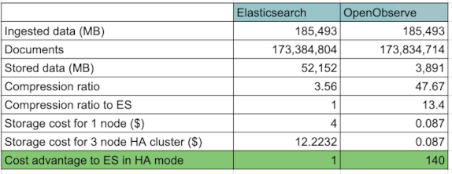

# Comparison with Alternatives

## How Does OpenObserve Compare to Elasticsearch?

Elasticsearch is a general-purpose search engine for both app search and log search use cases. OpenObserve is built specifically for log search, making it an excellent lightweight alternative to Elasticsearch.

### Technical Advantages

OpenObserve offers various ways to index data at faster speeds, while keeping storage size low. It uses a combination of:

- Partitioning
- Bloom filters
- Inverted indexes
- Caching
- Columnar storage

Consider Uber, which [found that 80% of the queries in its production environment were aggregation queries](https://www.uber.com/en-IN/blog/logging/). Our columnar data storage means that aggregation queries are much faster in OpenObserve than they typically are in Elasticsearch.

### Storage Cost Comparison

To compare storage costs, we used Fluent Bit to send real-life log data from our Kubernetes cluster to both Elasticsearch and OpenObserve. The results speak for themselves:

In this scenario, OpenObserve offers a significant advantage of 140x lower storage costs than Elasticsearch. These figures don't even consider the possibility of unused EBS volume capacity or include monitoring overhead. Your actual results may vary depending on how compressible your specific log data is.

This cost comparison pertains only to storage. Amazon EBS storage volumes cost [8 cents per GB per month (GP3)](https://aws.amazon.com/ebs/pricing/), and S3 costs [2.3 cents per GB per month](https://aws.amazon.com/s3/pricing/). In High Availability mode in Elasticsearch, you generally have one primary node and two replicas. You don't need to replicate S3 for data durability or availability, because [AWS redundantly stores your objects on multiple devices across at least three Availability Zones (AZs) in an Amazon S3 Region](https://aws.amazon.com/s3/faqs/).

### Operational Advantages

- **Stateless Architecture:** Scales horizontally without data replication or corruption challenges
- **No Index Mapping:** Enables hassle-free cluster management without index mapping complexities
- **Lower Operational Cost:** Significantly reduces effort required to manage clusters
- **Built-in GUI:** Eliminates the need for additional components like Kibana
- **Rust Performance:** Performs well and without Java Virtual Machine (JVM) challenges
- **Purpose-Built:** Built from the ground up as an observability tool, not a general-purpose search engine

## Elasticsearch Compatibility

The OpenObserve `_bulk` API endpoint is Elasticsearch-compatible and can be used by log forwarders like Fluent Bit, Fluentd, Filebeat and Vector by Datadog.
