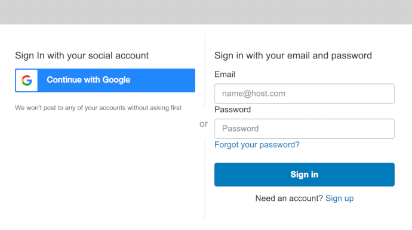
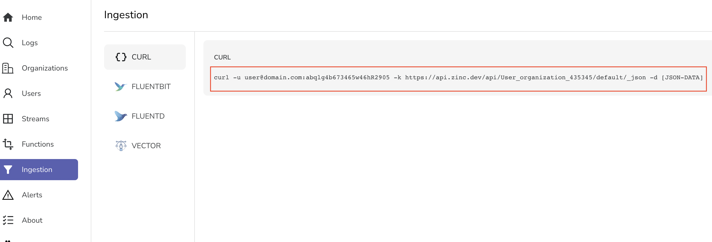
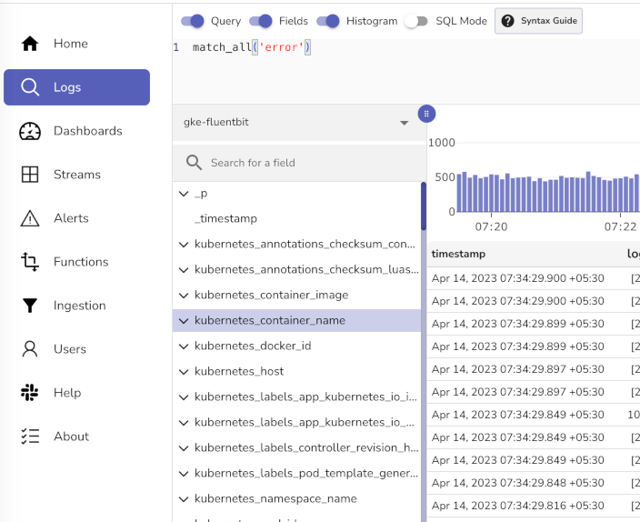

# Quickstart

You can get started with [Zinc Cloud](https://observe.zinc.dev) or a self hosted installation. 

Zinc Cloud is recommended for most users due to following benefits:

1. No effort in setting up a `Highly Available` installation and maintaining it.
1. Zinc cloud with its generous free tier is sufficient for most hobby users and smaller companies.
1. Newer features and bug fixes are launched earlier in Zinc Cloud. 
1. And more...

## Zinc Cloud

Zinc Cloud is offered as a hosted service backed by open source ZincObserve. It has the same features as that of ZincObserve with generous free tier and no effort and infrastructure of maintaining your own cluster.

1. Navigate to [https://observe.zinc.dev](https://observe.zinc.dev)
2. Use a social login or create an account using email / password

3. Now head over to `Ingestion` section and grab `CURL` command


Now head over to [Load sample data](#load-sample-data) section


## Self hosted Installation

You would need ZO_ROOT_USER_EMAIL and ZO_ROOT_USER_PASSWORD environment variables when you start ZincObserve for the first time. You don't need them on subsequent runs of ZincObserve.

=== "Windows"

    Binaries can be downloaded from [releases](https://github.com/zinclabs/zincobserve/releases) page for appropriate platform.


        set ZO_ROOT_USER_EMAIL=root@example.com
        set ZO_ROOT_USER_PASSWORD=Complexpass#123
        zincobserve.exe


    Now point your browser to [http://localhost:5080](http://localhost:5080) and login

=== "MacOS/Linux Binaries"
    Binaries can be downloaded from [releases](https://github.com/zinclabs/zincobserve/releases) page for appropriate platform.

        ZO_ROOT_USER_EMAIL=root@example.com ZO_ROOT_USER_PASSWORD=Complexpass#123 ./zincobserve


    Now point your browser to [http://localhost:5080](http://localhost:5080) and login

    **Getting glibc error running binary**

    ./zincobserve: `/lib/libm.so.6`: version `GLIBC_2.27` not found (required by ./zincobserve)

    > Download the `musl` binary instead of regular binary from [releases](https://github.com/zinclabs/zincobserve/releases) page.

=== "Docker"

    Docker images are available at [https://gallery.ecr.aws/zinclabs/zincobserve](https://gallery.ecr.aws/zinclabs/zincobserve)

        mkdir data
        docker run -v $PWD/data:/data -e ZO_DATA_DIR="/data" -p 5080:5080 \
            -e ZO_ROOT_USER_EMAIL=root@example.com -e ZO_ROOT_USER_PASSWORD=Complexpass#123 \
            public.ecr.aws/zinclabs/zincobserve:latest


    Now point your browser to [http://localhost:5080](http://localhost:5080) and login

    **Error pulling image if you have AWS CLI installed?**

    If you have AWS CLI installed and get login error then run below command:

        aws ecr-public get-login-password --region us-east-1 | docker login --username AWS --password-stdin public.ecr.aws

    
    *** Docker tags ***

    - `public.ecr.aws/zinclabs/zincobserve:latest`

        Compatible with environments of most users

    - `public.ecr.aws/zinclabs/zincobserve:latest-simd`

        If you want to leverage ZincObserve's support for vectorization then you should use this image. ZincObserve supports `AVX512` on intel CPUs, or `NEON` on ARM CPUs. This will help you get higher performance.

=== "Kubernetes - Manifest"

    Create a namespace:

        kubectl create ns zincobserve

    Create the deployment and port forward:

        kubectl apply -f https://raw.githubusercontent.com/zinclabs/zincobserve/main/deploy/k8s/statefulset.yaml

    Expose the zinc service by port-forwarding:

        kubectl -n zincobserve port-forward svc/zincobserve 5080:5080

    Now point your browser to [http://localhost:5080](http://localhost:5080) and login

## Load sample data

We will use JSON API to load sample log data.

Below commands will download a sample file of real life log data, unzip it and load it in ZincObserve using the JSON ingestion API.

**Download sample data**

```shell
curl -L https://zinc-public-data.s3.us-west-2.amazonaws.com/zinc-enl/sample-k8s-logs/k8slog_json.json.zip -o k8slog_json.json.zip
unzip k8slog_json.json.zip
```

**Load sample data**

*Note*: Replace the URL you got from Zinc Cloud and append it with `@k8slog_json.json`

```shell title="For Zinc Cloud"
curl -u user@domain.com:abqlg4b673465w46hR2905 -k https://api.zinc.dev/api/User_organization_435345/default/_json -d "@k8slog_json.json"
```

```shell title="For self hosted installation"
curl http://localhost:5080/api/default/default/_json -i -u root@example.com:Complexpass#123  -d "@k8slog_json.json"
```


## Search for data

Point your browser to [http://observe.zinc.dev](http://observe.zinc.dev) (for Zinc cloud) / [http://localhost:5080](http://localhost:5080) (for self hosted) and login

1. Visit `logs` page
1. Select the index `default` from drop down in the left

1. Type `match_all('error')` in search bar and click the search button on right.

Click on the "syntax guide" button next to the search bar to see examples on how to search.

