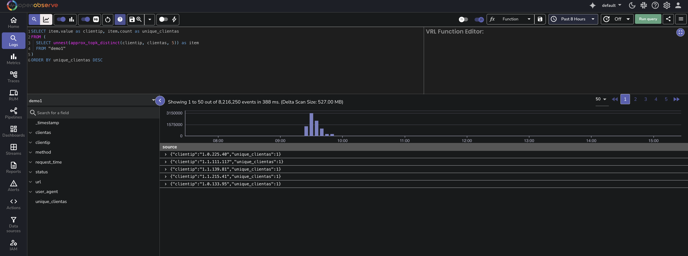

This page provides instructions on using the `approx_topk_distinct()` function. 
If you only need to find the top K most frequently occurring values in a field, refer to the [approx_topk()](../approx-topk/) function.

## What is approx_topk_distinct?
The `approx_topk_distinct()` function returns an approximate list of the top K values from one field (field1) that have the most number of distinct values in another field (field2). It is designed to handle large-scale, high-cardinality datasets efficiently by combining two algorithms:

- **HyperLogLog**: Used to estimate the number of distinct values in field2 per field1.
- **Space-Saving**: Used to select the top K field1 values with the highest estimated distinct counts.

Because both algorithms are probabilistic and the computation is distributed across multiple query nodes, the results are approximate.

---

## Query Syntax

```sql

SELECT approx_topk_distinct(field1, field2, K) FROM "stream_name"
```
Here:

- `field1`: The field to group by and return top results for.
- `field2`: The field whose distinct values are counted per field1.
- `K`: Number of top results to return.
- `stream_name`: The stream containing the data

**Example**
```sql
SELECT approx_topk_distinct(clientip, user_agent, 5) FROM "demo1"
```
This query returns an approximate list of the top 5 `clientip` values that have the most number of distinct user_agent values in the `demo1` stream.

**Note:** The result is returned as an array of objects, where each object includes the value of `field1` and its corresponding distinct count based on `field2`.

```json
{
  "item": [
    { "value": "192.168.1.100", "count": 1450 },
    { "value": "203.0.113.50", "count": 1170 },
    { "value": "10.0.0.5", "count": 1160 },
    { "value": "198.51.100.75", "count": 1040 },
    { "value": "172.16.0.10", "count": 1010 }
  ]
}
```

### Use `approx_topk_distinct` With `unnest`
To convert the nested array into individual rows for easier readability or further processing, use the `unnest()` function.

```sql
SELECT item.value as clientip, item.count as distinct_user_agent_count 
FROM (
  SELECT unnest(approx_topk_distinct(clientip, user_agent, 5)) as item 
  FROM "demo1"
)
ORDER BY distinct_user_agent_count DESC
```
**Result**
<br>
This query using approx_topk_distinct() with unnest() returns a flat result, where each row represents a value from field1 and its corresponding approximate distinct count from field2: <br>


## Performance Considerations
The `approx_topk_distinct()` function is designed for high-cardinality fields and large datasets. It uses the same distributed and memory-efficient architecture as `approx_topk()`.

For details on how this approach compares to traditional GROUP BY queries in terms of performance and memory usage, see the [approx_topk() guide](../approx-topk/).

---

## Limitations
The following are the known limitations of `approx_topk_distinct()` function:

Results are approximate, not guaranteed to be exact. Not recommended when exact accuracy is critical for analysis or reporting.
Accuracy depends on data distribution across partitions.


