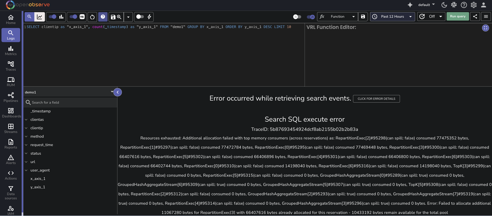
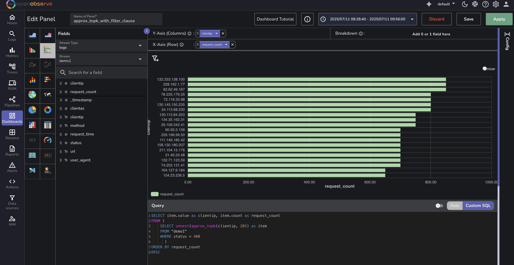

This page provides instructions on using the `approx_topk()` function and explains its performance benefits compared to the traditional `GROUP BY` method.

## What is `approx_topk`?
The `approx_topk()` function returns an approximate list of the top K most frequently occurring values in a specified field. It uses the Space-Saving algorithm, a memory-efficient approach designed for high-cardinality data and distributed processing, providing significant [performance benefits](#performance-comparison). 

> To find the top K values based on the number of distinct values in another field, use the [approx_topk_distinct() function](../approx-topk-distinct/).

---

## Query Syntax
```sql

SELECT approx_topk(field_name, K) FROM "stream_name"
```
Here:

- `field_name`: The field for which top values should be retrieved.
- `K`: The number of top values to return.
- `stream_name`: The stream containing the data.

**Example**
```sql
SELECT approx_topk(clientip, 10) FROM "demo1"
```
This query returns an approximate list of the `top k` most frequently occurring values in the `clientip` field from the `demo1` stream.

**Result of `approx_topk`** <br>
The result is returned as an array of objects, where each object includes the value and its corresponding count. For example:

```json
{
  "item": [ { "value": "192.168.1.100", "count": 2650 }, { "value": "10.0.0.5", "count": 2230 }, { "value": "203.0.113.50", "count": 2210 }, { "value": "198.51.100.75", "count": 1979 }, { "value": "172.16.0.10", "count": 1939 } ]
}
```

### Use `approx_topk` With `unnest`
To convert these nested results into individual rows, use the `unnest()` function.

```sql
SELECT item.value as clientip, item.count as request_count 
FROM ( 
    SELECT unnest(approx_topk(clientip, 20)) as item 
    FROM "demo1" 
    ) 
ORDER BY request_count 
DESC
```
**Result of `approx_topk()` with `unnest()`**
This provides a flat output as shown below: 

```json
{ "value": "192.168.1.100", "count": 2650 }
{ "value": "10.0.0.5", "count": 2230 }
{ "value": "203.0.113.50", "count": 2210 }
...
```

---

## `GROUP BY` versus `approx_topk`

### How GROUP BY Works
The traditional way to find the top values in a field is by using a `GROUP BY` query combined with `ORDER BY` and `LIMIT`. <br>
    For example:

    ```sql

    SELECT clientip AS x_axis_1, COUNT(*) AS y_axis_1 
    FROM cdn_production 
    GROUP BY x_axis_1 
    ORDER BY y_axis_1 DESC 
    LIMIT 10
    ```
    This query counts how many times each unique `clientip` appears and returns the **top 10** based on that count.

??? info "Why Traditional `GROUP BY` Breaks in Large Datasets"
    In large datasets with high-cardinality fields, the query is executed across multiple querier nodes. Each node uses multiple CPU cores to process the data. The data is split into partitions, and each core handles a subset of partitions.

    Consider the following scenario:

    - Dataset contains `3 million` unique client IPs.
    - Query runs using `60` CPU cores.
    - Each core processes `60` partitions.

    This results in:
    
    `3 million` values × `60` cores × `60` partitions = `10.8 billion` data entries being processed in memory.

    This level of memory usage can overwhelm the system and cause failures.

    **Typical Failure Message** <br>
    ```
    Resources exhausted: Failed to allocate additional 63232256 bytes for GroupedHashAggregateStream[20] with 0 bytes already allocated for this reservation - 51510301 bytes remain available for the total pool
    ```
    
    This is a common limitation of using traditional `GROUP BY` with high-cardinality fields in large environments.

### How `approx_topk` Works
When you run a query using `approx_topk()`, each query node processes a subset of the dataset and computes its local approximate top K values. These local top K values are sent to the leader node. The leader node merges them to generate the final approximate result. 

Because each node sends only its local top K values, the final result may miss values that are frequent across the entire dataset but do not appear in the top K list of any single node. 

!!! Note 
    This method improves performance and reduces memory usage, especially in production-scale environments. It is a trade-off between precision and efficiency. View the **performance comparison** shown in the following section.  

---

### Performance Comparison

When querying high-cardinality fields like clientip in large datasets, performance becomes critical. This section compares the execution performance of a traditional `GROUP BY` query with a query that uses the `approx_topk()` function.

**Use Case**<br>
You want to identify the top 20 most frequent client IP addresses in the `demo1` stream based on request volume.

**Query 1: Using `GROUP BY` and `LIMIT`**<br>
```sql
SELECT clientip as "x_axis_1", count(_timestamp) as "y_axis_1"
FROM "demo1"
GROUP BY x_axis_1
ORDER BY y_axis_1 DESC
LIMIT 20
```

**Query 2: Using `approx_topk()`**
```sql
SELECT item.value as clientip, item.count as request_count
FROM (
  SELECT unnest(approx_topk(clientip, 20)) as item
  FROM "demo1"
)
ORDER BY request_count DESC
```

**Results**<br>

<br>
Both queries were run against the same dataset using OpenObserve dashboards. Here are the observed query durations from the browser developer tools:

- The `GROUP BY` query without `approx_topk` took **1.46 seconds** to complete.
- The query using `approx_topk` completed in **692 milliseconds**.

This demonstrates that **approx_topk** executed more than twice as fast in this scenario, delivering a performance improvement of **over 50 percent**.

---

## Limitations

The following are the known limitations of `approx_topk()` function:

- Results are approximate, not guaranteed to be exact. Not recommended when exact accuracy is critical for analysis or reporting. 
- Accuracy depends on data distribution across partitions.

---

## Frequently Asked Questions
**Q.** Can I use a `WHERE` clause with `approx_topk()`?
**A.** Yes. You can apply a `WHERE` clause before calling the `approx_topk()` function to filter the dataset. This limits the scope of the top K calculation to only the matching records.

```sql
SELECT item.value as clientip, item.count as request_count 
FROM ( 
    SELECT unnest(approx_topk(clientip, 5)) as item 
    FROM "demo1" 
    WHERE status = 401
) 
ORDER BY request_count DESC
```

