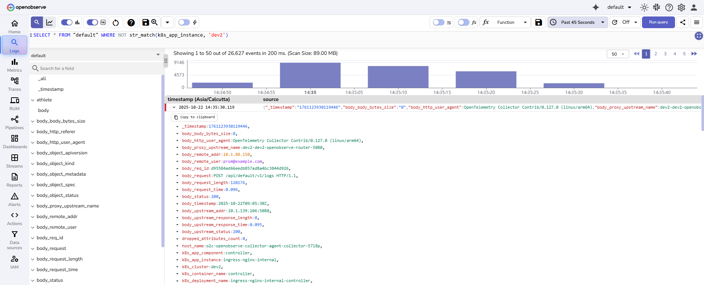
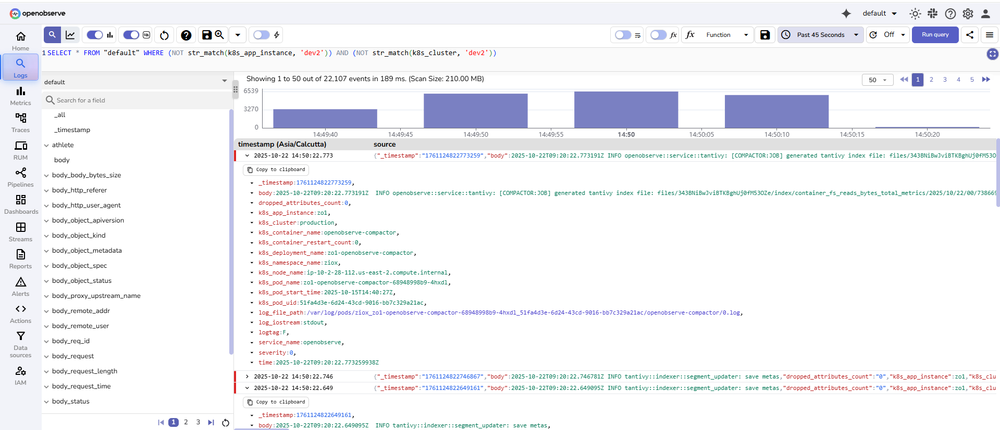
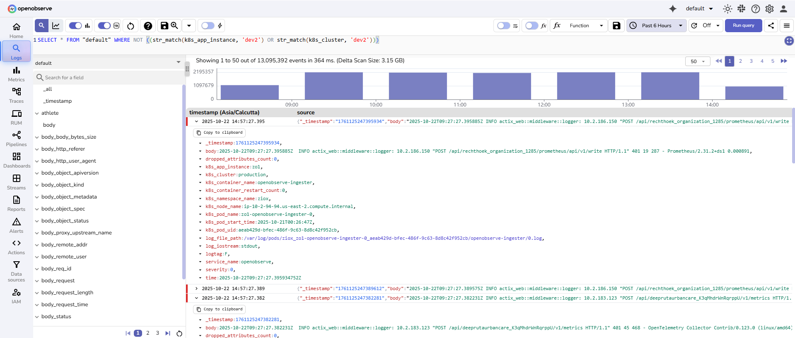

The full-text search functions allow you to filter records based on keyword or pattern matches within one or more fields. <br>This page lists the full-text search functions supported in OpenObserve, along with their usage formats, descriptions, and examples.


### `str_match`

**Syntax**: `str_match(field, 'value')` <br>
**Alias**: `match_field(field, 'value')` 
>The alias is available in OpenObserve version 0.15.0 and later.
 
**Description**: <br>

- Filters logs where the specified field contains the exact string value. 
- The match is case-sensitive. 
- Only logs that include the exact characters and casing specified will be returned. <br>

**Example**:
```sql
SELECT * FROM "default" WHERE str_match(k8s_pod_name, 'main-openobserve-ingester-1')
```
This query filters logs from the `default` stream where the `k8s_pod_name` field contains the exact string `main-openobserve-ingester-1`. It does not match values such as `Main-OpenObserve-Ingester-1`, `main-openobserve-ingester-0`, or any case variation.
<br>


---

### `not str_match(field, 'value')`
**Description**:<br>

- Filters logs where the specified field does NOT contain the exact string value.
- The match is case-sensitive.
- Only logs that do not include the exact characters and casing specified will be returned.
- Can be combined with other conditions using AND/OR operators.

**Example**: <br>
```sql
SELECT * FROM "default" WHERE NOT str_match(k8s_app_instance, 'dev2')
```


**Combining multiple NOT conditions with AND:**
```sql
SELECT * FROM "default" WHERE (NOT str_match(k8s_app_instance, 'dev2')) AND (NOT str_match(k8s_cluster, 'dev2'))
```


**Combining NOT conditions with OR:**
```sql
SELECT * FROM "default" WHERE NOT ((str_match(k8s_app_instance, 'dev2') OR str_match(k8s_cluster, 'dev2')))
```


---
### `str_match_ignore_case`

**Syntax**: `str_match_ignore_case(field, 'value')` <br>
**Alias**: `match_field_ignore_case(field, 'value')` 
> The alias is available in OpenObserve version 0.15.0 and later.

**Description**: <br>

- Filters logs where the specified field contains the string value. 
- The match is case-insensitive. 
- Logs are returned even if the casing of the value differs from what is specified in the query. <br>

**Example**:
```sql
SELECT * FROM "default" WHERE str_match_ignore_case(k8s_pod_name, 'MAIN-OPENOBSERVE-INGESTER-1')
```
This query filters logs from the `default` stream where the `k8s_pod_name` field contains any casing variation of `main-openobserve-ingester-1`, such as `MAIN-OPENOBSERVE-INGESTER-1`, `Main-OpenObserve-Ingester-1`, or `main-openobserve-ingester-1`.
<br>


---

### `match_all`
**Syntax**: `match_all('value')` <br>
**Description**: <br>

- Filters logs by searching for the keyword across all fields that have the Index Type set to Full Text Search in the [stream settings](../user-guide/streams/schema-settings.md). 
- This function is case-insensitive and returns matches regardless of the keyword's casing.

!!! Note 
    To enable support for fields indexed using the Inverted Index method, set the environment variable `ZO_ENABLE_INVERTED_INDEX` to true. Once enabled, you can configure the fields to use the Inverted Index by updating the [stream settings](../user-guide/streams/schema-settings.md) in the user interface or through the [setting API](../api/stream/setting.md).

    The `match_all` function searches through inverted indexed terms, which are internally converted to lowercase. Therefore, keyword searches using `match_all` are always case-insensitive.

**Example**:
```sql
SELECT * FROM "default" WHERE match_all('openobserve-querier')
```
This query returns all logs in the `default` stream where the keyword `openobserve-querier` appears in any of the full-text indexed fields. It matches all casing variations, such as `OpenObserve-Querier` or `OPENOBSERVE-QUERIER`.
<br>


**More pattern support**
The `match_all` function also supports the following patterns for flexible searching:

- **Prefix search**: Matches keywords that start with the specified prefix:
```sql
SELECT * FROM "default" WHERE match_all('ab*')
```
- **Postfix search**: Matches keywords that end with the specified suffix:
```sql
SELECT * FROM "default" WHERE match_all('*ab')
```
- **Contains search**: Matches keywords that contain the substring anywhere:
```sql
SELECT * FROM "default" WHERE match_all('*ab*')
```
- **Phrase prefix search**: Matches keywords where the last term uses prefix matching:
```sql
SELECT * FROM "default" WHERE match_all('key1 key2*')
```
### `not match_all('value')`
**Description**: <br>

- Filters logs by excluding records where the keyword appears in any field that has the Index Type set to Full Text Search in the stream settings. 
- This function is case-insensitive and excludes matches regardless of the keyword's casing.
- **Important**: Only searches fields configured as Full Text Search fields. Other fields in the record are not evaluated.
- Provides significant performance improvements when used with indexed fields.

**Example**:
```sql
SELECT * FROM "default" WHERE NOT match_all('foo')
```
This query returns all logs in the `default` stream where the keyword `foo` does NOT appear in any of the full-text indexed fields. Fields not configured for full-text search are ignored.

**Combining NOT match_all with NOT str_match**:
```sql
SELECT * FROM "default" WHERE (NOT str_match(f1, 'bar')) AND (NOT match_all('foo'))
```
This query returns logs where field `f1` does NOT contain `bar` AND no full-text indexed field contains `foo`. In other words, it excludes records that match either condition.

**Using NOT with OR conditions**:
```sql
SELECT * FROM "default" WHERE NOT (str_match(f1, 'bar') OR match_all('foo'))
```
This query returns logs where BOTH conditions are false: field `f1` does NOT contain `bar` AND no full-text indexed field contains `foo`. In other words, it excludes records that match either condition.

---

### `re_match`
**Syntax**: `re_match(field, 'pattern')` <br>
**Description**: <br>

- Filters logs by applying a regular expression to the specified field. 
- The function returns records where the field value matches the given pattern. 
- This function is useful for identifying complex patterns, partial matches, or multiple keywords in a single query.

> You can use standard regular expression syntax as defined in the [Regex Documentation](https://docs.rs/regex/latest/regex/).


**Example**:

```sql
SELECT * FROM "default" WHERE re_match(k8s_container_name, 'openobserve-querier|controller|nats')
```
This query returns logs from the `default` stream where the `k8s_container_name` field matches any of the strings `openobserve-querier`, `controller`, or `nats`. The match is case-sensitive.
<br>


To perform a case-insensitive search:

```sql
SELECT * FROM "default" WHERE re_match(k8s_container_name, '(?i)openobserve-querier')
```
This query returns logs where the `k8s_container_name` field contains any casing variation of `openobserve-querier`, such as `OpenObserve-Querier` or `OPENOBSERVE-QUERIER`.
<br>


---

### `re_not_match`
**Syntax**: `re_not_match(field, 'pattern')` <br>
**Description**: <br>

- Filters logs by applying a regular expression to the specified field and returns records that do not match the given pattern.
- This function is useful when you want to exclude specific patterns or values from your search results.

**Example**:
```sql
SELECT * FROM "default" WHERE re_not_match(k8s_container_name, 'openobserve-querier|controller|nats')
```
This query returns logs from the `default` stream where the `k8s_container_name` field does not match any of the values `openobserve-querier`, `controller`, or `nats`. The match is case-sensitive.
<br>


