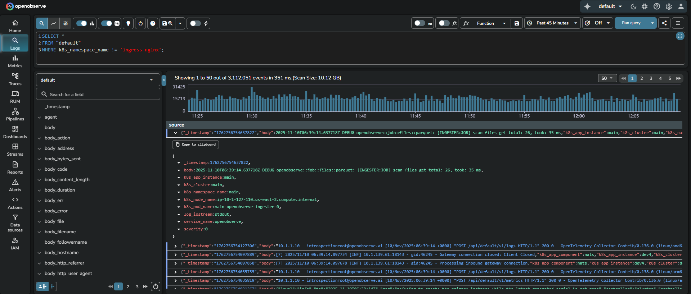
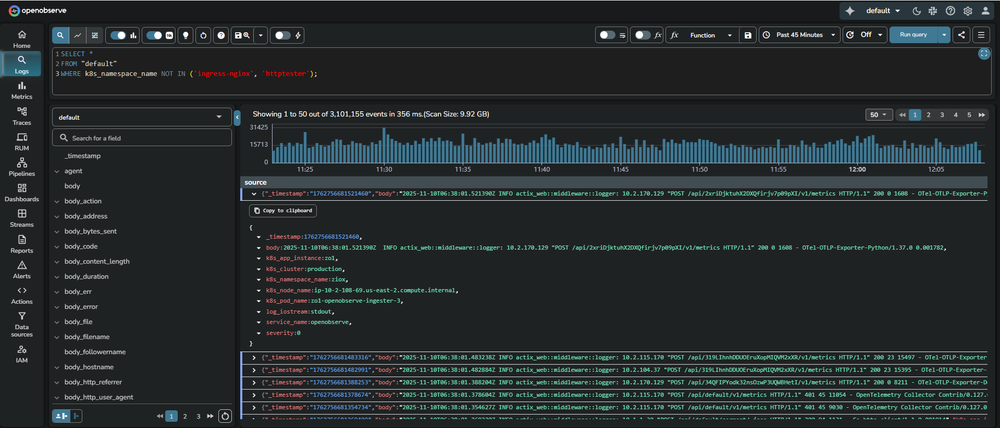

Secondary index functions allow you to filter and optimize queries using fields that are configured as secondary indexes in stream settings.

## `!=` (Not Equal)
**Syntax**: `field_name != 'value'` <br>
**Description**:

- Filters records where the specified indexed field does not match the given value.
- The comparison is case sensitive for string fields.
- When the environment variable `ZO_FEATURE_QUERY_NOT_FILTER_WITH_INDEX` is set to `true`, OpenObserve uses the secondary index to exclude the specified value before scanning data.
<br>

**Example**:
```sql
SELECT *
FROM "default"
WHERE k8s_namespace_name != 'ingress-nginx';
```


This query returns logs from the `default` stream where the `k8s_namespace_name` field is any value other than `ingress-nginx`. Note that the `k8s_namespace_name` is configured as a secondary index and the environment variable `ZO_FEATURE_QUERY_NOT_FILTER_WITH_INDEX` is set to `true`.

## NOT IN
**Syntax**: `field_name NOT IN ('value1', 'value2')` <br>
**Description**:

- Filters records where the specified indexed field does not match any value in the provided list.
- The comparison is case sensitive for string fields.
- When the environment variable `ZO_FEATURE_QUERY_NOT_FILTER_WITH_INDEX` is set to `true`, OpenObserve uses the secondary index to exclude all listed values before scanning data.
<br>

**Example**:
```sql
SELECT *
FROM "default"
WHERE k8s_namespace_name NOT IN ('ingress-nginx', 'httptester');
```


This query returns logs from the `default` stream where `k8s_namespace_name` is not any of the listed namespaces. Note that the `k8s_namespace_name` field configured as a secondary indexed field and the environment variable `ZO_FEATURE_QUERY_NOT_FILTER_WITH_INDEX` is set to `true`