Questions: This guide describes the custom SQL functions supported in OpenObserve for querying and processing logs and time series data. These functions extend the capabilities of standard SQL by enabling full-text search, array processing, and time-based aggregations.

## Full-text Search Functions
These functions allow you to filter records based on keyword or pattern matches within one or more fields.

### `str_match(field, 'value')`

**Alias**: `match_field(field, 'value')` (Available in OpenObserve version 0.15.0 and later) <br> 

**Description**: <br>

- Filters logs where the specified field contains the exact string value. 
- The match is case-sensitive. 
- Only logs that include the exact characters and casing specified will be returned. <br>

**Example**:
```sql
SELECT * FROM "default" WHERE str_match(k8s_pod_name, 'main-openobserve-ingester-1')
```
This query filters logs from the `default` stream where the `k8s_pod_name` field contains the exact string `main-openobserve-ingester-1`. It does not match values such as `Main-OpenObserve-Ingester-1`, `main-openobserve-ingester-0`, or any case variation.

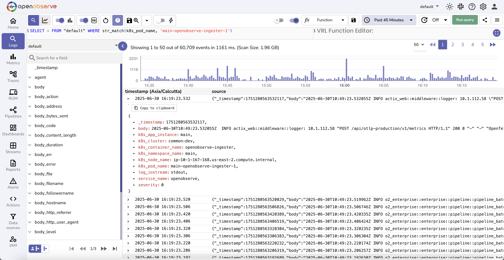

---
### `str_match_ignore_case(field, 'value')`
**Alias**: `match_field_ignore_case(field, 'value')` (Available in OpenObserve version 0.15.0 and later)<br>

**Description**: <br>

- Filters logs where the specified field contains the string value. 
- The match is case-insensitive. 
- Logs are returned even if the casing of the value differs from what is specified in the query. <br>

**Example**:
```sql
SELECT * FROM "default" WHERE str_match_ignore_case(k8s_pod_name, 'MAIN-OPENOBSERVE-INGESTER-1')
```
This query filters logs from the `default` stream where the `k8s_pod_name` field contains any casing variation of `main-openobserve-ingester-1`, such as `MAIN-OPENOBSERVE-INGESTER-1`, `Main-OpenObserve-Ingester-1`, or `main-openobserve-ingester-1`.

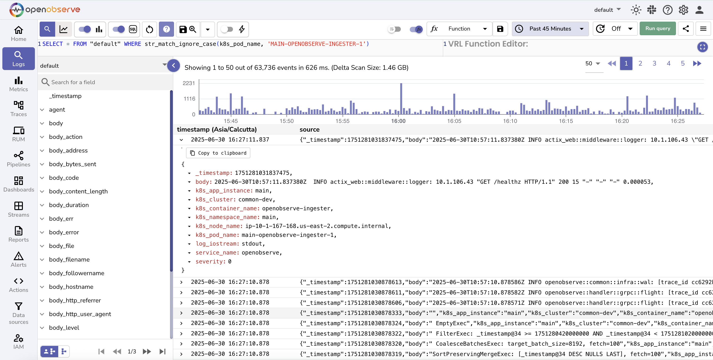

---

### `match_all('value')`
**Description**: <br>

- Filters logs by searching for the keyword across all fields that have the Index Type set to Full Text Search in the [stream settings](../user-guide/streams/schema-settings/). 
- This function is case-insensitive and returns matches regardless of the keyword's casing.

!!! Note 
    To enable support for fields indexed using the Inverted Index method, set the environment variable `ZO_ENABLE_INVERTED_INDEX` to true. Once enabled, you can configure the fields to use the Inverted Index by updating the [stream settings](../user-guide/streams/schema-settings/) in the user interface or through the [setting API](../api/stream/setting/).

    The `match_all` function searches through inverted indexed terms, which are internally converted to lowercase. Therefore, keyword searches using `match_all` are always case-insensitive.

**Example**:
```sql
SELECT * FROM "default" WHERE match_all('openobserve-querier')
```
This query returns all logs in the `default` stream where the keyword `openobserve-querier` appears in any of the full-text indexed fields. It matches all casing variations, such as `OpenObserve-Querier` or `OPENOBSERVE-QUERIER`.

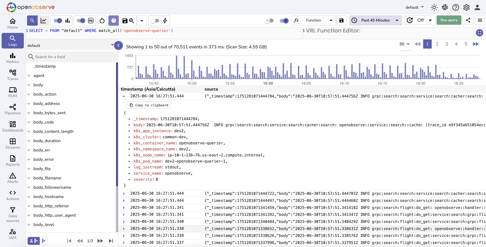

---
### `re_match(field, 'pattern')`
**Description**: <br>

- Filters logs by applying a regular expression to the specified field. 
- The function returns records where the field value matches the given pattern. 
- This function is useful for identifying complex patterns, partial matches, or multiple keywords in a single query.

> You can use standard regular expression syntax as defined in the [Regex Documentation](https://docs.rs/regex/latest/regex/).


**Example**:

```sql
SELECT * FROM "default" WHERE re_match(k8s_container_name, 'openobserve-querier|controller|nats')
```
This query returns logs from the `default` stream where the `k8s_container_name` field matches any of the strings `openobserve-querier`, `controller`, or `nats`. The match is case-sensitive.

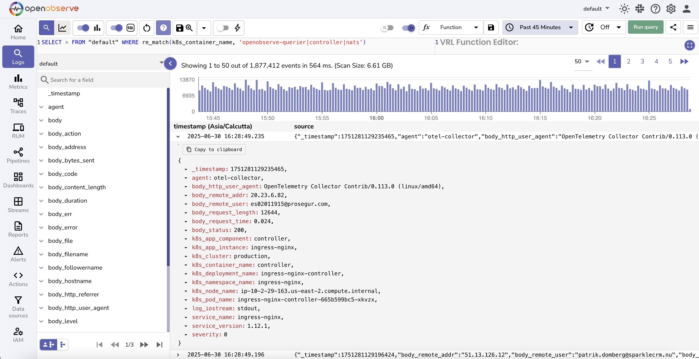


To perform a case-insensitive search:

```sql
SELECT * FROM "default" WHERE re_match(k8s_container_name, '(?i)openobserve-querier')
```
This query returns logs where the `k8s_container_name` field contains any casing variation of `openobserve-querier`, such as `OpenObserve-Querier` or `OPENOBSERVE-QUERIER`.

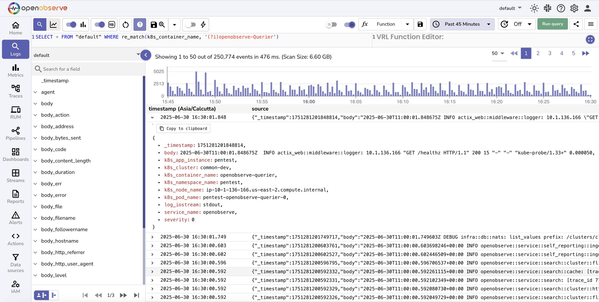

---

### `re_not_match(field, 'pattern')`
**Description**: <br>

- Filters logs by applying a regular expression to the specified field and returns records that do not match the given pattern.
- This function is useful when you want to exclude specific patterns or values from your search results.

**Example**:
```sql
SELECT * FROM "default" WHERE re_not_match(k8s_container_name, 'openobserve-querier|controller|nats')
```
This query returns logs from the `default` stream where the `k8s_container_name` field does not match any of the values `openobserve-querier`, `controller`, or `nats`. The match is case-sensitive.

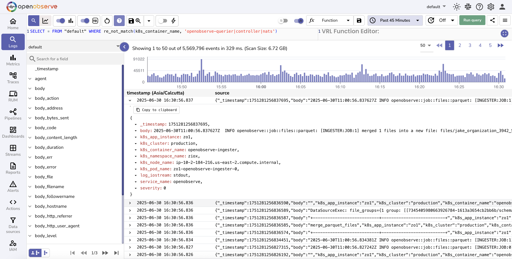

---

## Array Functions
The array functions operate on fields that contain arrays. In OpenObserve, array fields are typically stored as stringified JSON arrays.
<br>For example, in a stream named `default`, there may be a field named `emails` that contains the following value:
`["jim@email.com", "john@doe.com", "jene@doe.com"]` <br>
Although the value appears as a valid array, it is stored as a string. The array functions in this section are designed to work on such stringified JSON arrays and provide support for sorting, counting, joining, slicing, and combining elements.

--- 

### `arr_descending(field)`
**Description**: <br>
ß
- Sorts the elements in the specified array field in descending order. 
- The array must be a stringified JSON array. 
- All elements in the array must be of the same type.

**Example**:
```sql
SELECT *, arr_descending(emails) as sorted_emails FROM "default" ORDER BY _timestamp DESC
```
In this query, the emails field contains a stringified JSON array such as `["jim@email.com", "john@doe.com", "jene@doe.com"]`. The query creates a new field `sorted_emails`, which contains the elements sorted in descending order:
`["john@doe.com", "jene@doe.com", "jim@email.com"]`

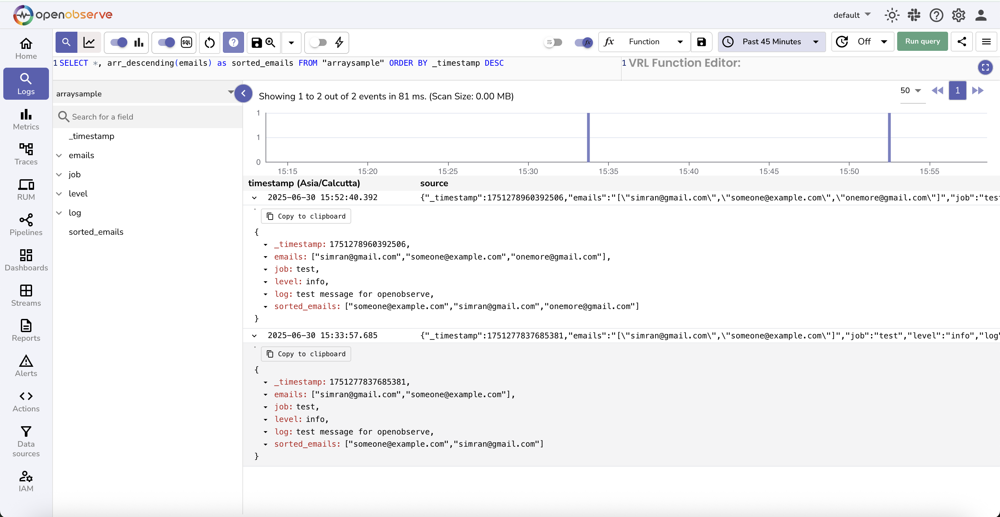

---

### `arrcount(arrfield)`
**Description**: <br>
Counts the number of elements in a stringified JSON array stored in the specified field. The field must contain a valid JSON array as a string.

**Example**:
```sql
SELECT *, arrcount(emails) as email_count FROM "default" ORDER BY _timestamp DESC
```
In this query, the `emails` field contains a value such as `["jim@email.com", "john@doe.com", "jene@doe.com"]`. The function counts the number of elements in the array and returns the result: `3`.

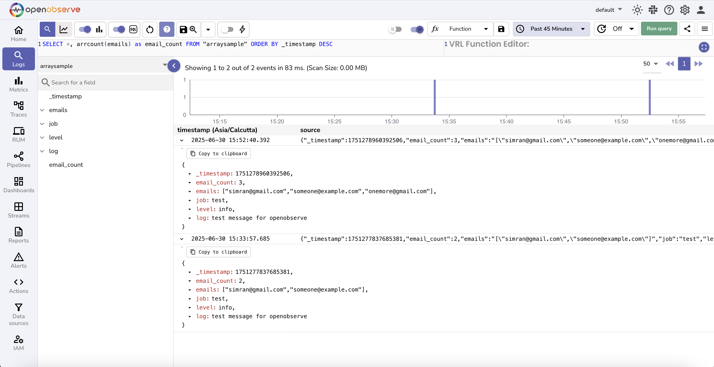

---

### `arrindex(field, start, end)`
**Description:**

- Returns a subset of elements from a stringified JSON array stored in the specified field. 
- The function selects a range starting from the start index up to and including the end index. 

**Example:**
```sql
SELECT *, arrindex(emails, 0, 1) as selected_emails FROM "default" ORDER BY _timestamp DESC
```
In this query, the `emails` field contains a value such as `["jim@email.com", "john@doe.com", "jene@doe.com"]`. The function extracts elements at index `0` and `1`. The result is:
`["jim@email.com", "john@doe.com"]`

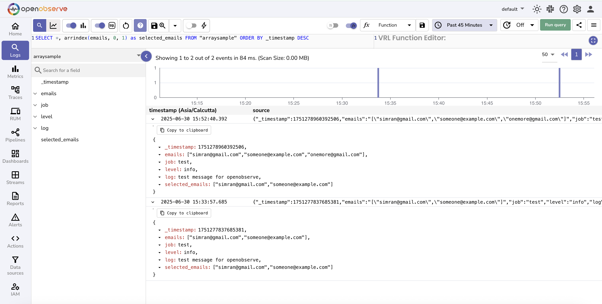

---

### `arrjoin(field, delimiter)`
**Description:**

- Concatenates all elements in a stringified JSON array using the specified delimiter. 
- The output is a single string where array elements are joined by the delimiter in the order they appear.

```sql
SELECT *, arrjoin(emails, ' | ') as joined_numbers FROM "default" ORDER BY _timestamp DESC
```
In this query, the `emails` field contains a value such as `["jim@email.com", "john@doe.com", "jene@doe.com"]`. The function joins all elements using the delimiter `|`. The result is:
`"jim@email.com | john@doe.com | jene@doe.com"`

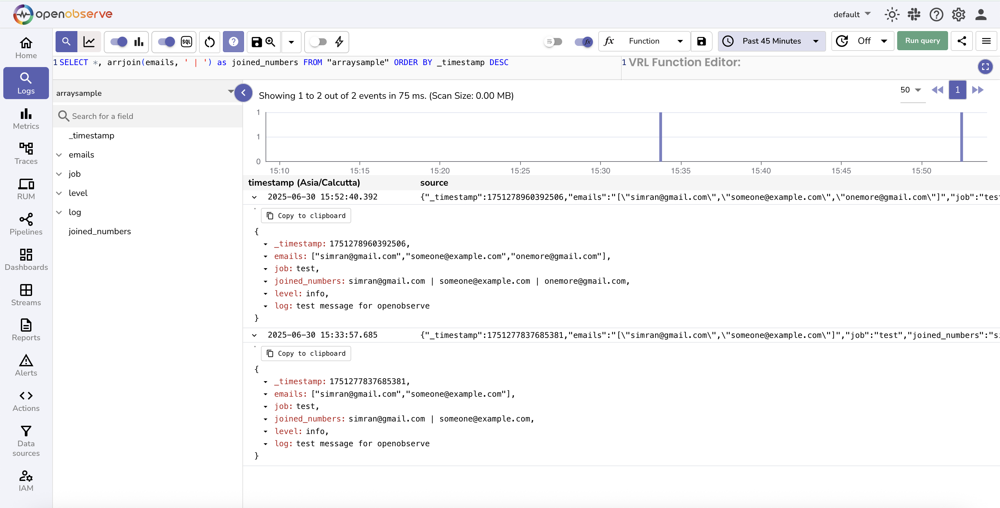

---

### `arrsort(field)`
**Description:** 

- Sorts the array field in increasing order. 
- All elements must be of the same type, such as numbers or strings.

```sql
SELECT *, arrsort(emails) as increasing_numbers FROM "default" ORDER BY _timestamp DESC
```
In this query, the emails field contains a value such as `["jim@email.com", "john@doe.com", "jene@doe.com"]`. The function sorts the elements in increasing lexicographical order. The result is:
`["jene@doe.com", "jim@email.com", "john@doe.com"]`.

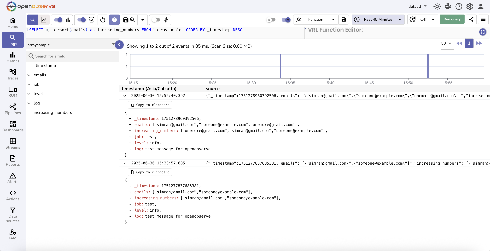


---

### `arrzip(field1, field2, delimiter)`
**Description:**

- Combines two stringified JSON arrays element by element using the specified delimiter. 
- Each element from the first array is joined with the corresponding element from the second array. 
- The result is a new array of joined values.

```sql
SELECT *, arrzip(emails, usernames, '|') as zipped_field FROM "default" ORDER BY _timestamp DESC
```
In this query, the `emails` field contains `["jim@email.com", "john@doe.com"]` and the `usernames` field contains `["jim", "john"]`. The function combines each pair of elements using the delimiter `|`.
The result is:
`["jim@email.com | jim", "john@doe.com | john"]`

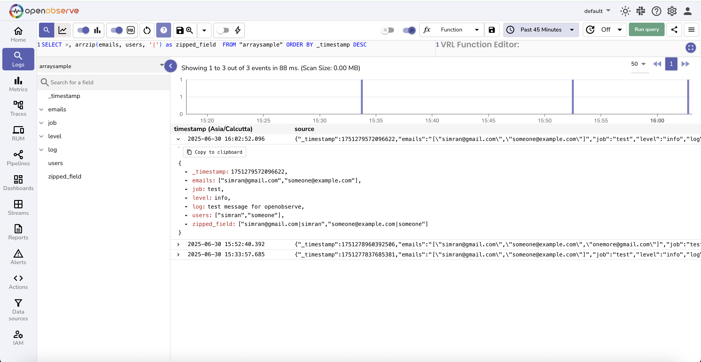

---

### `spath(field, path)`
**Description:**

- Extracts a nested value from a JSON object stored as a string by following the specified path. 
- The path must use dot notation to access nested keys. 

**Example:** 
```sql
SELECT *, spath(json_object_field, 'nested.value') as extracted_value FROM "default" ORDER BY _timestamp DESC
```
In this query, the `json_object_field` contains a value such as:

```json
{"nested": {"value": 23}}
```
The function navigates the JSON structure and extracts the value associated with the path `nested.value`.
The result is: `23`.

Sample Input in log stream:

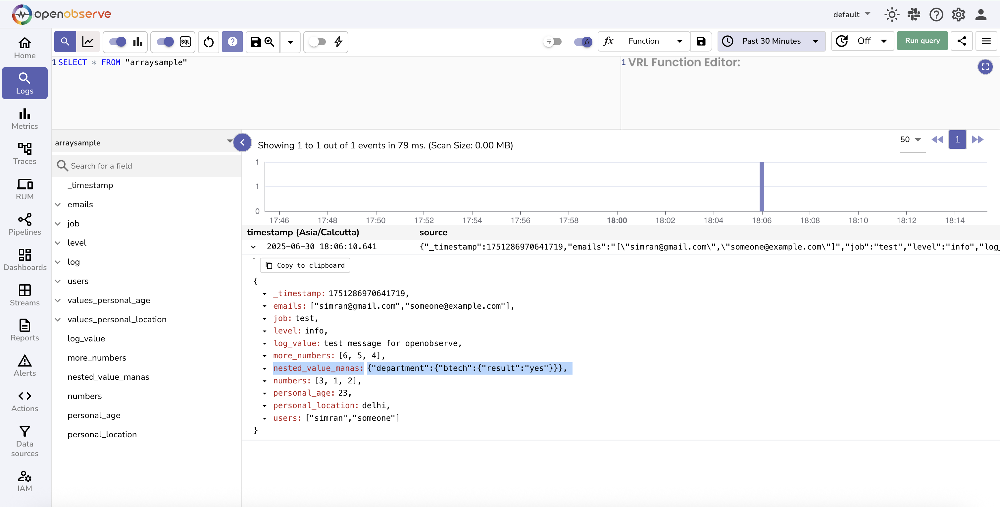

Running SQL query using spath():

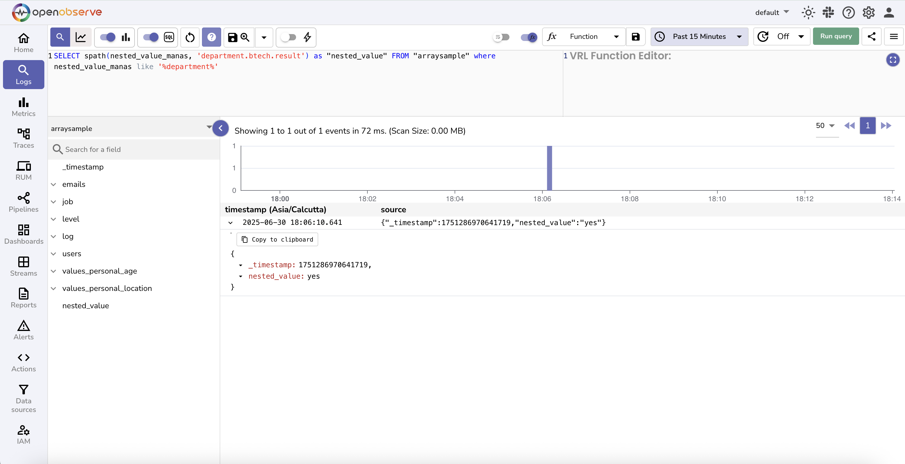

---

### `cast_to_arr(field)`
**Description:**

- Converts a stringified JSON array into a native DataFusion array. 
- This is required before applying native DataFusion array functions such as `unnest`, `array_union`, or `array_pop_back`. 
- Native functions do not work directly on stringified arrays, so this conversion is mandatory.

> Learn more about the [native datafusion array functions](https://datafusion.apache.org/user-guide/expressions.html#array-expressions).

Example:

```sql
SELECT _timestamp, nums, less,
array_union(cast_to_arr(nums), cast_to_arr(less)) as union_result
FROM "arr_udf"
ORDER BY _timestamp DESC
```

In this query:

- `nums` and `less` are fields that contain stringified JSON arrays, such as `[1, 2, 3]` and `[3, 4]`.
- The function `cast_to_arr` is used to convert these fields into native arrays.
- The result of `array_union` is a merged array with unique values: `[1, 2, 3, 4]`.

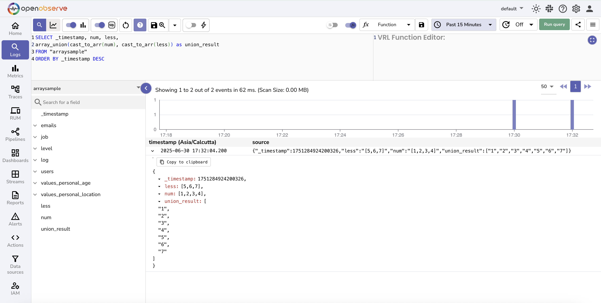

---

### `to_array_string(array)`
**Description:**

- Converts a native DataFusion array back into a stringified JSON array. 
- This is useful when you want to apply OpenObserve-specific array functions such as `arrsort` or `arrjoin` after using native array operations like `array_concat`.

**Example:**
```sql
SELECT *,
arrsort(to_array_string(array_concat(cast_to_arr(numbers), cast_to_arr(more_numbers)))) as sorted_result
FROM "default"
ORDER BY _timestamp DESC
```
In this query:

- `numbers` and `more_numbers` are stringified JSON arrays.
- `cast_to_arr` converts them into native arrays.
- `array_concat` joins the two native arrays.
- `to_array_string` converts the result back into a stringified array.
- `arrsort` then sorts the array in increasing order.

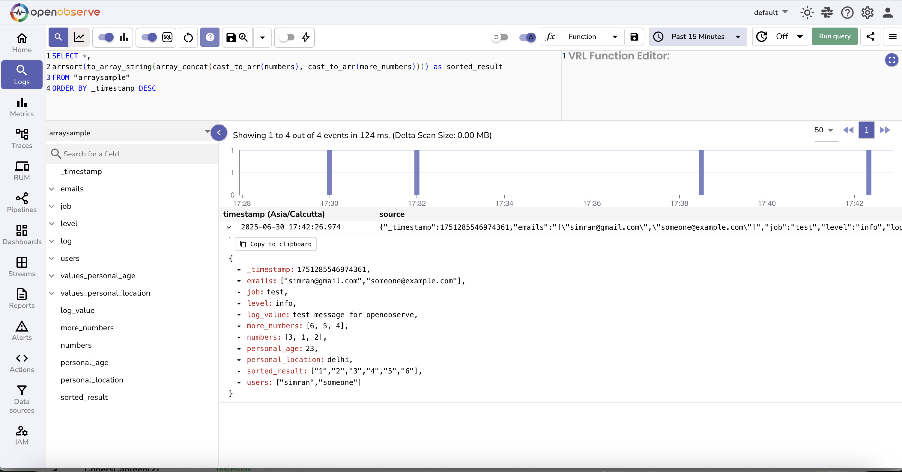

---

## Aggregate Functions
Aggregate functions compute a single result from a set of input values. For usage of standard SQL aggregate functions such as `COUNT`, `SUM`, `AVG`, `MIN`, and `MAX`, refer to [PostgreSQL documentation](https://www.postgresql.org/docs/).

### `histogram(field, 'duration')`
**Description:** <br>
Use the `histogram` function to divide your time-based log data into time buckets of a fixed duration and then apply aggregate functions such as `COUNT()` or `SUM()` to those intervals.
This helps in visualizing time-series trends and performing meaningful comparisons over time. <br><br>
**Syntax:** <br>
```sql
histogram(<timestamp_field>, '<duration>')
```

- `timestamp_field`: A valid timestamp field, such as _timestamp.
- `duration`: A fixed time interval in readable units such as '30 seconds', '1 minute', '15 minutes', or '1 hour'.

**Histogram with aggregate function** <br>
```sql
SELECT histogram(_timestamp, '30 seconds') AS key, COUNT(*) AS num
FROM "default"
GROUP BY key
ORDER BY key
```
**Expected Output**: <br>

This query divides the log data into 30-second intervals. 
Each row in the result shows:

- **`key`**: The start time of the 30-second bucket.
- **`num`**: The count of log records that fall within that time bucket.

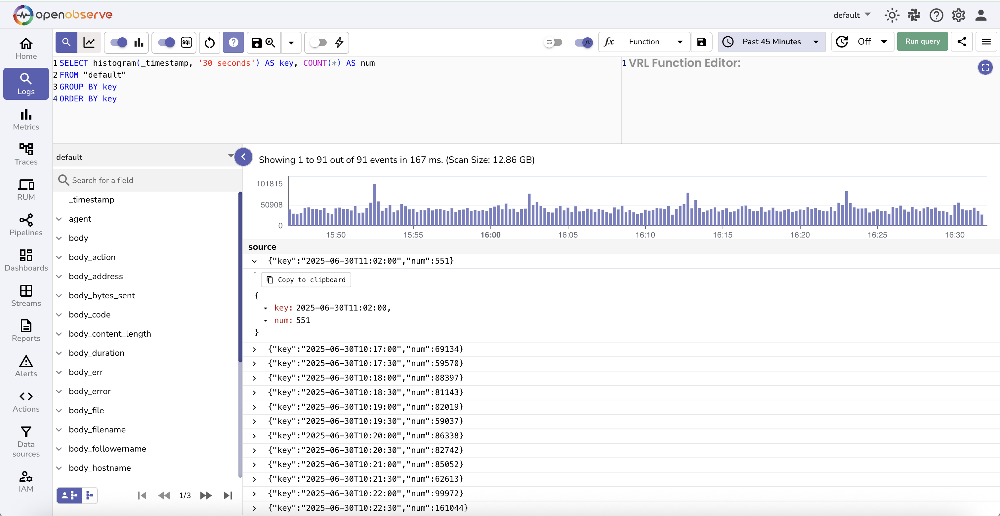

!!! note
    To avoid unexpected bucket sizes based on internal defaults, always specify the bucket duration explicitly using units. 

!!! info "Datafusion SQL reference"
    OpenObserve uses [Apache DataFusion](https://datafusion.apache.org/user-guide/sql/index.html) as its query engine. All supported SQL syntax and functions are available through DataFusion.

