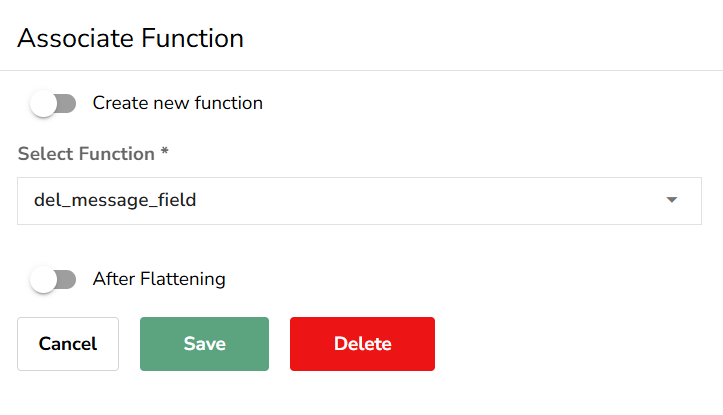
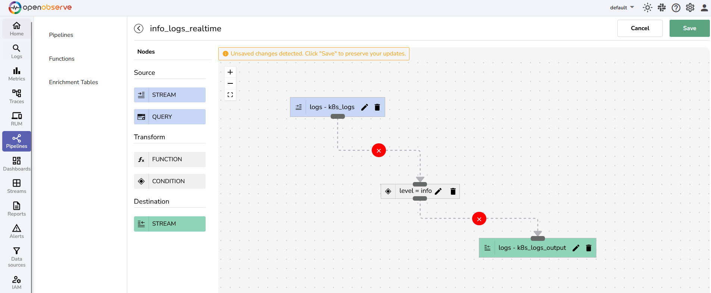
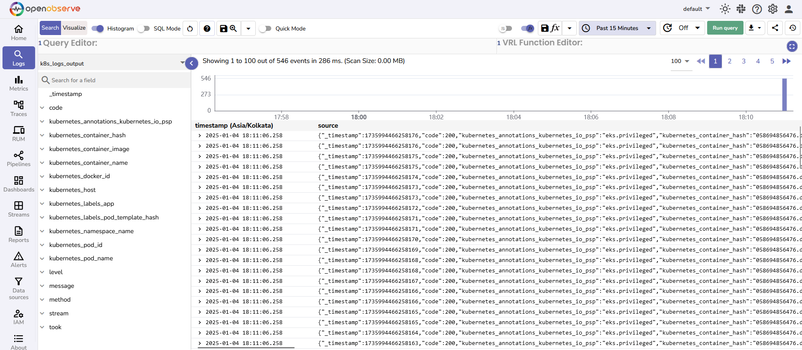

This guide shows you how to create and use real-time and scheduled pipelines in OpenObserve.

## Create a Pipeline
### Prerequisites

- Your OpenObserve Cloud or the self-hosted instance is up and running.
- You have a functioning [Stream](https://openobserve.ai/docs/user-guide/streams/) where data gets ingested. This Stream will be used as a source stream in the pipeline.

### Step 1: Open the pipeline editor
1. Log in to OpenObserve.
2. From the navigation panel, select **Pipelines**.
3. In the **Pipelines** tab, click the **Add Pipeline** button in the top-right corner. 
This opens up the pipeline editor.

### Step 2: Enter a unique pipeline name

### Step 3: Configure the Source node based on the pipeline type
1. From the **Source** section, drag a **Stream** or **Query** node into the editor based on the following requirement:

    - To set up a real-time pipeline: Select **Stream**.
    - To set up a scheduled pipeline: Select **Query**.

2. Edit the source node:

    - Select **Stream Type**:
    - **If you selected Stream in the previous step**: Use the drop-down menu under **Stream Name** to select the source stream. Ensure that the source stream is active and receiving data. 
    
    - **If you selected Query in the previous step**: Under **SQL**, write a query to fetch data from a source. Schedule the query execution by setting the **Frequency** and **Period**. For details, visit [Pipelines in OpenObserve](Pipelines-in-OpenObserve.md).  In the following example, data is ingested periodically into the stream **k8s_logs**. The query runs every 5 minutes and fetches all data that was ingested into the stream **k8s_logs** in the preceding 5-minute interval.
    <!-- This needs to be updated. On UI, the `Frequency` and `Period` have been restricted to be at least 5 -->
    <!--Updated the screenshot and the above sentence-->
    
    
     
3. Click **Save** to confirm the source node.

### Step 4: Configure the Transform node
1. From the **Transform** section, drag a **Function** or **Condition** node into the pipeline editor.
2. Click the edit icon to configure the selected node.

    - **For a Condition node**: In the **Associate Condition** form, add one or more conditions to refine the data. Select the field name from the drop-down menu.  
        > **Note**: If the selected source stream is active, the drop-down list shows all the field names from the ingested data.

      
    
    - **For a Function node**: In the **Associate Function** form, select an existing function or create a new function to associate with the pipeline. 

    
     
    In the above example, the associated function, **del_message_field**, deletes the **message** field from the ingested data. 
    
    
     
    For more details, see the [Functions Guide](https://openobserve.ai/docs/user-guide/functions/).

3. Click **Save** to confirm the transform node.

### Step 5: Edit the Destination node

1. Drag a **Stream** node into the editor.
2. Click the edit icon in the destination **Stream** node.
3. In the **Associate Stream** form:

    - From the **Stream Name** drop-down, select an existing stream or toggle **Create New Stream** to create a new destination stream.
    - Select the **Stream Type**.

4. Click **Save** to confirm the destination node.

### Step 6: Connect the Source, Transform, and Destination nodes to complete the data flow order

- Use the **remove icon** () to remove any incorrect connection.
- Use the **connection icon** () to build a connection between two nodes.

### Step 7: Save the pipeline

After you click Save, it gets activated automatically. Learn how to [manage pipelines](Manage-Pipelines.md).

## Use the Pipeline

### Prerequisite
Ensure that the pipeline is active.

### Step 1: Ingest Data 

Use `curl` or other [data ingestion options in OpenObserve](https://openobserve.ai/docs/user-guide/ingestion/).

**Example**: Ingesting new data from the **k8slog_json.json** file into the **k8s_logs** stream, which is under the **default** organization:
> `curl http://localhost:5080/api/default/k8s_logs/_json -i -u 'root@example.com:Complexpass#123' --data-binary "@k8slog_json.json"`

### Step 2: Execute Pipeline 

- **For real-time pipelines**: As soon as you ingest data into the source stream, the pipeline gets executed, and starts fetching and processing the data in real time.
- **For scheduled pipelines**: The pipeline executes according to its predefined schedule, fetching and processing data from the source stream at the specified intervals.

### Step 3: Verify Output 
1. Click **Streams** in the navigation panel.
2. Select the destination stream and click the **Stream Details** icon to verify that the transformed data is present.  

Your pipeline has successfully transformed the ingested data and sent them to the destination stream.  

<!-- This is great to demonstrate how to construct a simple straightforward pipeline. I would suggest to include a few screenshots of more comprehensive or complicated pipelines as examples to showcase its capabilities -->

### Example of a Complex Pipeline
The above example illustrates a basic pipeline setup. However, pipelines can become more complex depending on speficic requirements, as shown in the example below: 

  

## Troubleshoot

1. **Unable to view the field names while configuring Transform Condition node?**  

    Verify if the source stream is functioning:

    a. In the navigation panel, select **Streams**.  
    b. Select the desired stream and check if the **Records** and **Ingested data** fields are populated.

2. **No data in destination stream?**

    - Ensure the pipeline is active.
    - Check the **Transform** node for errors.

3. **No data in the stream where the data is being ingested?** 
     When you select a source stream in the pipeline, OpenObserve automatically assigns a default destination stream that connects to the same source stream. To ensure the data remains in the source stream, do not remove this default connection.  
    If you need to transform data, add new **Transform** and **Destination** nodes as required. This ensures that the transformed data flows to the new destination. 

 
<!-- I would call out another important character to watch out about pipeline  -->
<!-- The pipeline is implemented explicitly here, meaning, however a user configures a pipeline, the data flows as it shows on the UI. -->
<!-- This could be problematic if a user creates a pipeline with source stream `default` -> condition/function -> destination stream `default1` -->
<!-- With this setup, the user won't see any data in `default` anymore once this pipeline is enabled, which might not be user's intension -->
<!-- So, in the latest UI, when a source stream is added, a default destination stream to the same stream is added as well, so that the data is always going to be there, unless the user explicitly deletes this connection -->

## Next Step
- [Manage Pipelines](Manage-Pipelines.md) 