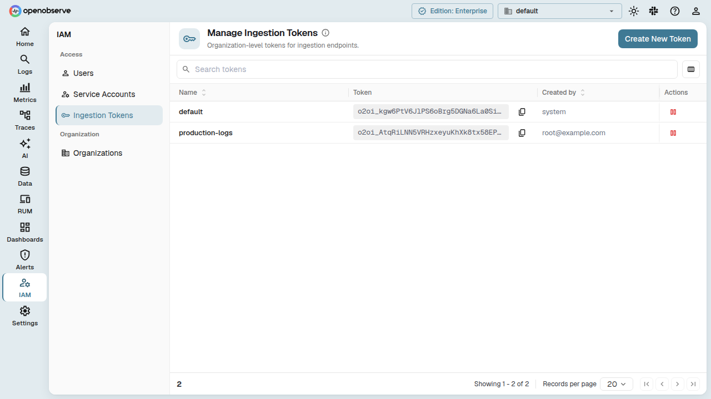
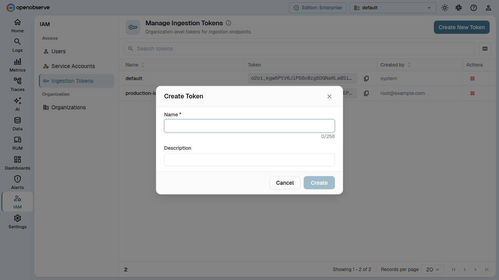
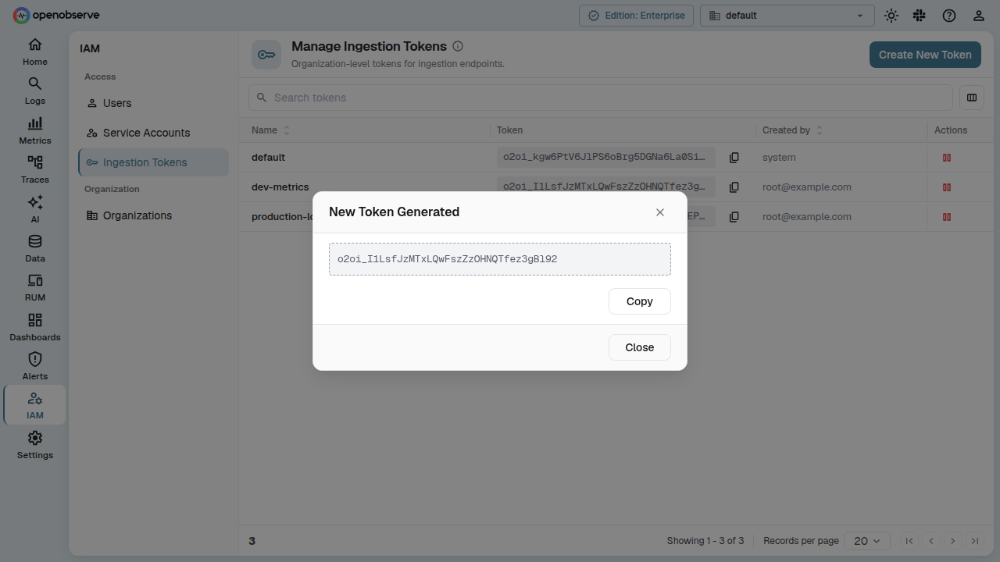
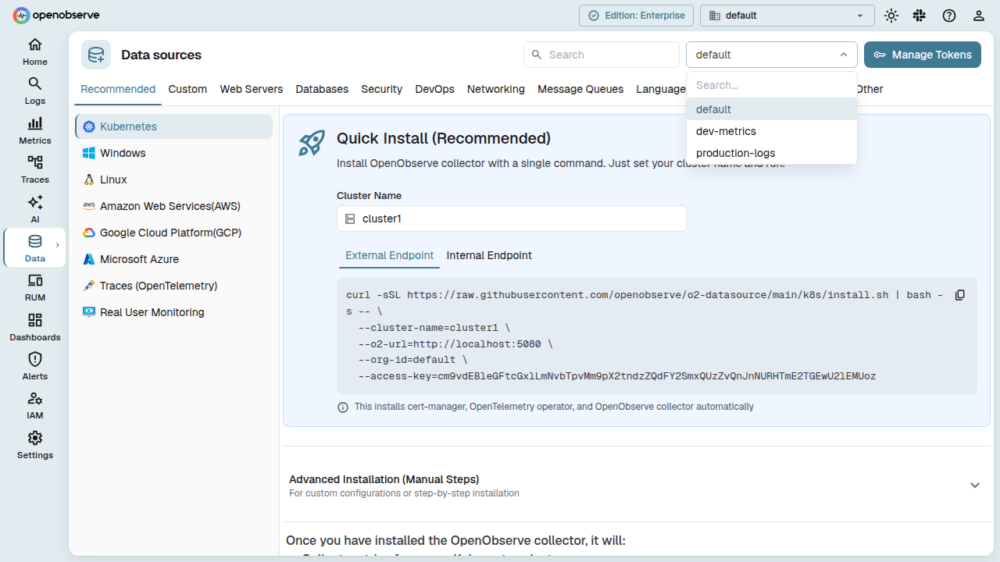

This guide explains how to create, manage, and use organization-level ingestion tokens. These tokens decouple ingestion credentials from individual user accounts, ensuring your data pipelines keep working even when users leave the organization.

## Overview

Organization-level ingestion tokens provide a stable, org-scoped credential for sending data into OpenObserve. Unlike user-bound tokens, org-level tokens:

- Are **not tied to a specific user** — they survive user removal or role changes.
- Can **only be used on ingestion endpoints** — they are rejected on any other API path.
- Are prefixed with `o2oi_` for fast identification.
- Support multiple named tokens per organization, each independently enabled or disabled.

A **default** token is created automatically when a new organization is provisioned.

## Managing ingestion tokens

Navigate to **IAM > Ingestion Tokens** to view and manage org-level tokens.



The page lists all tokens for the current organization with these columns:

- **Name** — the token name you assign at creation.
- **Token** — a masked view of the token value, with a **Copy** button.
- **Created by** — the user who created the token.
- **Actions** — an enable/disable toggle. Disabled tokens cannot be used for ingestion.

### Create a token

1. On the **Ingestion Tokens** page, click **Create New Token**.
2. In the dialog, enter:
   - **Name** (required) — alphanumeric characters, hyphens (`-`), and underscores (`_`) only. Maximum 256 characters.
   - **Description** (optional) — free-text notes about the token's purpose.
3. Click **Create**.



The full token value is displayed once immediately after creation. **Copy it now** — it will not be shown again.



### Enable or disable a token

Click the **pause**/**play** toggle in the **Actions** column to disable or enable a token. Disabled tokens are immediately rejected on ingestion endpoints. Enabling a token restores its functionality.

## Using tokens on the Ingestion page

When you visit the **Ingestion** page, a token selector dropdown appears above the curl examples. The dropdown lists all enabled org-level ingestion tokens for the current organization. Select a token to populate the curl commands with that credential.



Click **Manage Tokens** next to the selector to jump directly to the **IAM > Ingestion Tokens** page.

### Sending data with an org token

Use the token as the password in your ingestion requests. For example, with curl:

```bash
curl -i https://your-instance/api/default/_json \
  -u "org_identifier:o2oi_xxxx" \
  -d '[{"timestamp": "2026-06-24T12:00:00Z", "level": "info", "message": "hello"}]'
```

The username should be your organization identifier, and the password is the token value (prefixed with `o2oi_`).

## The default token

Every organization gets a default ingestion token named `default`, created automatically when the organization is provisioned. The default token:

- Appears at the top of the token list.
- Works like any other token — you can enable, disable, or rotate it.
- Is returned by the passcode API endpoint (`GET /{org_id}/passcode`), replacing the old user-bound token.

## Permissions

- **List tokens**: Any authenticated user in the organization can view the token list.
- **Create, enable, disable**: Requires **Admin** or **Root** role.
- **Token values are masked in the list** — only the creator sees the full value once at creation time.
