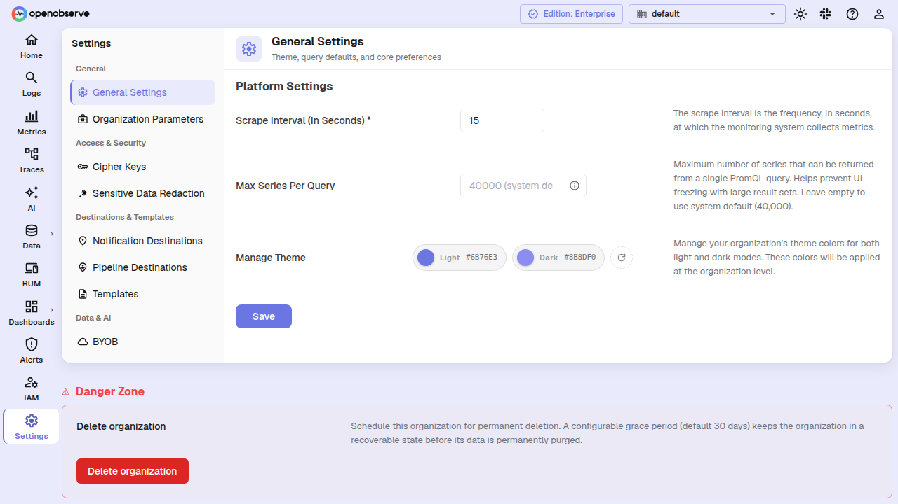
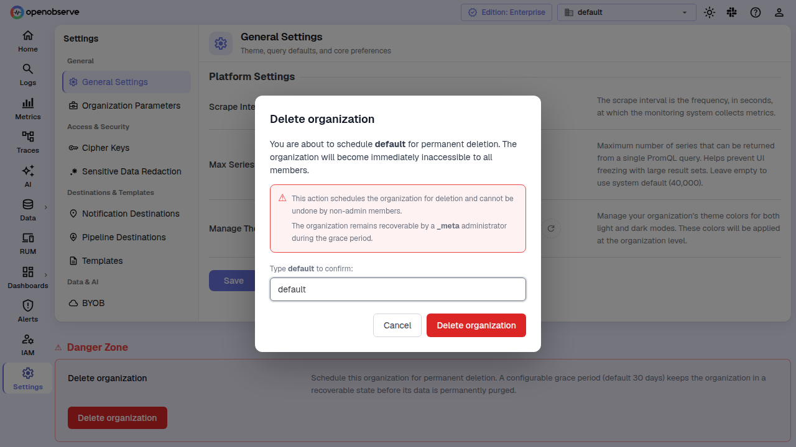
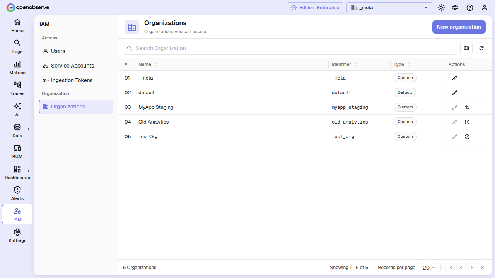
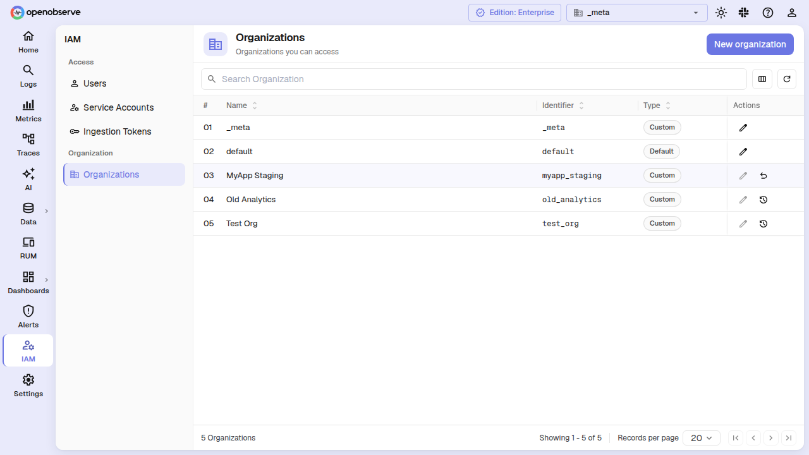
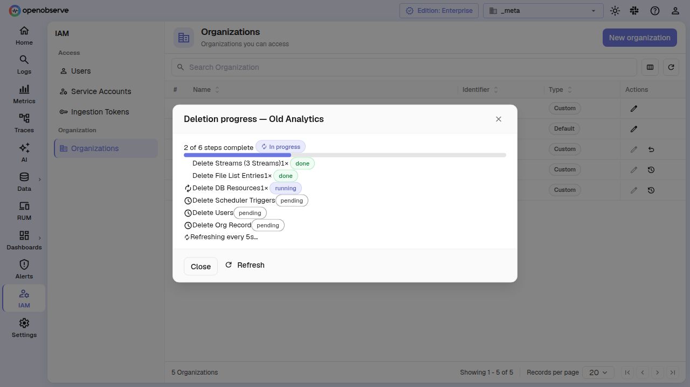

# Organization Deletion

Organization deletion lets you schedule an organization for permanent removal. A configurable grace period (default 30 days) keeps the organization in a recoverable state — hidden, blocked, and with all scheduled activity paused — before its data is permanently purged.

> Applicable to cloud deployments. Requires admin or root role in the organization.

## How It Works

When you initiate deletion, the organization enters one of two paths depending on the grace-period setting:

- **Grace period > 0 (soft delete):** The organization moves to `pending_deletion` status. It becomes immediately invisible to its members, ingestion and queries are blocked, and scheduled alerts, pipelines, and reports stop firing. During this window a **_meta** administrator can resurrect the organization. After the grace period expires, the organization automatically transitions to `deleting` and the cleanup worker removes all data permanently.

- **Grace period = 0 (immediate):** The organization skips the soft-delete phase and moves directly to `deleting`, where the cleanup worker begins permanent removal right away. This is not reversible.

> Billing subscriptions are **not** cancelled by deletion. Deletion is refused if the organization has an active paid subscription. Cancel your subscription first through the billing UI.

## Delete an Organization

### From General Settings

1. Navigate to the organization you want to delete.
2. Go to **Settings** > **General Settings**.
3. Scroll to the **Danger Zone** section at the bottom.



4. Click **Delete organization**.
5. In the confirmation dialog, type the organization name to confirm, then click **Delete organization** again.



The organization is scheduled for deletion and becomes immediately inaccessible. Anyone still on it is automatically switched to another organization.

## Manage Deletions as an Admin

**_meta** organization administrators can manage deletions across all organizations from the **IAM > Organizations** page. This view includes a **Status** column showing the current lifecycle phase and grace-period countdown for each organization.



### Resurrect an Organization

While an organization is in `pending_deletion` status — and before the grace period ends — you can cancel the deletion:

1. Switch to the **_meta** organization.
2. Go to **IAM > Organizations**.
3. Locate the organization with `pending_deletion` status.
4. Click the **Resurrect** (undo) action button.



The organization returns to `active` status, its data is untouched, and all members regain access.

### View Deletion Progress

When an organization is in `deleting` status, you can inspect the cleanup task ledger to see which steps have completed and whether any have failed:

1. Switch to the **_meta** organization.
2. Go to **IAM > Organizations**.
3. Locate the organization with `deleting` status.
4. Click the **View deletion progress** (history) action button.



The dialog shows each cleanup step with its status (**pending**, **running**, **done**, or **failed**), attempt count, and any error details. Per-stream deletion tasks are grouped into a collapsible "Delete Streams" row. The dialog auto-refreshes every 5 seconds while the deletion is in progress.

If all steps complete, the organization row is removed from the database and the cleanup task ledger is cleared. If a step fails permanently (after 10 retries), it stays in **failed** status and the deletion stalls — troubleshoot the error and the worker retries hourly.

## Configuration

| Variable | Default | Description |
|---|---|---|
| `O2_ORG_DELETION_GRACE_PERIOD_DAYS` | `30` | Number of days before a soft-deleted organization is permanently purged. Set to `0` for immediate deletion with no grace window. |

## API

### Initiate Deletion

```
DELETE /api/{org_id}/organizations
```

**Access:** Admin or root in the target organization.

Returns `200 OK` on success; `400` if the organization has an active billing subscription; `403` if the caller is not authorized; `400` if the organization is already being deleted.

### Resurrect (Cancel Pending Deletion)

```
POST /api/{org_id}/organizations/{target_org_id}/resurrect
```

**Access:** Requires the `organizations:CREATE` permission in the `_meta` organization.

Returns `200 OK` on success; `400` if the organization is not in `pending_deletion` status.

### List Cleanup Tasks

```
GET /api/{org_id}/org_cleanup_tasks/{target_org_id}
```

**Access:** Requires the `organizations:LIST` permission in the `_meta` organization.

Returns an array of cleanup task objects with `step`, `step_order`, `status`, `attempts`, `last_error`, and timing fields.

## Cleanup Workflow

Once the organization enters `deleting` status, the cleanup worker on the compactor node runs these steps in order:

1. **Delete streams** — enumerates all streams in the organization and creates a sub-task for each. Each stream's data and file-list entries are removed, then its schema definition is deleted.

2. **Delete file list** — catch-all removal of any file-list rows left behind after per-stream deletion (e.g., rows for streams whose schema was already missing).

3. **Delete DB resources** — removes every database resource belonging to the organization: alerts (through the service layer so caches evict cluster-wide), dashboards, folders, timed annotations, reports, templates, destinations, action scripts, enrichment tables, pipelines, saved views, cipher keys, search jobs, backfill jobs, search queues, distinct values, short URLs, compactor jobs, system settings, ingestion tokens, storage providers, trial quota usage, and cloud-only resources (org invites, billing-group invites, billing-group memberships).

4. **Delete scheduler triggers** — removes all scheduled-alert, scheduled-pipeline, and scheduled-report triggers so no notifications fire after deletion.

5. **Delete users** — removes each member from the organization. Users who belong only to this organization are deleted entirely along with their OpenFGA authorization tuples. Users in other organizations are kept but stripped of this organization's access grants.

6. **Delete org record** — calls the canonical organization-delete path to remove the org row, clean up all remaining OpenFGA tuples, propagate the change to the super-cluster (if configured), emit the `OrgDeleted` cloud event, and evict the organization from the status cache on all nodes.

The worker runs hourly, holds a cluster-wide distributed lock for task discovery, and uses per-task CAS (compare-and-swap) for execution — multiple compactor nodes remain safe. Steps are retried up to 10 times on failure.
