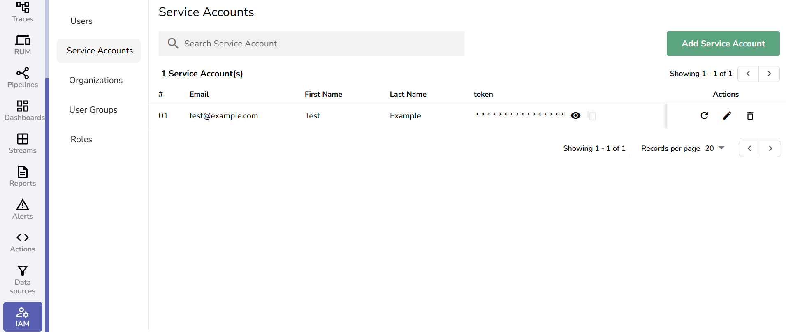

This guide explains how to create, manage, and authenticate with **service accounts** in OpenObserve.

## Overview

A service account is a non-human account used for API access, automation, and integrations. It is an **identity**: you assign it roles and permissions, and it is issued a **token** for authentication. Because permissions attach to the account rather than to the token, you can rotate the token at any time without changing the account's access, and audit logs stay tied to a stable identity across rotations.

!!! tip "Coming from API keys?"
    If you have used **API keys** in other tools (such as Kubernetes, GCP, or SaaS APIs), a service account is OpenObserve's equivalent — with roles and rotation built in. The **service account** is the identity you grant permissions to, and its **token** is the API key you place in your application.

Availability differs by edition:

- **Enterprise**: Service accounts have no permissions by default. Admins must assign roles explicitly.
- **Open-source**: Service accounts have full access by default.
- **Cloud**: Service accounts are not supported.

## Create a service account

1. From the **IAM** panel, select **Service Accounts**.
2. Click **Add Service Account**.
3. Enter the **Email** (used as the account identifier), **First Name**, and **Last Name**.
4. Click **Save**.
5. A **token** is generated and shown only once. Copy and store it securely at creation — it cannot be viewed again later; only a redacted version is shown (the first 4 characters followed by `*`).
6. After the account is created, assign the necessary **roles** and **permissions**. On Enterprise this step is required before the service account can make any API calls.



## Grant access

Service accounts are principals just like users, so you grant them access the same way:

- **Assign a role** — go to **IAM > Roles**, open a role, and add the service account from its **Service Accounts** tab.
- **Add to a user group** — go to **IAM > User Groups**, open a group, and add the service account from its **Service Accounts** tab. The account inherits every role attached to that group.

Grant only the minimum access the integration needs.

## Authenticate with the token

OpenObserve authenticates API requests using **HTTP Basic auth**, where the service account's email is the username and its token is the password.

```bash
curl -u "service-account@example.com:YOUR_TOKEN" \
  "https://your-instance/api/<org_identifier>/streams"
```

To send the credential as a header instead, base64-encode `email:token` and pass it as `Authorization: Basic <encoded>`.

## Rotate the token

You can rotate a service account's token at any time from the **Service Accounts** page by clicking the rotate icon next to the account. A rotated token is also shown only once, so copy and store it securely. Rotating does not change the account's roles or identity — only the secret.

Rotating a token requires the **Admin** or **Root** role (or, with RBAC/OpenFGA enabled, explicit permission). Users without sufficient privileges receive a `403` error.

## Which credential do I need?

OpenObserve issues a few different credentials. Use this table to pick the right one:

| Credential | Where to manage | What it authorizes | Typical use |
|---|---|---|---|
| **Service account token** | IAM > Service Accounts | Whatever roles you grant the account — general, scoped API access | Applications, automation, and integrations calling the OpenObserve API |
| **Ingestion token** (`o2oi_`) | IAM > Ingestion Tokens | Ingestion endpoints only; rejected on any other API path | Sending logs, metrics, and traces into an organization |
| **RUM token** | Ingestion page (RUM) | Real User Monitoring data from the browser | Instrumenting front-end apps with OpenObserve RUM |

If you need role-based access to the general API, use a **service account**. If you only need to ship data in, use an **[ingestion token](ingestion-tokens.md)**.
