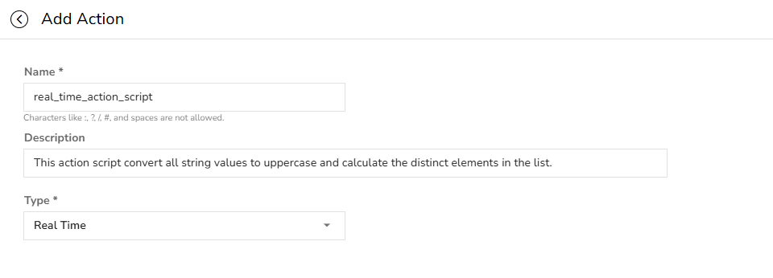
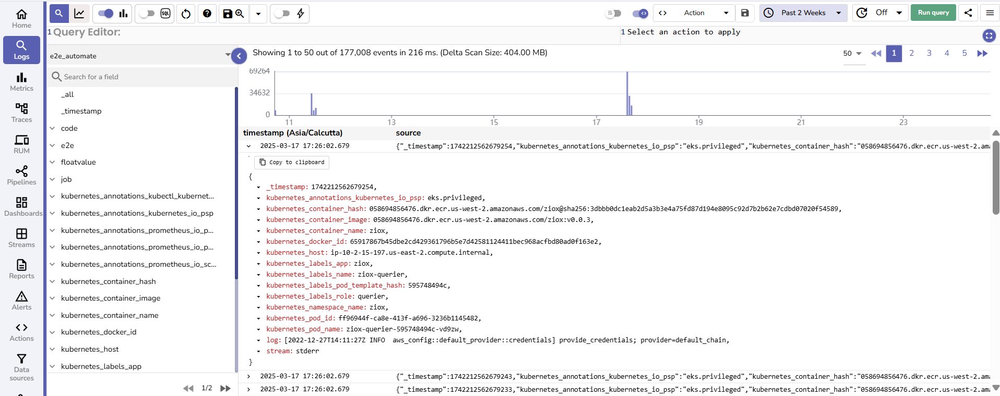
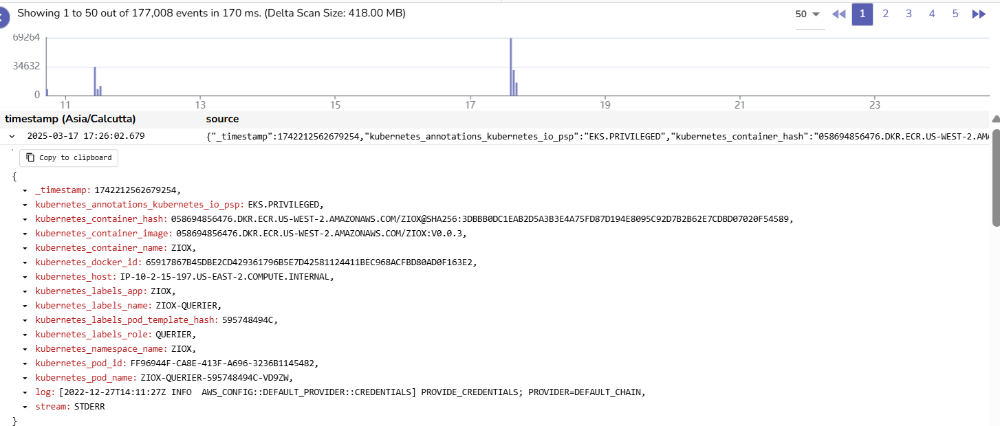
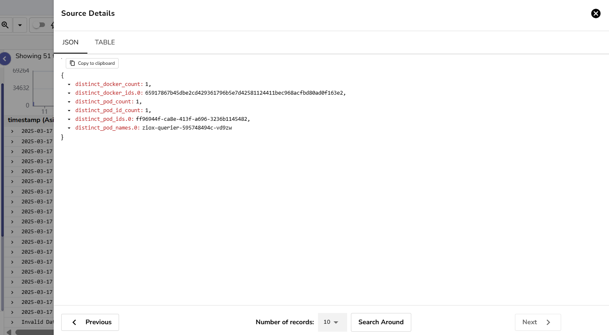

**Real-time Actions** in OpenObserve are user-defined Python scripts that are executed **immediately** when triggered, either manually by a user through the Logs UI or automatically when an alert gets triggered.

This guide provides instruction on how to create Real-time Actions.

## Prerequisite 
### Create a Service Account and Assign a Role
A [Service Account](https://openobserve.ai/docs/user-guide/identity-and-access-management/role-based-access-control/#service-accounts) in OpenObserve is a way to give specific identity access to system features and data. When you create a service account:

- OpenObserve generates a secure token (like a password).  
- You assign explicit permissions to that account. For example, access to:  
    - Action Scripts  
    - Logs  
    - Alerts

The first step to using Actions is to ensure that there is a service account that has the permission to fetch Action Scripts. 

**To create and assign Service Accounts for Actions:**

1. From the left navigation bar, go to **IAM** > **Service Accounts** > **Add Service Account**.  
2. Creates a Service Account with an email ID. Example: `action_script@gmail.com`. <br>

3. Go to **IAM** > **Roles** and assign a role to the Service Account. This can either be:  

    - An existing role  
    - A newly created role tailored to the specific use case
    
    

4. Edit the role and grant the appropriate permission to the role to enable Action execution. 


**Note:** 

- The role must include at least `GET` permission for Action Scripts. This allows OpenObserve to retrieve and run the uploaded script.
- If your script needs access to other OpenObserve services (such as Streams), make sure the Service Account also has permission for those services.
- You may use an existing Service Account if it already has the required role and permissions.


## Step 1: Create the Action Script
Based on your requirements, create the Python script that needs to get executed when the Action executes.  

**Key Points**

- All Action scripts must define a `main()` function. This is the expected entry point for execution.  
- Inputs such as data and logger are provided to `main()` during execution:   

```python  
  def main(data, logger):  
  …  
``` 
The `main()` function takes two inputs:

1. **data**: A list of log records, an Alert Template, or a JSON template.   

    - **In case of logs:** Use the following format: `List[Dict[str, Any]]`, a list of dictionaries, where each dictionary represents a log entry.   
    - **In case of Alerts:** Use the following format: `List[lAert Template]`. **The Alert Template should be a valid JSON.**  

2. **logger**:  A logger object provided by OpenObserve so your script can write logs. Use it like standard Python `logging.Logger`.   

Additionally, you can break the logic of the script into reusable components and import them into the main script using Python modules, as shown below:   

**Example**<br>
**File 1: `main.py`** <br> 
This script converts the strings from lowercase to uppercase and calculates the distinct elements in the list and appends the result into the stream data.  

```python linenums="1"
import logging  
from typing import List, Dict, Any  
from distinct import distinct  # helper function in another file

def main(data: List[Dict[str, Any]], logger: logging.Logger) -> List[Dict[str, Any]]:  
    logger.info("Starting transformation")

    result = []  
    for item in data:  
        updated_item = {  
            key: (value.upper() if isinstance(value, str) else value)  
            for key, value in item.items()  
        }  
        result.append(updated_item)

    pod_names, pod_count = distinct([item['kubernetes_pod_name'] for item in data])  
    docker_ids, docker_count = distinct([item['kubernetes_docker_id'] for item in data])  
    pod_ids, pod_id_count = distinct([item['kubernetes_pod_id'] for item in data])

    logger.info(f"Distinct pod names: {pod_count}, docker IDs: {docker_count}")

    return [{  
        "distinct_pod_names": pod_names,  
        "distinct_pod_count": pod_count,  
        "distinct_docker_ids": docker_ids,  
        "distinct_docker_count": docker_count,  
        "distinct_pod_ids": pod_ids,  
        "distinct_pod_id_count": pod_id_count  
    }]  
```  
**File 2: `distinct.py`**  
```python  
def distinct(lst):  
    unique_elements = set(lst)  
    return list(unique_elements), len(unique_elements)  
```  
**File 3: `pyproject.toml`** (for dependency management)
 
```toml  
[project]  
name = "openobserve_action"  
version = "0.1.0"  
requires-python = ">=3.8"  
dependencies = []  
```  
If you are using external libraries, list them in the `dependencies` section. 
<br> 
**Note**: OpenObserve supports two ways to manage dependencies for your Action scripts:

- `pyproject.toml` File
- `dependencies` Folder

Learn more about [declaring Python dependencies in Actions](declare-python-dependencies-in-O2-actions.md).

## Step 2: Compress the Script Folder into a ZIP File
- All Python scripts, including the dependency declaration file must be packaged into a ZIP file before uploading. The ZIP file structure may look like the following:

```bash
real_time_action_script/
├─ main.py          	# Required entry script
├─ distinct.py         	# Optional helper functions
├─ pyproject.toml or dependencies 	# (if dependencies exist)
```

## Step 3: Configure the Real-time Action


1. Go to **Actions** in the OpenObserve UI.  
2. Click **Add Action**.<br>


3. In the **Add Action** page:  

    - **Name**: Provide a name for your Action. Note that characters like :, ?, /, #, and spaces are not allowed.  
    - **Description**: Enter an appropriate description.   
    - **Type**: Select **Real-time**.<br>


4. In the **Upload Script Zip** section, upload the Action script package in `.zip` format and click **Continue**. OpenObserve stores the ZIP file in object storage.<br> 
**Note:** Only `.zip` files are accepted and it may contain various resources such as `main.py`, `.txt` etc.  
  

The file is now securely stored and tied to that Action configuration. Note that the Actions scripts are not executable yet.

## Step 4: Select the Service Account

Under **Select Service Account**, select a service account that the Action should use for credentials or identity. <br>
**Note**: Now, OpenObserve knows which token to use when it needs to run the Action.  


## Step 5: Add Environment Variables (optional)

You can use environment variables to pass information into your script, without writing it directly in the Python script. [Learn how to use environment variables in Actions.](environment-variables-in-actions.md)

## Step 6: Click Save

After you save the Real-time Action, it becomes ready for execution. 

## Action Execution Phase
The following steps describe what happens when an Action gets executed:

1. **Starts Action Runner**: OpenObserve runs an isolated execution environment (called an Action runner).
2. **Authenticates with the Service Account**: OpenObserve uses the selected service account `action_script@gmail.com`. It looks up the permissions you assigned to that service account. 
3. **Fetches the Script**: OpenObserve checks if `action_script@gmail.com` has`GET` access to Action Scripts:

    - **If Yes**, OpenObserve uses the service account’s token to access object storage and download `real_time_action_script.zip`.
    - **If No**, OpenObserve logs a permission error and stops. The script is never run.

4. **Runs the Script**: OpenObserve extracts the zipped file that the user uploads while configuring the Action and runs the `main.py` file inside it.

## Use Real-time Action to Transform Logs

1. From the left navigation menu, select **Logs**.  
2. Select the stream on which you want to apply the logs transformation.   
  
3. From the toolbar, use the **Transform Type** dropdown to select **Action**.   
4. Select the appropriate Action to apply. For example, `real_time_action_script` that converts the strings from lowercase to uppercase and calculates the distinct elements in the list and appends the result into the stream data.  
5. Select the time period for which you want to transform the data.   
6. Click **Run Query**.

## Result
Expand the logs to view the result. In this example, the Action converts the log strings get into uppercase, as shown below:  
  
Also, the calculation gets appended at the end of the logs as shown below:  

