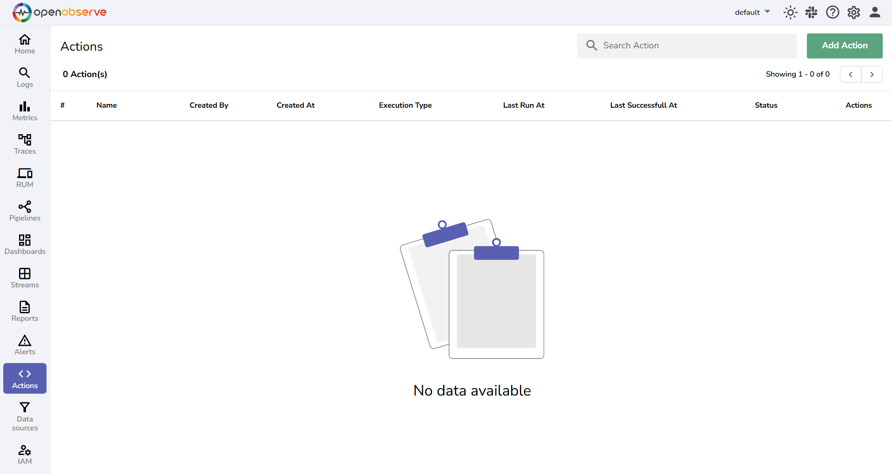
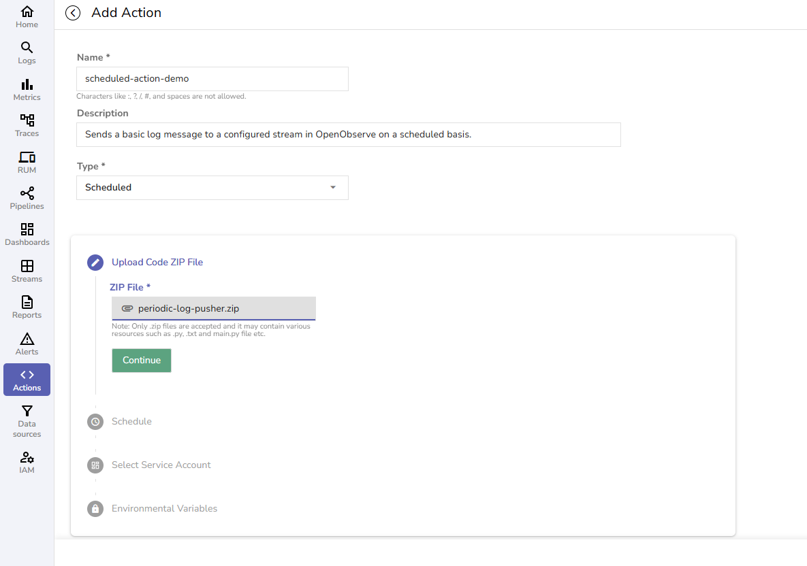
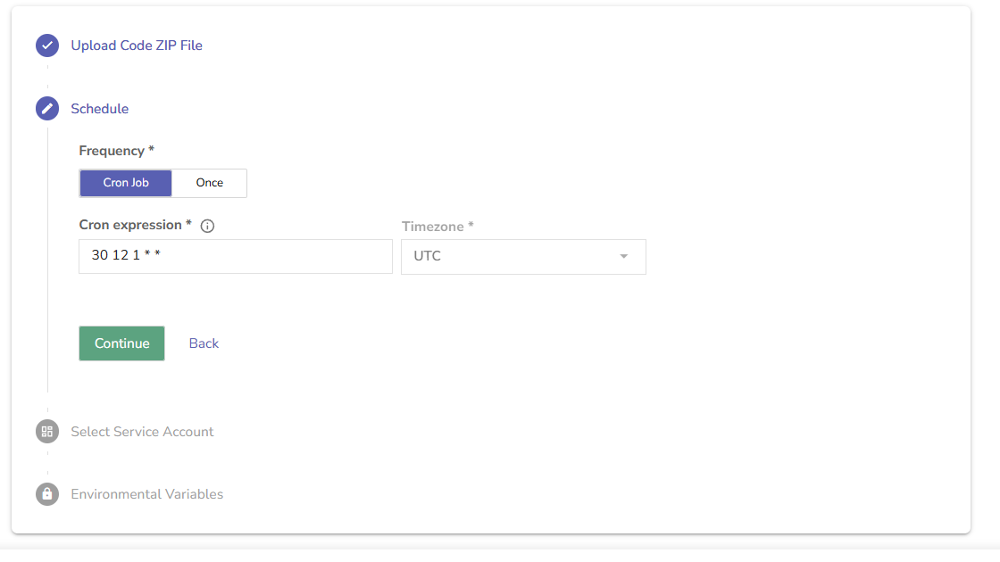
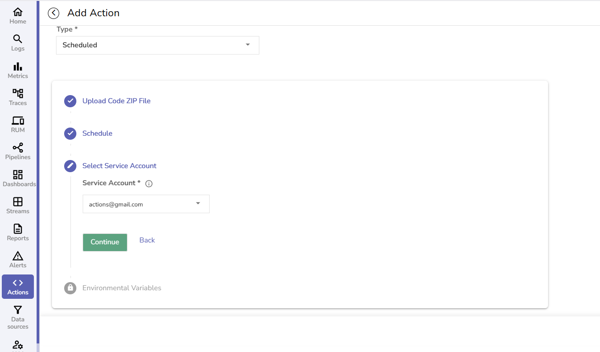
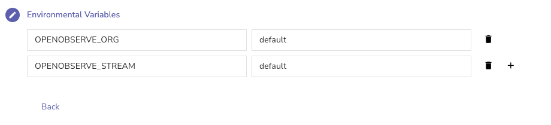
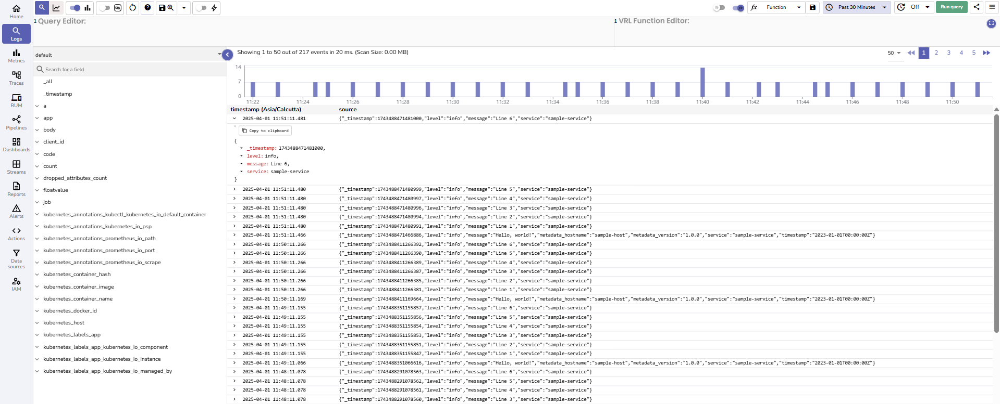

This guide provides step-by-step instructions for creating and using Scheduled Actions in OpenObserve.

**Scheduled Actions** in OpenObserve allow you to execute custom Python scripts at a specific time, either **once** or on a **recurring schedule** defined using a cron expression.  
Scheduled Actions run based on time, making them suitable for:

- Routine or periodic tasks. For instance, hourly, daily, weekly.  
- Background jobs that interact with OpenObserve. For instance, ingest logs.

>The following example demonstrates a periodic log pusher. <br>
>The action script:
>
>- Establishes a connection to OpenObserve using environment variables.
>- Pushes a test log event to the `default` organization and `default` stream.
>- Runs at a scheduled time defined by the cron expression.


### Prerequisites

Before you create a Scheduled Action, ensure the following are in place:

1. **Service Account with Necessary Permissions**

    - Choose an existing service account or create a new one, depending on your needs.  
    - Ensure the service account is associated with a role that grants permission to perform the specific actions required by your script. The role must include:  

        - **Actions**: `GET` permission (mandatory)  
        - Other permissions based on your script's requirements. In this example, the script interacts with log streams, the role must include permission to access and manage **Streams**.

2. **Python Script Requirements**

    - Must contain a `main()` function.  
    - **Important:** `main()` must **not** accept any arguments. **Scheduled Actions do not take input at runtime.**  
    - Use environment variables to fetch values such as:  

        - Base URL of OpenObserve  
        - Authentication token  
        - Target org and stream 

    Note: 

    `ORIGIN_CLUSTER_URL` and `ORIGIN_CLUSTER_TOKEN` are available to all actions by default. You do not need to manually define them during the Scheduled Action configuration. In the `main.py` script, user can directly call, as shown below:
    ```python
    os.environ.get("ORIGIN_CLUSTER_URL")
    os.environ.get("ORIGIN_CLUSTER_TOKEN")
    ```
    Note that you must use the base64 encoded version of the cluster token.   
    > **Where to Get the Base64 Token**
    > <br>
    > To find the base64-encoded version of `username:password`:
    >
    >1. From the left navigation menu, select **Data Sources**.
    >2. Go to **Custom** > **OTEL Collector**.
    >3. Locate the section for `Authorization: Basic <token>`
    >The value after `Basic` is your **base64 token**.

    However, other variables (like `OPENOBSERVE_ORG`, `OPENOBSERVE_STREAM`) are not provided by default.  
    If the script needs them, you can define them in the script or in the **Environment Variables** section when creating or editing an Action.

The following `main.py` builds a connection to OpenObserve, then pushes a test log to the `default` organization and `default` stream.

```python linenums="1"
import os
import sys
import json
import logging
import requests
import base64
from typing import Dict, Any, Optional, Tuple

# Configure logging
logging.basicConfig(
    level=logging.INFO,
    format='%(asctime)s - %(name)s - %(levelname)s - %(message)s'
)

logger = logging.getLogger(__name__)
class OpenObserveClient:
    def __init__(self):
        # Get values from environment variables with defaults
        self.base_url = os.environ.get("ORIGIN_CLUSTER_URL", "http://localhost:5080")
        self.token = os.environ.get("ORIGIN_CLUSTER_TOKEN", "dXNlcm5hbWU6cGFzc3dvcmQ=") # Here, "dXNlcm5hbWU6cGFzc3dvcmQ=" is the base64-encoded version of "username:password". See the "Where to Get the Base64 Token" section above.
        self.org = os.environ.get("OPENOBSERVE_ORG")
        self.stream = os.environ.get("OPENOBSERVE_STREAM") 

        # Ensure base_url doesn't end with a slash
        self.base_url = self.base_url.rstrip('/')

        # Parse the token to get username and password
        try:
            # Decode base64 token
            decoded = base64.b64decode(self.token).decode('utf-8')
            self.username, self.password = decoded.split(':', 1)
            self.auth = (self.username, self.password)
            logger.info(f"Initialized OpenObserve client for org: {self.org}, stream: {self.stream}")
        except Exception as e:
            error_msg = f"Failed to parse base64 encoded token: {str(e)}"
            logger.error(error_msg)
            raise ValueError(error_msg)

    def ingest_data(self, data: Dict[str, Any]) -> bool:
        """
        Ingest data to OpenObserve stream
        Args:
            data: Dictionary containing the data to be ingested
        Returns:
            bool: True if ingestion was successful, False otherwise
        """
        try:
            # Endpoint for ingesting JSON data
            url = f"{self.base_url}/api/{self.org}/{self.stream}/_json"

            # Make POST request to ingest data
            response = requests.post(
                url,
                json=data,
                auth=self.auth,
                headers={"Content-Type": "application/json"}
            )

            # Check if request was successful
            if response.status_code in (200, 201, 204):
                logger.info(f"Successfully ingested data to {self.stream}")
                return True
            else:
                logger.error(f"Failed to ingest data: {response.status_code} - {response.text}")
                return False               
        except Exception as e:
            logger.error(f"Error while ingesting data: {str(e)}")
            return False  
 
    def ingest_batch(self, data_list: list) -> bool:

        """
        Ingest a batch of data to OpenObserve stream
        Args:
            data_list: List of dictionaries containing data to be ingested          
        Returns:
            bool: True if ingestion was successful, False otherwise
        """
        try:
            # Endpoint for ingesting multiple records
            url = f"{self.base_url}/api/{self.org}/{self.stream}/_json"
            
            # Make POST request to ingest batch data
            response = requests.post(
                url,
                json=data_list,
                auth=self.auth,
                headers={"Content-Type": "application/json"}
            ) 

            # Check if request was successful
            if response.status_code in (200, 201, 204):
                logger.info(f"Successfully ingested {len(data_list)} records to {self.stream}")
                return True
            else:
                logger.error(f"Failed to ingest batch data: {response.status_code} - {response.text}")
                return False             
        except Exception as e:
            logger.error(f"Error while ingesting batch data: {str(e)}")
            return False
def main():
    try:
        # Initialize OpenObserve client
        client = OpenObserveClient()

        # Sample data to ingest
        sample_data = {
            "message": "Hello, world!",
            "level": "info",
            "timestamp": "2023-01-01T00:00:00Z",
            "service": "sample-service",
            "metadata": {
                "hostname": "sample-host",
                "version": "1.0.0"
            }
        }

        # Ingest single data point
        success = client.ingest_data(sample_data)      
        if success:
            # Sample batch data
            batch_data = [
                {"message": "Line 1", "level": "info", "service": "sample-service"},
                {"message": "Line 2", "level": "info", "service": "sample-service"},
                {"message": "Line 3", "level": "info", "service": "sample-service"},
                {"message": "Line 4", "level": "info", "service": "sample-service"},
                {"message": "Line 5", "level": "info", "service": "sample-service"},
                {"message": "Line 6", "level": "info", "service": "sample-service"}
            ]

            # Ingest batch data
            client.ingest_batch(batch_data)
    except Exception as e:
        logger.error(f"Error in main function: {str(e)}")

if __name__ == "__main__":
    main()
```

### Create a Scheduled Action in OpenObserve

Now, let's set up the Scheduled Action using the above action script: 

#### Step 1: Go to Actions

1. From the left navigation menu, select **Actions**.  
2. Click **Add Action**.


#### Step 2: Enter Name, Description, and Type

- **Name**: Enter a name for the action. Example: scheduled_log_sender.  
- **Description**: Provide a description for the action. Example: Sends a test log message on a schedule.  
- **Type**: Select **Scheduled**.

#### Step 3: Upload the Action Script in `.zip` Format

Ensure that the zip file has `main.py`, optional helper functions, and the `pyproject.toml` file or `dependencies` folder with necessary dependencies. [Learn more about declaring dependencies when creating Action script in Python.](declare-python-dependencies-in-O2-actions.md)



#### Step 4: Set the Schedule 

Choose either: 

- **Once**: Script runs one time only 
- **Cron Job**: Recurring runs based on a cron expression
 
Let's say, you want the action runner to execute this action at 12:30 PM on the 1st day of every month. In this case, select **Cron Job** and enter the cron expression as: `30 12 1 * *`



Other Cron Expression Examples:

- 0 * * * *: Every hour at minute 0  
- 10 7 * * *: At 07:10 AM UTC every day  
- 30 2 * * 1: Every Monday at 02:30 UTC

**Important:** 

- All cron jobs run in UTC timezone. Be sure to convert from your local time if needed.  
- Once a Scheduled Action is saved, you cannot change the schedule later. Double-check your schedule before submitting.

#### Step 5: Select a Service Account



#### Step 6: Add Environment Variables (optional)

You can use environment variables to pass information into your script, without writing it directly in the Python script. [Learn how to use environment variables in Actions](environment-variables-in-actions.md).

For the periodic log pusher action script, we can use the environment variables and values while configuring the actions.  
```python linenums="15"
 def __init__(self):  
        # Get values from environment variables with defaults  
        self.base_url = os.environ.get("ORIGIN_CLUSTER_URL")  
        self.token = os.environ.get("ORIGIN_CLUSTER_TOKEN”)  
        self.org = os.environ.get("OPENOBSERVE_ORG")  
        self.stream = os.environ.get("OPENOBSERVE_STREAM")  
```
Since `ORIGIN_CLUSTER_URL` and `ORIGIN_CLUSTER_TOKEN` are available by default, define other variables in the **Environment Variables** section.   



#### Step 7: Click Save

After the scheduled action gets saved, it remains `Ready` until the scheduled time. After the execution is complete the status shows `Completed`. If the execution fails, the status shows `Errored`.

#### Result

In the above example, when the schedule hits and the script executes successfully, it connects to OpenObserve using the environment variables and push a log at the scheduled time. The output looks like this:

```json  
{  
  "message": "Scheduled log from OpenObserve action",  
  "level": "info",  
  "timestamp": "2025-01-01T00:00:00Z",  
  "service": "scheduled-action"  
}

```  
