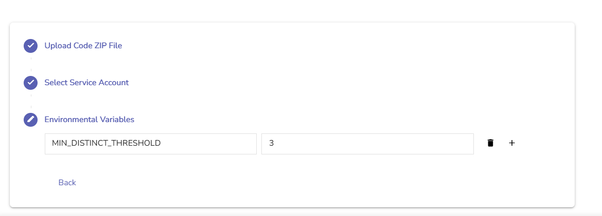

If your Action script is designed to use environment variables (e.g., for thresholds or other dynamic values), OpenObserve gives you the option to define those variables while [configuring the Action](../create-and-use-real-time-actions/).

> You can use environment variables to pass information into your script, without writing it directly in the Python script.  

## Example 
The following Python script processes a list of log records and returns the **distinct Kubernetes pod names** and **Docker IDs**, **but only if the number of distinct pod names meets a minimum threshold set by an environment variable**.

```python  linenums="1"
import os  
import logging  
from typing import List, Dict, Any  
from distinct import distinct

def main(data: List[Dict[str, Any]], logger: logging.Logger) -> List[Dict[str, Any]]:  
    logger.info("Starting log transformation")

    # Get environment variable  
    min_count_str = os.getenv("MIN_DISTINCT_THRESHOLD", "0")  
    try:  
        min_count = int(min_count_str)  
    except ValueError:  
        logger.error("Invalid MIN_DISTINCT_THRESHOLD. Must be an integer.")  
        return []

    # Use helper function  
    pod_names, pod_count = distinct([item.get("kubernetes_pod_name") for item in data])  
    docker_ids, docker_count = distinct([item.get("kubernetes_docker_id") for item in data])

    logger.info(f"Found {pod_count} distinct pod names")  
    logger.info(f"Found {docker_count} distinct docker IDs")

    # Only return result if pod count exceeds threshold  
    if pod_count < min_count:  
        logger.info(f"Pod count below threshold ({min_count}). Skipping output.")  
        return []

    return [{  
        "distinct_pod_names": pod_names,  
        "distinct_pod_count": pod_count,  
        "distinct_docker_ids": docker_ids,  
        "distinct_docker_count": docker_count  
    }]  
```  
While creating or editing the Action, in the Environment Variables section, you can set:  
`MIN_DISTINCT_THRESHOLD = 3` <br>

This ensures that your script only returns results if at least 3 distinct pod names are found.
