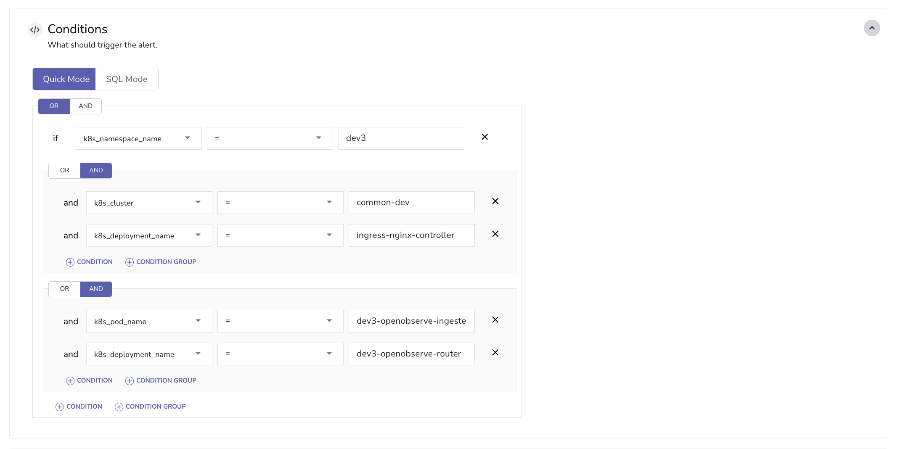

This guide explains how to define alert conditions in OpenObserve using logical operators and grouping rules.

## Define Alert Conditions
While creating an alert, you can define multiple conditions to determine when the alert should be triggered. Use logical operators such as AND and OR to combine conditions. These operators allow you to create structured, rule-based logic to control alert evaluation.

**To define multiple conditions:**

1. In the **Add Alert** view, navigate to the **Conditions** section.
2. Select an operator between AND or OR at the top level. This operator will be applied across all items added at the same level.
3. Define an individual condition using a column, an operator, and a value.
4. Select **+ Condition** to add more conditions at the same level.
5. Select **+ Condition Group** to add a grouped block of conditions. A group has its own operator, independent from the parent group or other groups at the same level.

!!! Note
    Each condition group in an alert can include nested groups to build complex logic. However, nesting is limited to a maximum depth of three levels per group. This means you can nest groups within groups, but only up to three levels deep.

    This limit ensures that alert logic remains readable and manageable while still allowing sufficient flexibility for advanced use cases.

## Example
The configuration shown in the image includes the following conditions:

1. The top-level logical operator is `OR`. 
2. There are three items at the top level:

- A condition: `k8s_namespace_name` equals `dev3`
- A condition group with the `AND` operator:

    - `k8s_cluster` equals `common-dev`
    - `k8s_deployment_name` equals `ingress-nginx-controller`

- Another condition group with the `AND` operator:

    - `k8s_pod_name` equals `dev3-openobserve-ingester`
    - `k8s_deployment_name` equals `dev3-openobserve-router`

## How it works
The alert is triggered if any one of these items is true:

- `k8s_namespace_name` is `dev3`.
- Both `k8s_cluster` is `common-dev` and `k8s_deployment_name` is `ingress-nginx-controller`.
- Both `k8s_pod_name` is `dev3-openobserve-ingester` and `k8s_deployment_name` is `dev3-openobserve-router`.

Because the top-level operator is `OR`, only one item must be true for the alert to trigger.

