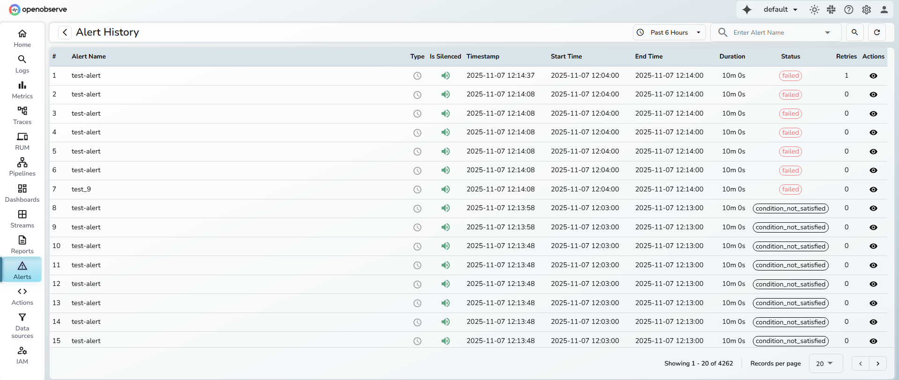
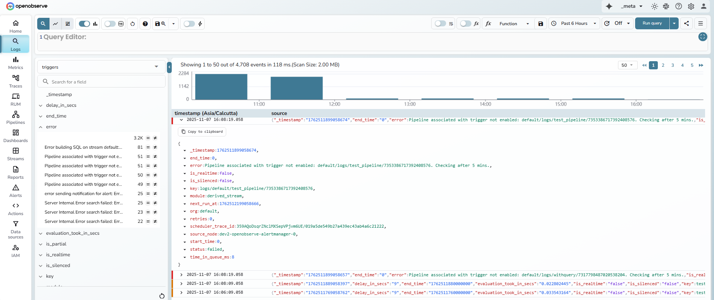

This guide provides information about how the Alert History feature in OpenObserve works, where the data originates from, who can access it, how to interpret the Alert History table, and how to debug failed or skipped alerts.

## Overview 
All alert trigger data is stored in the triggers stream inside the `_meta` organization. Access to `_meta` is restricted and managed through IAM, which means only users with elevated privileges can view it directly.

The Alert History page brings this information into the user’s organization. It provides visibility into alert evaluations, including when each alert ran, its evaluation duration, and its final status. This design allows alert owners to monitor alert performance and troubleshoot issues without requiring access to the `_meta` organization.

!!! note "Who can access it"
    Any user who has permission to view, update, or delete alerts can also access Alert History. This ensures that alert managers and operators can analyze their alerts’ execution history without depending on users with higher administrative access.

## How to interpret the Alert History table

Each row represents one alert evaluation.

- **Alert Name**: The name of the configured alert.
- **Type**: Indicates whether the alert is Scheduled or Real-time.
- **Is Silenced**: Shows whether the alert was silenced during evaluation.
- **Timestamp**: Time when the alert manager picked up the alert for evaluation.
- **Start Time** and **End Time**: The time range of data evaluated.
- **Duration**: How long the alert condition remained true.
- **Status**: The result of the alert evaluation.
- **Retries**: Number of times the system retried alert delivery when the destination did not acknowledge it. The system retries up to three times.   
**Note**: The environment variable `ZO_SCHEDULER_MAX_RETRIES` defines how many times the scheduler retries a failed execution.
- **Actions**: Opens a detailed view that includes:

    - **Evaluation Time**: The time taken to complete the alert’s search query.
    - **Silenced**: Indicates whether the alert was silenced.
    - **Source Node**: The node that processed the alert. Useful for debugging distributed environments.

- **Status codes**:
    
    - **completed**: The alert condition was met, and the notification was sent to its destination.
    - **failed**: The alert evaluation or delivery failed. The trigger record in `_meta` includes the error field with details.
    - **condition_not_met**: The configured alert condition was not satisfied for that time range.
    - **skipped**: The scheduled evaluation window was missed due to a delay, and the system evaluated the next aligned window.

## How to debug a failed alert
This process applies only to users who have access to the `_meta` organization.

1. From the organization selector, switch to `_meta`.
2. Go to **Logs**.
3. From the stream dropdown, select `triggers`.
4. Set the required time range and select Run query.
5. Locate the error log for the failed alert.
6. Identify the `scheduler_trace_id` field.  
    **Example:**  
    `scheduler_trace_id: 358zJCLiWVdApBSBXM50YYnIwgA/019a5d91932174c3bab84fff2785f73f`  
    The trace ID is the part after the slash: `019a5d91932174c3bab84fff2785f73f`
7. Copy this trace ID.
8. Switch back to your organization.
9. Go to **Logs**.
10. In the SQL editor, search using the trace ID. 
    For example, 
    `match_all('019a5d91932174c3bab84fff2785f73f')`
    This displays all logs related to that alert evaluation.
11. Review the logs to identify the failure cause, such as query issues, destination errors, timeouts, or node resource problems.
12. Use the **Source Node** field from the **Alert History** details to locate the node that processed the alert and check its introspection logs if needed.

## Why you might see a skipped status
A **skipped** status appears when a scheduled alert runs later than its expected window.  
For example, an alert configured with a 5-minute period and 5-minute frequency is scheduled to run at 12:00 PM. It should normally evaluate data from 11:55 to 12:00.
If the alert manager experiences a delay and runs the job at 12:05 PM, it evaluates the current aligned window (12:00 to 12:05) instead of the earlier one. The earlier window (11:55 to 12:00) is marked as skipped to indicate that evaluation for that range did not occur because of delay in job pickup or data availability.