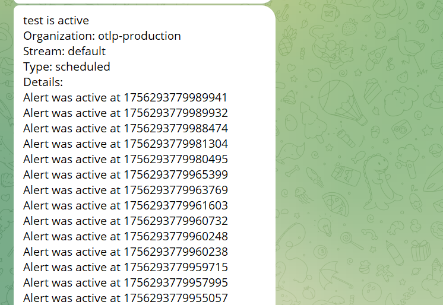

This guide explains how to configure OpenObserve alerts to send notifications directly to Telegram. You will create a template, configure an alert destination, and attach it to an alert rule.

## Prerequisites
- A Telegram account
- Telegram bot token: Create a bot in Telegram using **BotFather**. BotFather provides the token.
- Telegram chat ID: Start a chat with your bot, send a message, and run `getUpdates` with your bot token to retrieve the `chat.id`.

Verify the bot token and chat ID with the following commands:

### Get updates
```bash
curl "https://api.telegram.org/bot<YOUR_BOT_TOKEN>/getUpdates"
```

### Get bot details
```bash
curl "https://api.telegram.org/bot<YOUR_BOT_TOKEN>/getMe"
```

### Send a test message
```bash
set TOKEN=<YOUR_BOT_TOKEN>
set CHAT=<YOUR_CHAT_ID>

curl.exe -X POST "https://api.telegram.org/bot%TOKEN%/sendMessage" ^
  --data-urlencode "chat_id=%CHAT%" ^
  --data-urlencode "text=OpenObserve test"
```
If the message appears in Telegram, your setup is correct.

---

## Configure OpenObserve alerts

### Step 1: Create Template
1. Go to **Management > Templates > Add Template**.
2. Enter a name, for example `Telegram_alert`.
3. Select **Web Hook**.
4. In the Body, add the following JSON. Replace <YOUR_CHAT_ID> with your chat ID.

5. Save the template.

### Step 2: Create Alert Destination
1. Go to **Management > Alert Destinations > Add Destination**.
2. Enter a name, for example `Telegram_alert`.
3. Select the template you created earlier (Telegram_alert).
4. Set **URL** to: https://api.telegram.org/bot<YOUR_BOT_TOKEN>/sendMessage
5. Set **Method** to POST.
6. Add the header: Content-Type = application/json
7. Save the destination.


### Step 3: Create Alert

1. Go to **Alerts > Add Alert**.
2. Configure the alert:
    
    - Name: any name
    - Stream Type: logs
    - Stream Name: select your stream. For example, default.
    - Alert Type: Scheduled
    - Condition: for example service_name = ingress-nginx
    
    - Threshold: >= 1 time
    - Period: 1 minute
    - Frequency: 1 minute
    - Destination: select `Telegram_alert`
    
    - In Row Template, define the row format, for example: `Alert was active at {_timestamp}`
3. Save the alert.

### Step 4: Verify alert delivery
After you save the alert, wait until the condition is met.
If configured correctly, you will receive a message in Telegram that looks similar to the following:


---- 

## Troubleshooting

**Issue:** No message received in Telegram <br>
**Solution:** Verify that the template body includes a valid `chat_id`. Without `chat_id`, Telegram cannot deliver the message.

Example of a valid body:

{
  "chat_id": "8237******",
  "text": "{alert_name} is active \nDetails:\n{rows}"
}
