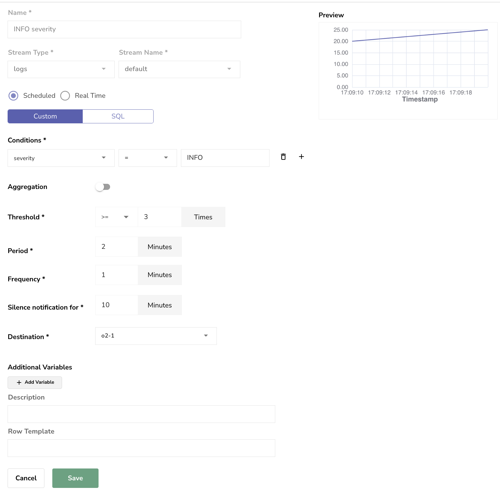
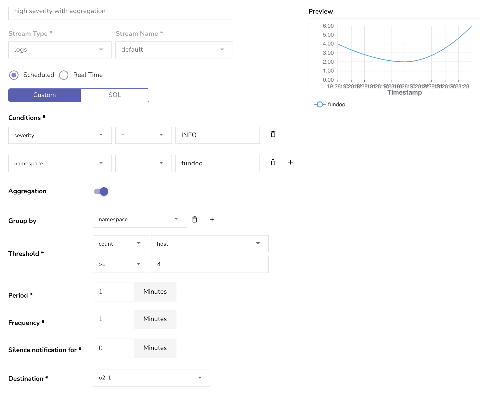

# Alerts

Alerting provides mechanism to notify users when certain conditions are met. OpenObserve supports both scheduled and real time alerts. For the most part you should use Standar alerts as they are more efficient and can be used for most use cases.

Real time alerts are useful when you want to be notified of a condition as soon as it occurs. Realtime alerts are suited primarily in the scenarios like "panic" in log or known malicious ip address in logs. Realtime alerts are evaluated at ingestion time based on condition specified, they are evaluated per record and can be computationally expensive.

## Concepts

Following is the definition of the fields in alerts:

- **Threshold**: The threshold above/below which the alert will trigger. e.g. if the threshold is >100 and the query returns a value of 101 then the alert will trigger.
    - For Scheduled - Standard:
        - Threshold is measured against the number of records returned by the SQL query
    - For Scheduled - With aggregation:
        - This is fired whenever the SQL query returns more than `0` records
    - For Scheduled with SQL:
        - Threshold is measured against the number of records returned by the SQL query

- **Period**: Period for which the query should run. e.g. 10 minutes means that whenever the query will run it will use the last 10 minutes of data. If the query runs at 4:00 PM then it will use the data from 3:50 PM to 4:00 PM.

- **Frequency**: How often the alert should be evaluated. 2 minutes means that the query will be run every 2 minutes and will be evaluated based on the parameters provided.

- **Silence notification for**: If the alert triggers then how long should it wait before sending another notification. This is to prevent overloading of alert messages. e.g. if the alert triggers at 4:00 PM and the silence notification is set to 10 minutes then it will not send another notification until 4:10 PM even if the alert is still after 1 minute. This is to avoid spamming the user with notifications.

- Aggregation: The aggregation function to be used for the query. e.g. if the query is `SELECT COUNT(*) FROM table` then the aggregation function is `COUNT`. If the query is `SELECT AVG(column) FROM table` then the aggregation function is `AVG`.

OpenObserve supports following kinds of alerts:

## Standar alerts

Standar alerts are evaluated at frequency (every 1 minute by default ) for the condition of the alert, over duration specified as part of alert. If the condition evaluates to true a notification is sent to alert destination. Additionally user can delay notification after a notification is generated once for specified time duration.

For example: 

> A user wants to be notified of condition if error code 500 occurs more than 15 time for duration of 2 mins & wants such evaluation to happen at every 1 minute frequency.

### Scheduled - Standard

You can configure the condition which will be converted to SQL query and executed at specified frequency.

We can configure the alert like this:

**Threshold** is measured against the number of records returned by the SQL query



The above alert configuration will result in the following SQL query (It's simplified for understanding):

```sql
select count(*) from default where severity = 'INFO' 
```

The above query will be run every 1 minute for the last 2 minutes data. If count(*) > 3 (Threshold) then the alert will trigger. Additionally, the alert will not send another notification for 10 minutes after the first notification is sent.

### Scheduled - With aggregation

We fire when record count > 0




### Scheduled - with SQL

Threshold = number of records returned

### Scheduled - with PromQL


## Real time alerts

Real time alerts are evaluated at ingestion time based on condition specified , they are evaluated per record.

For example: 

> A user wants to be notified of when API response time is more than 100 ms

<kbd>

</kbd>

Please note we selected `Slack` destination for demo, but you can add others in `Alert destination`.
