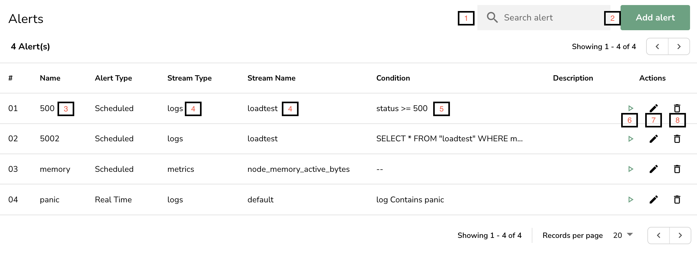
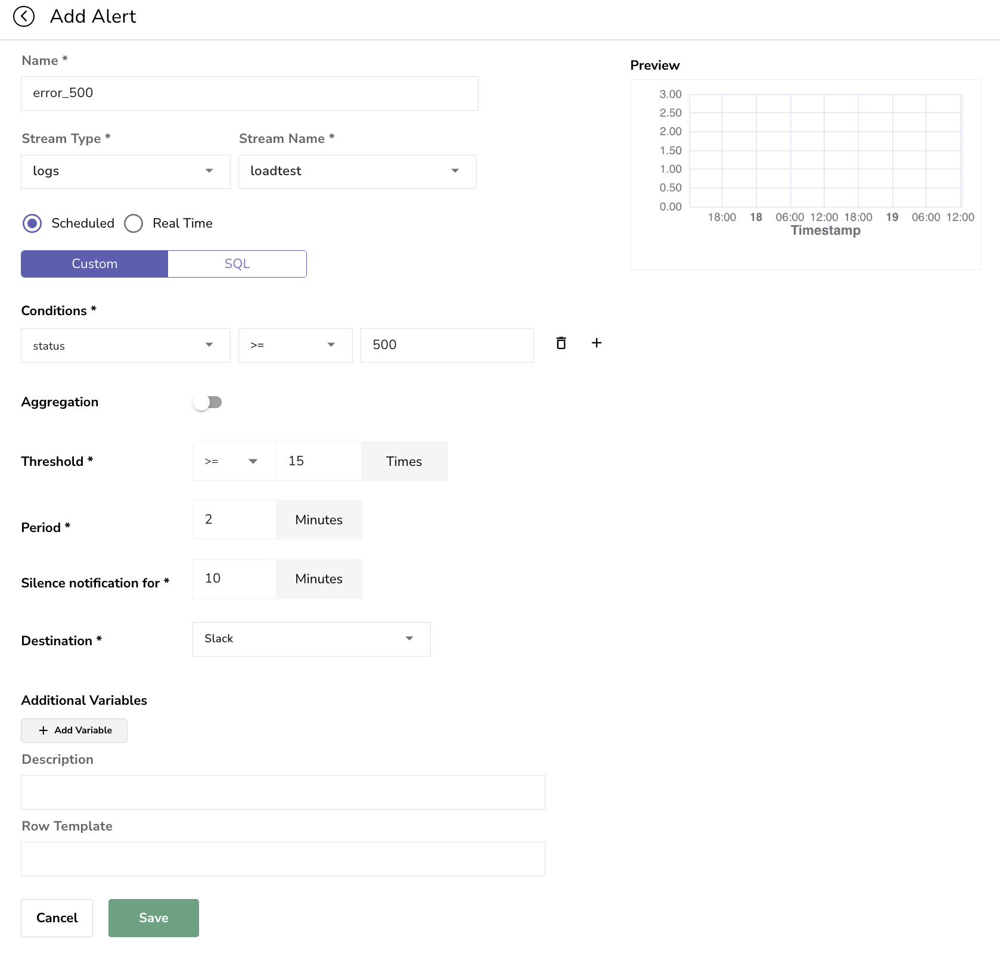
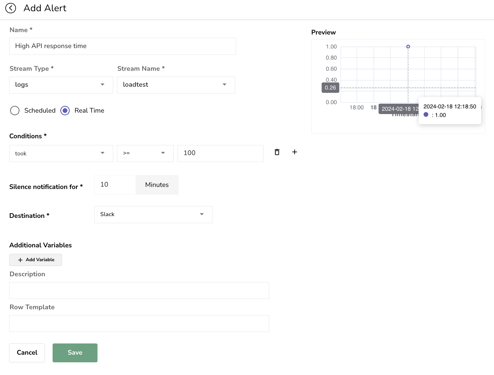

# Alerts

We support two kinds of alerts, which are evaluated for specified stream:

1. Scheduled alerts
1. Real time alerts

To navigate to alerts in OpenObserve, select preferred organization using organization selection control, then click on  menu , which will take one to alerts list screen. The screen lists all alerts for selected organization.  

<kbd>

</kbd>

**Alert screen details:**

1. Search in listed alerts
1. Add new alert
1. Name of the alert - used during notification
1. Stream type and stream name for alert
1. Conditions or custom SQL / PromQL used for alert evaluation
1. Start / Pause alert
1. Edit alert
1. Delete alert

## Scheduled alerts

Scheduled alerts are evaluated at frequency for the condition of the alert, over duration specified as part of alert. If the condition evaluates to true a notification is sent to alert destination. Additionally user can delay notification after a notification is generated once for specified delay.

For example: 

> A user wants to be notified of condition if error code 500 occurs more than 15 time for duration of 2 mins & wants such evaluation to happen at 1 min frequency.

We can configure the alert like this:

<kbd>

</kbd>

## Real time alerts

Real time alerts are evaluated at ingestion time based on condition specified , they are evaluated per record.

For example: 

> A user wants to be notified of when API response time is more than 100 ms

<kbd>

</kbd>

Please note we selected `Slack` destination for demo, but you can add others in `Alert destination`.
