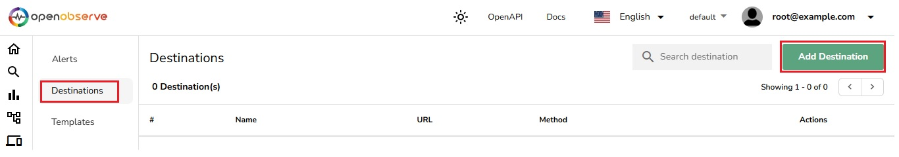
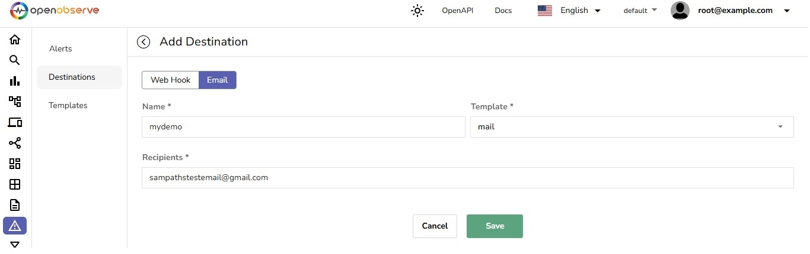
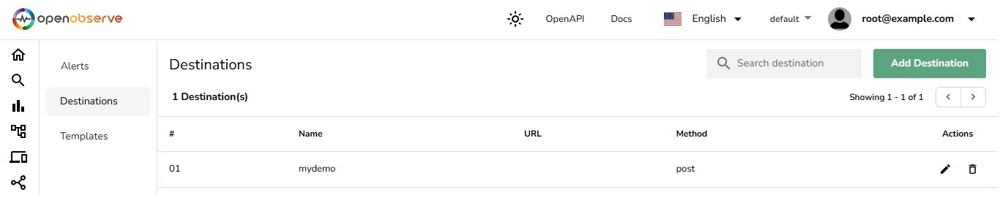

# Alerts - destinations
In OpenObserve (O2), **Destinations** enables users to set up notification channels for alert messages. These destinations define where and how notifications will be delivered when alerts are triggered. Destinations are reusable, allowing them to be associated with multiple alerts for efficient management.

The **Destinations** section provides two configuration options:
1. **Webhook**: Used for sending notifications to third-party systems via HTTP requests.
2. **Email**: Used for delivering notifications directly to email addresses.

Below is a detailed guide on how to configure both Webhook and Email destinations in OpenObserve.

---
## Configuring Webhook Destinations

Webhooks are ideal for integrating OpenObserve alerts with third-party platforms, such as Slack, Microsoft Teams, or custom systems. Follow these steps to configure a Webhook destination:

1. Navigate to the **Alerts** module from the left-hand navigation menu and click on **Destinations**.
2. Click the **Add Destination** button.

3. In the **Add Destination** screen, select the **Webhook** tab (selected by default).
4. Fill in the following details:
   - **Name**: Enter a descriptive name for the Webhook destination (e.g., "Slack Notifications").
   - **Template**: Choose a predefined alert message template from the dropdown menu.
   - **URL**: Specify the Webhook endpoint URL where notifications will be sent.
   - **Method**: Select the HTTP method (**POST**, **GET**, or **PUT**) depending on the Webhook's requirements.
   - **Headers (Optional)**: Add custom headers in key-value format (e.g., authentication tokens or content type).
   - **Skip TLS Verify**: Enable this option if the endpoint uses self-signed certificates or if you want to bypass SSL verification.
6. Once all the fields are complete, click **Save** to create the Webhook destination.


### Example:

- **Name**: Slack Alerts  
- **Template**: SlackTemplate  
- **URL**: `https://hooks.slack.com/services/T02QBH105PF/B04C7NLLLRE/HY3fXf123`  
- **Method**: POST  
- **Headers**:  
  - **Key**: Authorization  
  - **Value**: Basic cm9vdEBleGFtcGxlLmNvbTpDb21wbGV4GFzcy  

---
## Configuring Email Destinations

Email destinations are used for delivering alert notifications directly to specified email addresses. To configure an Email destination:

1. Navigate to the **Alerts** module from the left-hand navigation menu and click on **Destinations**.
2. Click the **Add Destination** button.
3. In the **Add Destination** screen, select the **Email** tab.
4. Fill in the following details:
   - **Name**: Provide a descriptive name for the Email destination (e.g., "Team Alerts").
   - **Template**: Select a predefined email message template from the dropdown.
   - **Recipients**: Enter one or more email addresses, separated by commas or semicolons.
5. Click **Save** to create the Email destination.


### Example:

- **Name**: Critical Alerts  
- **Template**: EmailTemplate  
- **Recipients**: `team@example.com; manager@example.com`  

---
## Additional Notes

- Configured destinations appear in the **Destinations** list under the **Alerts** module. From this list, you can:
  - Search for specific destinations by name or type.
  - Edit existing destinations to update settings.
  - Delete destinations that are no longer required.
- Destinations can be linked to multiple alerts, allowing for efficient and consistent notification management.

By following this guide, you can set up Webhook and Email destinations to ensure timely and reliable alert notifications in OpenObserve.

---
### Setup and Configure OpenObserve to Send Email Alerts via SMTP

To send email alerts, OpenObserve requires SMTP configuration. This can be done by setting the appropriate environment variables when starting OpenObserve.


#### Start OpenObserve with SMTP Configuration

Use the following command to configure OpenObserve to send email alerts via Gmail:

```bash
ZO_SMTP_ENABLED=true \
ZO_SMTP_HOST="smtp.gmail.com" \
ZO_SMTP_PORT=587 \
ZO_SMTP_USER_NAME="your-user-name" \
ZO_SMTP_PASSWORD="your-app-password" \
ZO_SMTP_FROM_EMAIL="your-email-address" \
ZO_SMTP_ENCRYPTION="starttls" \
ZO_ROOT_USER_EMAIL="root@example.com" \
ZO_ROOT_USER_PASSWORD="Complexpass#123" \
./openobserve
```
Replace the placeholders (your-email-address, your-app-password, etc.) with your actual SMTP details.

By configuring SMTP, you ensure that OpenObserve can send reliable email notifications for your alerts.

If you're interested in learning more about SMTP environment variables, refer to this documentation: [SMTP Environment Variables](https://openobserve.ai/docs/environment-variables/#smtp).

For step-by-step instructions on setting up Email Alerts in OpenObserve, check out our Blog: [How to Configure Email Alerts in OpenObserve](https://openobserve.ai/blog/how-to-configure-email-alerts-in-openobserve).

