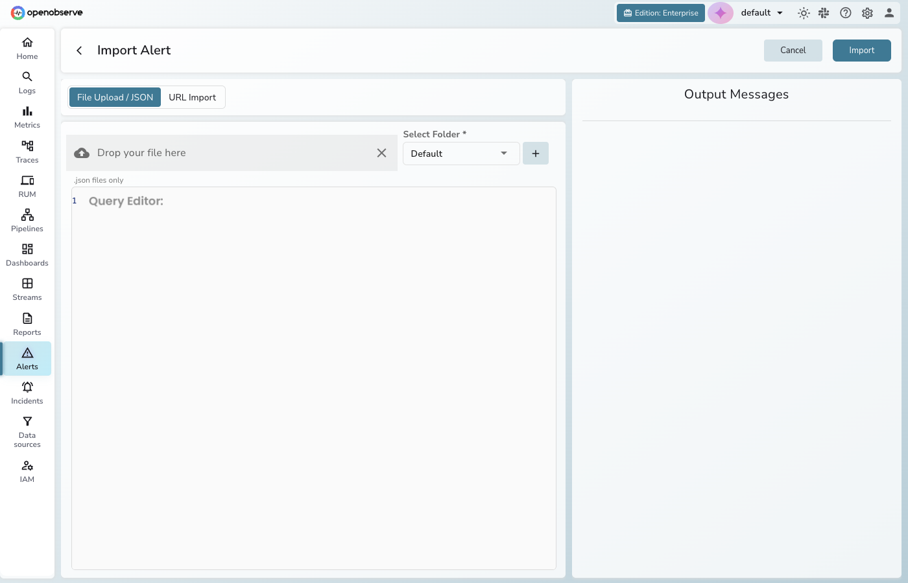
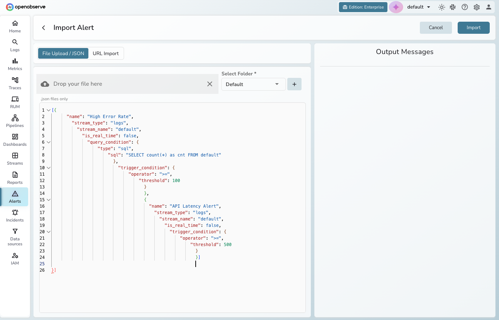
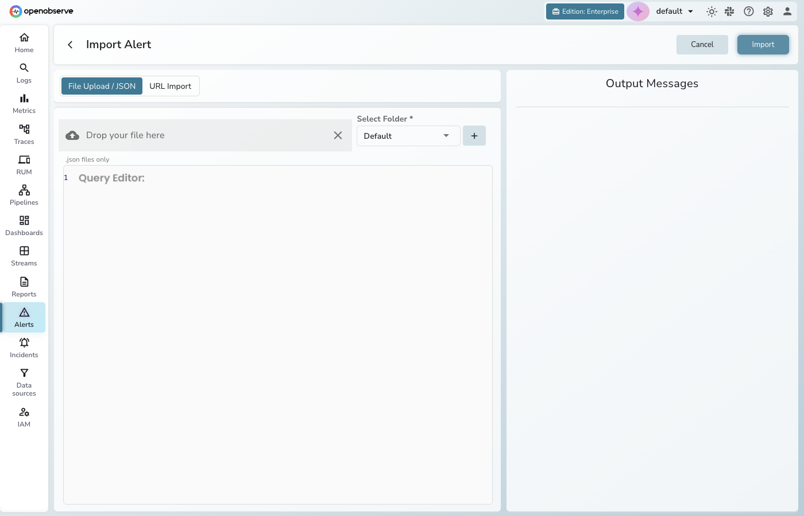
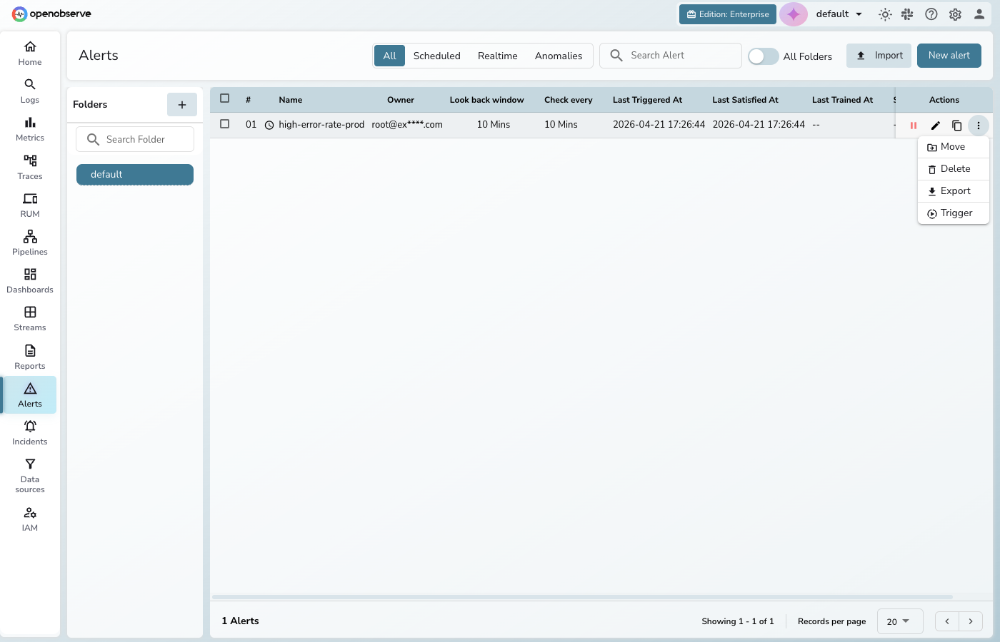

This guide provides an overview of the alert import and export feature and explains how to use it. 

The primary goal of the alert import and export feature is to simplify and automate the management of alert configurations across environments. Instead of manually recreating alert rules in each OpenObserve instance, users can export an alert’s definition to a file and import it elsewhere. 

An alert, including its conditions, thresholds, and other settings, can be represented as a JSON object. OpenObserve provides multiple ways to import this JSON: uploading a JSON file, providing a URL to a JSON template, or pasting raw JSON content. Exporting an alert does the reverse – it serializes the alert’s settings into a JSON file that can be downloaded or shared.

## Import Alerts

You can import alerts individually or in bulk using pre-defined templates. The import process supports the following formats:

- JSON files  
- URL   
- JSON object or array

### Steps to Import an Alert

1. From the left-hand navigation, select **Alerts**.  
2. Click the **Import** button. 
3. Choose one of the supported import methods: 

    - **Upload JSON File:** Select a local JSON file containing alert configurations.  
    - **Enter URL:** Provide a URL to fetch the alert configuration.  
    - **Paste JSON Object:** Copy and paste the JSON alert definition in the JSON editor.

**Note**: To import alerts in bulk, choose multiple JSON files, as shown below: 

4. Click **Import**.  
5. If validation errors occur, resolve issues based on the prompts:

- **If the alert name already exists:** Enter a new alert name.  
- **If the destination is missing:** Select a destination from the dropdown.  
- **If the timezone is missing for the cron job:** Select the appropriate timezone from the dropdown.  
- **If the stream name and stream type does not exist:** Select existing stream name and stream type. 

## Export Alerts

Alert export allows users to download an alert configuration as a JSON file. This file contains all the alert's settings. 

### Steps to Export an Alert

1. Navigate to the **Alerts** page.  
2. Locate the alert you want to export.  
3. Click the **Export Alert** button under the **Actions** column.

The alert configuration is downloaded as a JSON file.  
This JSON file can later be imported into another OpenObserve instance, making it easy to transfer or restore alerts.

## Use Cases

- If you manage separate instances, such as development, test, and production environments, you can configure alerts in one environment and import them into others to replicate the monitoring setup.   
- Many teams use a set of predefined alerts, such as those for high CPU usage or error log spikes, that should be included in every new project or organization. Instead of manually creating these alerts each time, teams can maintain a library of alert JSON templates. When setting up a new OpenObserve organization or stream, they can quickly import the necessary alerts from these templates.
