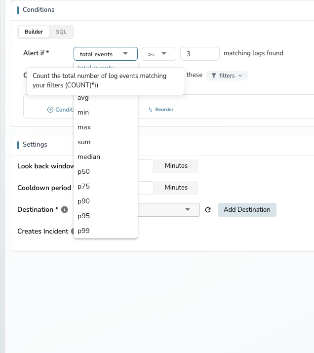

This guide explains how to define alert conditions in OpenObserve using the condition sentence builder and filter system.

## Condition sentence

The condition sentence is the core of the alert configuration. It reads as natural language, making the alert logic immediately clear. The sentence structure changes based on the selected function.

### Count mode

When the function is set to **total events** (the default for logs and traces), the condition counts matching records:

**"Alert if total events >= 3 matching logs found"**

- The **operator** and **threshold** control when the alert fires
- No column selection is needed — the alert counts all records matching the filters
- Group-by is not available in count mode

### Measure mode

When you select an aggregation function (avg, min, max, sum, etc.), the condition evaluates a specific field:

**"Alert if avg of cpu_usage is >= 80"**

- A **column selector** appears — choose the field to aggregate
- **Group by** becomes available — evaluate the condition per dimension
- The operator and threshold now apply to the aggregated value

![Measure mode showing "Alert if avg of [column] is >= [value]" with Group by option](../../../images/add-alert-measure-mode.png)

### Metrics streams

For **metrics** stream types, count mode (total events) is not available. The condition always uses measure mode with an aggregation function.

---

## Aggregation functions

The function dropdown determines how data is evaluated. Each function includes a tooltip describing what it computes.

| Function | Description | Mode |
|----------|-------------|------|
| **total events** | Count the total number of events matching filters (`COUNT(*)`) | Count |
| **count** | Count non-null values of the selected field | Measure |
| **avg** | Average value of the selected field | Measure |
| **min** | Minimum value of the selected field | Measure |
| **max** | Maximum value of the selected field | Measure |
| **sum** | Sum of all values of the selected field | Measure |
| **median** | Median (50th percentile) of the selected field | Measure |
| **p50** | 50th percentile value of the selected field | Measure |
| **p75** | 75th percentile value of the selected field | Measure |
| **p90** | 90th percentile value of the selected field | Measure |
| **p95** | 95th percentile value of the selected field | Measure |
| **p99** | 99th percentile value of the selected field | Measure |

---

## Group by

In measure mode, click **+** next to **Group by** to add one or more fields. When group-by is configured:

- The alert evaluates the condition independently for each unique combination of group-by field values
- If any group meets the condition, the alert triggers
- The notification includes which groups triggered the alert

For example, grouping by `hostname` with "Alert if avg of cpu_usage >= 80" evaluates CPU usage per host and alerts if any individual host exceeds the threshold.

---

## Filter conditions

Filters narrow which data the alert evaluates. Click the **filters** dropdown in the condition area to expand the filter section.

### Add a filter

1. Click **+ Condition** to add a new filter row.
2. Select a **field** from the stream's available columns.
3. Select an **operator**: `=`, `!=`, `>=`, `<=`, `>`, `<`, `Contains`, `NotContains`.
4. Enter a **value** to match.

### Multiple filters

- The first condition is labeled **if**.
- Additional conditions are labeled **and** — all conditions must be true for a record to match.
- Click the **x** button on any condition row to remove it.

### Filter groups

Click **+ Condition Group** to create a grouped block of conditions. Groups support their own logical operator, enabling nested logic such as:

`(level = error AND service = api) OR (level = warn AND response_time > 5000)`

!!! note
    Condition groups can be nested up to three levels deep. This limit ensures alert logic remains readable while allowing sufficient flexibility for advanced use cases.

### SQL preview

A SQL preview of the generated query is always visible within the filter section. It updates automatically as you add or modify conditions. The preview is limited to two lines and scrolls for longer queries.

---

## Query modes

### Builder mode

The default mode. Use the condition sentence and filters to define alert logic without writing code. Suitable for most monitoring use cases.

### SQL mode

Click the **SQL** tab to switch to SQL mode. The condition sentence is replaced with:

- An inline SQL editor with the generated query
- An **Open Full Editor** button for a full-screen editor with a field browser, AI assistance, and results preview
- **Check every** and **Alert if No. of events** controls below the editor

!!! warning
    Queries using `SELECT *` are not allowed for scheduled alerts. Specify the columns you need.

### PromQL mode

Available for **metrics** stream types only. Click the **PromQL** tab to enter a Prometheus query expression. The condition sentence shows operator and value controls for the PromQL result.

---

## Operators

The following comparison operators are available for both count and measure mode thresholds:

| Operator | Description |
|----------|-------------|
| `>=` | Greater than or equal to (default) |
| `>` | Greater than |
| `<=` | Less than or equal to |
| `<` | Less than |
| `=` | Equal to |
| `!=` | Not equal to |

---

## Switching between modes

When switching from measure mode back to count mode:

- The column selector and group-by fields are hidden.
- The aggregation configuration is cleared.
- The operator and threshold revert to controlling the event count.

When switching from count mode to measure mode:

- The column selector appears — select the field to aggregate.
- The group-by option becomes available.
- The operator and threshold now apply to the aggregated value.
