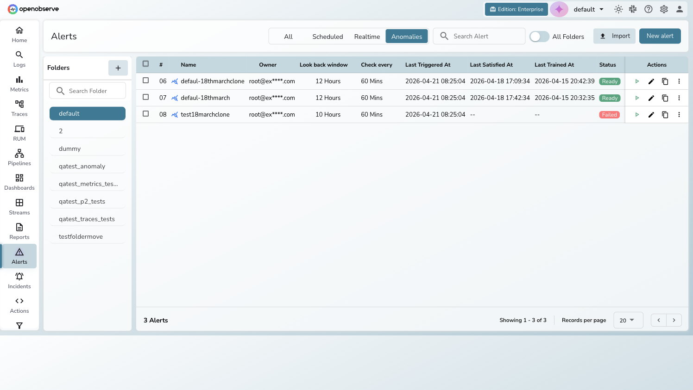
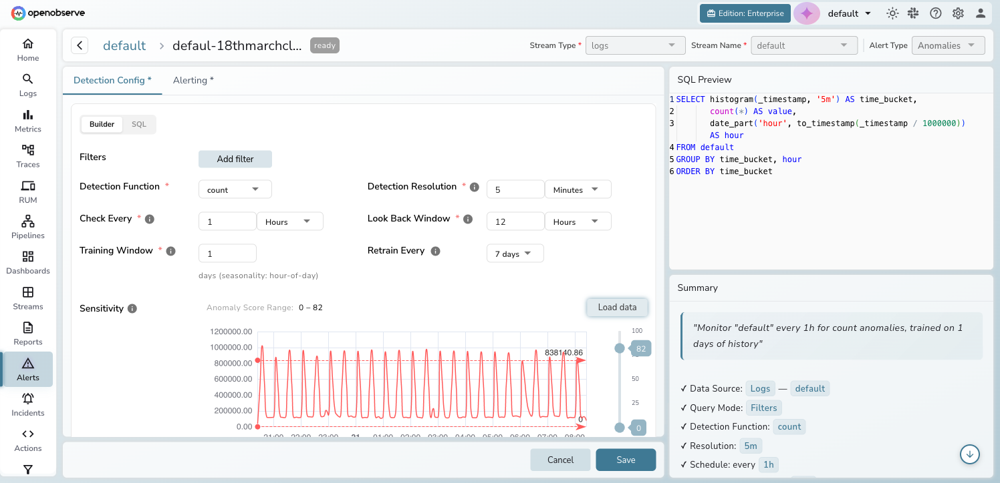
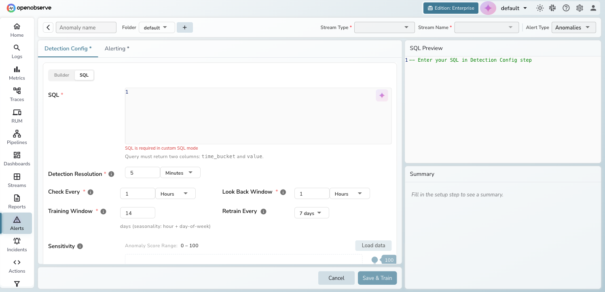
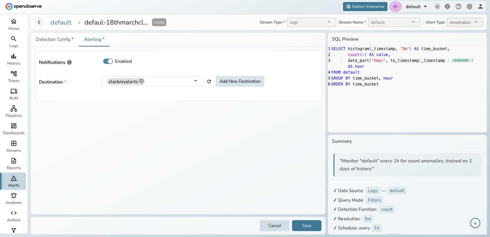
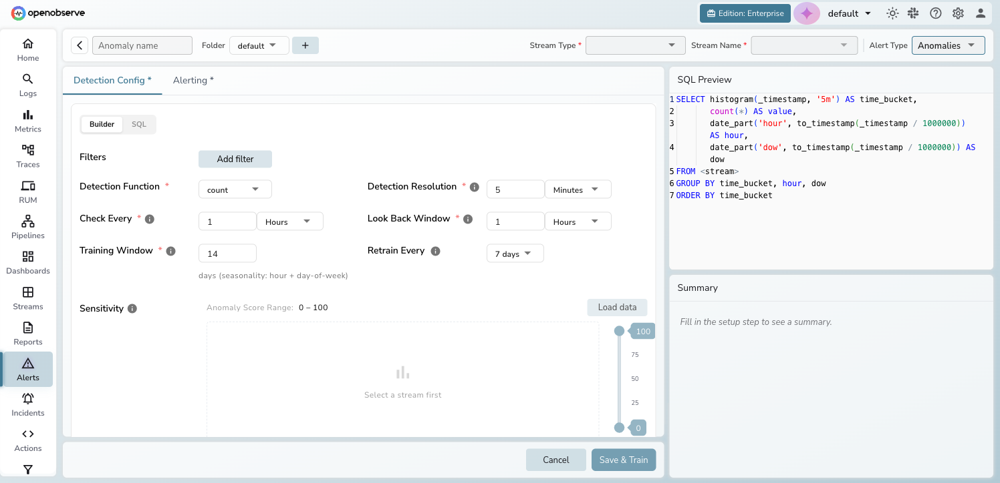
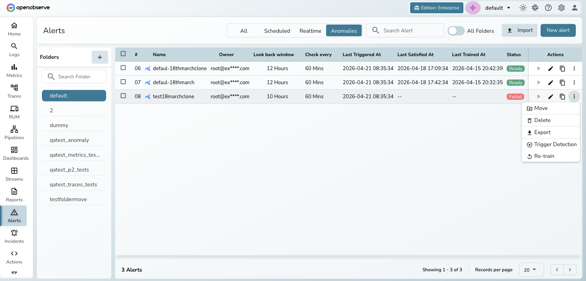

# Anomaly Detection

Anomaly Detection automatically identifies unusual patterns in your data streams using machine learning, alerting you to deviations before they become incidents.

## Overview

Traditional threshold-based alerts require you to define exact conditions for every scenario. Anomaly Detection uses Random Cut Forest (RCF) algorithms to learn your data's normal behavior and flag statistical outliers automatically — no manual threshold tuning required.

Configure a detection rule on any logs, metrics, or traces stream. OpenObserve trains a model on your historical data, then runs periodic detection to surface anomalies and optionally send notifications.

!!! note
    Anomaly Detection is available in OpenObserve Enterprise and Cloud editions.

## Getting started

**Prerequisites:**

- OpenObserve Enterprise or Cloud edition
- At least one data stream with historical data for model training

**To access anomaly detection:**

1. Click **Alerts** in the left sidebar
2. Click the **Anomalies** tab in the filter bar
3. The list displays all anomaly detection rules for the current organization

## Key features

### Model training and retraining

OpenObserve trains an isolation forest model on historical data from your selected stream. You control the training window (minimum 1 day) and the system automatically detects seasonality patterns:

- **Less than 7 days**: hour-of-day seasonality
- **7 days or more**: hour-of-day + day-of-week seasonality

Automatic retraining keeps the model current. Set a retraining interval (1, 7, or 14 days) or choose **Never** to train once and retrain manually.

### Detection configuration

The **Detection Config** tab provides a full configuration wizard:

- **Query mode** — choose **Builder** (visual filter-based) or **SQL** (custom query returning `time_bucket` and `value` columns)
- **Detection function** — aggregate data using `count`, `avg`, `sum`, `min`, `max`, `p50`, `p95`, or `p99`
- **Detection resolution** — granularity of data bucketing (e.g., 5 minutes)
- **Check every** — how often the detection job runs
- **Look back window** — how far back each detection run queries

In **SQL** mode, the query editor replaces the visual builder. Your query must return exactly two columns: `time_bucket` and `value`.

### Sensitivity tuning

The sensitivity section displays a time series preview of your historical data with adjustable threshold lines. Use the vertical range slider (0–100) to set the anomaly score range. Data points with scores outside this range trigger alerts.

Click **Load data** to preview the time series and visually adjust your thresholds.

### Alerting and notifications

The **Alerting** tab configures what happens when anomalies are detected:

- **Notifications toggle** — enable or disable alert notifications
- **Destination selector** — choose one or more destinations (Slack, email, webhook, etc.)

!!! info
    Anomaly detection results are always written to the `_anomalies` stream, even when notifications are disabled. You can query this stream directly for analysis.

### Status lifecycle

Each anomaly detection rule progresses through a status lifecycle:

| Status | Description |
|--------|-------------|
| **Waiting** | Initial state — awaiting first training |
| **Training** | Model training in progress (spinner visible) |
| **Ready** | Model trained and detection running on schedule |
| **Failed** | Training failed — hover over the status badge to see the error |

## Create an anomaly detection rule

1. Navigate to **Alerts > Anomalies** and click **New alert**.

    

2. Enter a name, select the **Stream Type** (Logs, Metrics, or Traces) and **Stream Name**.

3. On the **Detection Config** tab, configure your query:
    - In **Builder** mode, add filters and select a detection function
    - In **SQL** mode, write a query that returns `time_bucket` and `value` columns

4. Set the **Detection Resolution**, **Check Every** interval, and **Look Back Window**.

5. Set the **Training Window** (days of historical data) and **Retrain Every** interval.

6. Click **Load data** to preview the time series, then adjust the **Sensitivity** slider to set your anomaly score range.

7. Switch to the **Alerting** tab to enable notifications and select destinations.

8. Click **Save & Train** to create the rule and start model training.

!!! tip
    Start with a training window of 7–14 days for best seasonality detection. Use a shorter window (1–3 days) for fast-changing data patterns.

## Manage anomaly detection rules

From the **Anomalies** list, use the three-dot action menu on each row:

- **Pause/Resume** — temporarily stop or restart detection without deleting the model
- **Retrain** — trigger manual retraining (replaces the existing model once complete)
- **Stop Training** — cancel an in-progress training job
- **Retry** — retry training after a failure (the error message is shown in the dialog)
- **Edit** — modify the detection configuration, schedule, or alerting settings
- **Delete** — permanently remove the rule and its trained model
