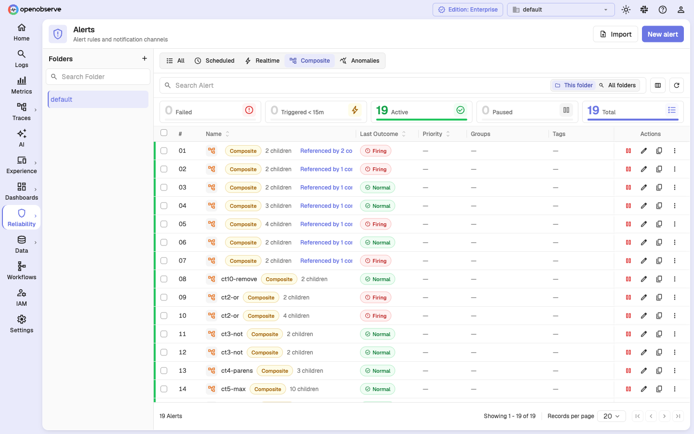
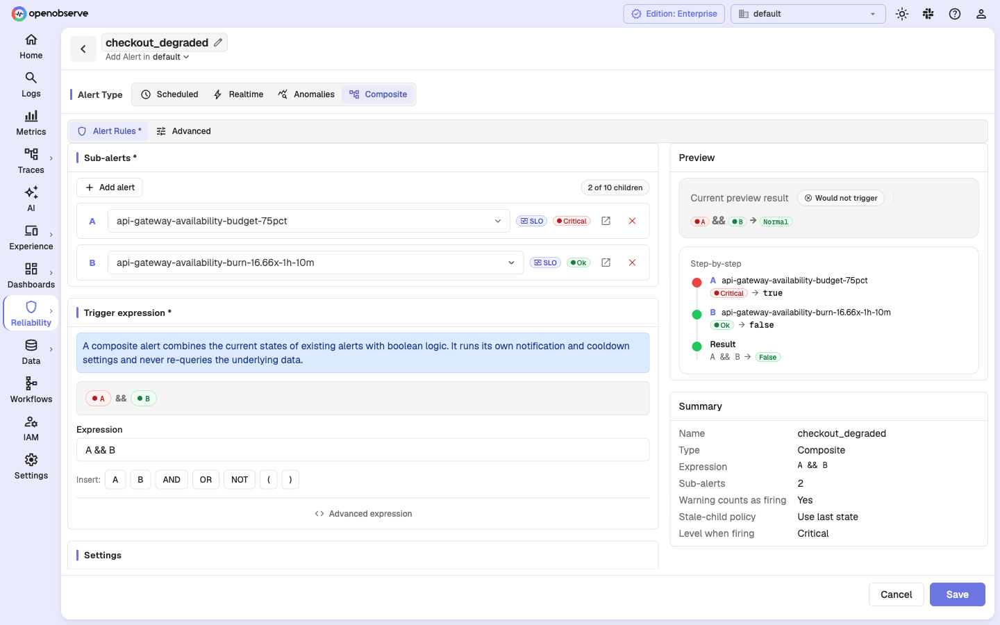
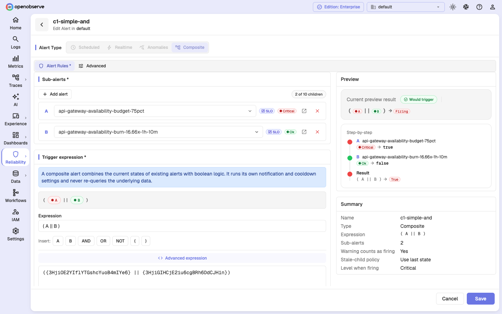
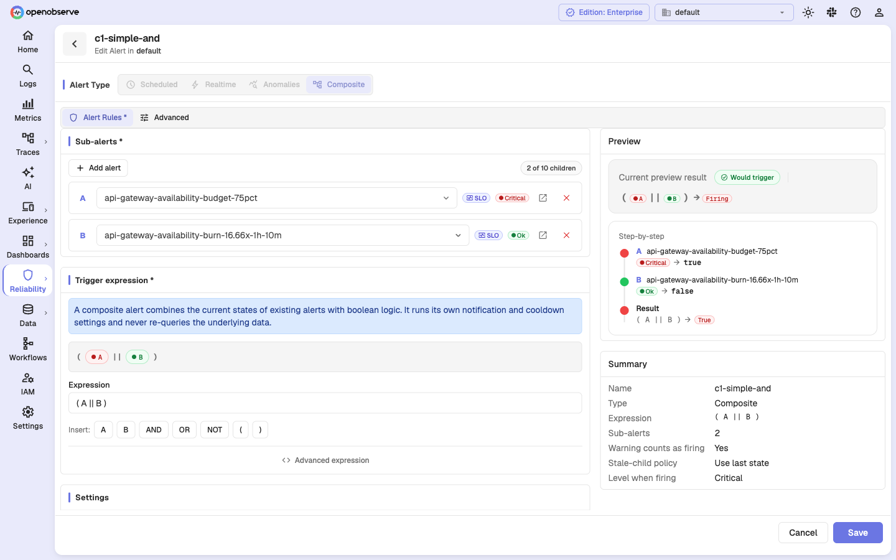
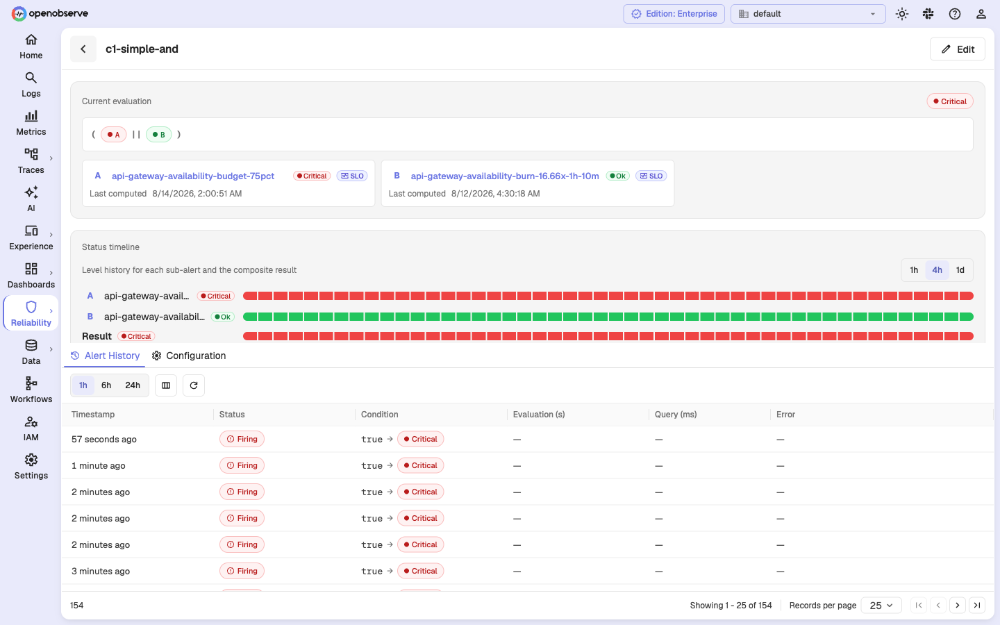
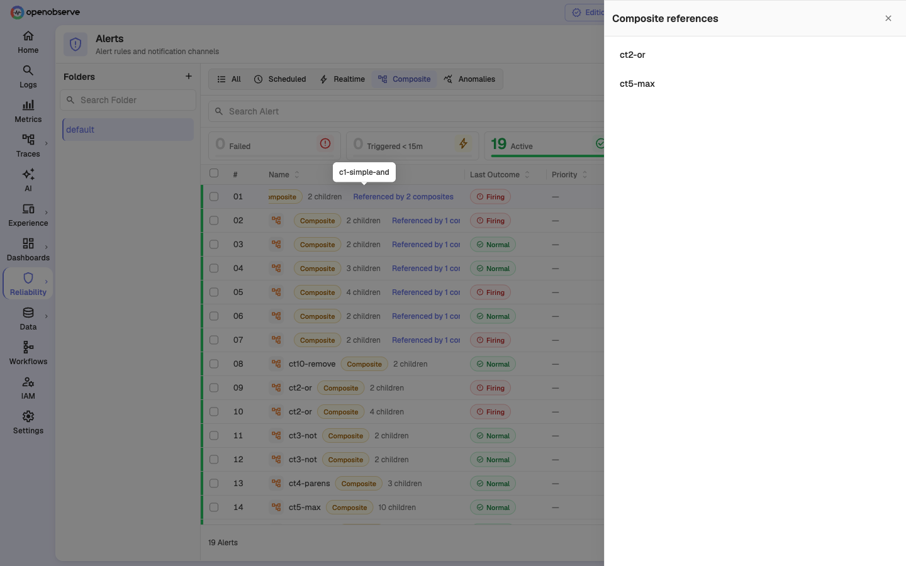

# Composite Alerts

A composite alert is an alert whose trigger condition is a boolean expression over the current state of other alerts. Instead of running its own query against raw data, a composite alert evaluates the states that other alerts have already computed and fires only when those states combine into a meaningful incident.

For example:

```text
high_error_rate && (high_latency || database_unavailable) && !deployment_in_progress
```

This reduces alert noise: each child alert remains useful for diagnosis on its own, but you page only when several independently meaningful signals line up.



## How composite alerts work

A composite alert **never re-runs the queries of its children**. It reads the durable, already-computed level of each child alert (Critical, Warning, Ok, or No data) and evaluates the boolean expression over those levels. Notifications, cooldowns, destinations, incidents, workflows, and history all follow the same behavior as ordinary alerts.

A firing composite records a **Critical** level; a non-firing composite records **Ok**.

### Eligible child types

A composite can reference between **2 and 10** children. The following alert types can be children:

- **Scheduled alerts** (SQL, PromQL, or builder-based)
- **SLO alerts**
- **Other composite alerts**, up to two levels of nesting

> **Note**: A multi-alert child contributes its overall (rollup) state only — you cannot compose on individual groups of a multi-alert. Realtime alerts and anomaly-detection rules cannot yet be children.

## Prerequisites

- At least two existing alerts (scheduled, SLO, or composite) to use as children
- At least one notification [destination](../../account-administration/management/alert-destinations.md) configured
- Appropriate permissions to create alerts and to read every alert you want to reference

---

## Create a composite alert

### Step 1: Open the form and select the Composite type

1. Go to **Alerts** in the left sidebar.
2. Click **New alert** in the top-right corner.
3. In the **Alert Type** selector, choose **Composite**.

The stream type, stream name, condition sentence, and evaluation schedule are replaced by the composite controls: **Sub-alerts**, **Trigger expression**, and **Settings**.



### Step 2: Select sub-alerts (children)

In the **Sub-alerts** section, click **Add alert** to add a child. Each child is shown as a row with:

- A **letter badge** (`A`, `B`, `C`, …) that identifies it in the expression.
- A searchable dropdown to choose any eligible alert in your organization.
- A type badge (**Scheduled**, **SLO**, or **Composite**) and a current level badge.
- An open-in-new link and a remove button.

You must select between **2 and 10** children. A counter shows your progress (for example, `2 of 10 children`), and the **Add alert** button is disabled at 10.

### Step 3: Build the trigger expression

The **Trigger expression** section combines the selected children with boolean logic. By default, selecting two children produces `A && B`.

- The editable input uses letters (`A`, `B`, `C`, …) that map to the children in order.
- Use the **Insert** palette to add an operand letter, or an **AND**, **OR**, **NOT**, **`(`**, or **`)`** token.
- A live render above the input shows the current expression as level-colored pills.
- **Unused children** are offered as one-click chips so every selected child can be placed.

Supported operators and their precedence (from highest to lowest):

- **NOT** (`!`) — negates a child's truth value
- **AND** (`&&`) — true only when both sides are true
- **OR** (`||`) — true when either side is true

Parentheses `( )` override precedence, and binary operators are left-associative. For example, `A || B && C` evaluates as `A || (B && C)`.

Each child must appear in the expression **exactly once**. Save stays disabled while the expression does not use exactly the selected child set.

#### Advanced expression view

Click **Advanced expression** to edit the raw stored form, where operands are alert IDs wrapped in braces:

```text
({3HjiOE2YIflYTGshcYuoB4mIYe6} || {3HjiGIHCjE2iu6cgBRh6DdCJH1n})
```

Names are only a presentation layer. The server stores and matches operands by stable alert ID, so renaming or moving a child never changes your stored expression.



### Step 4: Configure child behavior

Two settings control how child levels are interpreted:

- **Warning counts as firing** (default **on**): When enabled, a child in the Warning state maps to `true`. When disabled, only Critical children map to `true`.
- **Stale-child policy**: What to do when a child's state is stale (its level has not been refreshed within its expected cadence). See [Stale-child policies](#stale-child-policies) below.

### Step 5: Review the live preview

The **Preview** panel evaluates the expression against the current child states as you edit:

- **Current preview result**: **Would trigger** (Firing) or **Would not trigger** (Normal).
- **Step-by-step**: each child's level, its mapped truth value (`true`/`false`), and the final boolean result.

This is an advisory preview; the server re-validates everything on save.

### Step 6: Configure alerting settings

Composite alerts reuse the standard alert settings:

- **Cooldown period**: Minimum time between repeated notifications (default: 10 minutes).
- **Destination**: Select one or more notification destinations.
- **Creates Incident**: Toggle on to automatically create an incident when the composite fires.

### Step 7: Save

Click **Save** at the bottom. The server validates the expression, resolves every child, and checks that the alert graph has no cycles and stays within the two-level nesting limit before saving.

---

## Truth mapping

The table below shows how each child level maps to `true` (firing) or `false` (not firing) inside the expression:

| Child level | Warning counts as firing **on** (default) | Warning counts as firing **off** |
| --- | --- | --- |
| Critical | `true` | `true` |
| Warning | `true` | `false` |
| Ok | `false` | `false` |
| No data | `false` | `false` |

A child that has never been evaluated, or whose state has gone stale, follows the stale-child policy instead.

## Stale-child policies

A child is considered stale when its last computed level has not been refreshed within its expected cadence. Choose how stale children are treated:

| Policy | Behavior |
| --- | --- |
| **Use last state** (default) | Use the child's last computed level; a child with no recorded state counts as `false`. |
| **Treat stale as false** | A stale child always counts as `false`. |
| **Treat stale as true** | A stale child always counts as `true`. |

The UI makes `Use last state` explicit so you can distinguish a stale child from a currently-firing one: the detail view flags stale children with a "Freshness expired" note, and the preview shows a banner such as "… is stale — using its last Critical state".

---

## Edit a composite alert

1. Go to **Alerts** in the left sidebar.
2. Click the composite's name in the table to open its detail.
3. Click **Edit**.



The **Alert Type** tabs are read-only for existing alerts. You can add or remove children, change the expression, and adjust the child behavior settings. Removing a child also removes it from the expression automatically. Click **Save** to apply changes.

---

## View composite details

Click a composite's name in the list to open its detail view.



The detail view shows:

- **Current evaluation**: the current result level and a name-resolved expression rendered as pills.
- **Child cards**: one card per child with its letter, name (linking to the child's own detail), level, type, outcome, and last-computed time.
- **Status timeline**: a per-child and composite level history over the last 1 hour, 4 hours, or 1 day.
- **Settings**: the name-resolved expression, warning behavior, stale-child policy, and the level when firing (always Critical).

The **Alert History** tab shows the composite's trigger history, where the condition column records the boolean result and resulting level (for example, `true → Critical`).

---

## References and deletion protection

An alert that is referenced by a composite cannot be deleted. The list shows a **Referenced by N composites** chip on any alert that another composite depends on. Click it to open a drawer listing the parent composites, and navigate to any visible parent.



If you attempt to delete a referenced child, the server blocks the deletion and returns a conflict that identifies the parents you are allowed to read (plus a count of any additional hidden references).

Rename and folder moves never require updating a parent — children are referenced by ID, not by name.

---

## Best practices

- Reference alerts that are individually useful but too noisy to page on alone, then combine them into one actionable signal.
- Start with `A && B` to page only when both symptoms are present, and add `!` negations for maintenance or deployment windows.
- Keep the **Warning counts as firing** default unless a Warning child truly should not contribute to the page.
- Use **Treat stale as false** for children that must be freshly firing to count, and **Treat stale as true** when a missing heartbeat itself indicates a problem.
- Add a meaningful **Description** so on-call engineers understand the composite's intent without tracing through its children.

---

## Troubleshooting

### Composite is not firing

**Problem**: The composite does not fire when you expect it to.

**Solution**:

1. Open the **Preview** panel in the edit form to see each child's current truth value and the step-by-step result.
2. Check that the expression uses the operators and parentheses you intend (remember `!` > `&&` > `||`).
3. Verify **Warning counts as firing** — a Warning child maps to `false` when this is off.
4. Check the **Stale-child policy**: a stale child behaves differently under each policy.
5. Confirm the composite is enabled in the alerts list.

### Composite is firing but you expected it not to

**Problem**: The composite fires even though a child looks healthy.

**Solution**:

1. Review the child cards in the detail view — a child may be stale and its last state is still being used.
2. Set the stale-child policy to **Treat stale as false** so stale children stop contributing.
3. Check whether **Warning counts as firing** is treating a Warning child as firing.

### "No scheduler job" warning in the detail view

**Problem**: The detail view warns that an enabled composite has no scheduler job, so it will not evaluate.

**Solution**: Edit and save the composite, or disable and re-enable it, to repair evaluation.

### Cannot delete a child alert

**Problem**: Deleting an alert fails with a reference conflict.

**Solution**: The alert is referenced by a composite. Open the **Referenced by N composites** chip to find the parents, edit those composites to remove the child, and then retry the delete.
