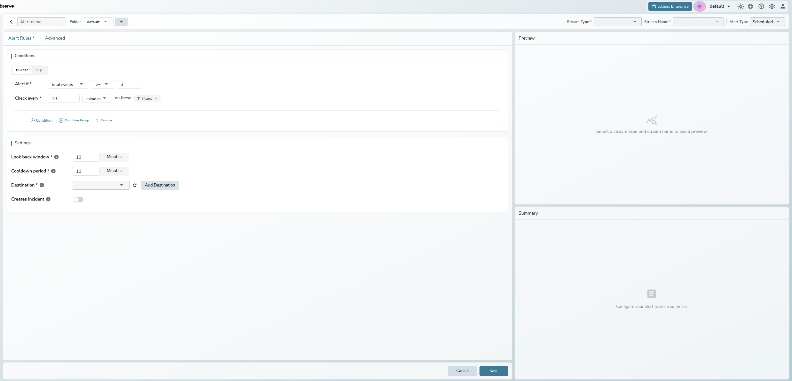
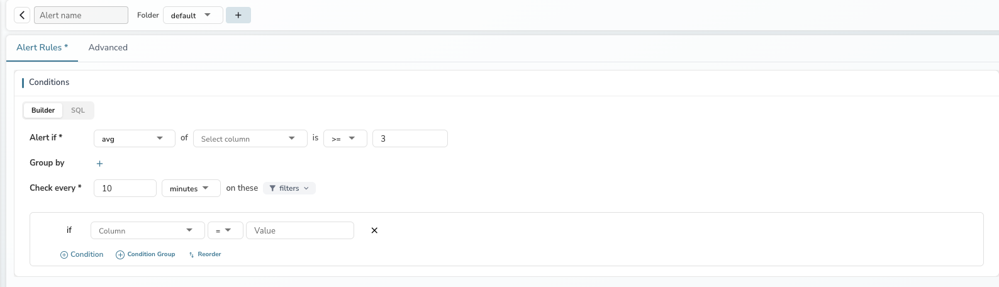
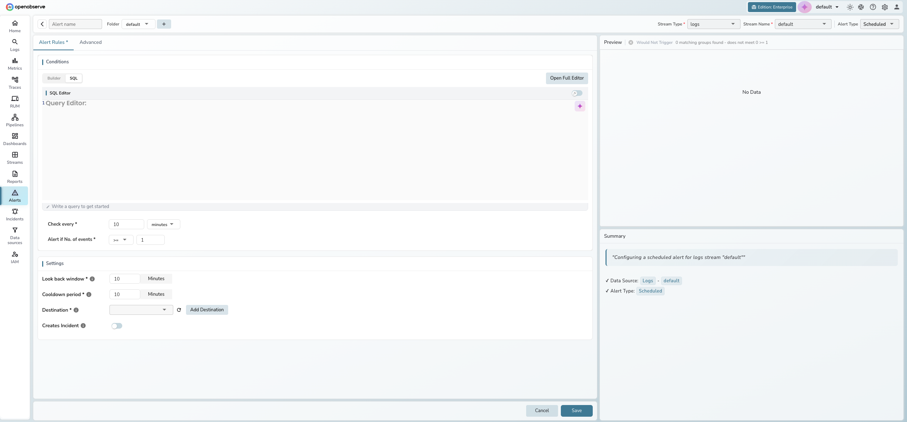
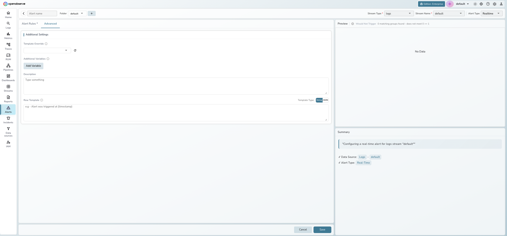

## Create an alert

This guide walks you through creating alerts in OpenObserve. The alert creation form uses a two-tab layout with a live preview panel on the right.

### Prerequisites

- At least one data stream (logs, metrics, or traces) with ingested data
- At least one notification [destination](../../account-administration/management/alert-destinations/) configured
- Appropriate permissions to create alerts

---

## Create a scheduled alert

Scheduled alerts evaluate your data at regular intervals and trigger when conditions are met. This is the most common alert type.

### Step 1: Open the alert form

1. Go to **Alerts** in the left sidebar.
2. Click **New alert** in the top-right corner.

### Step 2: Configure the top bar

Fill in the required fields across the top bar:

- **Alert name**: Enter a descriptive name (e.g., "High Error Rate - Production")
- **Folder**: Select a folder to organize the alert, or click **+** to create a new one
- **Stream Type**: Select **logs**, **metrics**, or **traces**
- **Stream Name**: Select the data stream to monitor
- **Alert Type**: Leave as **Scheduled** (default)

### Step 3: Define the condition

The **Conditions** section on the **Alert Rules** tab shows the condition sentence. By default, it uses count mode:

**"Alert if total events >= 3 matching logs found"**

Configure the condition:

- **Function**: Select from the dropdown — **total events** for count mode, or an aggregation (avg, min, max, sum, median, p50–p99) for measure mode
- **Operator**: Choose the comparison operator (>=, >, <=, <, =, !=)
- **Threshold**: Set the value that triggers the alert

> **Tip**: See [Alert Conditions and Filters](alert-conditions) for a detailed explanation of count mode vs. measure mode and all available functions.

### Step 4: Set the evaluation schedule

- **Check every**: Enter the frequency in minutes (default: 10). You can switch to a cron expression for precise scheduling using the dropdown next to the minutes input.

### Step 5: Add filters (optional)

Click the **filters** dropdown next to "on these" to expand the filter section. Use filters to narrow which data the alert evaluates.

1. Click **+ Condition** to add a filter row.
2. Select a field, operator, and value (e.g., `level = error`).
3. Additional conditions are joined with AND logic.

### Step 6: Configure settings

Scroll down to the **Settings** section on the same **Alert Rules** tab:

- **Look back window**: Time range of data to evaluate each run (default: 10 minutes)
- **Cooldown period**: Minimum time between repeated notifications (default: 10 minutes)
- **Destination**: Select one or more notification destinations. Click the refresh icon to reload, or **Add Destination** to create a new one.
- **Creates Incident**: Toggle on to automatically create an incident when the alert triggers

### Step 7: Save

Click **Save** at the bottom. OpenObserve validates all fields before saving. If validation fails, a red error indicator appears on the tab that contains the issue.

> **Tip**: Check the **Preview** panel on the right before saving. It shows whether your current conditions would trigger based on recent data.

---

## Create a SQL alert

For complex queries that go beyond the visual builder, use SQL mode.

### Step 1: Switch to SQL mode

After configuring the top bar (steps 1–2 above), click the **SQL** tab in the **Conditions** section.

### Step 2: Write the query

Enter a SQL query in the inline editor, or click **Open Full Editor** for a full-screen editing experience with:

- A field browser on the left for reference
- AI assistance for query suggestions
- Query results preview on the right

!!! warning
    Queries using `SELECT *` are not allowed for scheduled alerts. Specify the columns you need.

### Step 3: Set the threshold

Below the SQL editor, configure:

- **Check every**: Evaluation interval in minutes
- **Alert if No. of events**: Set the operator and threshold for the number of rows the query returns

### Step 4: Complete settings and save

Scroll down to configure **Settings** (look back window, cooldown period, destinations) and click **Save**.

---

## Create a real-time alert

Real-time alerts trigger immediately when matching data is ingested.

### Step 1: Select real-time type

In the top bar, change **Alert Type** to **Realtime**. The form simplifies — the condition sentence and evaluation schedule are hidden.

### Step 2: Add filter conditions

Click the **filters** dropdown and define filters that match the events you want to alert on. Every ingested event that matches triggers the alert.

### Step 3: Configure and save

Set the **Cooldown period**, add your **Destinations**, and click **Save**.

!!! note
    Real-time alerts do not have a look back window or evaluation frequency since they evaluate each event as it arrives.

---

## Configure advanced settings

The **Advanced** tab provides additional options. Click **Advanced** next to the **Alert Rules** tab.

### Compare with past

Compare current evaluations against historical data to detect relative changes rather than absolute thresholds. Available for scheduled alerts only.

- **Current window**: Displays the current look back window and cycle
- **Add Comparison Window**: Add reference time windows for comparison (e.g., same hour yesterday)

See [Multi-window Selector](multi-window-selector-scheduled-alerts) for detailed concepts and a step-by-step tutorial.

### Deduplication

Group similar alerts to reduce notification noise. Available for scheduled alerts only.

- **Group similar alerts by**: Select fields that identify similar alerts (e.g., `hostname`, `service`). Leave empty for auto-detection based on the query
- **Consider alerts identical within**: Time window for grouping similar alerts (default: matches the check interval)

### Additional settings

- **Template Override**: Select a custom notification template to override the default
- **Additional Variables**: Add key-value pairs available in notification templates via the **Add Variable** button
- **Description**: Free-text description for the alert
- **Row Template**: Customize the format of individual data rows in notifications. Toggle between **String** and **JSON** template types

---

## Edit an existing alert

1. Go to **Alerts** in the left sidebar.
2. Click the alert name in the table to open it.
3. Modify any fields. Note that **Stream Type**, **Stream Name**, and **Alert Type** are read-only for existing alerts.
4. Click **Save** to apply changes.

---

## Best practices

- Start with a generous threshold and tune it down once you understand your data patterns. This prevents alert fatigue from overly sensitive conditions.
- Use **Group by** fields in measure mode to create per-dimension alerts (e.g., per host) instead of creating separate alerts for each dimension.
- Set a **Cooldown period** of at least 10 minutes to avoid notification storms during sustained incidents.
- Use **Deduplication** in the Advanced tab to group related alerts and reduce noise.
- Add a meaningful **Description** so on-call engineers understand the alert's purpose without investigating the configuration.
- Use **Compare with Past** for alerts where relative change matters more than absolute values.

---

## Troubleshooting

### Alert not triggering

**Problem**: The alert does not fire when expected.

**Solution**:

1. Check the **Preview** panel — it shows whether current data meets the condition.
2. Verify the **Stream Name** has recent data within the look back window.
3. Confirm the **Look back window** covers enough data.
4. Check that the **Threshold** value is appropriate for your data volume.
5. Ensure the alert is enabled in the alerts list (toggle in the **Status** column).

### Too many notifications

**Problem**: The alert fires too frequently, causing notification fatigue.

**Solution**:

1. Increase the **Cooldown period** to reduce notification frequency.
2. Raise the **Threshold** value to only alert on more significant conditions.
3. Enable **Deduplication** in the Advanced tab.
4. Add more specific **Filters** to narrow the data the alert evaluates.

### Validation errors when saving

**Problem**: Clicking **Save** shows errors or red indicators on tabs.

**Solution**:

1. Check the tab with the red error indicator.
2. Ensure all required fields are filled: alert name, stream type, stream name, and at least one destination.
3. For SQL mode, verify the query does not use `SELECT *`.
4. Ensure the threshold value is greater than 0.

### Destination not appearing

**Problem**: A configured destination does not show in the dropdown.

**Solution**:

1. Click the **refresh** icon next to the destination dropdown.
2. Verify the destination exists in **Alerts > Destinations**.
3. Click **Add Destination** to create one directly from the alert form.
