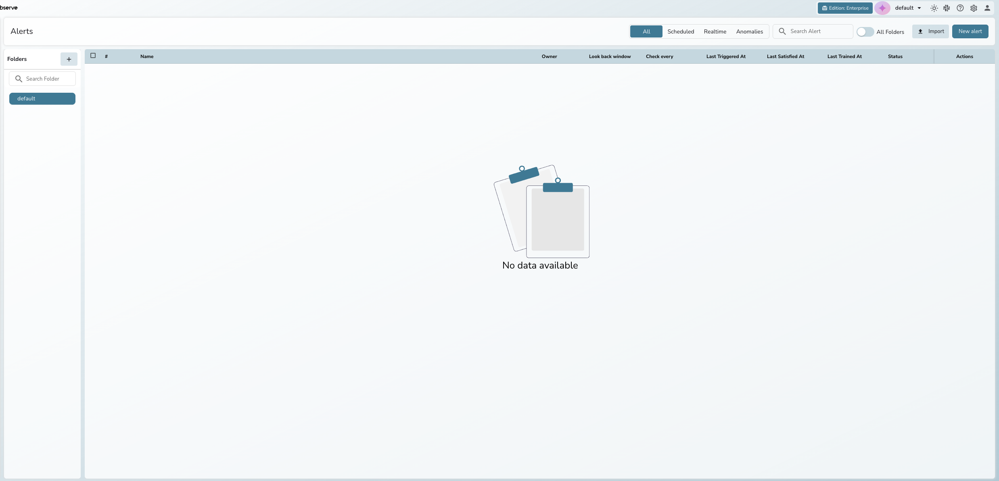
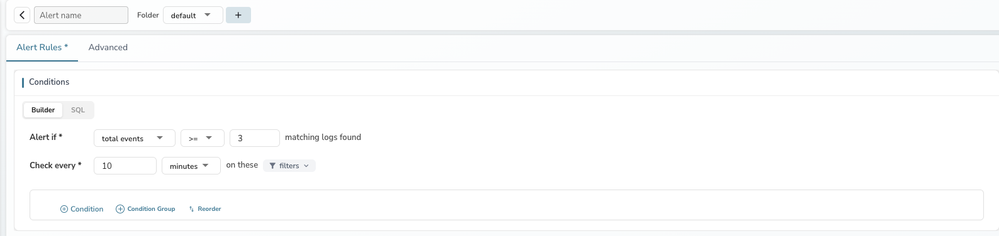
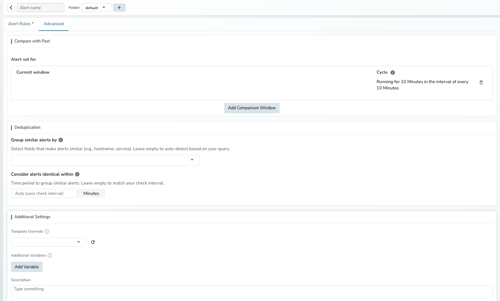

Alerts enable continuous monitoring of log, metric, or trace data to detect critical issues or operational patterns that require attention. Define conditions using a natural language builder or custom SQL, receive notifications through webhooks such as Slack, email, or other endpoints, and trigger configured Actions automatically when an alert is activated.



---

## Alert types

OpenObserve supports three types of alerts:

- **Scheduled alerts**: Run at fixed intervals to evaluate aggregated or historical data. Use for routine monitoring and trend analysis. For example, every 10 minutes, the alert evaluates your data and checks if the average response time exceeds 500ms. If the condition is met, the alert sends a notification.
- **Real-time alerts**: Monitor data continuously and trigger instantly when conditions are met. Use for critical events requiring instant action. For example, when a specific error pattern appears in your logs, the alert sends a notification within seconds.
- **Anomaly detection** *(Enterprise and Cloud only)*: Use machine learning to detect unusual patterns in your data without manually setting thresholds. See [Anomaly Detection](anomaly-detection.md) for details.

---

## Alert creation layout

The alert creation form uses a flat, two-tab layout:

```
Top Bar: Alert name, Folder, Stream Type, Stream Name, Alert Type
├── Alert Rules tab (required)
│   ├── Conditions: query mode, condition sentence, filters, schedule
│   └── Settings: look back window, cooldown, destinations, incidents
└── Advanced tab
    ├── Compare with Past (scheduled only)
    ├── Deduplication (scheduled only)
    └── Additional Settings (templates, variables, description)
```

The right panel displays a live **Preview** of your alert evaluation and an auto-updating **Summary** of your configuration.



---

## Core components

### Stream

The data source being monitored. Select a stream type (**logs**, **metrics**, or **traces**) and a specific stream name in the top bar.

### Condition sentence

The condition builder lets you define alert logic using a natural language sentence. In the default count mode, the condition reads:

**"Alert if total events >= 3 matching logs found"**

When you select an aggregation function (avg, min, max, sum, etc.), the sentence expands to:

**"Alert if avg of cpu_usage is >= 80"**

See [Alert Conditions and Filters](alert-conditions.md) for details on all available functions and modes.

### Query modes

OpenObserve supports three query modes for defining conditions:

- **Builder**: Point-and-click condition sentence with filters. Suitable for most use cases.
- **SQL**: Write custom SQL queries with a full-screen editor, AI assistance, and field browser. Required for advanced filtering and aggregations.
- **PromQL**: Use Prometheus query language for metrics alerts.

### Check every (frequency)

How often the alert evaluation runs. Set the interval in minutes, or switch to a cron expression for precise scheduling. Real-time alerts run continuously and do not have a frequency setting.

!!! note
    OpenObserve aligns the next run to the nearest upcoming time that is divisible by the frequency, starting from the top of the hour in the configured timezone. For example, if the current time is 23:03 and frequency is 5 minutes, the next run is at 23:05.

### Look back window (period)

The time window of data evaluated per alert run. If the look back window is 30 minutes, the alert evaluates the last 30 minutes of data each run.

### Destination

Where alert notifications are sent. Choose one or combine multiple:

- **Email**: Send to team members or distribution lists. Requires SMTP configuration.
- **Webhook**: Send to external systems via HTTP. Integrates with Slack, Microsoft Teams, Jira, ServiceNow, and more.
- **Actions**: Execute custom Python scripts. Most flexible; can send to Slack AND log to stream simultaneously. Supports stateful workflows.

### Cooldown period

The cooldown period prevents duplicate notifications by temporarily pausing alert triggers after firing. Set this to at least 10 minutes to avoid notification storms during sustained incidents.

### Creates incident

Toggle this on to automatically create an incident in the **Incidents** page when the alert triggers. This enables incident tracking and correlation across multiple alerts.

---

## Live preview and summary

The right panel provides real-time feedback as you configure your alert:

- **Preview**: Evaluates your conditions against recent data and shows whether the alert would trigger. Displays the number of matching data points and whether the threshold is met.
- **Summary**: Generates a human-readable description of your complete alert configuration. Auto-updates as you change any field. Clickable summary segments jump to the corresponding form field.

---

## Advanced settings

The **Advanced** tab provides additional configuration for scheduled alerts:

- **Compare with Past**: Compare current alert evaluations against historical reference windows to detect relative changes. See [Compare with Past](scheduled-alerts.md#compare-with-past) for details.
- **Deduplication**: Group similar alerts by fingerprint fields and time window to reduce notification noise.
- **Additional Settings**: Override notification templates, add context variables, set a description, and customize row templates.



---

## Alert folders

Use folders to organize alerts on the **Alerts** page. All alerts are stored in the **default** folder unless you assign them to a different folder.

To create a folder, click **+** in the **Folders** panel on the Alerts page, enter a name and description, and click **Create**. Use the **Search Folder** input to find folders quickly, or toggle **All Folders** to search alerts across all folders.

---

## Learn more

- [Scheduled Alerts](scheduled-alerts.md) — Create scheduled and SQL alerts with advanced configuration
- [Real-time Alerts](real-time-alerts.md) — Create alerts that trigger instantly on ingestion
- [Alert Conditions and Filters](alert-conditions.md) — Deep dive into condition modes, functions, and filters
- [Alert History](alert-history.md) — View alert trigger history
- [Anomaly Detection](anomaly-detection.md) — ML-based anomaly alerts
- [Import and Export Alerts](import-export-alerts.md) — Bulk alert management
- [Alert Destinations](../../account-administration/management/alert-destinations/) — Configure notification channels
- [Templates](../../account-administration/management/templates/) — Customize notification content