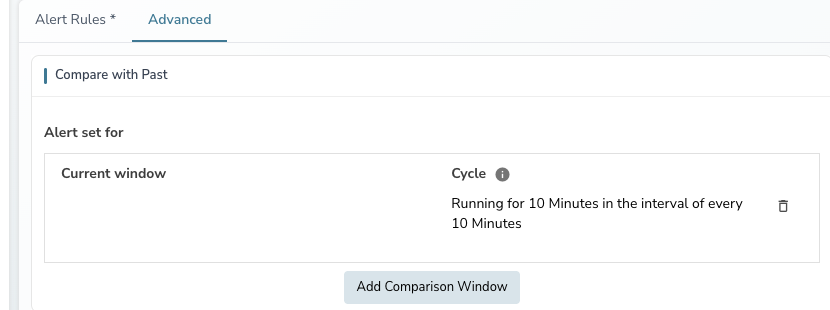
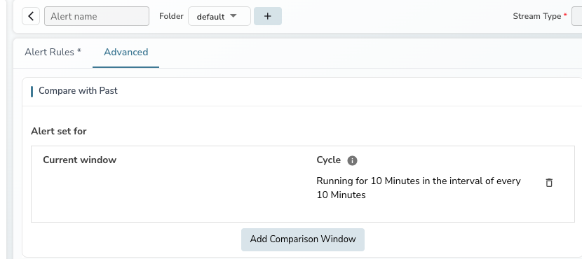
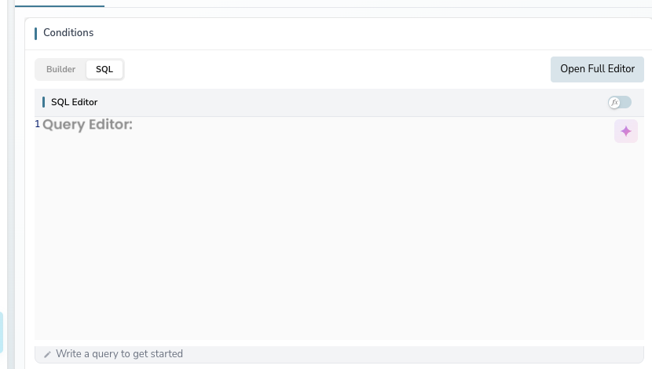
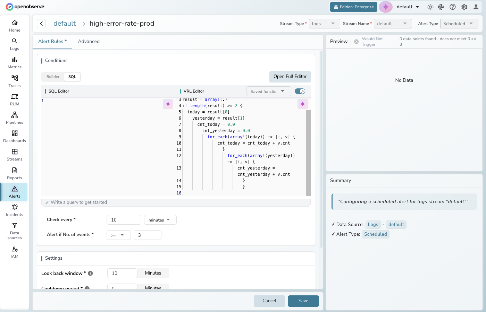
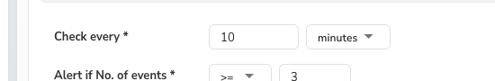
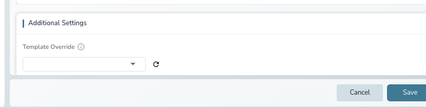

The Multi-window Selector lets you compare current data with historical data in scheduled alerts. Instead of alerting on absolute thresholds, you can detect relative changes — like a 5% increase in errors compared to the same time yesterday.

## Why use multi-window comparison

A single data point rarely tells you if something is wrong. If your system sees 200 checkout retries in the last 30 minutes, that could be normal or a serious spike — it depends on what the same period usually looks like.

The Multi-window Selector automates this comparison by:

- Defining the time window to monitor (e.g., last 30 minutes)
- Selecting one or more past windows to compare against (e.g., 1 day ago)
- Writing VRL logic that compares windows and detects meaningful changes

You can apply this to logs, metrics, or traces.

---

## Key concepts

### Period

The length of each window. If the period is 30 minutes, the alert evaluates 30 minutes of data each run.

### Window

Applies the period at different points in time:

- **Current window**: The last 30 minutes
- **Past window (1 day ago)**: The same 30-minute range from yesterday

### Frequency

How often the alert runs. If frequency is 30 minutes with a 30-minute period and a 1-day-ago past window:

| Run time | Current window | Past window |
|----------|---------------|-------------|
| 10:30 AM | 10:00–10:30 AM today | 10:00–10:30 AM yesterday |
| 11:00 AM | 10:30–11:00 AM today | 10:30–11:00 AM yesterday |

---

## How it works

When a scheduled alert with Multi-window Selector runs:

1. The alert manager executes your SQL query for each window (current + past windows)
2. Results are passed to your VRL function for comparison
3. The VRL output is checked against your threshold condition
4. If the condition is met, a notification is sent

---

## Step-by-step setup

### Access the Multi-window Selector

For new alerts:

1. Go to **Alerts** and click **New alert**
2. Configure the top bar (stream type, stream name, alert type = Scheduled)
3. Switch to **SQL** mode in the Conditions section
4. Click the **Advanced** tab to find the **Compare with Past** section



For existing alerts, click the alert name in the alerts list, then navigate to the **Advanced** tab.



### Step 1: Write the SQL query

Write a SQL query that returns the data you want to compare. Use the Logs page to test your query first.

```sql
SELECT 
  histogram(_timestamp, '15 minutes') AS time_s,
  COUNT(_timestamp) AS cnt
FROM 
  "openobserve_app_analytics_log_stream"
WHERE 
  pdata_dr_level1_level2_level3_level4_level5_level6_level7_retry > 0
  AND eventtype = 'purchase'
GROUP BY 
  time_s
```



### Step 2: Define the period

Set the time range to evaluate per run (e.g., last 30 minutes) in the **Compare with Past** section on the Advanced tab.


### Step 3: Add a comparison window

Click **Add Comparison Window** and select the historical window to compare against (e.g., 1 day ago).

The alert manager will run two queries at runtime:

1. Current window (e.g., 9:30–10:00 AM today)
2. Past window (e.g., 9:30–10:00 AM yesterday)

### Step 4: Write the VRL function

Click the function toggle in the SQL editor to write VRL logic that compares the windows.

!!! warning
    Always start your VRL function with `#ResultArray#` when using Multi-window Selector. This ensures your function receives a multi-dimensional array where `result[0]` = current window and `result[1]` = past window.

**VRL function example** — alert if purchase retries increased by more than 5%:

```
#ResultArray#

prev_data = []
curr_data = []
res = []
result = array!(.)

if length(result) >= 2 {
    today_data = result[0]
    yesterday_data = result[1]

    cnt_yesterday = 0.0
    cnt_today = 0.0

    for_each(array!(yesterday_data)) -> |index, p_value| {
        cnt_yesterday, err = cnt_yesterday + p_value.cnt
    }

    for_each(array!(today_data)) -> |index, p_value| {
        cnt_today, err = cnt_today + p_value.cnt
    }

    if cnt_yesterday > 0.0 {
        diff = cnt_today - cnt_yesterday
        diff_percentage, err = (diff) * 100.0 / cnt_yesterday

        if diff_percentage > 5.0 {
            diff_data = { 
                "diff": diff,
                "diff_percentage": diff_percentage
            }
            temp = []
            temp = push(temp, diff_data)
            res = push(res, temp)
        }
    }
}

. = res
.
```



The VRL function outputs an empty array if the increase is 5% or less, or a non-empty array with the diff data if it exceeds 5%.

### Step 5: Set the threshold

Set **Alert if No. of events >= 1**. This triggers when the VRL output is non-empty (meaning the condition was met).

### Step 6: Set the frequency

Define how often the alert runs (e.g., every 30 minutes).



### Step 7: Configure destination and save

Select a destination, optionally add a row template with fields from your VRL output (e.g., `{{ diff_percentage }}`), and click **Save**.



---

## FAQ

**Does the period control the window length?**

Yes. Every window — current and past — uses the same duration defined by the period.

**Does the alert manager run multiple queries within one window?**

No. It runs one query per window. Frequency controls *when* the queries run; period controls *what time range* each query covers.

**What happens without `#ResultArray#` in the VRL function?**

The VRL function receives a flat array with all results mixed together. You cannot distinguish current from past window data.