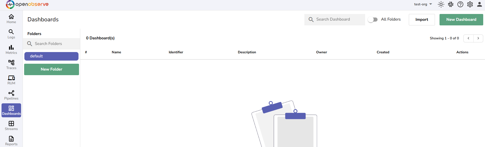
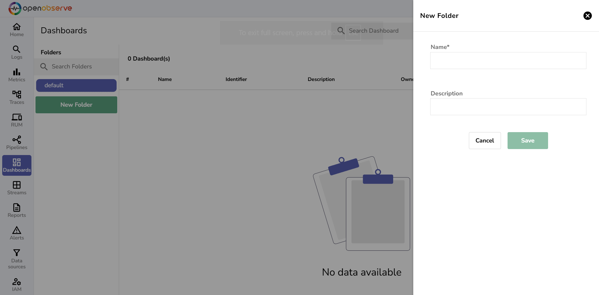
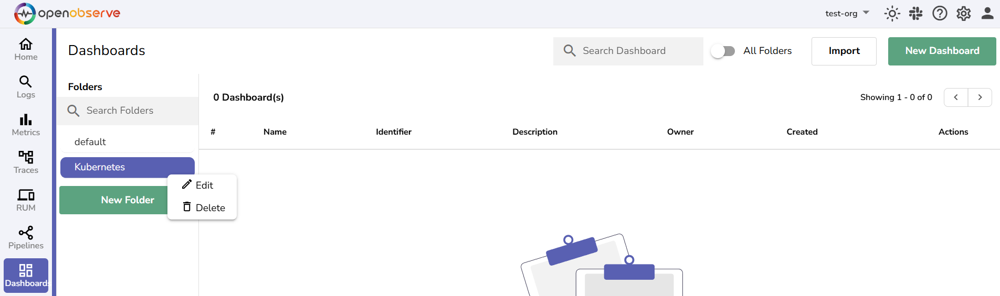
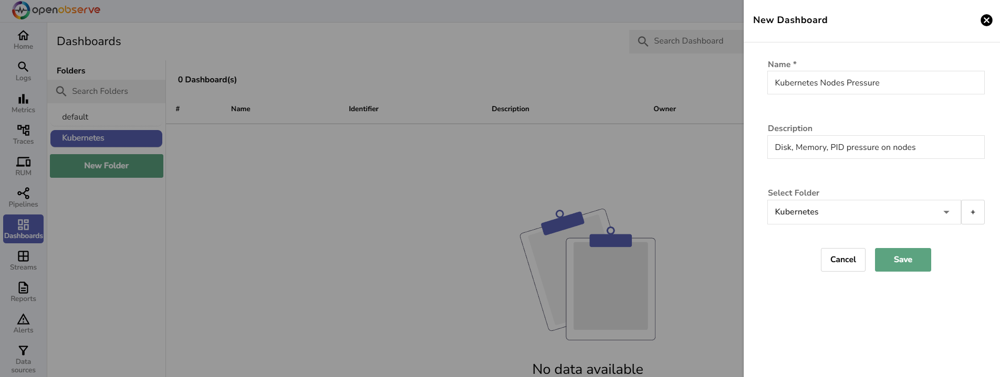
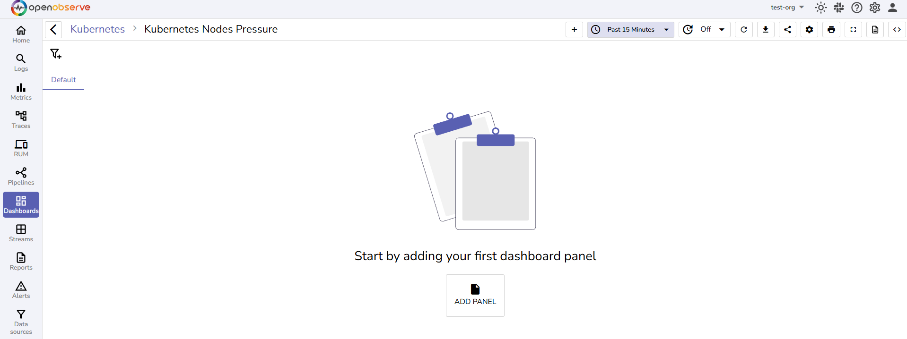
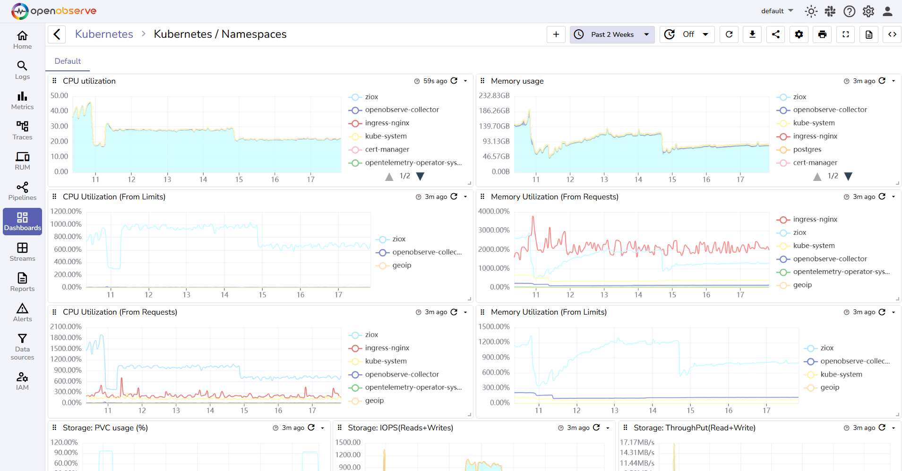
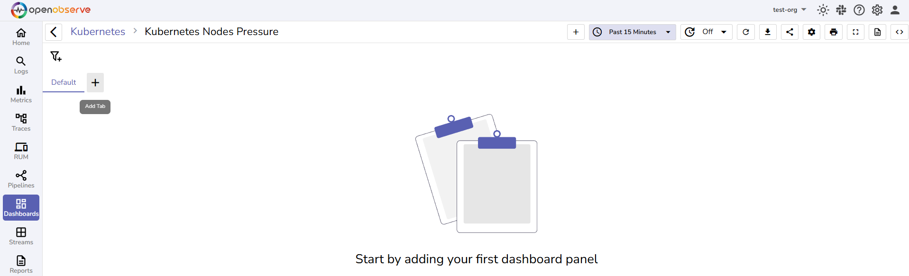

# Dashboards

This guide introduces you to the **Dashboards** in OpenObserve, including what they are, how to access them, and how to create a new dashboard.

## Introduction to Dashboards

In OpenObserve, **Dashboards** are the central tool for data visualization and monitoring. They provide a way to display real-time and historical data in an interactive, easy-to-understand format. 

The purpose of **Dashboards** is to offer an intuitive, at-a-glance view of your data, helping you:

- **Visualize trends**: Track performance over time with charts and graphs.  
- **Monitor systems**: Keep an eye on critical systems or services in real-time.  
- **Analyze errors**: Detect and analyze errors or issues that need attention.  
- **Facilitate collaboration**: Share and discuss insights with team members through dynamic and interactive data visualizations.

## How to Access Dashboards

On the left-hand side menu, click **Dashboards** to access the dashboard management section.

## How to Build Dashboards

!!! tip "Video walkthrough"
    <iframe width="560" height="315" src="https://www.youtube.com/embed/kjUvXQdL798?si=guA2AK3COvYJolIr" title="YouTube video player" frameborder="0" loading="lazy" allow="accelerometer; autoplay; clipboard-write; encrypted-media; gyroscope; picture-in-picture; web-share" allowfullscreen></iframe>

## Dashboard Structure in OpenObserve

### Folders
Dashboards are stored in folders. By default, the **default** folder is created. However, you can create additional folders to organize **Dashboards** based on your requirements.

!!! info "Create Folders"
    To create a new folder, click the **New Folder** button, and provide a folder name and description.

!!! info "Editing or Deleting Folders"
    To edit or delete a folder, click the vertical ellipsis (three dots) menu next to the folder name in the folder list. This allows you to rename or remove the folder as needed.

### Dashboards
Inside each folder, you can create one or more **Dashboards**. Dashboards hold Panels, which represent visualizations of your data.

!!! info "Create Dashboards"
    To create a new Dashboard, click the **New Dashboard** button, add Name and Description for the Dashboard, and select an existing folder or create a new folder to organize the Dashboard. Use the **Import** button to import an existing Dashboard.  
     
    Dashboards can contain one or more Panels for visualizing various data points or metrics.

### Panels
A Panel displays a single visualization using one of the [supported chart types](#supported-chart-types-in-dashboards), based on specific data.

!!! info "Create Panels"
    To add a Panel inside a Dashboard, click the **Add Panel** button.    
    Each Panel displays one type of visualization. You can add multiple Panels to a Dashboard to represent different data.

Example of a Dashboard with Panels:

### Supported Chart Types in Dashboards

The following charts are supported in Dashboards:

1. Area
2. Area stacked
3. Vertical Bar
4. Horizontal bar
5. Line
6. Scatter
7. Vertical Bar stacked
8. Horizontal bar stacked
9. Geo map
10. Maps
11. Pie
12. Donut
13. Heatmap
14. Metric Text
15. Gauge
16. HTML
17. Markdown
18. Sankey
19. Custom Charts
20. Table: Display data in rows and columns, with optional pivot mode.

The **Table** chart supports a pivot mode: add a **Breakdown** field (the **+P** button) to cross-tabulate data into columns (up to 3 pivot fields), with optional **Show Row Totals** / **Show Column Totals** (and sticky variants). **Transpose** and **Dynamic Columns** are disabled while pivot mode is active.

### Tabs
Tabs help organize your Panels into different sections within a **Dashboard**. For example, you might have one Tab for Performance, another for Errors, and another for Traffic Analysis.
By default, Panels are added to the **Default** tab.  
!!! info "Create New Tabs" 
    To create a new Tab, click the + icon next to the default Tab and enter a Tab name. You can create new Tabs from the **Tabs** menu under the **Dashboard Settings**.

Examples of a Dashboard with Panels organized in different Tabs:

  
  

## FAQ

### Why does my dashboard chart say "No data"?

OpenObserve shows a "No data" message on a dashboard chart when the selected query returns no results for the specified time range. This clarifies that the chart loaded successfully but no matching data was found. It is not an error.

When a dashboard loads, a blank chart placeholder appears while data is loading. If the query returns data for the selected time range, the chart is rendered normally. If the query returns no data, the chart shows a "No data" message to indicate an empty result.

**To resolve this:** try adjusting the time range or filters, and refresh the dashboard.

### Can I import an existing dashboard?

Yes. From the **Dashboards** page, click the **Import** button and upload a dashboard JSON file. You can also choose the folder to import it into, or create a new one.

### How do I move a dashboard to a different folder?

Open the dashboard, go to **Dashboard Settings**, and change the assigned folder. To move many dashboards at once, see [Bulk move and export](bulk-move-and-export-dashboards.md).

## Next steps

- [Manage Dashboards](manage-dashboards.md): edit, duplicate, delete, and share dashboards.
- [Panels](panels/index.md): deep-dive into panel configuration and chart types.
- [Filters](filters/index.md): control what data is shown across panels.
- [Variables](variables/index.md): make dashboards dynamic with reusable values.
- [Bulk move and export](bulk-move-and-export-dashboards.md): manage dashboards at scale.

**Need some help?**

- Join our [Community Slack](https://short.openobserve.ai/community) 
- Or [Contact support](https://openobserve.ai/contactus/)
