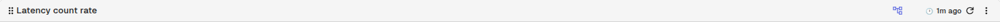
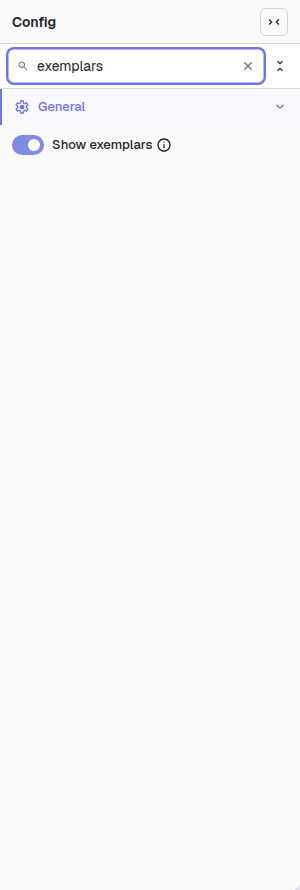
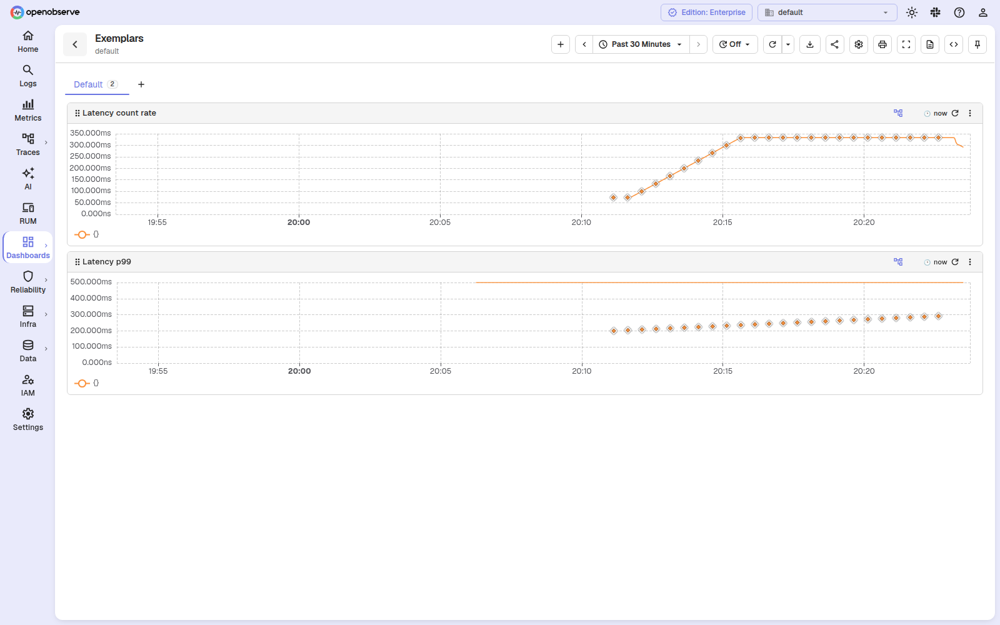
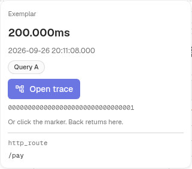
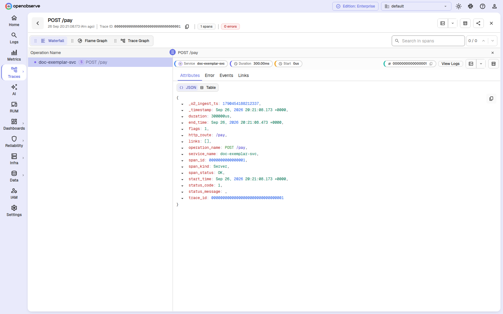
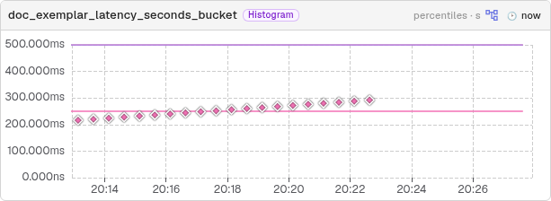

# Exemplars

Show OpenTelemetry exemplars on PromQL time-series panels so you can go from a spike on a chart to the trace behind it without leaving OpenObserve. Each exemplar appears as a marker on the panel; hovering a marker reveals its value and labels, and a trace action lets you open the linked trace.

## What Are Exemplars

An exemplar is a concrete example value that OTLP attaches to a metric series, typically the value of the metric at a specific point in time together with the `trace_id` and `span_id` of the request that produced it. OpenObserve stores exemplars and serves them through the `query_exemplars` endpoint; the **Show exemplars** toggle draws them on your PromQL panels and links each marker to its trace.

Exemplars are supported for PromQL panels that use a line, area, bar, or scatter chart and have at least one range query. Instant queries and other chart types do not show the toggle.

## Turn Exemplars On

Exemplars are off by default for every panel. You turn them on per panel, and the setting is saved in the panel configuration as `show_exemplars`. Existing dashboards load unchanged, and a panel with the toggle off sends no `query_exemplars` request.

The toggle appears in three places:

- **Panel header** — the exemplar icon in the panel toolbar, for a quick on/off while viewing a dashboard.

    

- **Full-screen view** — the same toggle when a panel is expanded to full screen.
- **Panel editor** — a **Show exemplars** switch in the **Config** panel, next to the other general panel options.

    

To enable exemplars from the panel editor:

1. Open the panel and select **Edit Panel**.
2. In the **Config** tab, turn on **Show exemplars**.
3. Select **Apply** to save the change.

## Read the Markers

When exemplars are on, each exemplar is drawn as a marker on the chart. Where the marker sits depends on the query:

- On a `histogram_quantile` panel, the marker sits at the exemplar's value. An unset panel unit counts as matching the metric's own unit.
- On every other chart (count or sum rates, counters, averages), the marker sits on its query's line at the exemplar's timestamp, marking when the exemplar happened.

Markers behave as follows:

- A marker whose value falls beyond the axis range is clamped to the edge of the chart, and it never rescales the axis.
- An exemplar shared by several queries is drawn once and tagged with each query it belongs to.

## Inspect an Exemplar

Hover over a marker to open the exemplar card. The card shows:

- The exemplar's **value** in the metric's own unit — a latency stays in milliseconds even on a requests-per-second chart.
- The **time** the exemplar occurred.
- A **query chip** for each query that returned the exemplar.
- A **trace action** with the full `trace_id`, when the exemplar carries one.
- The exemplar's **own labels**.

The card hides OpenTelemetry internal labels and always stays within the viewport.

## Jump to the Trace

The trace link is resolved lazily, only when the card opens, using the org-level trace time-range lookup. The result is cached per `trace_id`, so hovering the same marker again is instant. Depending on the lookup, the card shows one of the following:

- **Found** — the **Open Trace** action opens the trace with the exemplar's span selected. Pressing the browser **Back** button returns to the panel with the markers still on.
- **Not found** (and the search covered every stream) — the card shows **Trace not available — sampled out or past retention**.
- **Timeout, partial coverage, or error** — a best-effort trace link, labelled unverified.

## Use Exemplars in the Metrics Explorer

In the **Metrics Explorer**, histogram cards default to a heatmap. Turning exemplars on for a card switches it to the card's percentiles view while the toggle is on, without saving that change; turning the toggle off returns the card to the heatmap. Non-histogram cards draw markers the same way dashboard panels do.

## Related

- [Manage Panels](panel-management.md): panel toolbar features and lifecycle management.
- [Multi-Query Support](multi-query-support.md): configure multiple queries in a single panel.
- [Dashboards Overview](../dashboards-in-openobserve.md): learn about dashboards, folders, and tabs.
- [Metrics Explorer](../../../data-exploration/metrics/explorer.md): explore metrics and their exemplars.
