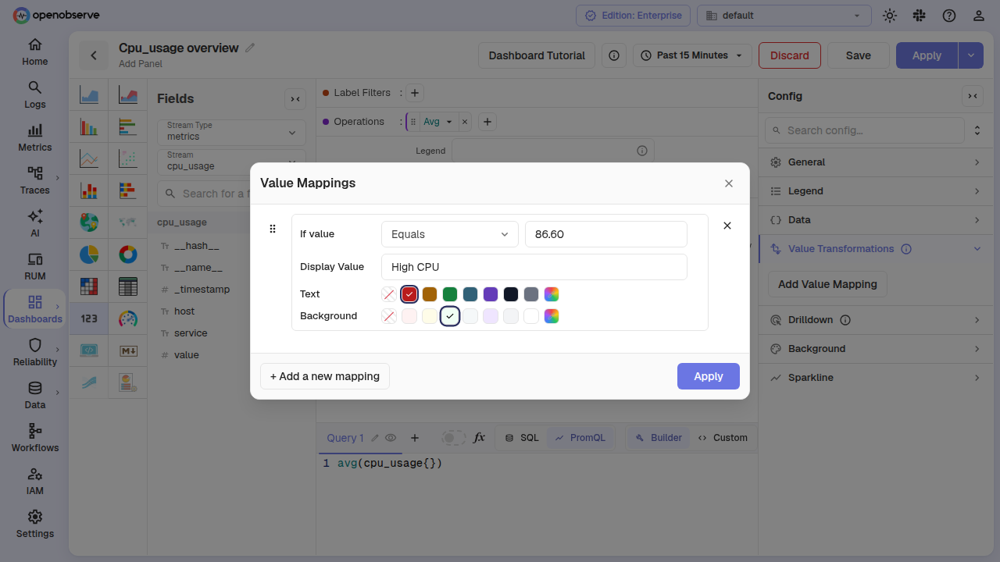
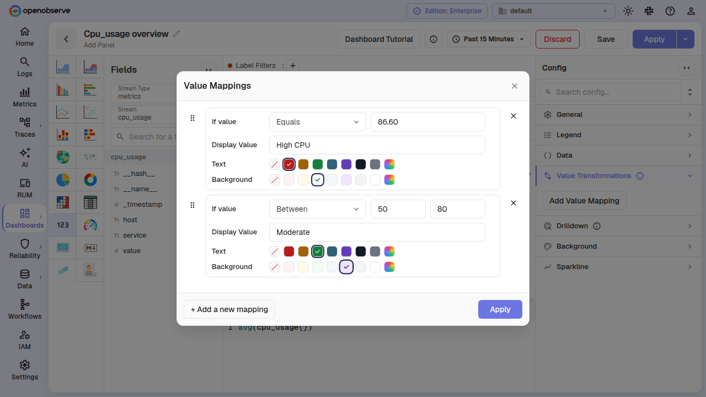
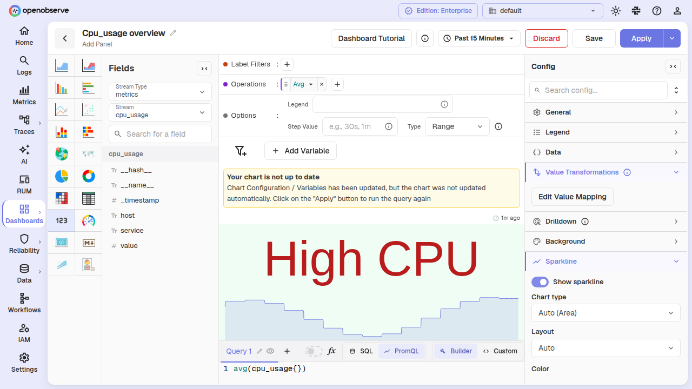
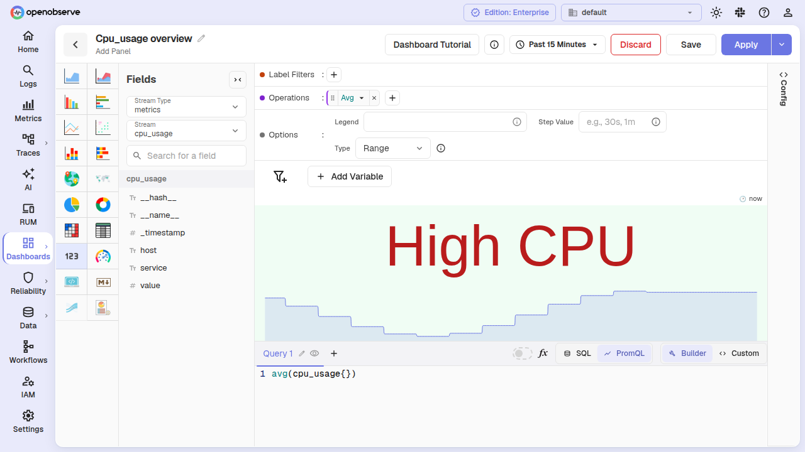

# Metric Chart

Metric chart panels display a single aggregated value, making them ideal for KPIs, status indicators, and at-a-glance monitoring. You can enhance each metric with a sparkline trend drawn behind or below the value, and transform the displayed value with conditional mappings.

## Configure value mappings on a metric chart

Value mappings let you replace the numeric metric value with custom display text, and apply background and text colors based on the value, a range, a threshold, or a regex pattern.

Value mappings are available on both **Table** and **Metric** chart types. To open the mappings dialog for a metric panel:

1. With the panel config sidebar open, expand the **Value Transformations** section.
2. Click the **Add Value Mapping** button.

### Mapping types

The dialog supports the following condition types:

- **Equals** — match an exact value.
- **Between** — match a numeric range (from–to).
- **Matches regex** — match a regex pattern (for non-numeric values).
- **Greater than**, **Less than**, **Greater than or equal**, **Less than or equal** — threshold comparisons against numeric values.

When multiple threshold rules overlap, the last matching rule wins — consistent with conditional styling in table column formatting.

### Display text and colors

Each mapping row lets you set:

- **Display text** — replaces the raw metric value on the panel (optional; the formatted value is shown when blank).
- **Text color** — an explicit color for the displayed text, chosen from a swatch picker.
- **Background color** — a background fill for the metric cell, chosen from a swatch picker.

If only a background color is set (no explicit text color), the metric automatically picks a contrasting text color (white or black) for readability. Legacy mappings with a single `color` field continue to work as background colors.

### Manage mapping rows

- Click **+ Add a new mapping** to add another row.
- Drag rows using the drag handle on the left to reorder them.
- Click the **X** button on a row to delete it.
- When all rows are deleted, an empty state message appears with a prompt to add a mapping.

Click **Apply** to save your mappings back to the panel config.

### Mapping on PromQL metric panels

Value mappings work identically on PromQL-based metric panels. The mapped text and colors round-trip through dashboard save/reload and persist across panel edits.

## Add a sparkline to a metric chart

A sparkline is a compact trend chart (line, area, or bar) drawn inside the metric panel alongside the value. It shows how the underlying metric has changed over the selected time range, without taking up additional dashboard space.

### Enable the sparkline

1. In the panel **Config** sidebar, expand the **Sparkline** section.
2. Toggle **Show sparkline** on.

When enabled, the sparkline renders behind or below the metric value. Sub-controls appear for chart type, layout, color, line width, and fill opacity.

### Chart type

Choose the shape of the trend:

| Option        | Description                               |
| ------------- | ----------------------------------------- |
| Auto (Area)   | Area chart (the default).                 |
| Line          | Stroked line only, no fill.               |
| Area          | Filled area under the line.               |
| Bar           | Discrete vertical bars.                   |

**Bar** hides the **Line width** and **Area fill opacity** controls, since they do not apply.

### Layout

| Option      | Description                                                      |
| ----------- | ---------------------------------------------------------------- |
| Auto        | Draws the trend along the bottom of the cell (same as **Bottom**). |
| Bottom      | The metric value sits in the upper portion; the sparkline fills the lower band. |
| Background  | The sparkline spans the full cell behind the value, drawn at reduced opacity. |

### Color

Pick a color for the sparkline from an 8-swatch series palette. The selected swatch is highlighted; click a different swatch to change the color.

### Line width

Sets the stroke width for line and area sparklines (hidden for bar). Enter a numeric value; defaults to `1`.

### Fill opacity

An area-only slider (0% to 100%) that controls how transparent the area fill is. The default is 15%.

### How sparkline data is fetched

The data source for the trend depends on the query type:

- **SQL queries** — When you apply sparkline settings, a second histogram query (`is_ui_histogram`) fires alongside the main metric query. The histogram response streams into the trend as data arrives, keeping the x-axis width fixed across the full time range. Empty histogram buckets use the panel's **No value replacement** setting (or `0` by default).

- **PromQL queries** — No second fetch is required. The sparkline trend is built from the matrix values already present in the PromQL `query_range` response. The latest point drives the displayed metric value, and the full series drives the trend.

If the histogram is unavailable for a query (for example, queries that use `JOIN`, `UNION`, `CTE`, `DISTINCT`, or `LIMIT`), a non-blocking warning icon appears in the panel header. The metric value still renders as normal.

### Multi-query metric grids

In a multi-query metric panel (a grid of individual metric cells), each cell draws its own sparkline from its query's data. The sparkline config (type, layout, color, etc.) is shared across all cells but each trend is driven by its own query result.

