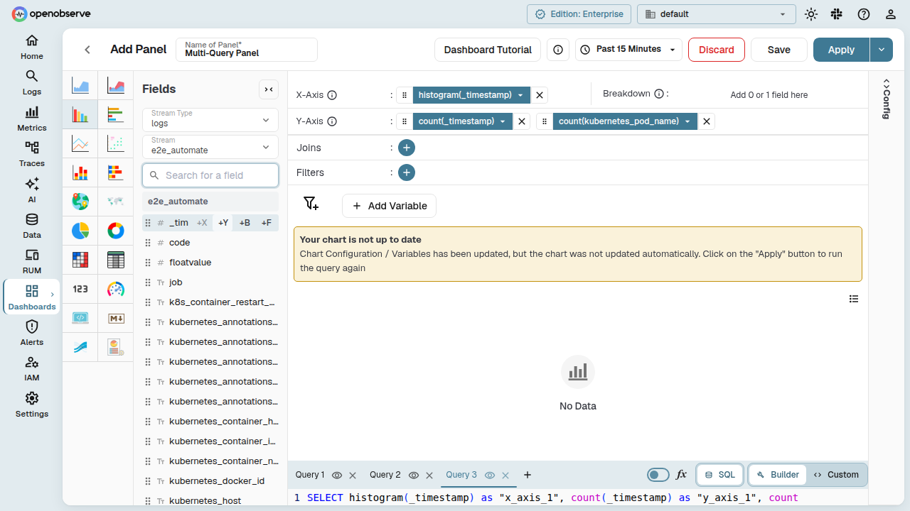
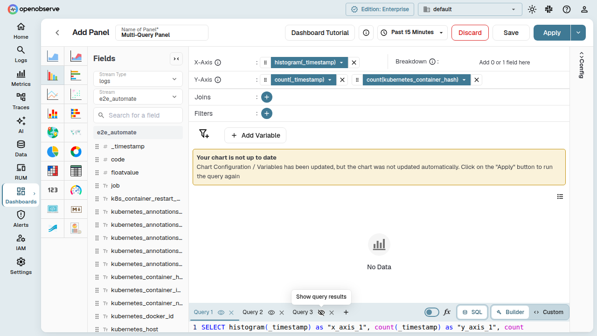
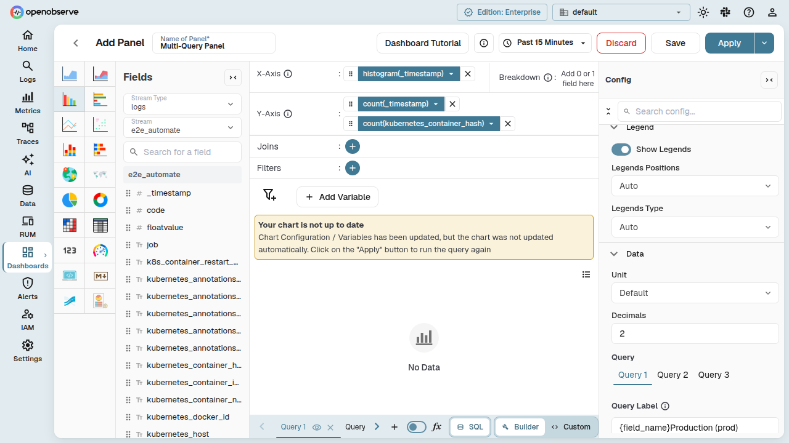
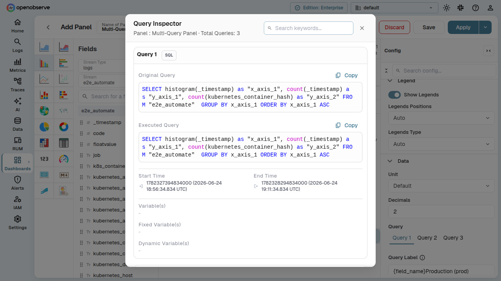
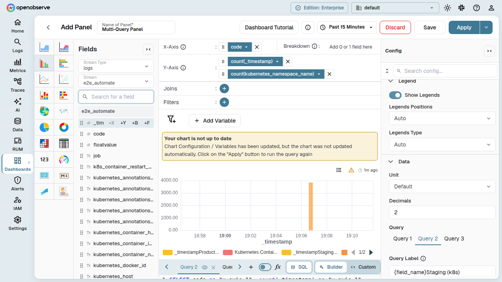

# Multi-Query Support

Configure multiple independent SQL queries within a single dashboard panel. Each query has its own stream, fields, filters, and VRL function — overlaid or displayed side by side on the same chart.

## Overview

When you create or edit a panel, you can add multiple SQL queries. Each query appears as a separate **query tab** in the panel editor. Use this to:

- Compare data from different streams in a single chart
- Overlay metrics from different sources
- Apply different aggregations to the same stream and compare results
- Toggle individual query visibility on the chart

Multi-query is supported for all SQL-based chart types: **bar**, **line**, **area**, **table**, **pie**, **donut**, **gauge**, **heatmap**, and **metric**.

## Adding, Switching, and Removing Queries

### Add a Query

In the panel editor, click the **+** button next to the query tabs to add a new query. Each new query tab starts empty — select a stream and configure its fields.

### Switch Between Queries

Click a query tab to switch to that query's fields and configuration. The panel editor updates immediately to reflect the selected query's stream, fields, filters, and VRL function.

### Remove a Query

Hover over a query tab and click the **×** icon to remove it. The first query cannot be removed — you must keep at least one query per panel.

## Renaming Query Tabs

Give each query a meaningful name to keep your panel organized:

1. **Double-click** the query tab label.
2. Type the new name and press **Enter** to save, or press **Escape** to revert.

Renamed tab names persist after you save and reopen the panel. Tab names also appear as headings in the **Query Inspector**.

## Toggling Query Visibility

When a panel has two or more queries, an **eye icon** appears on each query tab:

- Click the eye icon to **hide** a query's data from the chart. The query configuration is preserved but excluded from rendering.
- Click again to **show** the data.

Hidden queries are also excluded from the X-axis alias consistency check (see below).

## Per-Query Legend Labels

In the **Config** panel, each query gets its own **Legend Label** field. The legend label fields appear only when the panel has multiple queries. Use these to identify each query's data series in the chart legend and tooltips.

## Query Inspector

The **Query Inspector** shows the generated SQL for all queries in the panel. Open it from the panel toolbar dropdown menu:

Each query is grouped under its tab name, making it easy to inspect and debug individual queries.

## X-Axis Alias Consistency

For chart types with an X-axis (**bar**, **line**, **area**, **scatter**), mixing `histogram(_timestamp)` with non-histogram X-axis fields across queries produces misleading visualizations.

A **warning icon** appears in the panel editor header when your visible queries use inconsistent X-axis aggregations:

The warning updates reactively as you modify fields — no need to click **Apply** first. Hidden queries are excluded from the check.

## VRL Functions with Multiple Queries

Each query supports its own independent VRL function. The VRL editor content is per-query:

- Switch query tabs to edit VRL for each query separately.
- VRL on one query does not affect other queries.
- VRL content persists after save and reopen.

## Trellis Layout

The **Trellis** chart option is disabled when a panel has multiple queries. Remove additional query tabs to re-enable it.

## Chart Type Compatibility

| Chart Type | Multi-Query Support |
|---|---|
| Bar, Line, Area, Scatter | Full support |
| Table | Full support |
| Pie, Donut | Full support |
| Gauge | Full support |
| Heatmap | Full support |
| Metric | Full support |
| Pivot Table | Limited — warning banner shown; pivot breakdown applies to first query only |

## Error Handling

When a panel has multiple queries, errors surface for each query independently. If any query fails, the error panel appears regardless of which query tab is currently active. Switch to the failing query's tab to see its configuration and resolve the issue.

## Related

- [Manage Panels](panel-management.md): panel toolbar features and lifecycle management.
- [Dashboards Overview](../dashboards-in-openobserve.md): learn about dashboards, folders, and tabs.
- [Panel Troubleshooting](troubleshooting.md): common panel warnings and how to resolve them.
