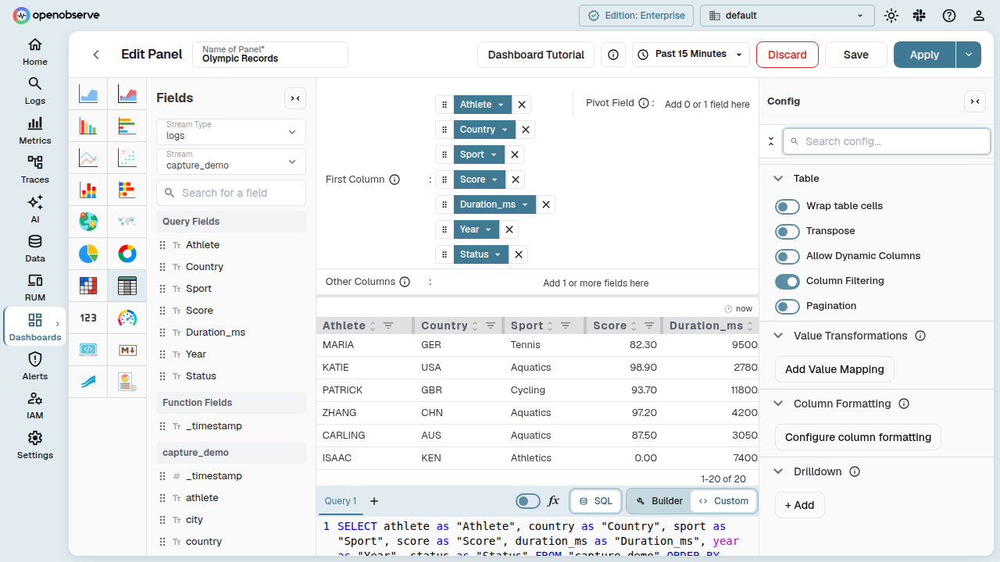
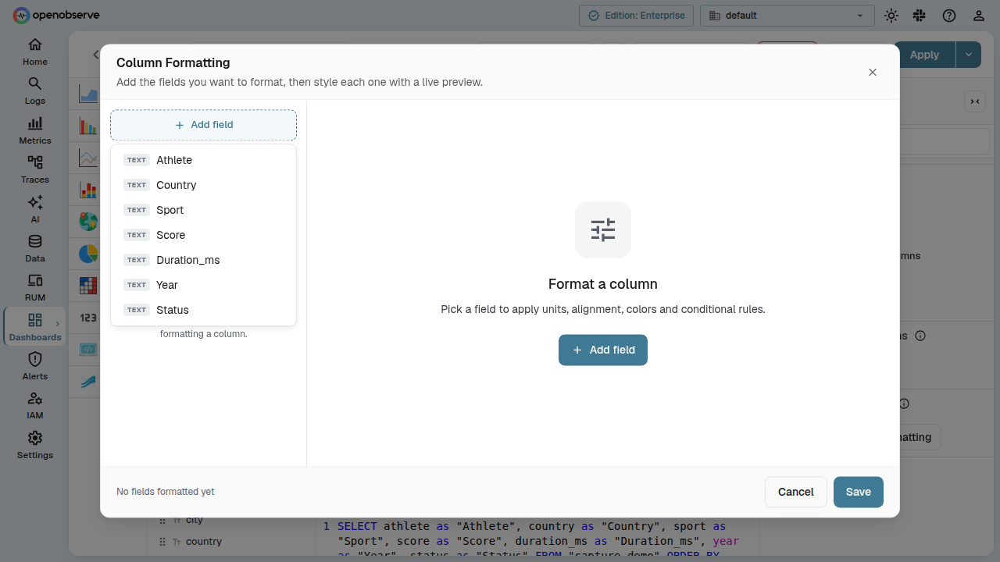
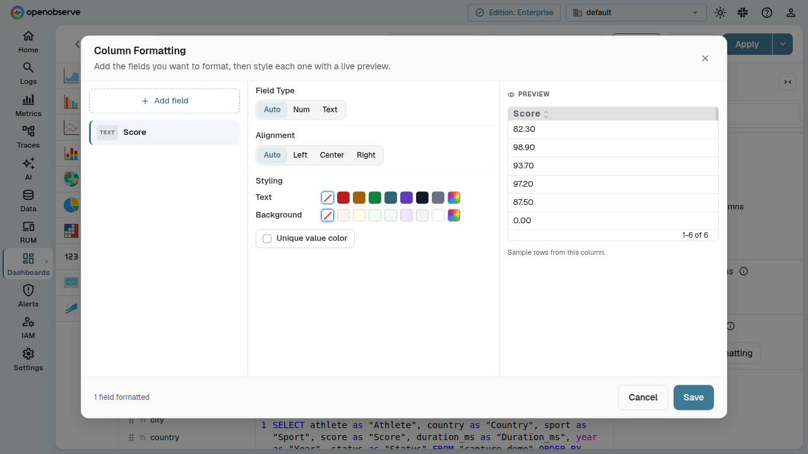
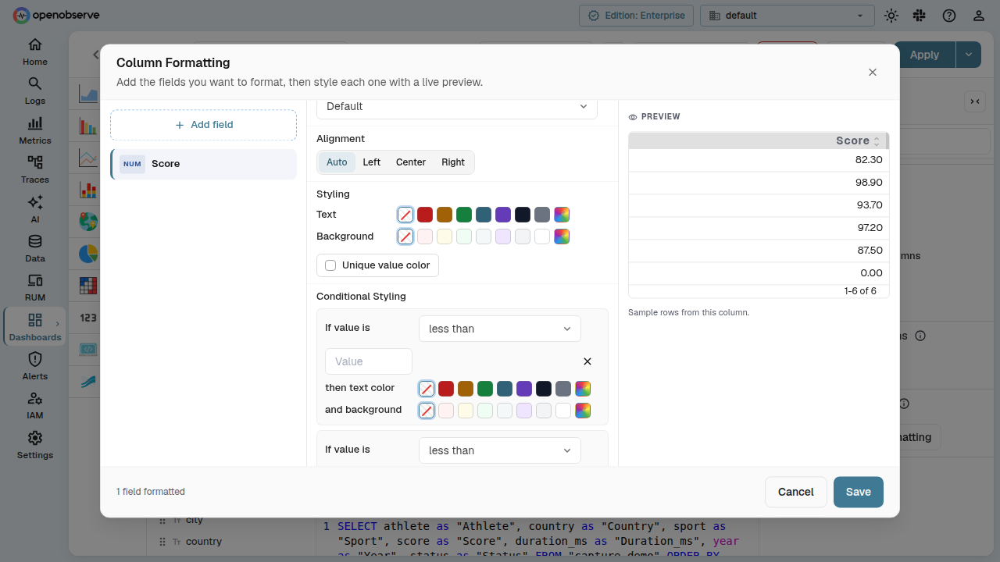
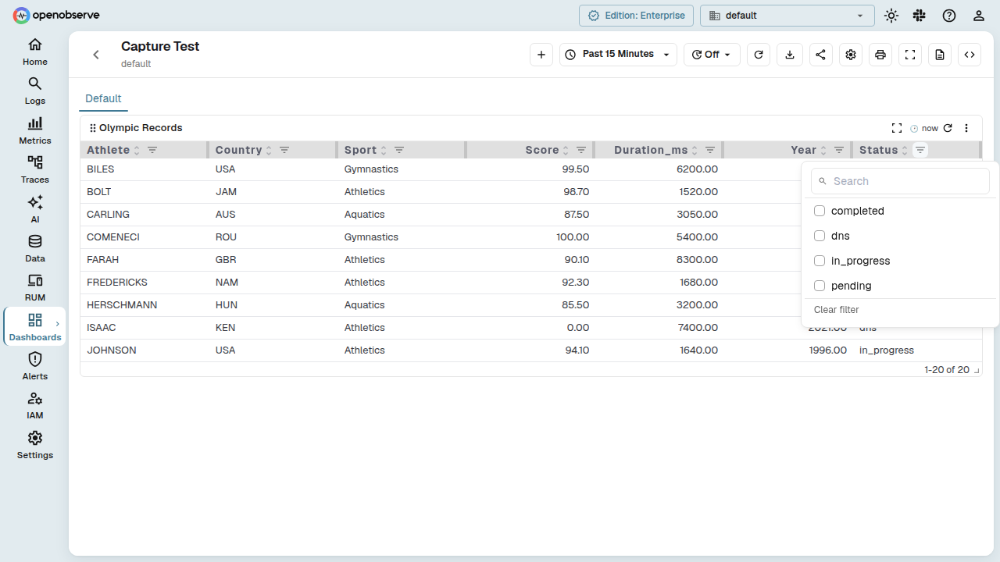

# Table Chart

Table chart panels display query results as a tabular view, with support for per-column formatting, Excel-style column filtering, and pagination.

## Configure column formatting

Column formatting lets you override the appearance of individual columns in a table panel — change value units, set text and background colors, control alignment, and define conditional styling rules.

To open the Column Formatting dialog:

1. Open a dashboard panel with type **Table**.
2. In the panel **Config** sidebar, locate the **Field Overrides** section.
3. Click the **Configure column formatting** button.

### Add a field

On first open, the dialog shows an empty state with an **Add field** button. Click it to see a dropdown of the panel's columns, each marked with a **NUM** or **TEXT** badge to indicate its detected data type.

Select a column to add it to the formatting list. The dialog switches to a three-pane layout:

- **Left pane** — list of all fields you have added, with type badges and a hover-to-remove **X** button. Click a field to select it.
- **Middle pane** — formatting controls for the selected field.
- **Right pane** — a live preview of the column rendered with your current settings.

### Formatting controls

The controls available for each field depend on its field type.

#### Field Type

Choose how the column's data type is interpreted:

- **Auto** — detect from the data (columns from Y-axis fields are numeric; X-axis and breakdown fields are text).
- **Num** — force numeric interpretation, enabling value formatting and conditional styling.
- **Text** — force text interpretation; value formatting and conditional styling are hidden.

#### Value Formatting

Available when the field type is numeric. Select a unit from the dropdown:

- **Default** — inherit the panel-level unit.
- **Numbers** — display raw numbers.
- **Locale Format (Auto)** — use locale-aware number formatting, following the viewer's UI language.
- **Other Locale** — pin the number format to a fixed locale (see [Choose a locale](#choose-a-locale)).
- **Bytes**, **Kilobytes**, **Megabytes** — data size units.
- **Bytes per Second** — throughput.
- **Seconds**, **Milliseconds**, **Microseconds**, **Nanoseconds** — duration units.
- **Percent (0-1)**, **Percent (0-100)** — percentage units.
- **Currency (Dollar)**, **Currency (Euro)**, **Currency (Pound)**, **Currency (Yen)**, **Currency (Rupees)** — currency units.
- **Custom** — enter a custom unit suffix.

When **Custom** is selected, a text input appears for the custom unit label.

### Choose a locale

By default, **Locale Format (Auto)** formats numbers according to each viewer's UI language. To pin a fixed locale — so every viewer sees the same format, for example Czech `1 234 567,89` — expand the **Other Locale** row directly below it.

The locale choice is available in two places, and works the same in both:

- The **Unit** dropdown in the panel **Config** sidebar (applies to the whole panel).
- The **Value Formatting** unit dropdown in the Column Formatting dialog (applies to a single column).

To pin a locale:

1. Select **Locale Format (Auto)** in the unit dropdown.
2. Click the **Other Locale** row to expand the list of available locales.
3. Pick a locale, labelled like **English - US (en_US)**.

The list offers 46 locales — the 16 UI languages plus 30 additional regions such as `en-GB`, `en-IN`, `de-AT`, `de-CH`, `fr-CA`, `fr-CH`, `es-MX`, `pt-BR`, and `cs-CZ`. Search matches both the locale name and its code.

The **Other Locale** row is a toggle, not a selectable value — clicking it expands or collapses the list without changing your selection. It opens already expanded when a nested locale is currently selected, and the locale names are shown in the viewer's UI language, sorted alphabetically.

A pinned locale is stored in the existing `unit` value as `locale:<tag>` (for example `locale:cs-CZ`), so no schema change or migration is required. The locale applies everywhere the panel renders a number — charts, tables, gauges, tooltips, and PromQL panels. If a pinned locale becomes unusable (for example, after downgrading), the panel falls back to **Locale Format (Auto)** rather than showing an error.

#### Alignment

Set the column's text alignment:

- **Auto** — default alignment based on type (right for numeric, left for text).
- **Left**, **Center**, **Right** — explicit alignment.

#### Styling

- **Text color** — pick a color from the preset swatches, or use the rainbow picker for a custom color. The **X** button resets to no override.
- **Background color** — same swatch-based picker for the cell background.
- **Unique value color** — when enabled, each distinct value in the column gets a unique color from the chart palette, applied as the cell background.

#### Conditional Styling

Available when the field type is numeric. Define threshold rules that change cell colors based on the value.

Each rule reads as a sentence:

**If value** `[operator]` `[threshold]` **then** text color / background color.

Supported operators: `<`, `>`, `<=`, `>=`, `=`, `!=`.

Rules are evaluated in order; when multiple rules match a value, the **last matching rule** wins. This lets you layer conditions — for example, a rule for values `> 400` (amber) followed by one for `> 1000` (red) means values above 1000 will show red, not amber.

Click **Add rule** to create a new condition, or the **X** button on a rule to remove it.

### Save or cancel

The dialog footer shows a count of configured fields. Click **Save** to apply the formatting or **Cancel** to discard changes.

Formatting settings are persisted with the dashboard and survive page reloads.

## Column filtering

Column filtering provides Excel-style dropdowns in table column headers, letting you filter the visible rows by one or more distinct column values.

### Enable column filtering

1. Open a dashboard panel with type **Table**.
2. In the panel **Config** sidebar, under the **Table** section, toggle **Table Filtering**.

Once enabled, a filter icon appears in each column header. Click it to open the filter panel for that column.

### Use column filtering

The filter panel contains:

- **Search** — filter the list of unique values shown in the panel.
- **Checkbox list** — each distinct value in the column is listed as a checkbox. Check values to include in the table; only rows matching at least one checked value are shown.
- **Clear filter** — resets the selection and shows all rows.

When a column has an active filter, its filter icon turns blue to indicate the column is filtered. Filters are applied client-side and do not trigger a new query.

## Configuration reference

The following panel config fields control table chart behavior:

| Field | Type | Default | Description |
|-------|------|---------|-------------|
| `table_filtering` | boolean | `false` | Enables per-column filter dropdowns. |
| `table_pagination` | boolean | `false` | Enables paginated mode (turns off virtual scroll). |
| `table_pagination_rows_per_page` | number | — | Rows per page when pagination is enabled. |
| `wrap_table_cells` | boolean | `false` | Wraps long text in cells instead of truncating. |
| `table_transpose` | boolean | `false` | Transposes the table (swap rows and columns). |
| `table_dynamic_columns` | boolean | `false` | Shows only columns present in the data. |
| `override_config` | array | `[]` | Per-column formatting rules (set via the Column Formatting dialog). |
