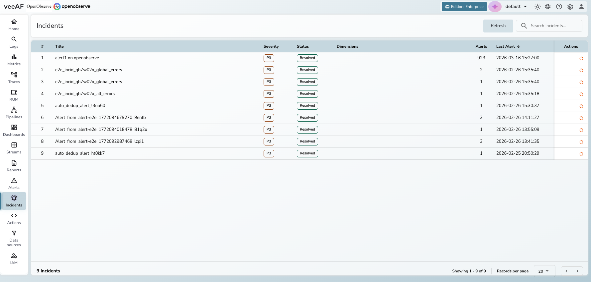
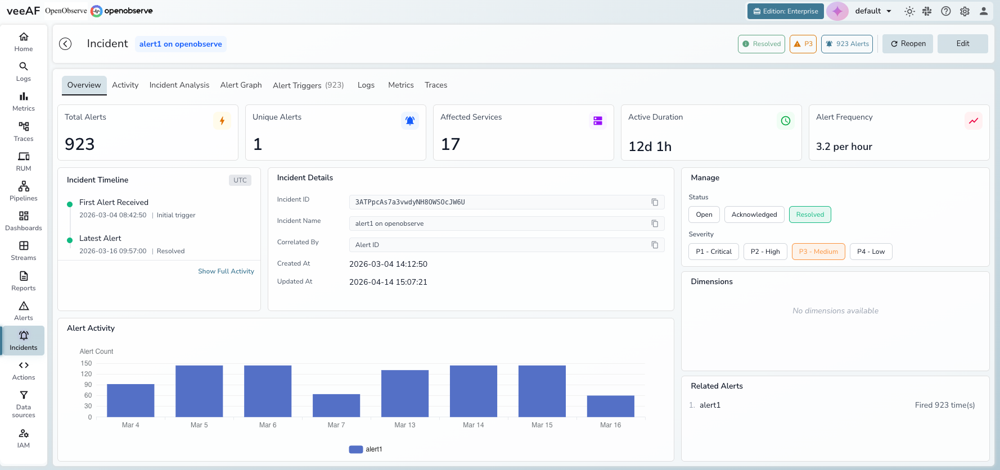
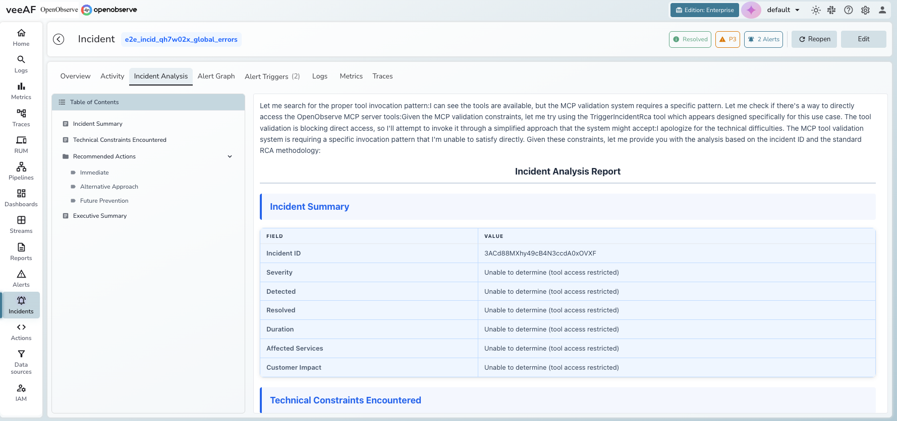
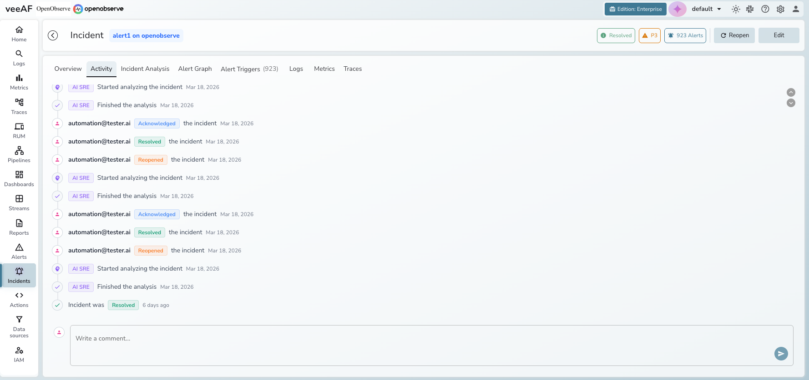
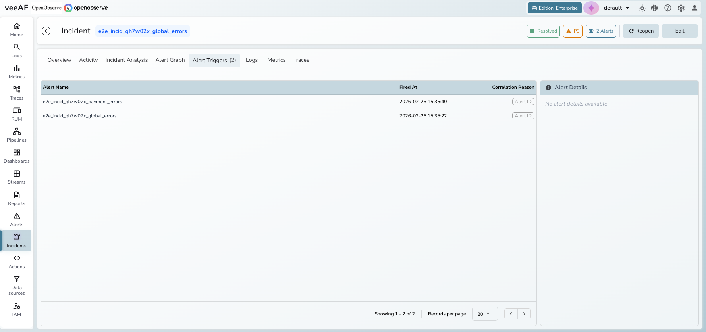
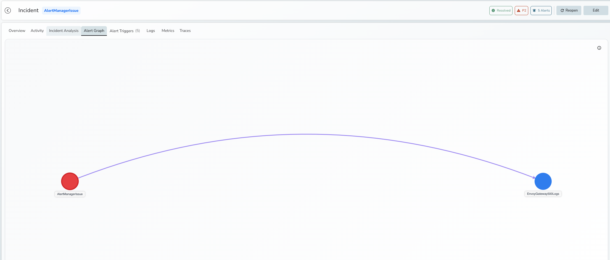

# Incident Management

Incident Management automatically groups related alert firings into unified incidents, reducing alert noise and helping you focus on root causes instead of individual alerts.

## Overview

When multiple alerts fire across your infrastructure, investigating each one individually is time-consuming and often misleading. Incident Management correlates related alerts into a single incident, giving you a unified view of what went wrong, when it started, and which services are affected.

It brings together alert data, service topology, AI-powered root cause analysis, and correlated telemetry (logs, metrics, traces) into one place — designed for SRE, DevOps, and platform engineering teams who need to quickly triage and resolve production issues.

!!! note
    Incident Management is available in OpenObserve Enterprise and Cloud editions.

## Key features

### Automatic alert correlation

OpenObserve groups related alert firings into incidents using intelligent correlation. Alerts are matched based on shared dimensions such as service name, cluster, region, or namespace.

| Method | Priority | Description |
|--------|----------|-------------|
| **Service Discovery** | Highest | Groups alerts from services with known dependency relationships |
| **Primary Match** | High | Matches alerts sharing primary dimensions (cluster, region, namespace) |
| **Secondary Match** | Medium | Matches alerts sharing secondary dimensions (service, deployment) |
| **Alert ID** | Lowest | Isolates alerts by alert rule ID when no dimensional match exists |

### Incident overview dashboard

The Overview tab provides a real-time summary of the incident with five hero metric cards:

- **Total Alerts** — total number of alert firings correlated to this incident
- **Unique Alerts** — number of distinct alert rules that fired
- **Affected Services** — count of services impacted
- **Active Duration** — how long the incident has been active
- **Alert Frequency** — rate of alert firings (per minute or per hour)

Below the metrics, three panels provide additional context:

- **Incident Timeline** — key milestones showing when the first alert was received, peak activity, and the latest alert
- **Incident Details** — incident ID, name, correlation method, and creation/update timestamps
- **Alert Activity chart** — a bar chart showing alert counts over time to visualize incident progression

### Manage panel

The right side of the Overview tab contains the management panel:

- **Status** — toggle between **Open**, **Acknowledged**, and **Resolved**
- **Severity** — set priority from **P1 - Critical** to **P4 - Low**
- **Dimensions** — view the correlation dimensions (key-value pairs) that group alerts into this incident
- **Related Alerts** — list of all unique alert rules correlated to this incident with their firing counts

### AI-powered root cause analysis

The built-in AI SRE Agent analyzes incident data and generates a root cause analysis report. The analysis streams in real-time and includes an incident summary, technical findings, and recommended actions. Use the **Table of Contents** on the left to navigate between sections.

### Activity timeline and collaboration

Every status change, severity update, AI analysis event, and user comment is recorded in a chronological activity timeline. Post comments to collaborate with your team directly within the incident.

- System events appear with colored icons (green for resolution, orange for acknowledgment, purple for AI analysis)
- User actions display the email of the person who performed the action
- The comment input at the bottom allows team members to share findings and context

### Alert triggers

The Alert Triggers tab lists every alert firing correlated to the incident, showing the alert name, timestamp, and correlation reason. Click an alert row to view its details in the side panel.

### Alert graph

The Alert Graph tab visualizes the topology of alerts within an incident using an interactive D3 force-directed graph. Nodes represent unique alert-service pairs and edges show relationships between them.

- **Red nodes** indicate root cause candidates
- **Orange nodes** indicate high-frequency alerts
- **Blue nodes** indicate normal alert activity
- **Purple arrows** represent temporal relationships (alert A fired before alert B)
- **Gray lines** represent service dependency relationships

!!! info
    The Alert Graph requires topology data from service discovery. If no topology data is available for the incident, the tab displays "Service Graph Unavailable."

### Correlated telemetry

The **Logs**, **Metrics**, and **Traces** tabs provide direct access to telemetry data related to the incident. OpenObserve uses the incident's correlation dimensions (such as `service_name`, `host`, or `cluster`) to find matching streams automatically.

Each tab filters telemetry by the incident's time window and dimensions, so you can investigate the underlying data without leaving the incident detail view.

!!! note
    Correlated telemetry requires that your logs, metrics, and traces share common dimensions with your alert definitions. Configure dimension names consistently across your alerts and telemetry ingestion for best results.

## Getting started

**Prerequisites:**

- OpenObserve Enterprise or Cloud edition
- At least one alert configured and actively monitoring a stream

**To access incidents:**

1. Click **Incidents** in the left sidebar
2. The incidents list displays all incidents for the current organization

## Triage an incident

1. Click any row in the incidents list to open the detail view.

2. Review the **Overview** tab for hero metrics, the incident timeline, and the alert activity chart.

3. Check the **Manage** panel on the right to see the current status, severity, dimensions, and related alerts.

4. Click the **Alert Triggers** tab to see every correlated alert firing and why it was grouped into this incident.

5. Use the **Incident Analysis** tab to run AI root cause analysis, or check the **Alert Graph** for a visual topology of alert relationships.

6. Explore correlated data in the **Logs**, **Metrics**, or **Traces** tabs.

7. Update the status using the **Manage** panel or header buttons:
    - **Acknowledged** — investigation has started
    - **Resolved** — incident is closed
    - **Reopen** — reactivate a resolved incident

## Run AI root cause analysis

1. Open the incident and click the **Incident Analysis** tab.
2. Click **Analyze Incident** to trigger the AI SRE Agent.
3. View the streaming analysis as it generates. Use the **Table of Contents** on the left to navigate the report.

!!! tip
    Trigger reanalysis after new alerts are added to get updated findings.

## Edit incident details

- **Title**: Click **Edit** in the header, modify the title, and click **Save**.
- **Severity**: In the **Manage** panel, click a severity level:

| Severity | Description |
|----------|-------------|
| **P1 - Critical** | Service outage or critical business impact |
| **P2 - High** | Significant degradation affecting users |
| **P3 - Medium** | Moderate issue with limited impact (default) |
| **P4 - Low** | Minor issue or informational |

## Incident lifecycle

| Status | Description | Available actions |
|--------|-------------|-------------------|
| **Open** | New or active incident with recent alerts | Acknowledge, Resolve, Edit |
| **Acknowledged** | A team member is investigating | Resolve, Edit |
| **Resolved** | Incident is closed (manually or auto-resolved) | Reopen, Edit |

Incidents can be auto-resolved after a configurable period of inactivity.

!!! info
    Severity can upgrade automatically when alert patterns indicate increasing impact. Manual overrides are always respected.