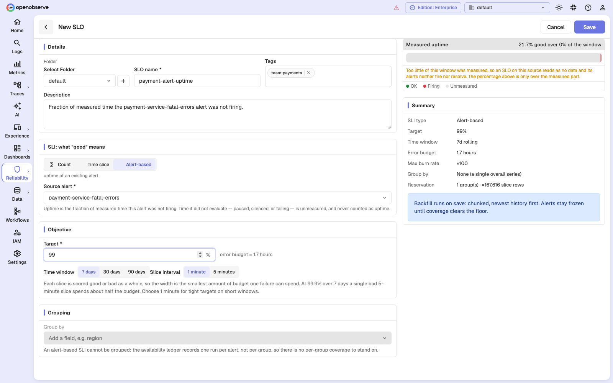
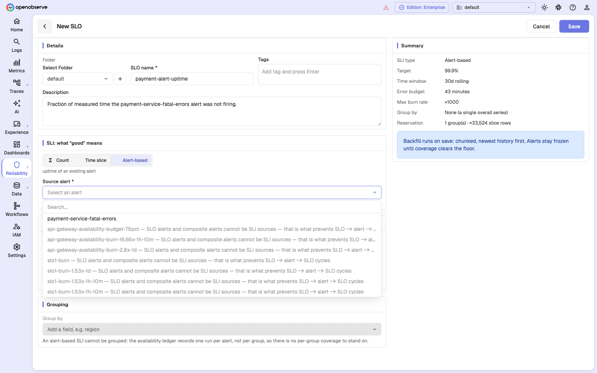
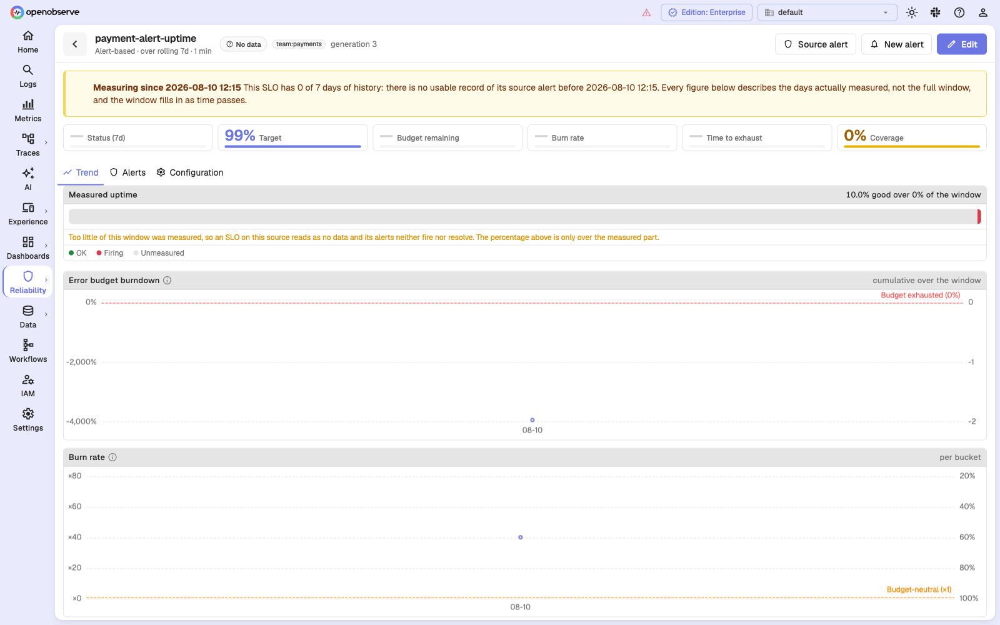

# Alert-based SLOs

An alert-based SLO measures the **uptime of an existing alert**: the fraction of
measured time during which that alert was *not* firing.

```
good  = seconds in the slice that were measured AND the alert was Ok
total = seconds in the slice that were measured
SLI   = 100 × good / total
```

You already wrote a query that defines "broken" when you built the alert. This
SLI type reuses it instead of asking you to express the same thing a second way,
in a second place, where the two definitions can drift apart.



## When to use it

- You have a monitor that already encodes the failure condition — "disk above
  90%", "replication lag above 60s", "error rate above 2%" — and you want its
  uptime tracked with a budget.
- The condition is expensive or awkward to express as a per-row predicate or a
  per-slice aggregate.
- You want a single SLO over a composite-shaped condition that the alert already
  expresses.

If you are creating a brand new objective, prefer a
[count](count-slos.md) or [time-slice](time-slice-slos.md) SLI. Those measure
your data directly. An alert-based SLI measures your *monitoring* — which is one
step removed, and inherits whatever the alert's schedule does.

## Configuration

Select **Alert-based** as the SLI type, then choose a **Source alert**. There is
nothing else to configure on the SLI side: the alert supplies the condition.

The picker lists every alert in the organization you can see. Ineligible ones
are greyed out with the reason inline, so you can see why an alert cannot be
used rather than wondering where it went.

One caveat: the picker judges eligibility against **5-minute slices**, the
coarsest an SLO can use, because at that moment no SLO exists to supply a grid.
An alert that evaluates every 5 minutes therefore looks selectable, but is still
refused at save if you then set this SLO's slice interval to 1 minute.



### Eligibility rules

A source alert must satisfy all of the following. Each rule exists because
breaking it would produce an SLO that looks configured but can never measure
anything, or one that reports uptime it did not observe.

| Rule | Why |
| --- | --- |
| **Scheduled, not real-time** | Only scheduled alerts carry durable evaluation state. A real-time alert has no per-run record to measure. |
| **Not grouped** | The evaluation record is one row per alert run, not per group, so a grouped source cannot say *which* of its groups were measured. "Grouped" here means the alert maintains per-group state — either a non-empty group-by list, or per-group fan-out. |
| **Not an SLO alert, not a composite alert** | This is what prevents `SLO → alert → SLO` cycles without needing a cycle checker. |
| **Fixed frequency, not cron** | A cron cadence is not a single number. A weekdays-only expression would read as about 71% coverage — under the floor — so the SLO would be permanently frozen for a reason you could not see. |
| **Evaluates at least once per slice** | If the alert runs every 5 minutes against 1-minute slices, four slices in five are never measured and the SLO freezes on a configuration that looks valid. |
| **Not silence-gated** | See below. |
| **The SLO itself must be ungrouped** | There is no per-group coverage to stand on, so the form disables **Group by** for this SLI type. |

### The silence rule

A single-level alert with a silence period stops evaluating for the whole
silence window — it is not merely suppressed at delivery. And silence engages
*after* a firing.

That combination is uniquely bad for measurement: the unmeasured holes land
inside the bad periods, by construction. The SLI would be biased upward without
ever tripping the coverage floor — biased uptime, no freeze, no signal.

So a source alert with silence greater than zero is rejected, with one exception:
an alert that carries a **warning threshold** of any kind — count, aggregation,
or PromQL — keeps evaluating through silence and suppresses only delivery.
Either set the source's silence to `0`, or give it a warning threshold.

Prefer setting silence to `0`. Adding a warning threshold has two side effects:
warning-level time then [counts as bad](#warning-counts-as-bad), and on an alert
that is already an SLI source it is a verdict change, so it restarts measurement
and discards the current window.

## What counts as measured

Uptime is only credited for time the alert **provably evaluated**. Every run
that happens records an outcome, and the outcomes split into two groups:

| Outcome | Measured? |
| --- | --- |
| Firing, Normal, NotifyFailed | Yes — a level was computed |
| Error, Skipped, Succeeded | No — a run exists, but nothing was measured |

The runs that are **absent** matter as much as the ones marked unmeasured. A
paused, disabled, or silenced alert writes no record at all — the scheduler
returns before publishing one — so those slices carry no evidence of measurement
and become gaps. `Error` and `Skipped` cover the cases where a record does
exist but produced no level: a failed query, or a run the scheduler dropped
because it fell behind.

Outcome and level are separate axes. *Did we evaluate?* and *was it bad?* are
different questions, and both are needed: only the first can distinguish "Ok for
three hours" from "paused for three hours".

### Warning counts as bad

Good means the level was **`Ok`, and nothing else**. A `Warning` match burns
error budget exactly as a `Critical` one does. A `NoData` level — the alert ran
but could not tell — is treated as unmeasured rather than as downtime, because
counting it bad would invent downtime that nobody observed.

This matters when you reach for the silence workaround below: adding a warning
threshold to a source alert starts charging warning-level time against the
budget.

## Worked example

**Goal:** the payment service's fatal-error monitor should be quiet at least 99%
of the time, over a rolling 7 days.

First, the source alert:

| Setting | Value |
| --- | --- |
| Type | Scheduled |
| Stream | `logs_default` |
| Condition | `service_name = 'payment-service' AND severity = 'FATAL'` |
| Threshold | at least 215 events |
| Period | 5 minutes |
| Frequency | every 1 minute |
| Silence | 0 minutes |

Then the SLO:

| Setting | Value |
| --- | --- |
| SLI type | Alert-based |
| Source alert | `payment-service-fatal-errors` |
| Target | 99% |
| Time window | 7 days |
| Slice interval | 1 minute |
| Tags | `team:payments` |

The form's preview shows a timeline strip of the source alert's history — green
for OK, red for firing, grey for unmeasured — with the resulting uptime and
coverage above it. If too little of the window was measured, the preview says so
before you save.

## History starts when recording starts

Uptime is computed from an evaluation ledger that OpenObserve writes fleet-wide
for every ungrouped, fixed-frequency scheduled alert whose run computed a level —
continuously, whether or not any SLO references it. That is deliberate: it means
a new SLO can measure history that already happened, instead of starting from
zero on the day you create it.

But it cannot measure further back than the later of two points:

- where the **ledger** begins, and
- when the source alert was **last saved**.

The second bound is easy to trip and worth understanding. The eligibility rules
validate the alert's configuration as it stands when the SLO is saved. An alert
that silenced for 10 minutes last month and silences for 0 today passes the
silence rule cleanly, while its older history carries exactly the bias that rule
exists to reject — and that bias lives in the gaps, where no per-record check
can reach. So backfill refuses to go back past the alert's last edit.

The practical consequence: a newly created source alert, an upgraded deployment,
or any edit to the source made **before this SLO (or its current generation) was
created** moves the **Measuring since** point forward. The floor is captured
when backfill is queued — at SLO save, or at a generation restart — so a later
cadence-only edit does not move it retroactively; it only floors backfills
queued afterwards.



The banner names the earliest measurable point and how many **days of history**
the SLO has since it — which is elapsed time, not coverage, so it will not match
the Coverage tile when there are gaps inside that span. Every figure below it
describes the days actually measured, not the full window, and the window fills
in as time passes.

This is not the same as being frozen. It is an honest statement that the window
is still filling. Until coverage clears the floor, the SLO still reads **No
data** and its alerts still freeze — the banner just explains why.

The **Source alert** button in the page header jumps to the alert this SLO is
measuring.

## How an alert-based SLO freezes

Freezing arrives by two different routes, and the page's wording tells you which
one you are looking at.

**While the source is not evaluating** — paused or disabled — measurement stops
advancing. After a few passes the watermark goes stale and the SLO freezes
with:

> **Frozen: the source alert stopped evaluating.** The source alert has not
> evaluated since ⟨time⟩, so measurement is frozen: the window stays where it
> was and the SLO's alerts neither fire nor resolve. The figures below are the
> last real measurement, not the current state.

Coverage of the pinned window can still read high at that moment, which is
exactly why staleness is checked before coverage.

**After the source resumes**, the watermark moves again and the accumulated hole
slides into the rolling window as gap slices. If the holes total more than
`1 − ZO_SLO_MIN_COVERAGE` of the window — more than 10% by default, which is
about 17 hours of a 7-day window — coverage drops below the floor and the SLO
freezes with:

> **Frozen: not enough coverage.** Only 63% of this window was measured, below
> the 90% floor: the source alert did not evaluate for the rest of it, whether
> paused, silenced or failing. The SLO reads as no data and its alerts neither
> fire nor resolve, so unmeasured time is never reported as uptime.

Smaller holes do not freeze it; they lower coverage and stay visible in the
**Coverage** tile.

Either way, the alerts attached to this SLO neither fire nor resolve. Pausing a
noisy alert never turns into a good month.

## Editing and deleting the source alert

Once an SLO measures from an alert, that alert is no longer free to change in
any way it likes. Save-time validation only holds at save time, so OpenObserve
also guards the source alert itself. Three different things can happen.

### An edit that changes the verdict restarts measurement

The SLI is "the alert's level was Ok", so anything that would make the same data
produce a different level redefines what the SLO is measuring. That means the
**query condition**, and **every field of the trigger condition except the six
that decide cadence and delivery**. In practice: period, operator, threshold,
warning threshold, tolerance, and time alignment.

The rule is written as an exclusion list on purpose, so a field added to the
trigger condition later counts as computation-affecting by default. That also
means the two less obvious ones — tolerance and time alignment — restart
measurement even though neither looks like a severity setting.

Such an edit bumps the SLO's **generation**, exactly as editing the SLO itself
would: the current window's measurements are discarded, backfill starts again,
and alerts on the SLO freeze until the new generation has coverage. One window
must never mix two definitions of good.

Loosening a source alert's threshold is therefore not a quiet change. It resets
the objective.

### An edit that only changes cadence or delivery does not

Frequency, the frequency type (minutes vs cron), the cron expression, silence,
timezone, and notify-on-warning decide when the alert runs and who hears about
it — never whether it considered the world good. Editing them leaves the SLO's
generation and history intact.

### An edit that breaks eligibility is refused

If the alert would no longer satisfy the [eligibility
rules](#eligibility-rules), the save is rejected with **409 Conflict**, naming
each affected SLO and its own reason:

```
this edit breaks the SLOs measuring from this alert — "payment-alert-uptime":
an alert-based SLI needs a source that evaluates at least once per slice:
cadence is 600s against 60s slices, so slices would go unmeasured and the SLO
would freeze
```

Each SLO is judged against **its own** slice interval, so the same edit can be
fine for a 5-minute SLO and refused by a 1-minute one. The refusal is the point:
allowing the edit and warning on the SLO page would leave the SLO frozen forever
on a configuration that was valid when it was created.

The escape hatch stays open — the edit that repairs a broken source passes,
because the repaired source is eligible.

### Deleting a source alert is refused

```
this alert is the measurement source for "payment-alert-uptime"; delete or
repoint them before deleting it
```

Also **409 Conflict**. Delete or repoint the SLOs first. (Deleting the whole
organization is not blocked by this — it removes SLOs before alerts.)

## Next steps

- [Count SLOs](count-slos.md)
- [Time-slice SLOs](time-slice-slos.md)
- [Alerting on SLOs](slo-alerts.md)
