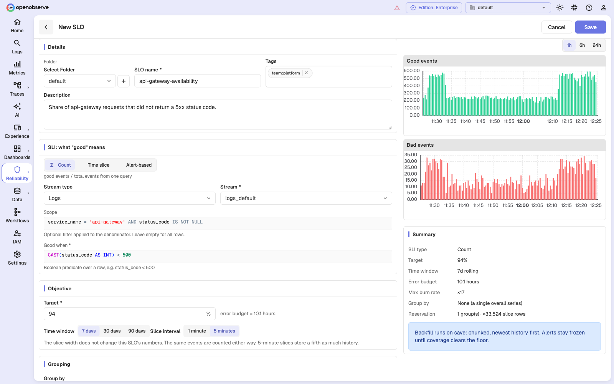
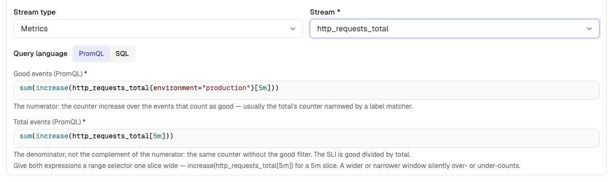
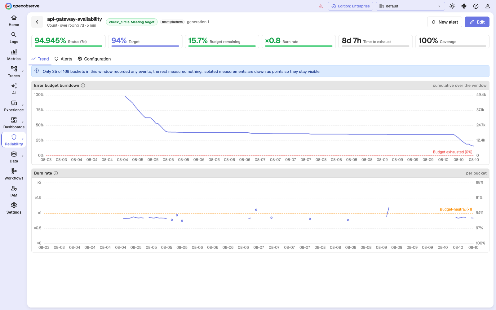

# Count SLOs

A count SLO measures **good events divided by total events**. Use it when your
signal represents discrete units of work — requests, jobs, payments, spans —
and you can identify both the good events and the complete population.

```
SLI = 100 × good events / total events
```

OpenObserve can obtain those counts in two ways:

- **SQL** counts rows in a logs, metrics, or traces stream. A scope defines the
  denominator and a boolean predicate identifies good rows. In the SLO form,
  both numbers come from one scan, so they cannot drift apart.
- **PromQL** evaluates separate good and total expressions over metrics. This
  is the right shape for monotonic counters, where `increase()` handles resets
  and turns samples into event counts.



## When to use it

| Question | Count SLO? |
| --- | --- |
| What share of API requests did not return 5xx? | Yes |
| What share of background jobs finished successfully? | Yes |
| What share of payments were authorized? | Yes |
| Was p95 latency under 300 ms? | No — use a [time-slice SLO](time-slice-slos.md) |
| Was the disk-space alert quiet? | No — use an [alert-based SLO](alert-based-slos.md) |

The distinguishing test is whether the objective weights **events**. With SQL,
"good" is a property of an individual row; with PromQL, good and total are
event counts derived from counters. If you need to aggregate a gauge or latency
distribution before you can judge a period, use a time-slice SLO.

## Configuration

Select **Count** as the SLI type, then choose a stream type and stream. Logs and
traces use SQL. For metrics, the **Query language** selector offers **PromQL**
(the default) and **SQL**.

| Language | Fields that define the SLI | Best for |
| --- | --- | --- |
| **SQL** | Optional **Scope** and required **Good when** predicate | Streams with one event per row, including raw metric samples when each sample is itself the unit you intend to count |
| **PromQL** | Required **Good events** and **Total events** expressions | Metrics counters that must be converted into per-slice event counts with `increase()` |

:::warning
SQL can query a metrics stream, but counting its rows usually counts **samples**,
not the events represented by a counter. Use PromQL for monotonic counters.
:::

## SQL count configuration

Both expressions are SQL fragments over the stream's fields — the same dialect
you use in the log search bar. The editor autocompletes field names and values
for the selected stream.

### Scope is the denominator

Scope is not cosmetic. It decides what the SLO is *about*.

```
Scope:     service_name = 'api-gateway' AND status_code IS NOT NULL
Good when: CAST(status_code AS INT) < 500
```

This measures "of the api-gateway rows that describe an HTTP response, what
fraction were not a server error". Rows without a `status_code` — health checks,
startup logs, anything that is not a request — are excluded from both sides
rather than silently counted as successes.

Dropping the `status_code IS NOT NULL` clause would put every api-gateway log
line in the denominator, and the SLI would mostly measure how chatty the service
is.

Leaving **Scope** blank means "all rows in the stream"; the form omits the field
rather than sending an empty string. If you are posting to the API directly,
omit `scope` entirely — an empty string is rejected as an empty predicate, not
read as "all rows".

### Good when

`Good when` is evaluated per row and must be a boolean expression. Some working
shapes:

```sql
-- HTTP success
CAST(status_code AS INT) < 500

-- explicit success flag
status = 'success'

-- successful and fast enough
status = 'success' AND CAST(duration_ms AS DOUBLE) < 1000

-- anything that is not a hard failure
severity NOT IN ('ERROR', 'FATAL')
```

Fields ingested as strings need an explicit cast before numeric comparison, as
in the examples above.

## PromQL count configuration

After selecting a metrics stream, leave **Query language** set to **PromQL**.
The SQL fields are replaced by two PromQL editors:

| Field | Meaning |
| --- | --- |
| **Good events (PromQL)** | The numerator: the counter increase for events that count as good. |
| **Total events (PromQL)** | The denominator: the counter increase for every event in the population. This is the total, not the complement of the good expression. |

For example, if one request counter carries a status label:

```promql
# Good events
sum(increase(http_requests_total{status_code!~"5.."}[5m]))

# Total events
sum(increase(http_requests_total[5m]))
```



Keep these rules in mind:

- Give both expressions a range selector exactly **one slice wide**:
  `[1m]` for a 1-minute slice or `[5m]` for a 5-minute slice. OpenObserve
  evaluates at slice ends; a wider or narrower range silently overcounts or
  undercounts. If you change the slice interval later, update both range
  selectors as part of the same edit.
- Make sure good and total describe the same population and preserve every
  configured **Group by** label. The two expressions are evaluated separately,
  so they do not have the single-scan atomicity of the SQL source.
- Derive good and total from the same counter whenever possible. Subtracting a
  separate error counter can return no good series in a healthy slice where the
  error series does not exist. Filter the request counter by a status or outcome
  label instead.
- Use `increase()` for counters instead of subtracting raw samples yourself.
  It accounts for monotonic counter resets. Choose a slice that normally
  contains at least two samples; a range with too few samples returns no value.
- The preview plots **Good events** and **Total events**. Unlike the SQL
  preview, it does not derive bad events as the complement of good rows.

PromQL is accepted only for metrics. To filter it, put label matchers in the
expressions; the SQL **Scope** field is not part of a PromQL count definition.
OpenObserve parses both expressions on save and reports invalid PromQL before
it starts backfill.

:::note
The selected metrics stream supplies the available **Group by** labels. PromQL
autocomplete derives metric and label suggestions from the expression itself,
and the saved PromQL source stores the expressions rather than a stream name.
When editing an existing PromQL count SLO, reselect a metrics stream if you need
to repopulate the **Group by** list.
:::

### PromQL grouping

For a grouped PromQL count SLO, the returned series labels supply the group
values. If **Group by** contains `region`, return a `region` label from both
expressions, for example:

```promql
# Good events
sum by (region) (
  increase(http_requests_total{status_code!~"5.."}[5m])
)

# Total events
sum by (region) (increase(http_requests_total[5m]))
```

OpenObserve folds any extra labels down to the configured group grain by
adding their event counts. If a configured group label is missing, its value is
recorded as empty. The SLO preview folds all returned series into an overall
rollup and does not display or validate their labels. Before saving, run the
expression in **Metrics** and inspect its output labels to make sure both
expressions preserve every configured group label.

## SQL worked example

**Goal:** the API gateway should serve at least 94% of requests without a server
error, measured over a rolling 7 days.

| Setting | Value |
| --- | --- |
| SLI type | Count |
| Stream | `logs_default` (logs) |
| Scope | `service_name = 'api-gateway' AND status_code IS NOT NULL` |
| Good when | `CAST(status_code AS INT) < 500` |
| Target | 94% |
| Time window | 7 days |
| Slice interval | 5 minutes |
| Tags | `team:platform` |

Reading the result:

- **SLI 94.946%** — that is `good / total` over the last 7 days.
- **Error rate 5.054%** — `100 − SLI`.
- **Error budget 6%** — `100 − 94`, which over 7 days is about 10.1 hours.
- **Budget consumed 84.2%** — `5.054 / 6`.
- **Budget remaining 15.8%** — what is left.
- **Burn rate ×0.8** — below budget-neutral, so at this pace the SLO ends the
  window inside its budget.
- **Time to exhaust 8d 7h** — longer than the window, which is another way of
  saying the same thing.



## PromQL worked example

**Goal:** at least 99.9% of HTTP requests should complete without an error,
measured from counters over a rolling 30 days.

| Setting | Value |
| --- | --- |
| SLI type | Count |
| Stream | `http_requests_total` (metrics) |
| Query language | PromQL |
| Good events | `sum(increase(http_requests_total{status_code!~"5.."}[5m]))` |
| Total events | `sum(increase(http_requests_total[5m]))` |
| Target | 99.9% |
| Time window | 30 days |
| Slice interval | 5 minutes |
| Tags | `team:platform` |

## Choosing the slice interval

For a SQL count SLO, the slice interval **does not change the numbers**. The same
rows are counted either way because both `good` and `total` are sums.

For a PromQL count SLO, changing the slice also changes the evaluation grid and
requires matching range selectors. Although the expressions are intended to
cover the same event population, `increase()` extrapolation and sample density
mean that five 1-minute evaluations do not necessarily equal one 5-minute
evaluation. Choose a slice that normally contains at least two counter samples,
and update both range selectors whenever you change it.

Pick 5 minutes unless you have a reason not to: it stores a fifth as much
history for the same answer. Choose 1 minute only when you want finer resolution
in the burndown chart, or when you intend to attach burn-rate alerts with very
short windows — the short window must be at least two slices wide.

## Grouping

Set **Group by** to one or more fields to measure each distinct value
separately — for example `region`, or `service_name`, or `tenant_id`.

- Each group gets its own SLI, budget, and burn rate.
- An exact overall rollup is measured alongside the groups; it is not a sum of
  the truncated group list.
- Grouped SLOs are pinned to **5-minute slices**.
- The default cap is 500 groups per SLO. Exceeding it is reported as an
  overflow, not silently truncated, so pick a field with bounded cardinality.
  `region` is a good grouping key; `user_id` is not.

The **Cardinality estimate** field sizes the storage reservation. Twice the
estimate is reserved — with a floor of 64 groups and a ceiling at the hard cap —
to leave headroom for organic growth.

## Empty slices and low-traffic services

Two different situations look similar and are treated very differently.

**The query ran and found nothing.** For a count SLI that is a real observation
of zero traffic, so the slice is recorded as **measured with zero events**. It
does not lower coverage, and because it adds nothing to either the numerator or
the denominator, it does not move the SLI either.

**The query never ran, or failed.** That is a **gap**. It lowers coverage, and
once coverage drops below `ZO_SLO_MIN_COVERAGE` (default 0.9) the SLO reads as
**No data** and its alerts freeze.

PromQL count expressions are joined using the total result as the population.
For each total point, a missing matching good point is stored as zero good
events; a good-only point with no matching total is ignored. If good exceeds
total, OpenObserve caps good at total before storing the slice. A successful
PromQL evaluation with no total points becomes a measured zero-traffic slice,
not a gap. These rules are another reason to derive good and total from the same
counter with aligned labels. The preview plots the raw query results, so it can
differ from the stored values when a join is missing or good exceeds total.

This is the opposite of how a [time-slice SLO](time-slice-slos.md) treats an
empty period, and the difference is deliberate: counting events over an empty
period is well defined, computing a percentile over one is not.

There is still a low-traffic failure mode, but it is a different one. If the
**whole window** ends up covered with no events at all, the SLI is undefined —
zero divided by zero — and the SLO freezes with no data even though coverage
reads 100%. Traffic stopping entirely is usually the incident, not a recovery,
so the safe behaviour is to refuse to answer rather than to report either 0% or
100%.

If you are measuring something that legitimately goes quiet for long stretches,
model it as a [time-slice SLO](time-slice-slos.md) instead, which can be
configured to treat a proved-empty period as a failure.

## Next steps

- [Time-slice SLOs](time-slice-slos.md)
- [Alert-based SLOs](alert-based-slos.md)
- [Alerting on SLOs](slo-alerts.md)
