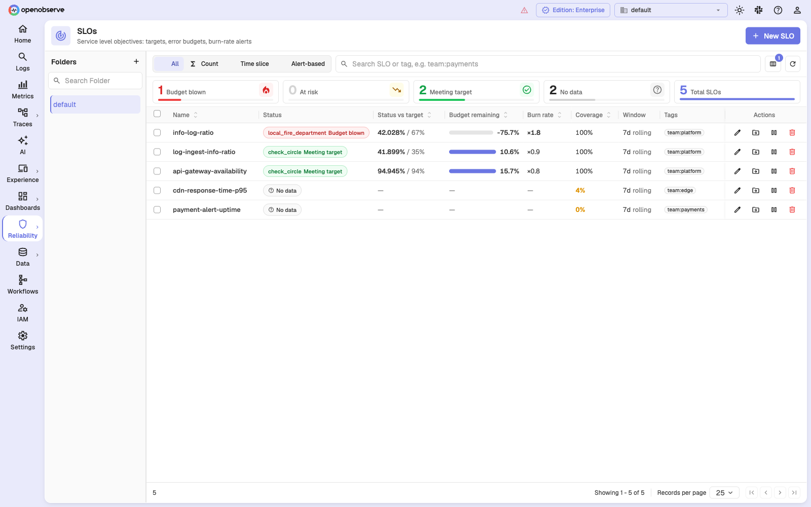
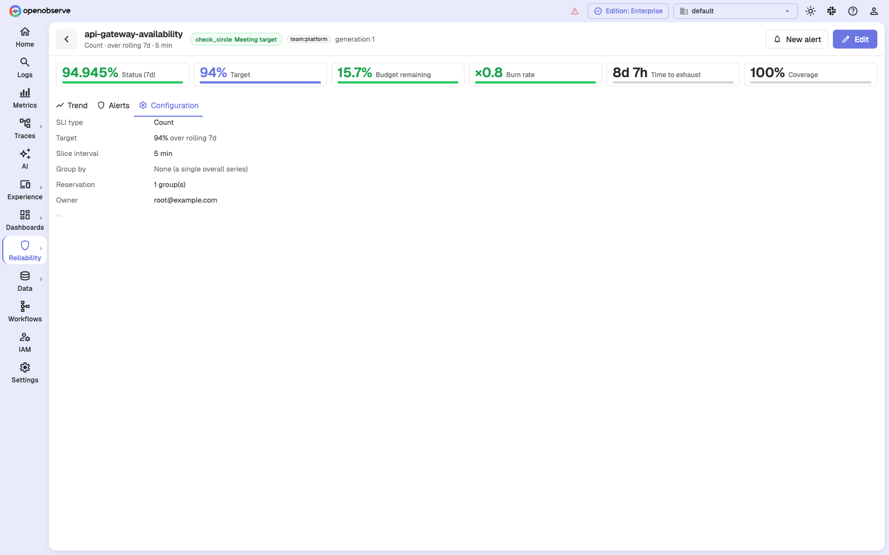

# Service Level Objectives

An SLO turns a reliability goal into a number you can measure, argue about, and
alert on. It answers one question continuously: **over the last N days, what
fraction of the thing you care about was good, and how much of your allowance
for badness is left?**

OpenObserve measures SLOs on a background job that runs independently of
alerting. That separation is the whole point of the feature: measurement happens
once, several alerts read the result, and none of them re-scan your raw data.



Find SLOs under **Reliability > SLOs**. The counters across the top break the
list down by health, and the type filter narrows it to Count, Time slice, or
Alert-based. The two **No data** rows in this example are SLOs that are still
filling their window — see [Coverage](#coverage-and-why-unmeasured-time-is-not-uptime).

## Why not just use an alert?

A threshold alert tells you what is happening right now. It cannot tell you
whether you can afford it.

Consider a checkout API that is supposed to succeed 99.9% of the time over 30
days. A 15-minute outage is survivable — it spends about a third of the month's
allowance. The same outage in the last week of a month that already had two
outages is a different conversation entirely. An SLO is what makes those two
identical incidents distinguishable, because it tracks the **budget**, not just
the event.

## Core concepts

### SLI: the service level indicator

The SLI is the measurement — a percentage between 0 and 100. In OpenObserve you
declare what "good" means, and the SLI follows:

```
SLI = 100 × good / total
```

What `good` and `total` count depends on the SLI type you pick. See
[The three SLI types](#the-three-sli-types) below.

### SLO target

The target is the percentage the SLI is supposed to stay at or above — 99.9%,
99%, 95%. It must be strictly between 0 and 100, with at most three decimal
places.

A 100% target is rejected on purpose: it leaves a zero error budget, so every
burn rate is either 0 or infinite, and no burn-rate alert can ever be calibrated.

The target is applied when the SLO is **read**, not when it is measured. Changing
only the target therefore never discards measurement history — see
[Editing an SLO](#editing-an-slo).

### Error budget

The error budget is what the target permits you to spend:

```
error budget           = 100 − target
error rate             = 100 − SLI
error budget consumed  = 100 × (error rate ÷ error budget)
error budget remaining = 100 − error budget consumed
```

At a 99.9% target the budget is 0.1% of the window. Over 30 days that is
**43 minutes**; over 7 days it is **10 minutes**. The SLO form shows this
conversion as you type the target.

**Budget remaining is signed.** Once the budget is blown, it keeps counting down
into negative numbers — `−75.6%` means you have spent 175.6% of what the target
allowed. It is never clamped to zero, because "just barely blown" and
"catastrophically blown" are different operational situations.

### Burn rate

Burn rate is the error budget's speed, expressed as a multiple:

```
burn rate = error rate ÷ (100 − target)
```

- **×1** means the budget lands exactly at the end of the window. Budget-neutral.
- **×2** means you are spending twice as fast as the window allows — the budget
  is gone in half the window.
- **×14.4** exhausts a 30-day budget in about two days.

Burn rate is the quantity most worth alerting on, because it is comparable
across SLOs with different targets and windows. A ×5 burn is the same urgency
whether the target is 99% or 99.99%.

Every SLO has a **maximum possible burn rate**, `100 / (100 − target)`, which is
what the error rate reaching 100% would produce. A 94% target caps at about
×16.7 (the form rounds and displays ×17); a 99.9% target caps at ×1000. Alert
thresholds above the ceiling are rejected, because they could never fire.

### Rolling window

SLOs are measured over a **rolling** window — 7, 30, or 90 days — not a calendar
month. Old time falls out of the window as new time enters. Calendar-aligned
windows are not supported.

A measurement pass does not re-read the whole window. It writes only the slices
that have newly closed, plus a few trailing ones to pick up late-arriving data,
and its update to the running totals only ever *adds*. What retires slices that
have aged out — what actually makes the window roll — is the periodic rebuild
from the stored slices, on `ZO_SLO_RECONCILE_INTERVAL_SECS` (hourly by default).
Between rebuilds the totals can run slightly ahead of the window.

The window is anchored to the **watermark** (the last point measurement has
reached), not to the wall clock. Anchoring at `now` would read a window missing
its most recent slice, which makes the SLI look systematically better than it is
— and it would be most wrong during an incident.

### Time slices

The window is divided into fixed **slices** of 1 minute or 5 minutes. Each
measurement pass writes one row per slice with that slice's `good` and `total`,
and the SLO's overall numbers are the sum over the slices in the window.

Slice width means different things per SLI type:

- For a **count** SLI it does not change the answer. The same events are counted
  either way; 5-minute slices simply store a fifth as much history.
- For a **time-slice** SLI it is load-bearing. A whole slice is scored good or
  bad, so the slice width is the smallest amount of budget one failure can
  spend. At 99.9% over 7 days, a single bad 5-minute slice spends about half the
  budget.

Grouped SLOs are pinned to 5-minute slices.

### Coverage, and why unmeasured time is not uptime

**Coverage** is the fraction of the window that was actually measured:

```
coverage = observed slices ÷ expected slices
```

A slice that was never measured is a **gap**, not a zero. This distinction is
the single most important safety property in the feature. If a search backend is
down, or the SLO is paused, or a source alert stopped evaluating, that time
contributes to neither `good` nor `total`, so it never counts as uptime — but it
*is* still counted in coverage's denominator, which is derived from the aligned
slice grid rather than from what a query returned. That is exactly how the floor
notices the hole.

A slice that *was* measured and came back empty is a different case, and the
three SLI types answer it differently — a count SLI records zero events, a
time-slice SLI records a gap, and an alert SLI proves coverage from the
evaluation record instead. Each type's page explains its own rule.

When coverage falls below the floor — `ZO_SLO_MIN_COVERAGE`, default **0.9** —
the SLO reads as **No data** and alerts on it **freeze**:

> A frozen alert neither fires nor resolves. It holds its last level until real
> measurement resumes.

Which alerts freeze depends on what they read. An
[error-budget alert](slo-alerts.md) reads the same full window as the SLO, so it
freezes with it. A **burn-rate alert** is gated on the coverage of its own long
and short windows, so an old hole that drags the 30-day figure below the floor
does not stop it evaluating a well-covered recent hour. A stale watermark
freezes everything.

Freezing rather than resolving is deliberate. The alternative — treating "we
could not measure" as "everything is fine" — would silently resolve every
burn-rate page in the organization during a measurement outage, which is exactly
when you least want that.

An SLO also freezes when its **watermark goes stale**, meaning measurement has
stopped advancing even though the coverage of the pinned window still looks
high. Staleness is checked before coverage: if the data is not current, nothing
about it is a measurement.

### Health states

The list page classifies each SLO into one of four states:

| State | Meaning |
| --- | --- |
| **Meeting target** | Budget remaining is positive and burn rate is at or below ×1. |
| **At risk** | Budget remaining is positive, but burn rate is above ×1 — at this pace the budget runs out before the window does. |
| **Budget blown** | Budget remaining is at or below 0. |
| **No data** | Not measured, measured below the coverage floor, or fully covered but carrying zero events — the ratio is undefined, and traffic stopping is usually the incident rather than a recovery. Not a flavour of healthy: an SLO that cannot be measured is not passing. |

### Grouping

An SLO can be split by one or more fields — `region`, `service_name`,
`customer_tier` — producing one measured series per distinct value, plus an
exact overall rollup. Grouping is set on the SLO, is limited to 500 groups per
SLO by default, and forces 5-minute slices.

A grouped SLO gets an extra **Groups** tab on its detail page, listing each
measured group with its own SLI, budget, and burn rate. Groups appear there once
the first measurement pass has seen them.

Alert-based SLIs cannot be grouped: the underlying evaluation record is one row
per alert run, not per group, so there would be no per-group coverage to stand
on.

## The three SLI types

OpenObserve supports the three standard SLI shapes. Pick by what your data
looks like, not by what you want the dashboard to say.

| Type | `good` / `total` are | Use when |
| --- | --- | --- |
| [**Count**](count-slos.md) | good events / total events, from one scan | You have one row per request, job, or transaction, and a predicate that says which ones succeeded. |
| [**Time slice**](time-slice-slos.md) | good slices / measured slices | Your signal is an aggregate over a period — p95 latency, queue depth, freshness lag — not a per-row verdict. |
| [**Alert-based**](alert-based-slos.md) | seconds not firing / seconds measured | You already have an alert that defines "broken", and you want its uptime as an SLO without rebuilding the query. |


## Creating an SLO

1. Go to **Reliability > SLOs** and select **New SLO**.
2. Give it a **name**, an optional description, and optional **tags**. Tags are
   free-form and searchable — `team:payments` is the conventional shape.
3. Under **SLI: what "good" means**, pick the type and fill in its fields. The
   preview panel on the right evaluates your definition against recent data as
   you type.
4. Under **Objective**, set the **target**, the **time window**, and the **slice
   interval**. The form shows the resulting error budget in wall-clock terms.
5. Optionally set **Group by**.
6. Select **Save**.

**Backfill runs on save.** OpenObserve immediately starts measuring history
backwards, newest first, so a new SLO fills its window rather than starting at
zero. Alerts on the SLO stay frozen until coverage clears the floor.

Backfill walks the window in chunks of `ZO_SLO_BACKFILL_CHUNK_SECS` (one day by
default) and issues **one bucketed aggregate query per chunk** — never one per
slice. A 7-day SLO is therefore about seven queries, spaced out over a few
minutes. (A dual-query or PromQL count source runs two queries per chunk, one
each for good and total; an alert-based SLI reads the evaluation ledger instead
of running a search at all.)

## Reading an SLO

Select any row in the list to open the detail page.


The tiles across the top are the whole story in six numbers:

| Tile | Reads |
| --- | --- |
| **Status (window)** | The current SLI over the rolling window. |
| **Target** | What it is supposed to be. |
| **Budget remaining** | How much of the error budget is left, signed. |
| **Burn rate** | How fast it is being spent, as a multiple of budget-neutral. |
| **Time to exhaust** | How long a *full* window's budget lasts at the current burn rate, as `window ÷ burn rate`. |
| **Coverage** | How much of the window was actually measured. |

**Time to exhaust is a pace indicator, not a countdown.** It does not subtract
the budget already spent, so an SLO whose budget is long gone still shows a
positive figure — an SLO burning at ×1.74 over 7 days reports about 4 days even
at −74% budget remaining. Read it as "at this speed a whole budget would last
this long", and read **Budget remaining** for how much is actually left.

The **Trend** tab holds two charts:

- **Error budget burndown** — cumulative over the window, falling from 100%
  toward the "Budget exhausted (0%)" line.
- **Burn rate** — per bucket, against the orange "Budget-neutral (×1)" line.
  Time above that line is time you are spending faster than you can afford.

The **Alerts** tab lists every alert attached to this SLO and is where you create
them. See [Alerting on SLOs](slo-alerts.md).

The **Groups** tab appears only on a grouped SLO, and breaks the window down by
group.

The **Configuration** tab shows the stored definition: SLI type, target, window,
slice interval, grouping, row reservation, and owner.



## Editing an SLO

Editing splits into two cases, and the form tells you which one you are in.

**Changing the target** is free. The target is applied at read time, so the
existing measurements are still valid — the numbers just get compared against a
different line.

**Changing what a slice means** — the SLI type, the query, the predicate, the
threshold, the window, the slice interval, or the grouping — starts a new
**generation**. The current window's measurements describe a definition that no
longer exists and are discarded, and backfill starts again.

For an [alert-based SLO](alert-based-slos.md), editing the **source alert's
condition** starts a new generation too, even though nobody touched the SLO.

While a new generation is filling, alerts on the SLO are **frozen**, not
resolved. Expect a firing alert to go quiet mid-incident if someone edits the
SLO underneath it.

One consequence worth knowing before you edit: OpenObserve does not re-validate
attached alerts when the SLO changes. Moving the **slice interval** off an
alert's grid — say, 1-minute to 5-minute slices under an alert whose burn
windows are not multiples of 5 minutes, or whose short window shrinks to a
single slice — leaves that alert stranded: it keeps its stored configuration but
can no longer be saved, even to change its silence period. Review the SLO's
**Alerts** tab after a slice-interval change. (Window changes cannot strand an
alert: the shortest SLO window, 7 days, always exceeds the 48-hour cap on burn
windows.)

## Pausing and deleting

**Pause** stops the measurement job. While paused, the watermark stops
advancing and the SLO freezes on staleness — its alerts neither fire nor
resolve, and the figures on the page are the last real measurement rather than
the current state.

Pausing does **not** exclude that time from the SLO. On resume, the next pass
starts from the stale watermark and re-reads the whole paused span from your
raw data in one catch-up query, so the hole is measured after the fact. Pausing
an SLO through a bad afternoon is not a way to keep it out of the numbers.

The exception is an [alert-based SLO](alert-based-slos.md) whose *source alert*
was paused. There is no raw data to go back to — only the evaluation record the
source never wrote — so that time stays permanently unmeasured.

**Delete cascades to the alerts.** An alert whose SLO is gone has nothing to
evaluate and no way to recover, so deleting an SLO deletes every alert attached
to it, along with their schedules. The confirmation dialog shows how many alerts
will go with it. Slices already written stay on disk until they age out.

## Configuration reference

SLO measurement is tuned with these environment variables:

| Variable | Default | What it controls |
| --- | --- | --- |
| `ZO_SLO_MIN_COVERAGE` | `0.9` | Coverage floor. Below this the SLO reads as No data and its alerts freeze rather than resolving. |
| `ZO_SLO_INGEST_DELAY_SECS` | `60` | How far behind `now` a slice is closed, so late-arriving data is present before it is measured. Sets the floor on alert latency. |
| `ZO_SLO_RECOMPUTE_SLICES` | `3` | How many trailing slices each pass re-measures to pick up late data. Also the staleness tolerance on the watermark. |
| `ZO_SLO_RECONCILE_INTERVAL_SECS` | `3600` | How often the running aggregate is rebuilt from the stored slices. This is what makes the rolling window actually roll. |
| `ZO_SLO_BACKFILL_CHUNK_SECS` | `86400` | How much history one backfill chunk covers. |
| `ZO_SLO_MAX_GROUPS` | `500` | Hard cap on measured groups per SLO. Overflow is reported rather than silently truncated. |
| `ZO_SLO_MAX_BURN_WINDOW_PAIRS` | `8` | Distinct (long, short) burn-window pairs precomputed per SLO. Alerts share pairs, so the cost is per SLO, not per alert. |
| `ZO_SLO_MAX_SLICE_ROWS_PER_ORG` | `250000000` | Per-organization budget over stored slice rows, bounding the SLOs × groups × window product. |
| `ZO_SLO_REVISION_HEADROOM` | `1.2` | Multiplier over logical slice rows pricing late-data re-emissions into the per-org row budget. Values below 1.0 are clamped. |

## Next steps

- [Count SLOs](count-slos.md)
- [Time-slice SLOs](time-slice-slos.md)
- [Alert-based SLOs](alert-based-slos.md)
- [Alerting on SLOs](slo-alerts.md)
