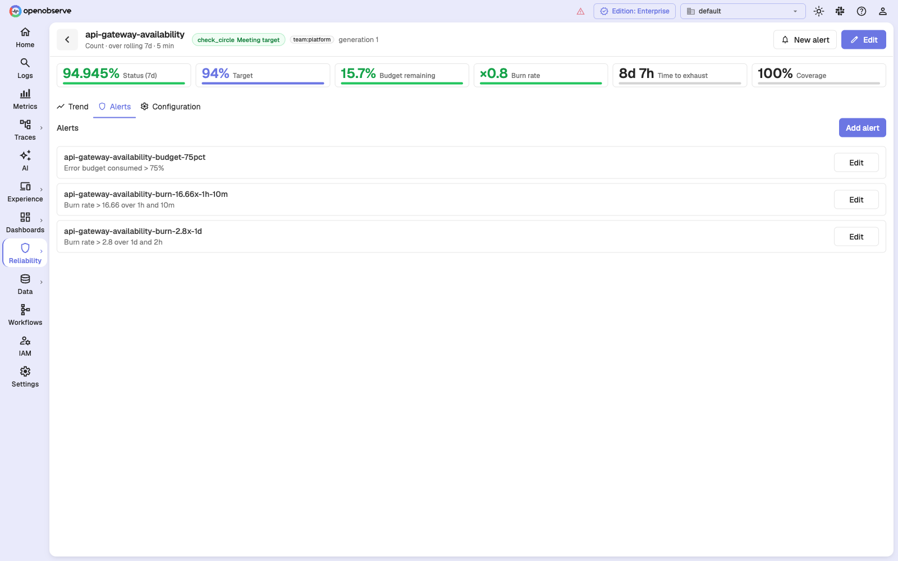
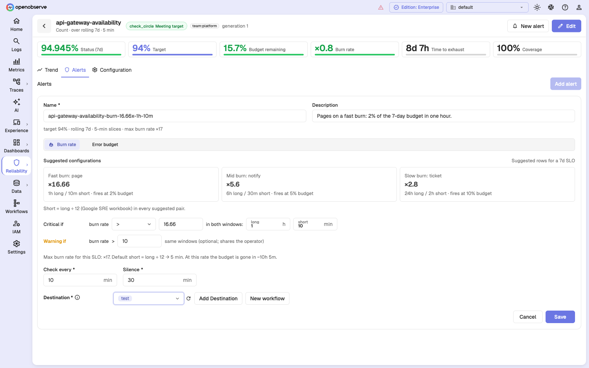
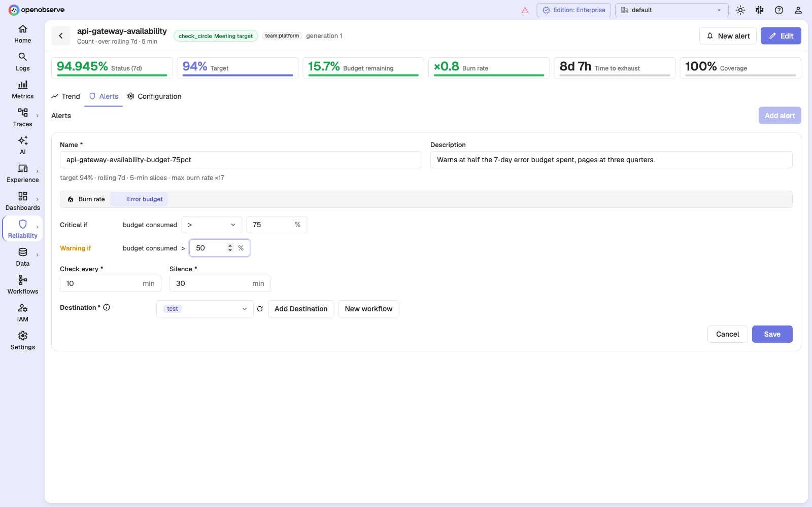
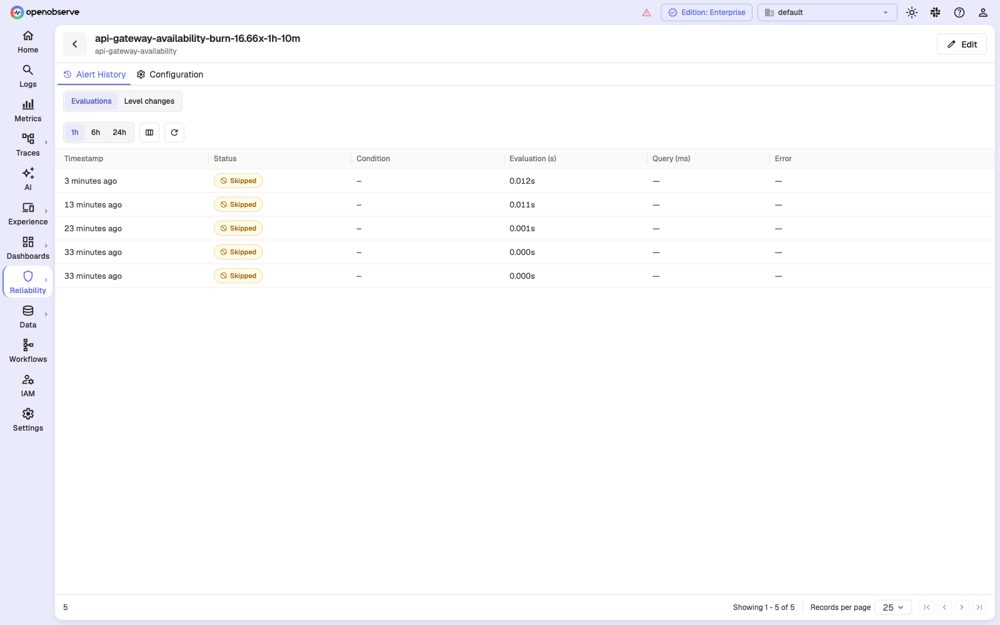
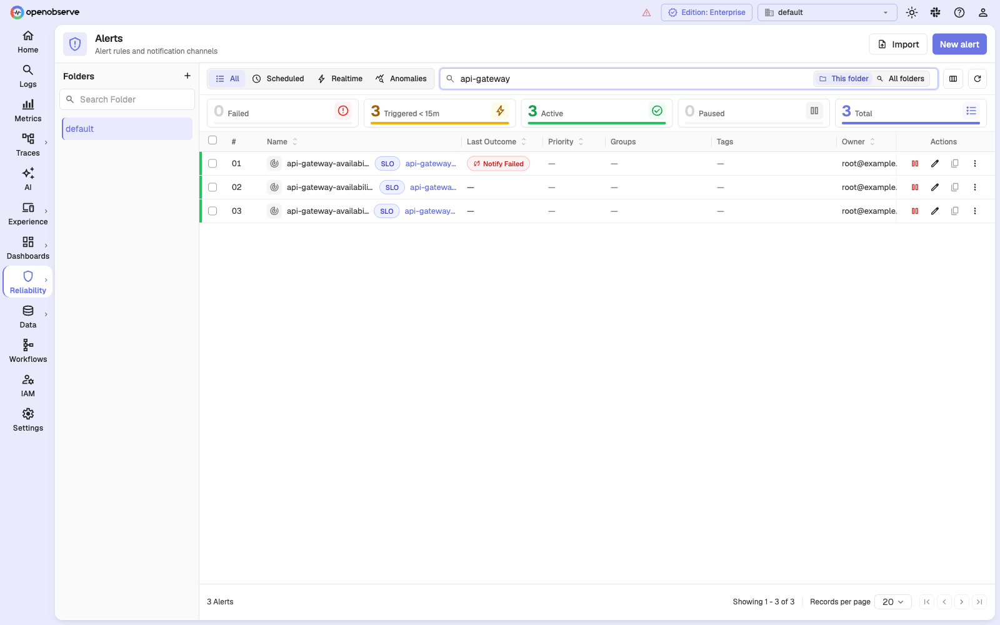
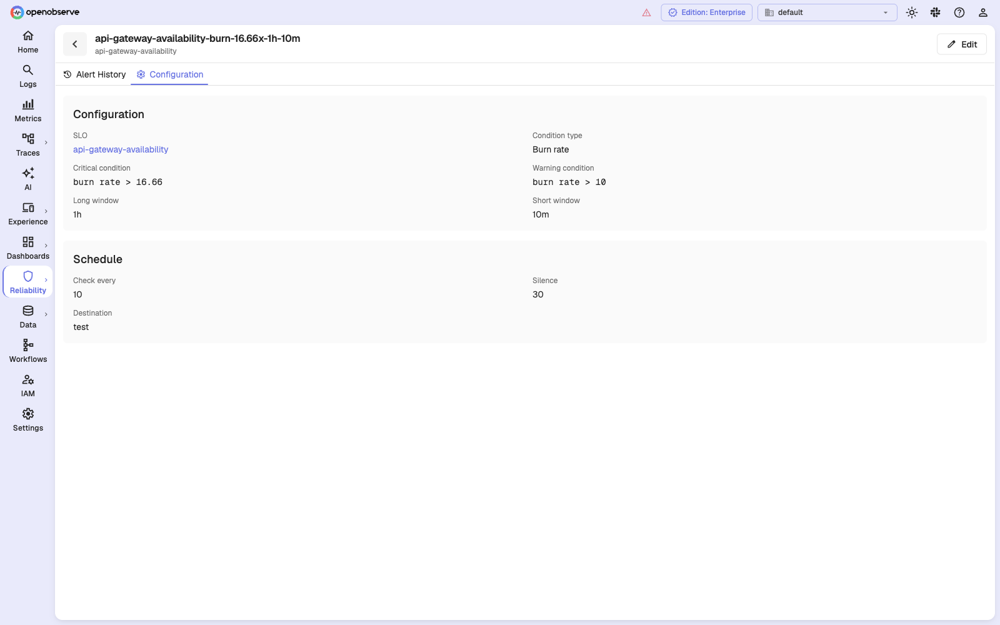

# Alerting on SLOs

An SLO on its own is a report. What makes it operational is alerting on the
*rate* at which its error budget is being spent, so a page arrives while there is
still budget left to protect.

An SLO alert is an ordinary OpenObserve alert. It has destinations, silence,
priority, history, and folders like any other — though the SLO page's form edits
only the name, description, condition, schedule, and destinations. Priority,
tags, and folder are set through the API and preserved across form edits. What is different is its
condition: instead of a query, it references an SLO.

## The defining property: an SLO alert runs no query

A regular scheduled alert re-scans your data every time it evaluates. An SLO
alert does not. Measurement already happened on the SLO's own schedule, so the
alert just reads the number that was computed.

Three consequences worth planning around:

1. **Cost is flat.** Five alerts on one SLO cost five cheap row reads and zero
   extra data scans. Attaching fast, mid, and slow burn alerts to the same SLO
   is nearly free.
2. **The alert's frequency is independent of measurement.** Checking every
   minute does not make measurement any fresher. The floor on detection latency
   is set by the SLO's slice interval and `ZO_SLO_INGEST_DELAY_SECS`, not by the
   alert.
3. **Alerts inherit the SLO's coverage.** If the SLO cannot be measured, its
   alerts freeze. They do not resolve.

## Creating an SLO alert

SLO alerts are created and edited from the SLO's own page, not from the generic
alert form.

1. Open **Reliability > SLOs** and select an SLO.
2. Go to the **Alerts** tab.
3. Select **Add alert**.



Editing an SLO alert from the alerts list, or from an alert's detail page,
redirects you back to the owning SLO page. The HTTP API remains the automation
path and accepts the same objects directly.

## The two alert kinds

### Burn rate

Fires when the error budget is being spent faster than a chosen multiple of
budget-neutral, measured over **two windows at once**.



| Field | Meaning |
| --- | --- |
| **Critical if burn rate > N** | The paging threshold, as a multiple. |
| **Warning if burn rate > M** | Optional, and must be strictly less severe than critical. |
| **long** | The main measurement window: 1 hour to 48 hours. |
| **short** | The confirmation window: no longer than the long window, at least two slices, and an exact multiple of the slice interval. |

**Both windows must exceed the threshold** for the alert to reach a level. This
is the standard multi-window rule, and it is the entire reason the short window
exists.

The alert's level is the **less severe** of the two windows' classifications. In
practice this means a healthy short window holds the alert down even while the
long window is breaching — which is what suppresses a spike that has already
recovered. Concretely, on an SLO with a 35% target — a 65% error budget; the
numbers come from a real test run, and the arithmetic is the same at any
target:

| Window | SLI | Burn rate |
| --- | --- | --- |
| long (1h) | 35.85% | ×0.987 |
| short (10m) | 57.46% | ×0.654 |

With thresholds of warning ×0.8 and critical ×1.2: the long window breaches the
warning, the short window does not, and the governing value is ×0.654 — so the
alert is **Ok**. The recovery already visible in the short window is trusted
over the damage still sitting in the long one.

The value reported in the notification is the **governing** burn rate — the one
that actually gated the decision. The reported SLI and remaining budget come
from the same window, so a notification can never show a burn rate that
contradicts its own SLI.

### Error budget

Fires on the percentage of the error budget consumed over the **whole SLO
window**. It sets no burn windows — the SLO's window is the window, by
definition.



| Field | Meaning |
| --- | --- |
| **Critical if budget consumed > N%** | Page when this much of the window's budget is gone. |
| **Warning if budget consumed > M%** | Optional, strictly less severe. |

Use this for the slow-moving conversation — "three quarters of the trailing
30-day budget is gone" — rather than for paging. Note that the window is rolling,
not a calendar period, so there is no month-end reset. It says nothing about
speed either: the same 75% can be the residue of one bad hour or a fortnight of
drizzle.

A practical pairing is warning at 50% and critical at 75%, so the budget review
happens with time left to change something.

## Suggested configurations

The form offers three prefilled configurations. Their windows are the same for
every SLO; the burn thresholds depend on the SLO's window length:

| Preset | Intent | Windows | 7-day threshold | 30-day threshold | 90-day threshold |
| --- | --- | --- | --- | --- | --- |
| **Fast burn: page** | Wake someone up | 1h / 5m | ×16.8 | ×14.4 | ×21.6 |
| **Mid burn: notify** | Tell the team channel | 6h / 30m | ×5.6 | ×6 | ×10.8 |
| **Slow burn: ticket** | File it for the week | 24h / 2h | ×2.8 | ×3 | ×4.5 |

Every pair uses **short = long ÷ 12**, following the Google SRE workbook. Two
adjustments are then made so that every card offered can actually be saved:

- The **short window** is snapped onto the SLO's **slice grid** — this depends
  on the slice interval, not the window length. On a 5-minute-slice SLO the
  fast card's 5-minute short window would be a single slice, which is rejected,
  so it is raised to 10 minutes; the 30m and 2h short windows are unaffected.
- The **burn threshold** is clamped down to the SLO's ceiling (×14.4 is
  impossible for any target at or below about 93%).

On a 94% SLO with 5-minute slices, the fast-burn card therefore reads ×16.66
with a 10-minute short window — the ×16.66 from the target, the 10 minutes from
the slice interval.

### What "fires at N% budget" means

Each card states the fraction of the error budget its threshold spends over the
long window — `burn rate × (long window ÷ SLO window)`, computed from the
clamped threshold, so it is accurate for this SLO's window length and target:

| Preset | 7-day SLO | 30-day SLO | 90-day SLO |
| --- | --- | --- | --- |
| Fast burn | ~10% | 2% | ~1% |
| Mid burn | 20% | 5% | 3% |
| Slow burn | 40% | 10% | 5% |

Notice how different the same card is per window: "Slow burn: ticket" on a
7-day SLO fires once **40%** of the budget is gone, versus 10% on a 30-day SLO.
Shorter windows tolerate proportionally deeper spend before the slow-burn
ticket, because the same 24 hours is a larger share of the window.

The recommended shape is the pair: one fast-burn alert to a paging destination,
one slow-burn alert to a ticket queue, both on the same SLO and the same budget.

## Delivery settings

| Field | Meaning |
| --- | --- |
| **Check every** | How often the alert re-reads the SLO's measurement. Minutes. |
| **Silence** | How long the alert holds off after a notification. |
| **Destination** | One or more destinations, or a workflow on Enterprise. |

Silence behaves differently depending on whether the alert has a **warning**
threshold, and the difference matters during an incident:

- **With a warning threshold**, the alert keeps evaluating through the silence
  window and suppresses only delivery. A Warning to Critical escalation inside
  the window is still observed.
- **Without one**, silence pauses evaluation for the whole window. The alert
  does not look at the SLO again until the silence expires.

If you want a fast-burn alert to escalate mid-silence, give it a warning
threshold.

Because the alert runs no query, `Check every` is cheap — but setting it below
the SLO's slice interval buys nothing.

Cron schedules are not offered in the form, which works in minutes. An SLO alert
created through the API with a cron frequency **keeps** its cron schedule when
saved from the form — but the form does not display the cron expression, and its
**Check every** box does not control a cron alert. Editing that box stores a
value the scheduler ignores. Manage cron-scheduled SLO alerts through the API.

## What SLO alerts do not have

- **No count gate.** For other alert types, the trigger threshold means "for at
  least N groups". Here it is meaningless, and a non-default value is
  **rejected** rather than ignored — configuration that is silently ignored is
  configuration you cannot see.
- **No lookback period, aggregation, VRL function, or multi-time-range.** None of
  them apply to an alert that runs no query. The stored object still carries a
  `period` because the API model requires one; it is inert — evaluation never
  reads it, and it only surfaces if a template uses `{alert_period}`.
- **No stream.** `stream_name` is stored empty. `stream_type` is left at its
  `logs` default and is meaningless here — see the template variable notes below.
- **No per-group fan-out.** One alert covers the SLO's overall rollup. Per-group
  SLO alerting is not supported yet and is rejected at save rather than silently
  degraded.
- **No real-time mode.** SLO alerts are always scheduled.

## Freezing: the safety property

An SLO alert has three possible outcomes, not two:

| Outcome | Meaning |
| --- | --- |
| **Observed, matched** | Real measurement, threshold exceeded. Fires at Warning or Critical. |
| **Observed, healthy** | Real measurement, threshold not exceeded. Resolves to Ok. |
| **Frozen** | Nothing was measured. The alert's level is left untouched — it neither fires nor resolves. |

A frozen evaluation is recorded in the alert's history as **skipped**, with no
level and no error, and it does not touch the alert's state. An alert that was
Critical stays Critical through a measurement outage rather than reporting a
recovery that nobody observed.



An evaluation freezes when:

- The **watermark is stale** — measurement has stopped advancing. Checked first:
  if the data is not current, nothing about it is a measurement.
- **Coverage is below the floor** — `ZO_SLO_MIN_COVERAGE`, default 0.9. We
  cannot claim a window was clean if we did not measure it.
- The window was covered but carries **no events at all**, so the SLI is
  undefined.
- The SLO is **brand new** and has not measured anything yet. A new SLO has not
  observed a healthy window; it has observed nothing.
- The SLO was **redefined** and the current generation has no measurements yet.
- The required **burn window was never precomputed** for this pair.

For a burn-rate alert, either window being unobserved freezes the whole
classification.

A newly created alert on a newly created SLO will therefore sit frozen until
backfill has filled enough of the window. That is expected, and the SLO page
shows the coverage climbing.

## Notification template variables

The following variables are available in destination templates for SLO alerts:

| Variable | Notes |
| --- | --- |
| `{slo_id}` | |
| `{slo_name}` | Use this in place of `{stream_name}`, which is blank. |
| `{slo_target}` | |
| `{slo_window}` | Rendered as `7d`, `30d`, `90d`. |
| `{value}` | Whatever was compared — the generic name. |
| `{burn_rate}` | Burn-rate alerts only. Same value as `{value}`. |
| `{error_budget_consumed}` | Error-budget alerts only. Same value as `{value}`. |
| `{sli}` | The SLI from the governing window. |
| `{error_budget_remaining}` | Signed; negative once the budget is blown. |

`{group}` is reserved for per-group SLO alerting and is never emitted today —
evaluation reads only the SLO's overall rollup row, so there is no group name to
substitute.

`{stream_name}` substitutes to blank, and `{stream_type}` renders `logs`, which
means nothing for an alert that reads no stream. Prefer `{slo_name}`.

A usable Slack template:

```
{slo_name} is burning error budget at ×{burn_rate}
SLI {sli}% against a {slo_target}% target over {slo_window}
Budget remaining: {error_budget_remaining}%
```

## Window rules and limits

Validation rejects configurations that could never work, and each rejection
names its own bound:

- **Long window between 1 hour and 48 hours.** Both windows must be exact
  multiples of the SLO's slice interval, at least two slices wide, and no longer
  than the SLO's own window.
- **Short window no longer than the long window.**
- **Only `>` and `>=`.** Burn rate and budget consumption are bad when high;
  there is no meaningful "burn rate below X" alert.
- **Thresholds finite and strictly positive.**
- **Critical burn rate at or below `100 / (100 − target)`.** Above that ceiling
  the alert would require an error rate over 100% and could never fire. On a 94%
  target the ceiling is about ×16.7; the form rounds it and states "Max burn
  rate for this SLO: ×17" under the threshold fields.
- **Error-budget threshold at or below 100%.** Anything higher is dominated by
  alerting at 100.
- **Warning strictly less severe than critical.**
- **At most 8 distinct (long, short) pairs per SLO**, configurable with
  `ZO_SLO_MAX_BURN_WINDOW_PAIRS`. The cost is per SLO, not per alert: ten alerts
  sharing two pairs cost two pairs. Reusing a pair another alert already uses is
  free, and disabling an alert releases its pair.

## Multiple alerts on one SLO

One SLO is expected to carry several alerts. The measurement is shared; only the
thresholds differ.

A conventional setup for a user-facing service:

| Alert | Kind | Threshold | Windows | Destination |
| --- | --- | --- | --- | --- |
| fast burn | Burn rate | critical ×16.66, warning ×10 | 1h / 10m | Pager |
| slow burn | Burn rate | critical ×2.8 | 24h / 2h | Ticket queue |
| budget review | Error budget | critical 75%, warning 50% | — | Team channel |

Do not cross-prefill destinations between them. Sending the fast and slow burn
alerts to the same place defeats the point of having both.

## SLO alerts in the alerts list

SLO alerts appear in the normal alerts list alongside every other alert, in
whatever folder they live in, labelled with their SLO.



From the list you can enable, disable, delete, move, and export them. **Edit**
takes you back to the SLO page, and **Clone** is disabled — SLO alerts are
authored on their SLO page, and the generic clone flow cannot represent one.

Selecting the row opens the alert's detail page, which shows the SLO it burns
against, its kind, thresholds, windows, and schedule.



## Troubleshooting

**The alert never fires and never resolves.**
It is frozen. Open the SLO and check the **Coverage** tile — coverage below the
floor and a stale watermark both freeze evaluation, and the alert's history will
show runs recorded as skipped.

If Coverage looks healthy and a **burn-rate** alert is still frozen, its
`(long, short)` pair is probably not being precomputed. A pair that was never
computed reports the same "below coverage floor" reason as a genuinely
under-covered window, so the tile will not point at it. Check that the alert is
enabled and that the SLO is within `ZO_SLO_MAX_BURN_WINDOW_PAIRS`.

**Saving fails with "critical burn rate N exceeds the maximum".**
The threshold is above `100 / (100 − target)` for this SLO. Either lower the
threshold or raise the target.

**Saving fails with "SLO alerts have no count gate".**
Something set the trigger threshold, the trigger operator, or the trigger
warning threshold away from its default. All three count as part of the gate.
Create the alert from the SLO page, which sends the correct defaults.

**Saving fails on the burn-window pair cap.**
The SLO already has 8 distinct (long, short) pairs. Reuse one of the existing
pairs, or disable an alert that holds a pair you no longer need.

**A firing alert went quiet in the middle of an incident.**
Somebody edited the SLO. A computation-affecting edit starts a new generation
and discards the current window's measurements, and evaluation stays frozen
until backfill produces measurements for the new generation.

## Next steps

- [SLOs overview](index.md)
- [Count SLOs](count-slos.md)
- [Time-slice SLOs](time-slice-slos.md)
- [Alert-based SLOs](alert-based-slos.md)
- [Alerts overview](../alerts/index.md)
