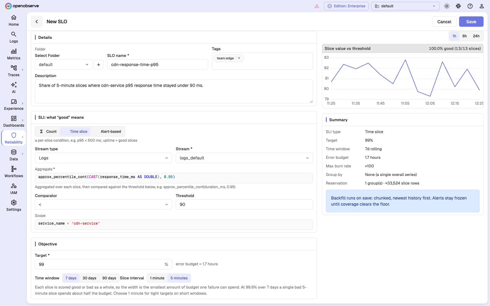
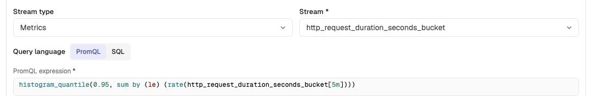

# Time-slice SLOs

A time-slice SLO measures **good slices divided by measured slices**. Instead of
judging individual events, it computes one aggregate per slice, compares it
against a threshold, and scores the whole slice good or bad.

```
per slice:  aggregate(data in this slice)  comparator  threshold   →  good | bad
SLI      =  100 × good slices / measured slices
```

Internally a good slice is stored as its full width in seconds and a bad one as
zero, which is why the burndown chart describes this SLI in seconds. The ratio
is identical either way.

This is the shape most people mean by "uptime": the service was up for 99.5% of
the last 30 days' five-minute periods.



## When to use it

Use a time-slice SLO when "good" is a property of a **period**, not of a row:

- **Latency:** p95 response time under 300 ms.
- **Saturation:** queue depth below 1000, connection pool utilization under 80%.
- **Freshness:** the pipeline's lag below five minutes.
- **Availability from a probe:** the success rate of synthetic checks in each
  five-minute window above 99%.

The tell is that you have to aggregate before you can decide. A percentile does
not exist for a single row.

## Configuration

Select **Time slice** as the SLI type, then choose a stream type and stream.
Logs and traces use SQL. For metrics, use the **Query language** selector to
choose **PromQL** (the default) or **SQL**.

| Field | Required | Meaning |
| --- | --- | --- |
| **Stream type** | Yes | Logs, metrics, or traces. PromQL is available only for metrics. |
| **Stream** | Yes | For SQL, the stream to aggregate. For PromQL, an advisory metrics selection that supplies the **Group by** field list; the expression itself names the metrics to query. |
| **Query language** | Metrics only | PromQL or SQL. The choice changes the expression editor and whether Scope is available. |
| **Aggregate / PromQL expression** | Yes | An expression evaluated once per slice, producing one number per SLO group. |
| **Comparator** | Yes | `<`, `<=`, `>`, or `>=`. |
| **Threshold** | Yes | The number the aggregate is compared against. |
| **Scope** | SQL only | An optional SQL filter applied before aggregating. In PromQL, put label matchers inside the expression. |

The comparator list contains only ordered operators. `=` and `!=` are not
offered, because a slice with no value is a gap rather than a failure, and
equality has no severity direction to fall back on.

### Choosing SQL or PromQL for metrics

Both languages can query a metrics stream, but they operate at different
levels:

| Choose | When |
| --- | --- |
| **PromQL** | You need counter-aware functions, range functions, histogram quantiles, or normal Prometheus label semantics. |
| **SQL** | You want to aggregate the metrics stream's raw `value` rows directly, with an optional SQL scope. |

For example, `avg(value)` is a valid SQL aggregate over a gauge metrics stream.
For a counter rate or histogram quantile, prefer PromQL; SQL over raw counter
samples does not reproduce `rate()` or `increase()` semantics.

### SQL aggregate expressions

The aggregate is a SQL aggregate over the slice's rows:

```sql
-- p95 latency
approx_percentile_cont(CAST(response_time_ms AS DOUBLE), 0.95)

-- p99 latency
approx_percentile_cont(CAST(duration_ms AS DOUBLE), 0.99)

-- mean queue depth
avg(CAST(queue_depth AS DOUBLE))

-- worst case in the slice
max(CAST(lag_seconds AS DOUBLE))

-- success rate inside the slice
100.0 * sum(CASE WHEN status = 'success' THEN 1 ELSE 0 END) / count(*)
```

That last form is worth noticing: it computes a ratio, but scores the slice as a
unit. It is not the same objective as the equivalent [count SLO](count-slos.md)
— see [Time slice or count?](#time-slice-or-count) below.

### PromQL expressions

A PromQL time-slice SLO carries one expression. OpenObserve evaluates it at the
end of every slice, compares the returned value with the stored comparator and
threshold, and then scores the slice. Keep the comparator outside the PromQL
expression so changing the threshold remains an explicit SLO edit.

Some useful shapes for a 5-minute slice:

```promql
# p95 request latency, in seconds
histogram_quantile(
  0.95,
  sum by (le) (rate(http_request_duration_seconds_bucket[5m]))
)

# mean CPU utilization across the whole slice and all returned series
avg(avg_over_time(cpu_utilization_percent[5m]))

# worst five-minute queue depth
max(max_over_time(message_queue_depth[5m]))
```



Use these rules when writing the expression:

- Make each range selector exactly **one slice wide**. For a 5-minute slice,
  use `[5m]`. OpenObserve evaluates PromQL at slice ends, so the sample at time
  T represents `(T − slice interval, T]`. If you change the slice interval,
  update the selectors too.
- Prefer range functions such as `avg_over_time(metric[5m])` over a bare
  instant expression such as `avg(metric)`. The latter measures only the
  slice-ending instant, not the whole slice.
- Reduce an ungrouped SLO to **one series per slice**. For a grouped SLO,
  return one series for each configured group. For example, grouping by
  `region` requires the expression to preserve `region`:

```promql
histogram_quantile(
  0.95,
  sum by (le, region) (rate(http_request_duration_seconds_bucket[5m]))
)
```

OpenObserve does not guess how to combine multiple aggregates. If two series
land on the same slice and SLO group, that slice is rejected and becomes a
coverage gap under the default absence policy; two pod-level p95 values cannot
safely be summed or averaged. The preview warns when an ungrouped expression
returns multiple series. For a grouped expression, it counts the returned
series but cannot validate that their labels map uniquely to the configured SLO
groups. Run the expression in **Metrics**, inspect the output labels, and
aggregate away every label that is not in **Group by**.

PromQL has no separate **Scope** field. Put label matchers directly in the
expression, such as `http_request_duration_seconds_bucket{service_name="api"}`.
OpenObserve parses the expression on save and rejects invalid PromQL before
backfill begins. It deliberately does not try to infer the output labels at
save time.

## SQL worked example

**Goal:** the CDN should keep p95 response time under 90 ms in at least 99% of
five-minute periods over a rolling 7 days.

| Setting | Value |
| --- | --- |
| SLI type | Time slice |
| Stream | `logs_default` (logs) |
| Aggregate | `approx_percentile_cont(CAST(response_time_ms AS DOUBLE), 0.95)` |
| Comparator | `<` |
| Threshold | `90` |
| Scope | `service_name = 'cdn-service'` |
| Target | 99% |
| Time window | 7 days |
| Slice interval | 5 minutes |

A 7-day window at 5-minute slices holds 2,016 slices. A 99% target permits about
20 bad slices — roughly 1.7 hours — before the budget is gone.

The preview panel plots each slice's aggregate against the threshold line and
reports how many slices were good, plus how many produced no data at all.

## PromQL worked example

**Goal:** p95 request latency should stay below 300 ms in at least 99% of
five-minute periods over a rolling 7 days.

| Setting | Value |
| --- | --- |
| SLI type | Time slice |
| Stream | `http_request_duration_seconds_bucket` (metrics) |
| Query language | PromQL |
| PromQL expression | `histogram_quantile(0.95, sum by (le) (rate(http_request_duration_seconds_bucket[5m])))` |
| Comparator | `<` |
| Threshold | `0.3` |
| Target | 99% |
| Time window | 7 days |
| Slice interval | 5 minutes |

The expression returns seconds, so the 300 ms objective is entered as `0.3`.
For an ungrouped SLO, the preview should show one series. If it reports several,
aggregate the extra labels away or add the intended labels under **Group by**.
For grouped SLOs, verify the label mapping in the Metrics query result because
the preview cannot detect group-label collisions.

## The slice interval is load-bearing here

For a SQL count SLO the slice width is a storage decision. For a PromQL count it
also controls the evaluation grid and range selectors. For a time-slice SLO it
is part of the objective.

A whole slice is scored good or bad, so **the slice width is the smallest amount
of budget a single failure can spend**. At a 99.9% target over 7 days the entire
budget is about 10 minutes — so one bad 5-minute slice spends half of it, and
two bad slices blow it completely.

Rule of thumb:

- **Tight target on a short window** (99.9% over 7 days) — use **1-minute**
  slices, or the objective is unmeasurable in practice.
- **Looser target, or a long window** (99% over 30 days) — **5-minute** slices
  are fine and cost a fifth of the storage.

Grouped SLOs are pinned to 5-minute slices, which is another reason to keep
tight-target time-slice SLOs ungrouped.

## Gaps versus failures

A slice that the query never measured — because the search failed, the SLO was
paused, or the measurement job was down — is a **gap**. It lowers coverage and
counts toward neither the numerator nor the denominator.

By default, a slice where the query **succeeded but returned nothing** is also
treated as a gap. That is the right default for a latency SLO: no traffic means
no latency to judge, not slow latency.

It is the wrong default for a **freshness** SLO, where silence *is* the failure.
For that case the API accepts an `absent_is_bad` flag on the time-slice
configuration, which makes a proved-empty slice score **bad** rather than
missing:

```json
{
  "name": "ingest-pipeline-freshness",
  "sli_type": "time_slice",
  "config": {
    "stream": "logs_default",
    "stream_type": "logs",
    "query_language": "sql",
    "query": "count(*)",
    "scope": "service_name = 'stream-ingest-service'",
    "comparator": ">",
    "threshold": 0,
    "absent_is_bad": true
  },
  "window_secs": 604800,
  "slice_interval_secs": 300,
  "target": 99,
  "enabled": true
}
```

Notes on `absent_is_bad`:

- It is an API-only field; the SLO form does not expose it.
- It only changes the meaning of a **successful** query's empty result. A
  *failed* query still writes nothing, so a search outage still reduces coverage
  and freezes the SLO instead of manufacturing failures.
- It cannot be combined with grouping. A group absent from an entire pass cannot
  be gap-filled, so a grouped freshness SLO would freeze for exactly the failure
  it is meant to catch. The API rejects the combination.

For PromQL, remember the Prometheus lookback window: a bare gauge can continue
returning its last value for several minutes after it stops reporting. Use a
slice-wide range expression such as `avg_over_time(metric[5m])` so a slice with
no samples returns no value. If absence must spend budget, create the SLO with
`absent_is_bad: true` through the API; without that flag, the empty slice is a
gap and lowers coverage instead.

## Time slice or count?

Both can express "the service was 99.9% available", and they will disagree. The
difference is what a burst of errors costs you.

Suppose one five-minute slice sees 10,000 requests and 500 of them fail, and the
rest of the week is clean.

- A **count SLO** over 7 days with roughly 20 million requests records a
  0.0025% error rate. Barely a scratch.
- A **time-slice SLO** records one bad slice out of 2,016 — 0.05% of the window
  — which at a 99.9% target is half the budget.

Neither is wrong. They answer different questions:

| Ask | Use |
| --- | --- |
| What fraction of *requests* failed? | Count |
| What fraction of *time* was the service degraded? | Time slice |

High-traffic user-facing services usually want the count form, because it
weighs failures by how many people saw them. Infrastructure with steady, low, or
bursty volume usually wants the time-slice form, because a count SLO there is
dominated by whichever hour happened to be busy.

## Next steps

- [Count SLOs](count-slos.md)
- [Alert-based SLOs](alert-based-slos.md)
- [Alerting on SLOs](slo-alerts.md)
