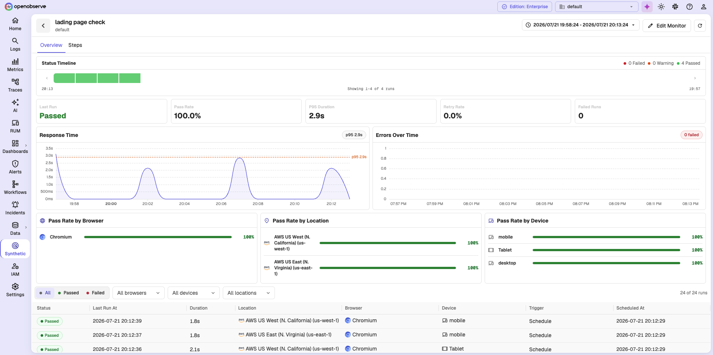
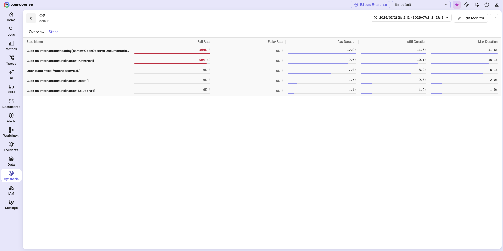
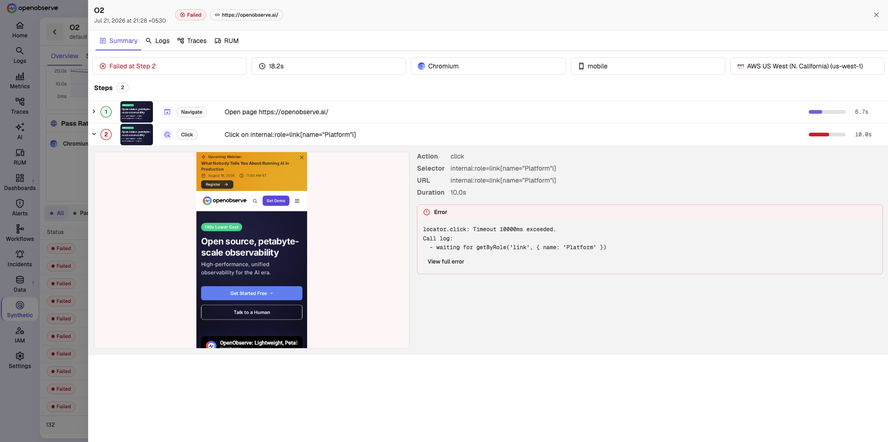

# Analyze Check Results

Use this guide to review how a synthetic check has behaved over time, find the runs that failed, and inspect the step that broke.

> Visit the [Synthetic Monitoring in OpenObserve](https://openobserve.ai/docs/user-guide/analytics/synthetics/synthetic-monitoring-in-openobserve/) page before starting. It explains the concepts used in this guide.

!!! info "Availability"
    This feature is available only in Enterprise Edition and Cloud.

## Prerequisites

- A synthetic check exists and has completed at least one run.
- You have permissions to work with synthetic checks. Access is controlled from IAM > Roles > Permissions.

## Open the results

1. In the left navigation panel, select **Synthetic**.
2. Select the check you want to review.

The results page for the check opens, with the check name in the header. Use the time range picker in the header to change the window, the refresh button to reload, and **Edit Monitor** to change the check.

## Overview tab

The **Overview** tab summarizes the selected time range.

**Status Timeline**

At the top of the tab, one block per run shows the sequence of results, with a count of failed, warning, and passed runs. Use the arrows on either side to page through longer histories.

**Key metrics**

| Tile | Description |
| --- | --- |
| **Last Run** | The status of the most recent run, such as Passed or Failed. |
| **Pass Rate** | The share of executions that passed. |
| **P95 Duration** | The 95th percentile response time. |
| **Retry Rate** | How often runs needed a retry. A high value indicates a flaky target. |
| **Failed Runs** | The number of runs that failed. |

**Charts**

- **Response Time** over the selected range, with the p95 marked.
- **Errors Over Time**, with the failure count for the range.
- **Pass Rate by Browser**, **by Location**, and **by Device**, which show whether a problem is isolated to one dimension.

**Runs table**

At the bottom, one row per execution, with columns **Status**, **Last Run At**, **Duration**, **Location**, **Browser**, **Device**, **Trigger**, and **Scheduled At**. Filter it by status, browser, device, and location using the controls above it.

When runs have failed, an **Error patterns** table also appears, grouping failures by error so you can see which one dominates.

!!! note "Reading Pass Rate by Location"
    When a check passes everywhere except one location, investigate the network path and that region before the target. When it fails at every location, investigate the target.

## Steps tab

The **Steps** tab analyzes each journey step across all runs in the range. If the range contains no completed runs, it reads **No step data for the selected time range**.

| Column | Description |
| --- | --- |
| **Step Name** | The step in the journey. |
| **Fail Rate** | How often the step failed. |
| **Flaky Rate** | How often the step failed on an earlier attempt but passed on the last one. |
| **Avg**, **p95**, **Max Duration** | How long the step took. |

Use this tab to find the one step in a long journey that is responsible for most failures.

## Run detail

Select a run in the runs table to open the run detail. It opens as a panel over the results page, headed by the check name, the run time, the run status, and the URL.

The **Summary** tab opens on a row of tiles naming the outcome, such as **Failed at Step 2**, along with the run duration, browser, device, and location.

Below that is the step list. Each step shows its number, action, description, a screenshot thumbnail, and a duration bar. A green number marks a step that passed and a red one marks the step that failed.

Expand a step to see:

- The screenshot captured at that point, according to the **Capture** setting on the check. Select it to open it full size.
- The step's **Action**, **Selector**, **URL**, and **Duration**.
- For a failing step, an **Error** panel with the message and call log, plus **View full error** for the complete text.

!!! note "Reading a step error"
    A timeout error names the selector it was waiting for, as in `locator.click: Timeout 10000ms exceeded` followed by the element it could not find. Check whether the page changed and the recorded selector stopped matching before you conclude the site is down.

!!! note "Screenshots depend on the Capture setting"
    A check with **Capture** set to **Off** records no screenshots. Set it to **On fail** or **Always** if you want screenshots to review here.

## Where results are stored

Every execution writes one record to the `synthetics_results` stream, keyed by an execution ID. One record represents one run, at one location, for one browser and device combination.

OpenObserve keeps screenshots and traces in object storage and serves them through the results page, so you do not need to reach them directly.

## Related Links

- [Synthetic Monitoring in OpenObserve](synthetic-monitoring-in-openobserve.md)
- [Create a Browser Check](create-a-browser-check.md)

**Need help:**

  [Community Slack](https://short.openobserve.ai/community)
  
  [GitHub issues](https://github.com/openobserve/openobserve/issues)
