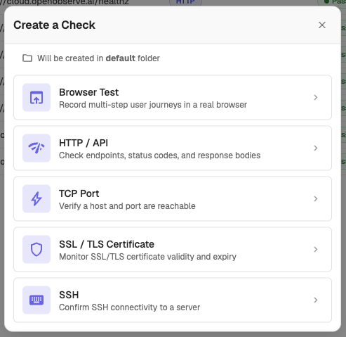
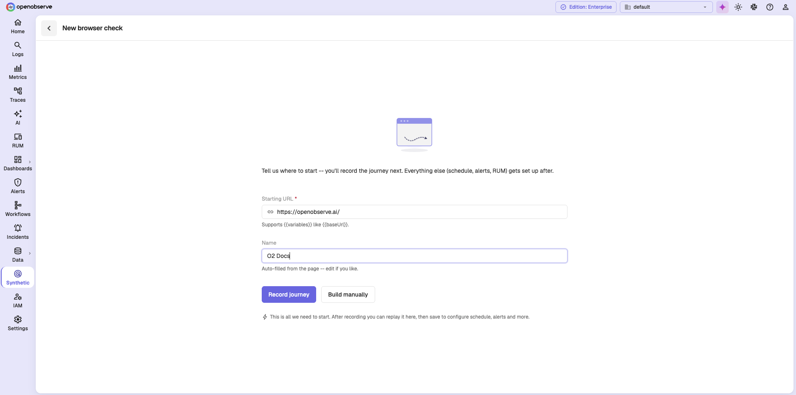
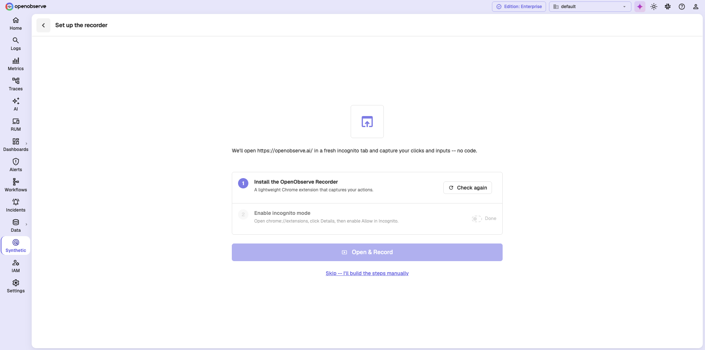
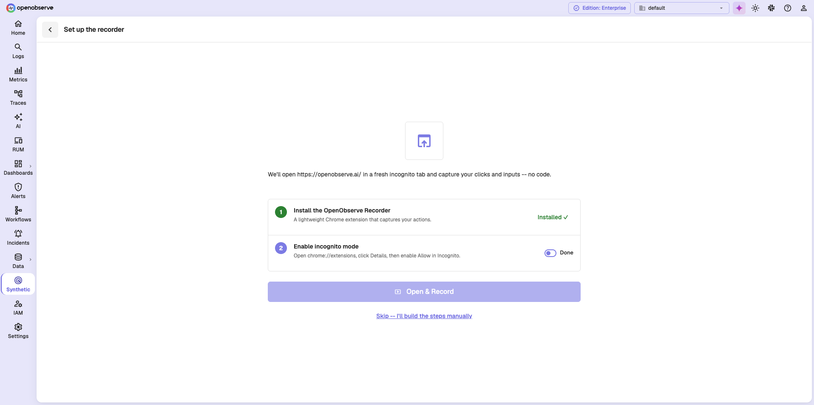
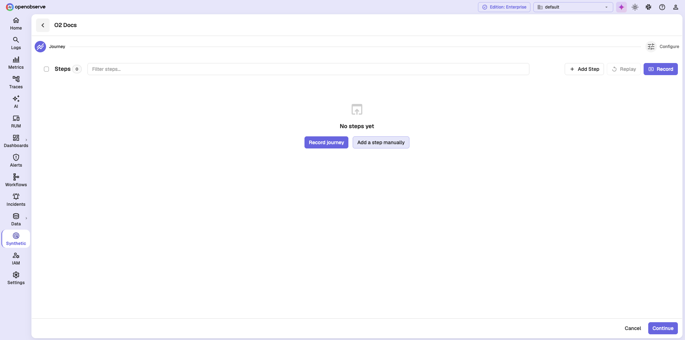
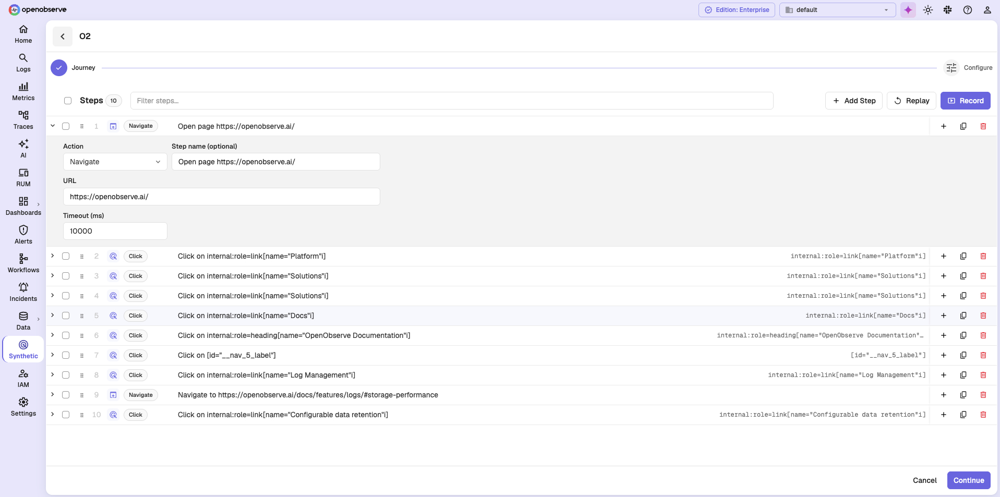
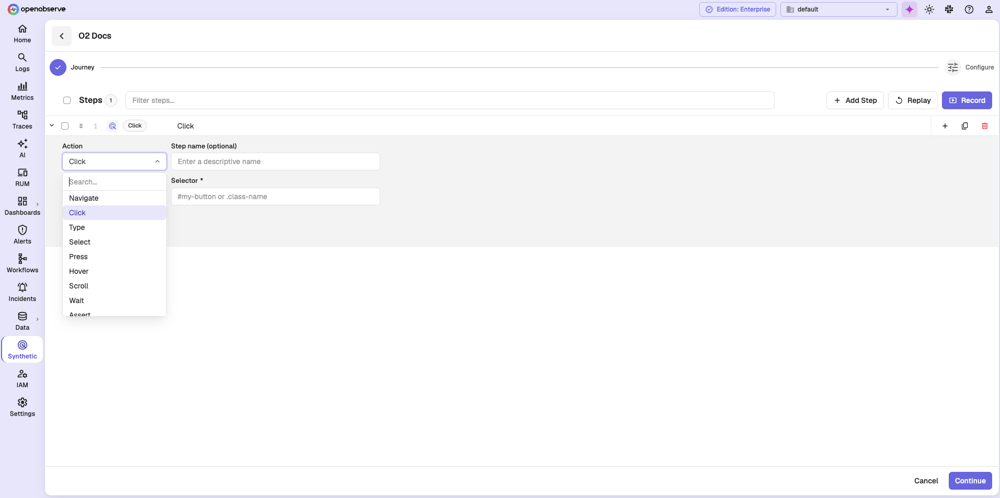
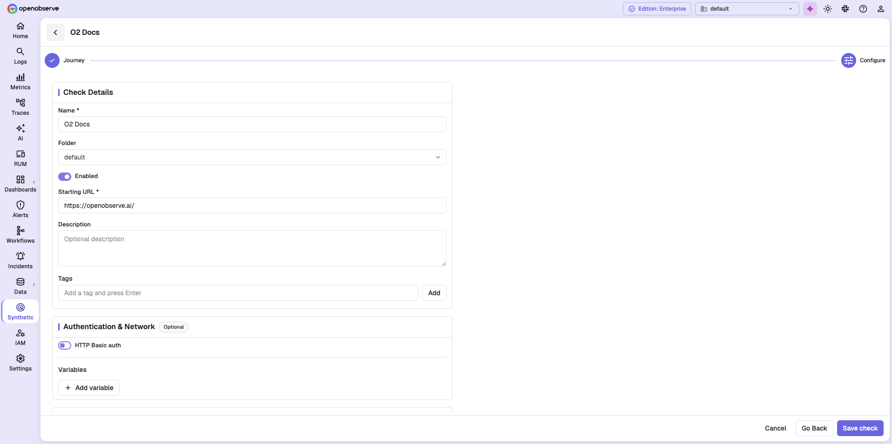
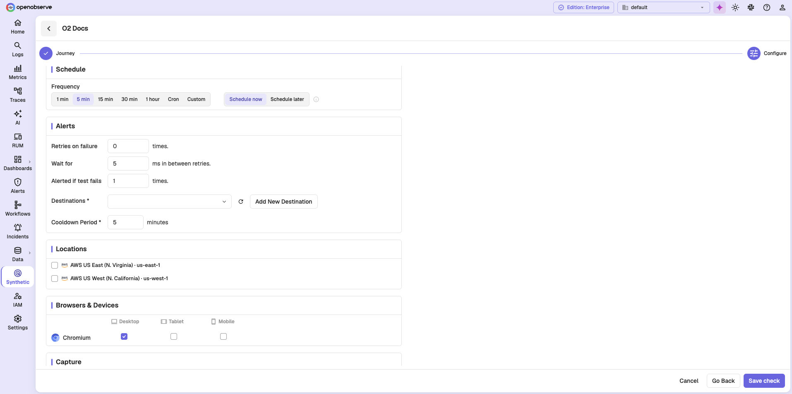

# Create a Browser Check

Use this guide to create a **Browser Test**. A browser check replays a multi-step user journey in a real browser from your selected locations, and reports where the journey broke.

> Visit the [Synthetic Monitoring in OpenObserve](https://openobserve.ai/docs/user-guide/analytics/synthetics/synthetic-monitoring-in-openobserve/) page before starting. It explains the concepts used in this guide.

!!! info "Availability"
    This feature is available only in Enterprise Edition and Cloud.

## Prerequisites

- Your OpenObserve Cloud or self-hosted instance is running.
- You have permissions to work with synthetic checks. Access is controlled from IAM > Roles > Permissions.
- At least one location is registered on the deployment.
- To record a journey rather than build it by hand, install the **OpenObserve Recorder** Chrome extension and allow it in incognito mode.

## Steps to create a browser check

??? "Step 1: Start a new browser check"
    ### Step 1: Start a new browser check
    1. Log in to OpenObserve.
    2. In the left navigation panel, select **Synthetic**.
    3. Click **New Check** at the top-right corner. The **Create a Check** dialog opens and shows the folder the check will be created in.
    
    4. Select **Browser Test**.
    5. On the **New browser check** screen, enter the **Starting URL**. It must begin with `http://` or `https://`, and it accepts `{{variable}}` placeholders.
    6. Enter a **Name**, or leave it to be filled in from the page title.
    
    7. Choose how to build the journey:

        - **Record journey**: capture the steps by using the site.
        - **Build manually**: add each step yourself in the editor.

    Both buttons stay disabled until the starting URL is valid.

    !!! note "Creating your first check"
        When the organization has no checks yet, the empty **Synthetic Checks** page shows the check types as cards. You can select **Browser Test** there instead of opening the dialog.

??? "Step 2: Set up the recorder"
    ### Step 2: Set up the recorder

    This screen appears only when the OpenObserve Recorder extension is not detected. It confirms that OpenObserve will open your starting URL in a fresh incognito tab and capture your clicks and inputs, with no code to write.

    

    1. Under **Install the OpenObserve Recorder**, install the Chrome extension, then click **Check again**. The step turns green and reads **Installed** once it is detected.
    2. Under **Enable incognito mode**, open `chrome://extensions`, click **Details** on the extension, and enable **Allow in Incognito**. Then turn on the **Done** toggle.

    

    3. Click **Open & Record** to start recording, or select **Skip -- I'll build the steps manually**.

    !!! note "Recording runs in incognito"
        Recording and replay open a separate incognito window, which is why the extension must be allowed in incognito mode. The extension replays the journey on your own machine, not from a probe location.

??? "Step 3: Build the journey"
    ### Step 3: Build the journey

    The editor opens on the **Journey** stage. If you skipped recording, the step list is empty and offers **Record journey** and **Add a step manually**.

    

    Use the toolbar to work on the journey:

    - **Add Step** appends an empty step for you to fill in.
    - **Record** reopens the recorder to capture more steps.
    - **Replay** runs the journey on your own machine, so you can watch it work before saving.
    - Use **Filter steps** once the list grows long.

    A recorded journey arrives as a numbered list, with a generated step name and the captured selector on each row. Drag a row to reorder it, or use the row buttons to insert, duplicate, or delete a step.

    

    Expand a step to edit it. Each step has an **Action**, an optional **Step name**, a **Timeout (ms)** that defaults to `10000`, and, depending on the action, a **Selector** or a value field such as **URL**.

    

    These are the actions available, and what each one needs:

    | Action | Value field | Needs a selector |
    | --- | --- | --- |
    | Navigate | URL | No |
    | Click | None | Yes |
    | Type | Text to type | Yes |
    | Select | Option | Yes |
    | Press | Key | No |
    | Hover | None | Yes |
    | Scroll | To (px or selector) | No |
    | Wait | Duration (ms) | No |
    | Assert | Expected | Yes |
    | Screenshot | None | No |

    The selector type defaults to **CSS**, and you can switch it to **XPath**, **Text**, **TestID**, or **Role**.

    Click **Continue** when the journey is complete.

    !!! note "Journey rules"
        - The journey must contain at least one step, and the **first step must be Navigate**. The probe opens a blank page and never navigates on its own.
        - A journey can contain up to 50 steps.
        - Each step timeout must be between 100 ms and 60000 ms.

??? "Step 4: Configure the check"
    ### Step 4: Configure the check

    Click **Configure** at the top right, or **Continue** at the bottom, to move to the configuration stage. Use **Go Back** to return to the journey.

    

    **Check Details**

    | Field | Description |
    | --- | --- |
    | **Name** | Required. |
    | **Folder** | Defaults to **default**. |
    | **Enabled** | Enabled by default. |
    | **Starting URL** | The URL the journey begins at. |
    | **Description** | Optional free text. |
    | **Tags** | Optional labels. Type a tag and press **Enter**, or click **Add**. |

    **Authentication & Network**, marked **Optional**

    - Turn on **HTTP Basic auth** and enter a username and password if the site requires it.
    - Click **Add variable** to define a variable as a name and value pair, and turn on the **secure** toggle on a row to mask its value. A check can hold up to 50 variables. Reference one in the starting URL as `{{name}}`.

??? "Step 5: Set the Schedule"
    ### Step 5: Set the Schedule
    1. Select a frequency: **1 min**, **5 min**, **15 min**, **30 min**, **1 hour**, **Cron**, or **Custom**.
        - **Custom** adds a **Repeat every** number and a unit of Minutes, Hours, Days, Weeks, or Months.
        - **Cron** adds a **Cron expression** field. The expression is parsed with a seconds field first, so every five minutes is `0 */5 * * * *`.

            !!! note "Ignore the placeholder"
                The field placeholder shows a five-field expression, `*/5 * * * *`. The server rejects it. Use the six-field form shown above.

    2. Choose **Schedule now** or **Schedule later**. **Schedule later** adds a start date and start time, and is not available for cron schedules.

    

    !!! note "Where the Timezone field appears"
        A **Timezone** list is shown only when you select **Cron**, or when you select **Schedule later** with any other frequency. A preset frequency that starts now does not need one.

    !!! note "Frequency limits"
        A browser check cannot run more often than once per 60 seconds, and its timeout must be shorter than its interval.

??? "Step 6: Configure Alerts"
    ### Step 6: Configure Alerts
    1. Set **Retries on failure**, from 0 to 3. The default is 0.
    2. Set the wait between retries, from 0 to 300. The default is 5.
    3. Set how many consecutive failures trigger a notification, from 1 to 100. The default is 1.
    4. Select one or more **Destinations**. To create one, click **Add New Destination**, which opens the alert destinations page in a new tab.
    5. Set the **Cooldown Period** in minutes, from 0 to 1440. The default is 5.

    !!! note "Important behavior"
        - Only Warning, Failed, and Error runs notify. A passing run never does.
        - One notification is sent per run, not one per location.
        - The wait between retries is labeled in milliseconds but is applied in **seconds**. A value of `300` means five minutes, and the field rejects anything above `300`.
        - The form marks **Destinations** and **Cooldown Period** as required, but neither is enforced. A check with no destination can still be saved, and it will never notify anyone.

??? "Step 7: Select Locations, Browsers, and Devices"
    ### Step 7: Select Locations, Browsers, and Devices

    1. In **Locations**, select one or more locations. Each entry shows the provider, region name, and region code.
    2. In **Browsers & Devices**, tick the combinations to run. The grid lists a row per browser and a column per device, and defaults to Chromium on Desktop.

    !!! note "Which browsers you see"
        The browsers and devices offered are reported by the probe agents serving your locations, so the grid differs between deployments. A deployment whose agents run only Chromium shows a single browser row.

    !!! note "Each combination is a separate execution"
        A check runs once per location per browser and device combination. Three locations and two combinations produce six executions per run, so add combinations deliberately.

        A check can hold up to 12 combinations. The last remaining combination cannot be cleared.

??? "Step 8: Set Capture options"
    ### Step 8: Set Capture options

    In **Capture**, choose when the probe takes screenshots: **Always**, **On fail** (the default), or **Off**.

    Each screenshot appears against its step in the run detail.

??? "Step 9: Save the check"
    ### Step 9: Save the check
    Click **Save check**.

    The form reports a problem if the name is missing, the starting URL is missing or not `http`/`https`, no location is selected, the first step is not **Navigate**, or a step that needs a selector does not have one.

    Confirm that the check appears on the **Synthetic Checks** page and that a result arrives after the first scheduled run.

## Next Steps

- [Analyze Check Results](analyze-check-results.md)

## Related Links

- [Synthetic Monitoring in OpenObserve](synthetic-monitoring-in-openobserve.md)
- [Locations and Probe Agents](locations-and-probe-agents.md)

**Need help:**

  [Community Slack](https://short.openobserve.ai/community)
  
  [GitHub issues](https://github.com/openobserve/openobserve/issues)
