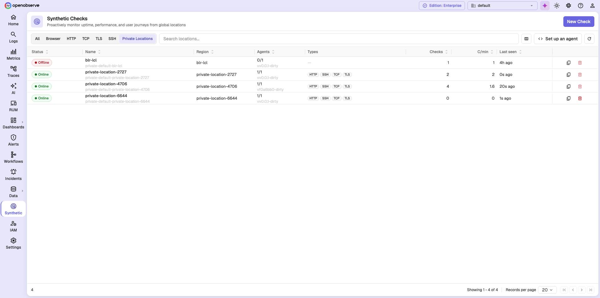

# Locations and Probe Agents

This guide explains where browser checks run from, the difference between public and private locations, and how probe agents serve a private location.

!!! info "Availability"
    Browser checks are available on OpenObserve Cloud and are currently in preview.

## Locations

A location is a place a check runs from. Every check must select at least one location, and each selected location produces its own execution for every run.

Locations are of two kinds:

| Kind | Scope | Who runs the probe |
| --- | --- | --- |
| **Public** | Shared across organizations | OpenObserve |
| **Private** | Your organization only | You, by running probe agents |

Use a private location to check a target that a public location cannot reach, such as an internal service, a staging environment behind a VPN, or a system inside your own data center.

A location record carries a name, a provider (AWS, GCP, Azure, or custom), a region, and an enabled flag. In the check form, locations appear as `{name} · {region}`.

!!! note "At least one location is required"
    A check cannot be created until at least one location is available to select. OpenObserve Cloud provides public locations. To run checks from your own environment, add a private location and connect a probe agent to it.

## View private locations

Open **Synthetic** and select the **Private Locations** tab.

| Column | Description |
| --- | --- |
| **Status** | **Online** or **Offline**, derived from agent heartbeats. |
| **Name** | The location name, with its internal identifier below. |
| **Region** | The region the location represents. |
| **Agents** | How many of the location's agents are reachable, such as `1/1`, with the agent version below. |
| **Types** | The check types the location's agents can run. |
| **Checks** | How many checks currently use the location. |
| **C/min** | Checks executed per minute. |
| **Last seen** | Time since the most recent agent heartbeat. |

!!! note "A location with no live agents is Offline"
    An entry showing `0/1` agents is reported **Offline**, and its **Types** column is empty because no agent is present to declare what it can run. Checks assigned to it will not execute.

## Manage locations

- After a location is created, you can change only its **label** and **enabled** state. The provider, region, and routing key are fixed.
- A location cannot be deleted while a check still references it. Remove it from every check first.
- Disable a location to stop it being used without deleting it.

## Probe agents

You serve a private location by running one or more probe agents in your own environment. Each agent:

1. Registers itself against a location, reporting its name, version, and capabilities.
2. Sends a heartbeat so OpenObserve knows it is alive.
3. Leases jobs for its location, runs them, and acknowledges the results.
4. Uploads artifacts such as screenshots and traces.

An agent's capabilities declare which check types it can run, whether it can send ICMP, and how many checks it runs concurrently. Run more than one agent against a location for high availability.

!!! note "Location health"
    Agents do not report an explicit up or down state. OpenObserve derives liveness from the last heartbeat, and reports a location whose agents have all gone stale as down.

### Agent authentication

OpenObserve issues each organization one probe token, prefixed `o2syn_`. Agents authenticate with this token using HTTP Basic authentication. The token works only on the probe endpoints and grants no access to the rest of the API.

### Set up a probe agent

Click **Set up an agent** on the **Private Locations** tab. OpenObserve walks you through registering the agent and connecting it to a location.

!!! note "Which check types an agent supports"
    An agent advertises the check types it can run, and the location's **Types** column shows them. A location only runs the types its agents support, so confirm the type you need appears there before assigning checks to it.

## Related Links

- [Browser Checks in OpenObserve](synthetic-monitoring-in-openobserve.md)
- [Create a Browser Check](create-a-browser-check.md)

**Need help:**

  [Community Slack](https://short.openobserve.ai/community)
  
  [GitHub issues](https://github.com/openobserve/openobserve/issues)
