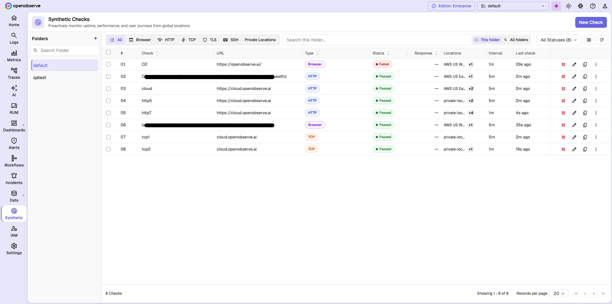
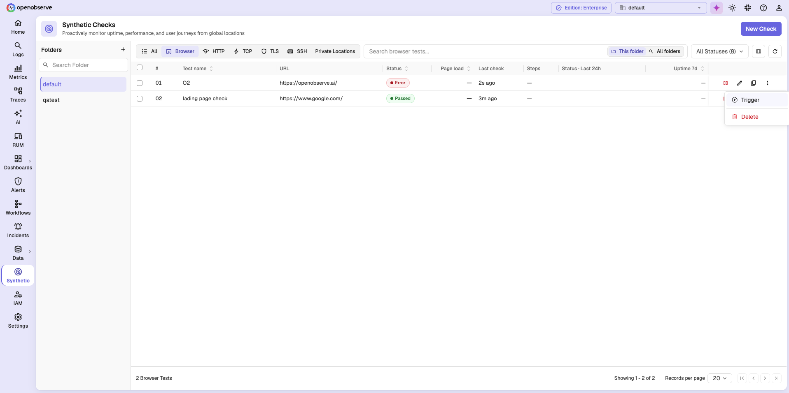

# Synthetic Monitoring in OpenObserve

This guide explains what synthetic browser checks are and the concepts used when you create and analyze them.

!!! info "Availability"
    This feature is available only in Enterprise Edition and Cloud.

## What is Synthetic Monitoring

Synthetic monitoring runs scripted checks against a target on a schedule, from one or more probe locations. Unlike monitoring that waits for real user traffic, synthetic checks generate their own traffic, so you learn about an outage as soon as it happens.

Each execution of a check records a status, a response time, and per-step results for the journey it replayed.

## How to access Synthetic Monitoring

1. Sign in to OpenObserve.
2. Select the desired organization from the top navigation bar.
3. In the left navigation panel, select **Synthetic**.

The **Synthetic Checks** page opens. Each row shows the check name, its URL, type, status, locations, interval, and when it last ran, along with actions to pause, edit, duplicate, and delete it.

Checks are organized in folders. Use the **Folders** sidebar to browse a folder, and switch between **This folder** and **All folders** to widen the search. The tabs across the top filter by check type, and **All Statuses** filters by result.

Select the **Browser** tab to see columns specific to browser checks: **Test name**, **URL**, **Status**, **Page load**, **Last check**, **Steps**, **Status · Last 24h**, and **Uptime 7d**.

Each row has actions to pause, edit, and duplicate the check. The **⋮** menu adds **Trigger**, which runs the check immediately instead of waiting for its schedule, and **Delete**.

!!! note "Private Locations"
    The **Private Locations** tab on this page is where you manage the locations your own probe agents serve. See [Locations and Probe Agents](locations-and-probe-agents.md).

## Browser checks

A **Browser Test** replays a multi-step user journey in a real browser, across the browser and device combinations you select. You record the journey with a Chrome extension or build it step by step, then OpenObserve replays it on a schedule from each location you choose.

OpenObserve times every step and lets you assert on it, so a failure names the step that broke instead of reporting only that the site is down.

## Scheduling

Each check runs on a frequency you choose:

- Presets: **1 min**, **5 min** (default), **15 min**, **30 min**, **1 hour**.
- **Custom**: repeat every *n* minutes, hours, days, weeks, or months.
- **Cron**: a cron expression. The expression is parsed with a seconds field first, so every five minutes is `0 */5 * * * *`, not `*/5 * * * *`.

!!! note "Ignore the cron placeholder"
    The **Cron expression** field shows a five-field placeholder, `*/5 * * * *`. The server rejects it. Use the six-field form.

You also choose whether the check starts immediately (**Schedule now**) or at a date and time you set (**Schedule later**). A **Timezone** list appears when you choose **Cron**, or **Schedule later** with any other frequency.

!!! note "Scheduling limits"
    - A browser check cannot run more often than once per 60 seconds.
    - The scheduler ticks every 5 seconds, so intervals shorter than 5 seconds run at tick resolution rather than at the exact interval.
    - A browser check timeout must be shorter than its interval.
    - A **Schedule later** start time cannot be in the past.

## Locations

Every check runs from at least one location. Locations are either:

- **Public**: operated by OpenObserve, shared across organizations.
- **Private**: registered by your organization and served by probe agents you run.

A check cannot be saved without a location, and a location cannot be deleted while a check still references it. For details, see [Locations and Probe Agents](locations-and-probe-agents.md).

## Assertions

Assertions define what a passing result looks like. In a browser check, you assert by adding an `assert` step to the journey at the point you want to verify, with a selector for the element and the value you expect.

A failing assertion fails the step, which fails the run and identifies the step that broke.

## Statuses

| Status | Meaning |
| --- | --- |
| **Passed** | All steps passed on the first attempt. |
| **Warning** | The check passed, but only after a retry. The target is flaky. |
| **Failed** | Every attempt failed. The target is down. |
| **Error** | The probe infrastructure failed, so the target could not be checked. This is different from **Failed**: the result says nothing about the health of the target. |
| **Unknown** | No result has been recorded yet. |

## Alerting

Alerting settings live in the **Alerts** section of the check form:

| Setting | Default | Range |
| --- | --- | --- |
| Retries on failure | 0 | 0 to 3 |
| Wait between retries | 5 | 0 to 300 seconds |
| Alert after the check fails *n* times | 1 | 1 to 100 |
| Destinations | none | one or more alert destinations |
| Cooldown period | 5 minutes | 0 to 1440 minutes |

Notifications reuse the standard alert destinations: email, SNS, and HTTP webhook. Each notification includes the monitor, the target, the status, the locations checked, the error, and a link back to the results page.

!!! note "Important behavior"
    - A notification is sent once per run, not once per location.
    - Passing runs never notify. Only Warning, Failed, and Error runs do.
    - The interface labels the retry wait in milliseconds, but the value is applied in **seconds**. A value of `300` means five minutes, and the field rejects anything above `300`.
    - The form marks **Destinations** and **Cooldown Period** as required, but neither is enforced. A check with no destination can still be saved, and it will never notify anyone. Add a destination if you want to be notified.

## Results

Every execution writes one record to the `synthetics_results` stream. An execution is one run, at one location, for one browser and device combination, so a single run of a browser check across three locations and two combinations produces six records.

Results are explored from the check's results page rather than from the stream directly. See [Analyze Check Results](analyze-check-results.md).

## Limits

| Item | Limit |
| --- | --- |
| Name | 256 characters |
| Description | 4096 characters |
| Tags | 20 tags, 64 characters each |
| Variables | 50 per check; names must start with a letter or underscore and contain only letters, digits, and underscores |
| Journey steps | 50 steps per browser check |
| Browser and device combinations | 12 per check. The browsers and devices actually offered are reported by the probe agents serving your locations. |
| Locations | at least 1, no duplicates |

## Next Steps

- [Create a Browser Check](create-a-browser-check.md)

## Related Links

- [Locations and Probe Agents](locations-and-probe-agents.md)
- [Analyze Check Results](analyze-check-results.md)
- [Alert Destinations](../../account-administration/management/alert-destinations.md)

**Need help:**

  [Community Slack](https://short.openobserve.ai/community)
  
  [GitHub issues](https://github.com/openobserve/openobserve/issues)
