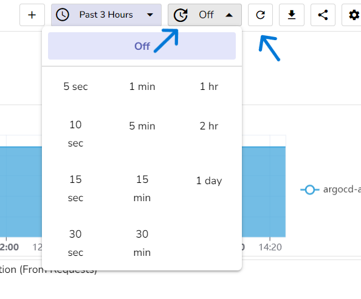
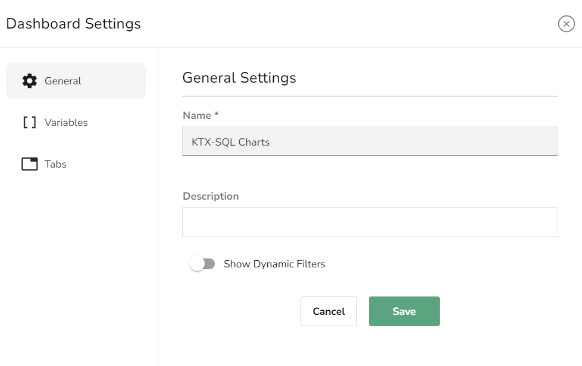
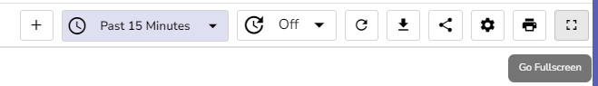

# Building Dashboards

To start building a custom dashboard from scratch in OpenObserve, follow these steps:

## Before You Begin
Confirm that the data streams you want to visualize in your dashboard are already set up in OpenObserve. Refer to the [Ingestion User](https://openobserve.ai/docs/user-guide/ingestion/) Guide if you need help ingesting a new data stream.

## 1: Creating a New Dashboard
- Click on the "Dashboards" section in the left-side menu of OpenObserve.
- Select "New Dashboard" to create a new dashboard.

- 

- Provide a name and description, and choose the desired folder. Click “Save” to create an empty dashboard.

- 

- You can either use the Default folder or create new folders to categorize your dashboards by project or team.

## 2: Creating a Folder
- Click on the "New Folder" button.

- 

- Enter the desired name for the folder.

- 

- Optionally, you can edit the folder name or delete the folder from the folder list.
- Provide the **Name of your panel** in the panel header.
- Click **Save** to finalize.

## 3: Adding and Configuring Panels
- On the empty dashboard, click "Add Panel" to start adding panels.
- Select **Stream**: In the panel configuration window, choose the desired data stream and its type from which you want to visualize metrics or logs.

- After selecting the stream, you will see all available fields for that log/metric stream.
- Assign fields to axes: Start by adding one or more fields to the X-axis (rows) and Y-axis (columns) that you wish to visualize.
- Select a suitable visualization **Chart Type**, such as bar chart, line chart, or pie chart.

- Click **Apply** to preview and apply changes.

## 4: Saving and Managing Dashboards

### Adding More Panels
- Click the **+ icon** in the dashboard header.

- Repeat the panel configuration steps as needed.

### Exporting a Dashboard
To share a dashboard, simply:
- Click the **Export** button.
- Save the dashboard as a JSON file.

### Importing a Dashboard
There are three ways to import a dashboard:

1. Import Dashboard from exported JSON file.
2. Import Dashboard from URL.
3. Import Dashboard from JSON.

### Move Dashboard to Another Folder
You can easily move a dashboard to another folder:

- Select the dashboard you want to move.
- 

- Choose the destination folder.
- 

### Duplicate Dashboard
Create a copy of an existing dashboard for minor modifications.

- 

### Delete Dashboard
- To remove a dashboard, select the dashboard and delete it.

- 

### Tabs
- Tabs are used to group related panels together, enhancing navigation.
- 

### Managing Tabs:
- Edit tab names, delete tabs, or change the sequence from settings.

### Date-Time
Choose between relative or absolute time and select the desired time zone.
- 

### Refresh
You can manually or automatically refresh all your dashboard panels as per your use case.
- 

### Sharing Dashboards
To share a dashboard link:
- Click the **Share** button.
- Copy and share the link with colleagues.

> **Note**: The shared link includes both absolute and relative time, ensuring seamless collaboration.

### Dashboard Settings

#### General Settings:
- Edit dashboard name and description.
- Toggle dynamic filters on/off.

#### Variables:
- Add variables to enhance dashboard functionality.

#### Tabs:
- Add, edit, or delete tabs to organize your dashboard.

### Print Dashboard
To print dashboard panels:
- Access the print settings via the URL.
- Customize print options as needed.

### Full-Screen Mode
To view all dashboard panels in full-screen mode:
- Click the **Full Screen** button.
- Explore your dashboard without distractions.

## 5. Dashboard Optimization: Caching Mechanism and Enhancements

### Caching Mechanism for Dashboard
A caching mechanism stores dashboard data while navigating between different views. This reduces unwanted API calls and improves loading times when users return to the dashboard.

> **Note**: When cached data is used on the dashboard, a warning is displayed if the cached data's time range differs from the currently selected time range. This ensures users are aware when they are viewing potentially outdated data and can refresh as needed.

### Last Refreshed Time
Each panel displays the last refreshed time, ensuring you know how recent the data is and whether a refresh is needed.

