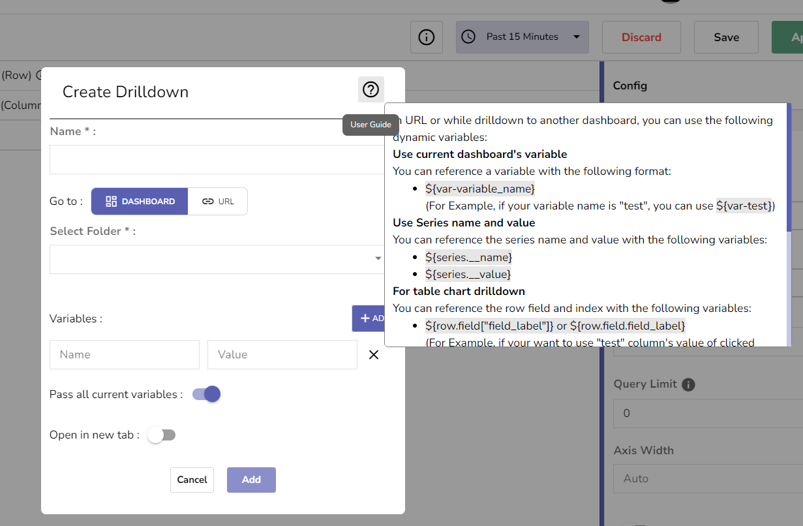

# Managing Panels

This section covers all essential features related to managing panels, from basic editing to advanced querying.

## Edit Panel

### Steps to Edit a Panel:
- Select the panel you want to edit.
- Click the **Edit** icon (pencil) in the top-right corner of the panel.
- Modify the query, choose different chart types, and adjust the panel's appearance using options like legends, axis settings, and drill-down features.
- Once the changes are made, click **Apply** to save them.

## Config Panel

The **Config Panel** allows you to fine-tune the display of your data and adjust various panel options, including legends, units, and axis properties.

### Description

This section allows users to customize panel-based descriptions.

### Show Legend
- Toggle to display or hide the legend.
- Default is **True**.

#### Legend Position:
Choose between three positions:
- **Auto**: Placed at the bottom by default.
- **Right**: Positioned on the right of the chart.
- **Bottom**: Positioned below the chart.

#### Legend Width:
Specify the legend's width or leave it blank for automatic adjustment.

#### Legend Width Unit:
Define the unit for legend width (e.g., %, px).

#### Units:
Select default units for chart values (e.g., Bytes, Seconds, Percent).

#### Decimals:
Set the number of decimal places for data values. Defaults to 2 decimal places if not specified.

### BaseMap Type (for geomaps):
Choose a base map layer for geographic visualizations. Currently, one base map type is available.

### Initial View
Specific to geomap chart type, displaying the current longitude and latitude of the map center along with the zoom level.

### Symbol Size
Set the symbol size based on value or choose a fixed size.

#### By Value:
- Set minimum and maximum symbol size.

#### Fixed:
- All data points have the same symbol size.

### Layer Type
Geomaps support showing multiple layers. Each layer determines how you visualize geospatial data on top of the base map.

> **Note**: There are two map layer types to choose from in a geomap. By default, **Scatter** type will be selected.
- **Scatter**: Renders a marker at each data point.
- **Heatmap**: Visualizes a heatmap of the data.

### Weight
Set the weight field or configure it from the config panel for geomap rendering. Defaults to 1 if not selected.

## Query

Configure multi-query options for geo maps and PromQL.

### Query Limit
Define the limit for query results.

### PromQL Legend
Specify the legend name for PromQL queries.

### Gauge Min/Max Value
Set minimum and maximum values for gauge chart display.

### Axis Width
Set a fixed width of the axis. By default, it dynamically calculates the width of an axis.

> **Note**: By setting the width of the axis, data with different axis types can share the same display proportions. This setting makes it easier to compare multiple graphs, as the axes will not shift or stretch in proximity to each other.

### Show Axis Border
Set the axis border line visibility. By default, it will be off.

- **On**: Always show border lines.
- **Off**: Never show border lines.

## Drill Down

The **Drill Down** feature allows users to navigate from a generalized view to a more specific one, enabling deeper exploration of data. This feature is particularly useful when diving into specific data points or dashboard details.

### Use Cases:
- Transition to another dashboard or provided link.
- Moving from a generalized panel to a more specific one.

#### Example:
Suppose there's a panel displaying CPU utilization across various nodes. If users wish to examine the CPU utilization of a single node and its associated pods, they can utilize the drill-down feature.

### How to Use It?

1. **Edit Panel**: Access the panel where you want to incorporate drill-down functionality.
2. **Add Drill Down**: Navigate to the config panel and click on "Add Drill Down."

We have two options:
- **Go to Another Dashboard**
- **Go to Specified URL**

#### Go to Another Dashboard:
- Select the target dashboard, folder, and tab.
- Utilize variables such as current series name, value, and dashboard variables in the URL using `${series.__name}`.
- Pass variables as query parameters to the target dashboard.
- Option to pass all current variables to the target dashboard.

> **Note**: Users can refer to the user guide for a comprehensive list of available variables. The drill-down feature enhances dashboard interactivity, allowing seamless navigation between different levels of data granularity.

#### Go to Specified URL:
- Insert the URL to which users will be directed.
- Similar to the dashboard option, users can utilize current state variables in the URL.

### MarkLines

The **MarkLines** feature enables users to display threshold lines on charts, enhancing data visualization. This feature requires the following three fields:

#### Fields

1. **Type**: Specifies the attribute of the threshold line.
2. **Label**: Provides a descriptive label for the threshold line.
3. **Value**: Represents the numerical value at which the threshold line should be positioned, based on the selected Type.

### Connect Null Values
Toggle option to connect null values in the data on the chart.

## Chart Types

OpenObserve supports a variety of chart types to visualize your data. Each chart type is suited for different use cases:

| Chart Type              | Description                                                                                                              | Plot Data Combinations            | Configuration Options                                                                                                                                               |
|-------------------------|--------------------------------------------------------------------------------------------------------------------------|-----------------------------------|--------------------------------------------------------------------------------------------------------------------------------------------------------------------|
| **Area Chart**           | Trend visualization. Displays data as continuous lines with filled-in areas below. Ideal for illustrating trends.         | x-1, y-1, x-2, y-1                | Description, Show Legend, Legend Positions, Unit, Decimals, Query Limit, Connect null values, Axis Width, Show Axis Border, Drill Down                             |
| **Area Stacked Chart**   | Stack multiple area series to illustrate cumulative contributions.                                                       | x-2, y-1                          | Description, Show Legend, Legend Positions, Unit, Decimals, Query Limit, Connect null values, Axis Width, Show Axis Border, Drill Down                             |
| **Bar Chart**            | Represents data using rectangular bars for comparing categories.                                                         | x-1, y-1, x-2, y-1                | Description, Show Legend, Legend Positions, Unit, Decimals, Query Limit, Axis Width, Show Axis Border, Drill Down                                                   |
| **Horizontal Bar Chart** | Displays horizontal bars, especially useful for long category names.                                                     | x-1, y-1, x-2, y-1                | Description, Show Legend, Legend Positions, Unit, Decimals, Query Limit, Axis Width, Show Axis Border, Drill Down                                                   |
| **Line Chart**           | Plots data as points connected by straight lines. Ideal for illustrating trends.                                         | x-1, y-1, x-2, y-1                | Description, Show Legend, Legend Positions, Unit, Decimals, Query Limit, Connect null values, Axis Width, Show Axis Border, Drill Down                             |
| **Scatter Chart**        | Shows individual data points as markers, perfect for visualizing correlations or clusters.                               | x-1, y-1, x-2, y-1                | Description, Show Legend, Legend Positions, Unit, Decimals, Query Limit, Axis Width, Show Axis Border, Drill Down                                                   |
| **Stacked Chart**        | Groups data into categories and stacks values to show cumulative contributions.                                          | x-2, y-1                          | Description, Show Legend, Legend Positions, Unit, Decimals, Query Limit, Axis Width, Show Axis Border, Drill Down                                                   |
| **H-Stacked Chart**      | Displays cumulative values with horizontal bars for more clarity with long category names.                                | x-1, y-2                          | Description, Show Legend, Legend Positions, Unit, Decimals, Query Limit, Axis Width, Show Axis Border, Drill Down                                                   |
| **HeatMap**              | Represents data values as colors within a grid. Useful for identifying patterns and concentrations of values.             | x-1, y-1, z-1                     | Description, Unit, Decimals, Query Limit, Axis Width, Show Axis Border, Drill Down                                                                                  |
| **GeoMap**               | Displays data spatially on a geographic map, visualizing patterns distributed across geographic locations.               | lat-1, lon-1, w-o or lat-1, lon-1 | Description, Unit, Decimals, Base Map, Initial View, Symbol Size, Query Limit, Layer Type, Weight                                                                   |
| **Pie Chart**            | Divides a circle into slices to represent data proportions.                                                              | x-1, y-1                          | Description, Show Legend, Legend Positions, Unit, Decimals, Query Limit, Drill Down                                                                                 |
| **Donut Chart**          | Similar to pie charts but with a hole in the center for added emphasis.                                                  | x-1, y-1                          | Description, Show Legend, Legend Positions, Unit, Decimals, Query Limit, Drill Down                                                                                 |
| **Table**                | Presents data in a tabular format for detailed examination of multiple data points.                                       | x-1 or more, y-1 or more          | Description, Unit, Decimals, Query Limit, Drill Down                                                                                                                |
| **MetricText**           | Displays a single numeric value or metric, ideal for representing key performance indicators (KPIs).                     | x-0, y-1                          | Description, Unit, Decimals, Query Limit                                                                                                                            |
| **Gauge**                | Visualizes a single value within a range, often used to represent progress toward a goal.                                | x-0, y-1                          | Description, Unit, Decimals, Query Limit                                                                                                                            |
| **Markdown**             | Allows for the display of formatted text using markdown syntax.                                                           | N/A                               | Description, Query Limit                                                                                                                                             |
| **HTML**                 | Renders custom HTML content for advanced visualizations or integrations.                                                 | N/A                               | Description, Query Limit                                                                                                                                             |
| **Sankey**               | Visualizes flows between different entities, showing how quantities move from one to another.                              | x-1, y-1                          | Description, Show Legend, Unit, Query Limit                                                                                                                           |