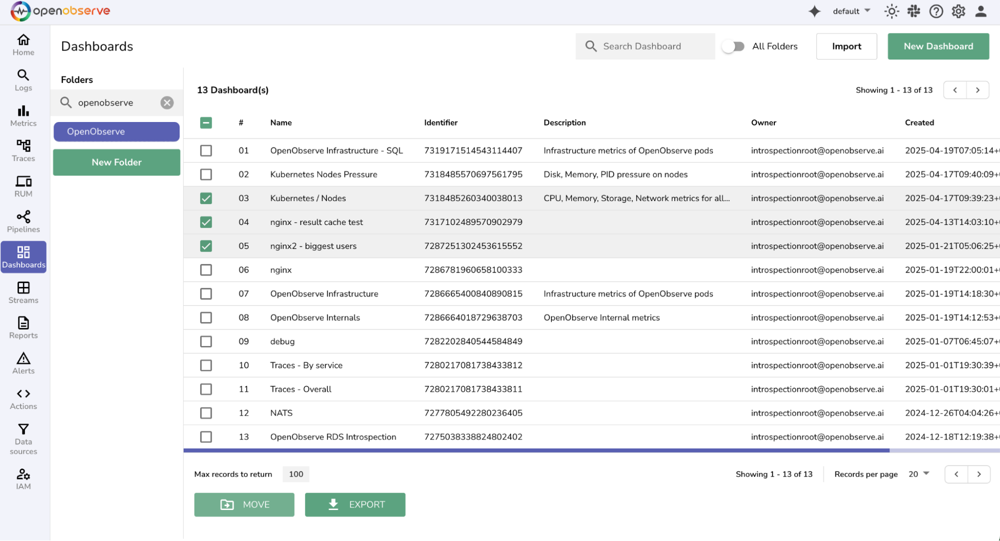
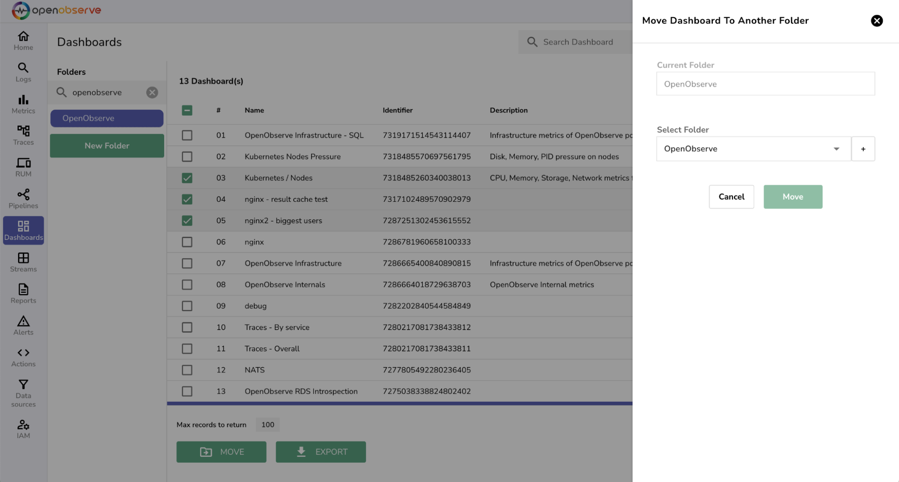

OpenObserve allows you to move or export multiple dashboards at once using the dashboard list view. This helps you organize your dashboards efficiently or back them up when needed.  

## How to Move Dashboards in Bulk

1. Go to **Dashboards** from the left menu.  
2. Use the checkboxes to select multiple dashboards from the list.  
3. Click the **Move** button at the bottom of the table.

4. In the side panel:

    - Use the **Select Folder** dropdown to choose the destination folder.  
    - To create a new folder, click the **+** icon and enter a name.  
    - Click **Move** to complete the operation.

The selected dashboards will be moved to the specified folder.

## How to Export Dashboards in Bulk

1. Go to **Dashboards** from the left menu.  
2. Select the dashboards you want to export using the checkboxes.  
3. Click the **Export** button at the bottom of the table.

 

A success message will confirm that the dashboards were exported.

!!! Note  
    The exported dashboards are downloaded in **JSON** format, which can be saved or imported later.