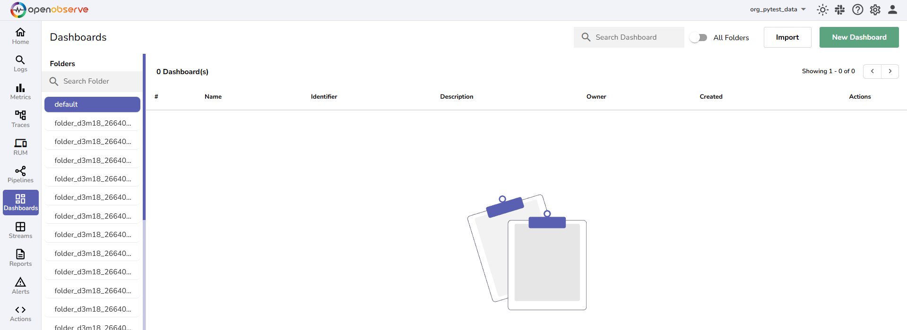
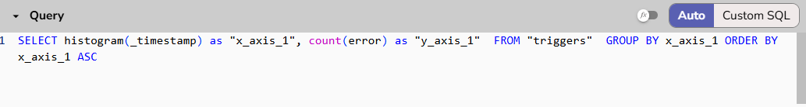
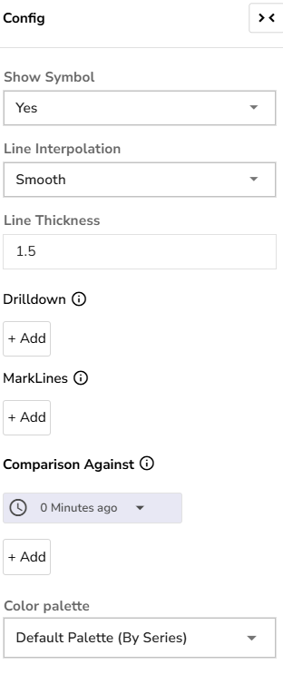
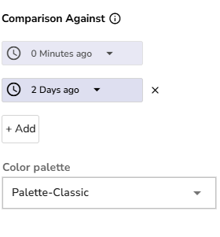

The **Comparison Against** feature in OpenObserve **Dashboards** lets you compare current data with data from the same time window in the past, such as 1 day ago or 7 days ago. This helps you quickly spot unusual spikes, drops, or changes in your logs, metrics, or traces.

### Where to Find This Feature

The **Comparison Against** feature is available for the following chart types in Dashboards:

- Area  
- Area Stacked  
- Bar  
- Horizontal Bar  
- Line  
- Scatter  
- Stacked  
- Horizontal Stacked

#### To access the feature

1. Go to **Dashboards** > **New Dashboard**.  
     
2. Click **Add Panel.**  
   
3. Select a chart [where the **Comparison Against** feature is available](#where-to-find-this-feature).  
     
4. Under **Fields**, add **Stream Type** and **Stream**, and set your x-axis and y-axis fields.  
    
    **Note**: You may use the Query editor to further customize your query. 
     
5. Choose a time range. For instance, **Past 15 Minutes**.  
   
6. Open the **Config** menu and scroll to **Comparison Against**.  
    
7. By default, **0 Minutes ago** (current time) is selected.  
8. Click **+ Add** to choose one or more past times to compare against the current time. For example, **1 day ago**. Use the dropdown menu to select the desired time.   
     
9. Ensure to select an appropriate **Color Palette** to differentiate charts.  
10. Click **Apply** to run the query and update the chart.   
    **Note**: You must click **Apply** after adding or changing any comparison values.

### How It Works

When you use the **Comparison Against** feature in OpenObserve **Dashboards**, the system compares data **from a fixed time window (e.g., the last 15 minutes) ending at the current time**, with **the same-sized window ending at one or more past times that you choose.**

The time range you select from the top navigation bar (e.g., Past 15 minutes) defines the window. This window is always the same size for both the current time and all past times you compare.

#### Example: 

Let us say, 

- Selected time range: **Past 15 minutes**  
- Current time: 03-04-2025, 4:00 PM.   
  This creates a window from 3:45 PM to 4:00 PM for 03-04-2025  
- In the Config panel, under **Compare Against**, you choose: **1 day ago**

Here is what happens:

- The Dashboard runs the same query for the current window: 03-04-2025, 3:45 PM to 4:00 PM  
- The Dashboard also runs the query for the same 15-minute window, but ending 1 day ago: 02-04-2025, 3:45 PM to 4:00 PM

**Note**: If you add more past times (e.g., 7 days ago), it will repeat the same process with the same 15-minute window ending 7 days ago.

**Result:**  

