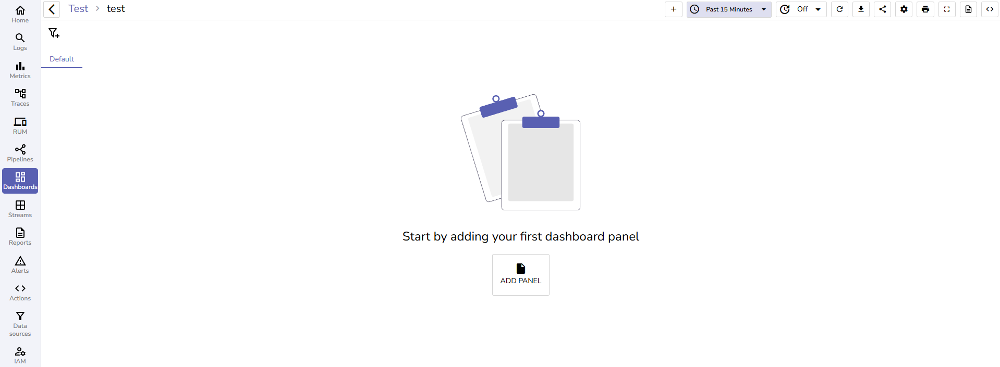
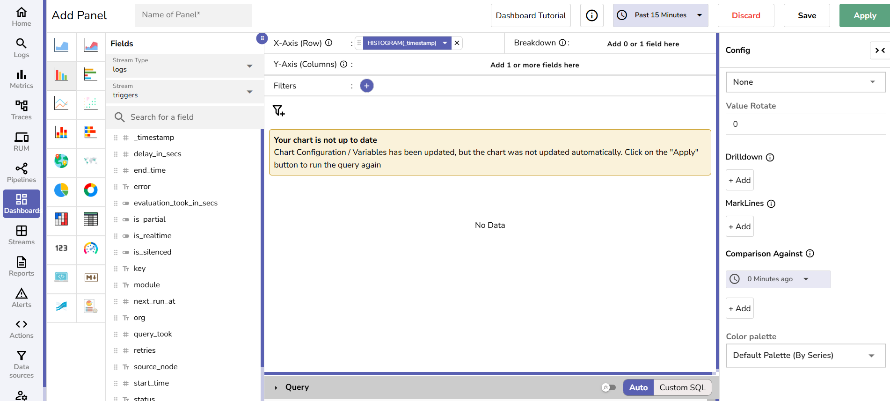
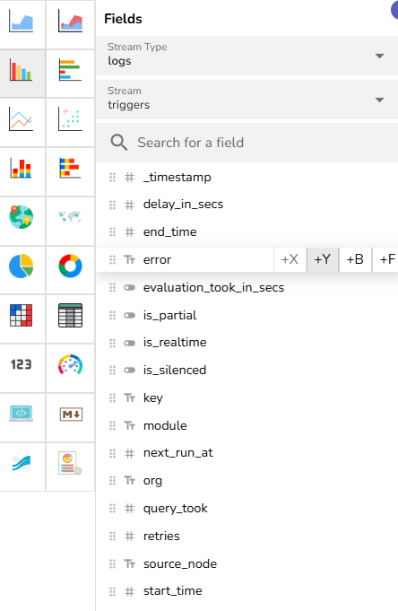
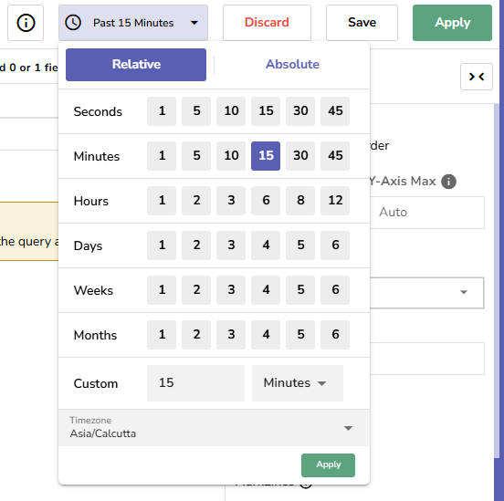

The **Comparison Against** feature in OpenObserve **Dashboards** allows you to visually compare your **current data** with **data from a selected point in time in the past**.
It is useful for trend analysis and identifying patterns over time.

### Where to Find This Feature
The **Comparison Against** feature is available for the following chart types in **Dashboards**:

- Area  
- Area Stacked  
- Bar  
- Horizontal Bar  
- Line  
- Scatter  
- Stacked  
- Horizontal Stacked

### How it Works

| Step | Without Comparison Against | With Comparison Against |
|------|------------------------|---------------------|
| **SQL Query** | You write SQL query for the current time frame (default). | Same SQL query is used for both current and past time frames. |
| **Period (Time Range)** | You select a time range (e.g., last 30 mins). | Same time range is applied to both current and past queries. |
| **Query Execution** | Query runs at the current time for the selected time range. | If you select one time frame in the past, the same query runs twice: • Query 1: Runs at the current time for the selected time range. • Query 2: Runs at the past time for the selected time range. |
| **Query Results** | Single result: current data only. | Two result sets: • Query 1: Current data • Query 2: Past data |
| **Visualization** | Chart shows current data only. | Chart shows both current and past data side by side for comparison. |

### How to Use the Compare Against Feature
For example, you want to compare **the error trends for the last 15 mins today** with **the error trends for the same time period, 2 days ago**. 

Let's say,

- You want to view the error trend for the past 15 mins today (for example, from 3:45 PM - 4:00 PM, today). 
- Now, you want to compare the error trend for the same time period (from 3:45 PM - 4:00 PM), 2 days ago. 

The following steps explain how to use the **Comparison Against** feature for this scenario:

1. Go to **Dashboards** > **New Dashboard**.  
     
2. Click **Add Panel.**  
   
3. Select a chart [where the **Comparison Against** feature is available](#where-to-find-this-feature).   
     
4. Under **Fields**, add **Stream Type** and **Stream**. These define the data source for your SQL query. Select fields that you want to set as x-axis (for example, timestamp) and y-axis (for example, error) of the chart. 
    
    **Note**: You may use the Query editor to further customize your query. 
     
5. Choose a time range. For instance, **Past 15 Minutes**. This becomes the period, the time range the system will use for both your current data and comparison data.  
   
6. Open the **Config** menu and scroll to **Comparison Against**.  
    
7. By default, **0 Minutes ago** is selected. This represents your current time.
8. Click **+ Add** to choose one or more past times to compare against the current time. For example, **2 days ago**. Use the dropdown menu to select the desired time. The system runs your SQL query for the same time range (period) at this past point.   
     
9. (Optional) Select a **Color Palette** to differentiate charts.  
10. Click **Apply** to run the query and update the chart.   
    **Note**: You must click **Apply** after adding or changing any comparison values.

**Result:**   
The results of both queries are shown side by side on your chart, making it easy to visually compare your current data with historical data.

