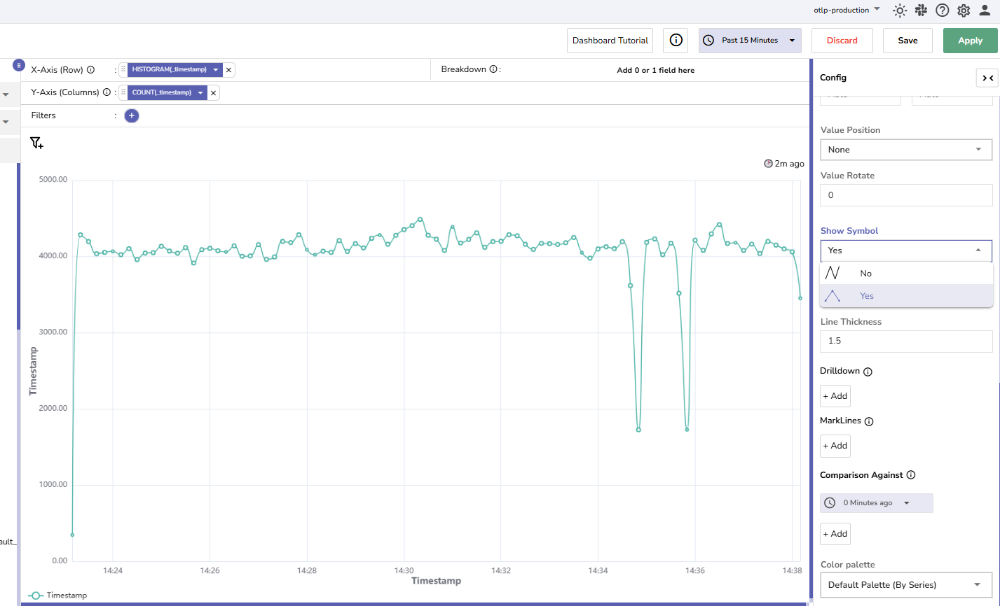
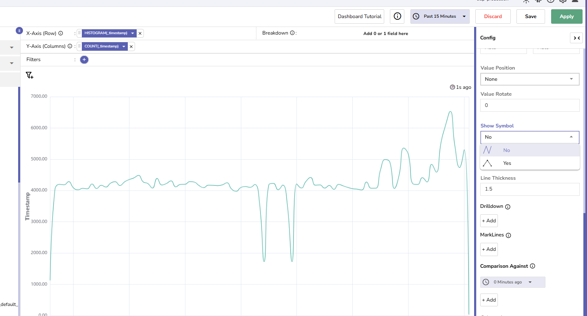

This guide describes how to use the **Show Symbol** option in OpenObserve dashboards to display or hide data point markers in supported chart types. This setting improves visual clarity when analyzing time-series data by highlighting values along a plotted line or area.

## Supported Chart Types
The **Show Symbol** setting is available only for the following chart types:

- Line
- Area
- Area Stacked

## Configure the Show Symbol Option
To configure the **Show Symbol** option:

1. In the **Panel Editor**, select a supported chart type. 
2. Expand the **Config** section on the right side of the screen.
3. Locate the **Show Symbol** dropdown.
4. From the **Show Symbol** dropdown, select Yes or No:

    - When you select **Yes**, each data point is marked with a small circle for clear identification.
    
    - When you select **No**, the chart renders a continuous line or area without individual point markers.
    

## Default Behavior and Environment Variable
The default selection of the **Show Symbol** dropdown is determined by the following environment variable:

```bash
ZO_DASHBOARD_SHOW_SYMBOL_ENABLED=false  # default
```

- When set to **true**, the **Show Symbol** dropdown defaults to **Yes**.
- When set to **false**, the **Show Symbol** dropdown defaults to **No**.

> This setting only controls the default state of the **Show Symbol** dropdown. Users can manually change the setting regardless of the environment variable value.

## Limitations
The **Show Symbol** option is supported only in **Line**, **Area**, and **Area Stacked** charts. It is not available for any other chart types in dashboard panels. If a different chart type is selected, the **Show Symbol** option will not appear in the configuration panel.