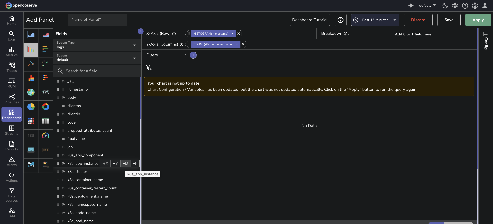

This guide explains how to use the Trellis Layout option under the Config tab to split a single chart into multiple consistently formatted panels based on a selected breakdown field.

## What is Trellis Layout?
**Trellis Layout** creates a separate chart panel for each unique value in a selected breakdown field. All panels use the same X-axis and Y-axis scales, making it easier to visually compare metric trends across different values.

For example, if the breakdown field is `k8s_app_instance`, **Trellis Layout** generates one panel for each application instance.

---

## Supported Chart Types
Trellis Layout supports:

- Area
- Bar
- Horizontal bar
- Line
- Scatter

--- 

## Apply Trellis Layout to a Panel
Follow these steps:

1. Open or [create a panel](../dashboards-in-openobserve/#panels). 
2. Click **Add Panel** to create a new panel and choose a supported chart type. 
Alternatively, select **Edit Panel** from the dropdown menu on an existing panel. 
3. Under **Fields**, choose a stream type and a stream name. 
4. By default, the system set the X-axis as `histogram(_timestamp)`. Modify if needed. 
5. Under **Fields**, select Y-axis and **Breakdown**. 

    - To select a Y-axis field, hover over a field and click the **+Y** icon. 
    For example, `k8s_container_name`.
    > Note: You can select more than one Y-axis fields.  
     
    
    - To select a **Breakdown** field, hover over a field and click the **+B** icon. 
    Choose a groupable field. For example, `k8s_app_instance`.
     
    
    This enables the **Trellis Layout** configuration options in the **Config** tab. 
    
6. Click the **Config** tab, to configure **Trellis Layout**.   
7. Under **Trellis Layout**, choose how panels should be arranged:

    - **None**: No panel splitting 
    
    - **Auto**: Automatically arranges the layout
    
    - **Vertical**: Stacks panels vertically
    
    - **Custom**: Allows you to specify the number of panels per row    

8. If you choose **Custom**, enter a number in the **Columns Per Row** field to control how many charts appear in each row.

9. Click **Apply** to view the updated layout.
10. Click **Save** to preserve the changes.

## Multiple Y-axis Grouping

If your panel includes multiple Y-axis fields and a **Breakdown** field, use the **Group multi Y-axis for trellis** toggle to control how panels are created:

**Disabled**: Creates separate panels for each combination of Y-axis field and breakdown value.  

**Enabled**: Creates one panel per breakdown value, showing multiple Y-axis series in each panel.  

