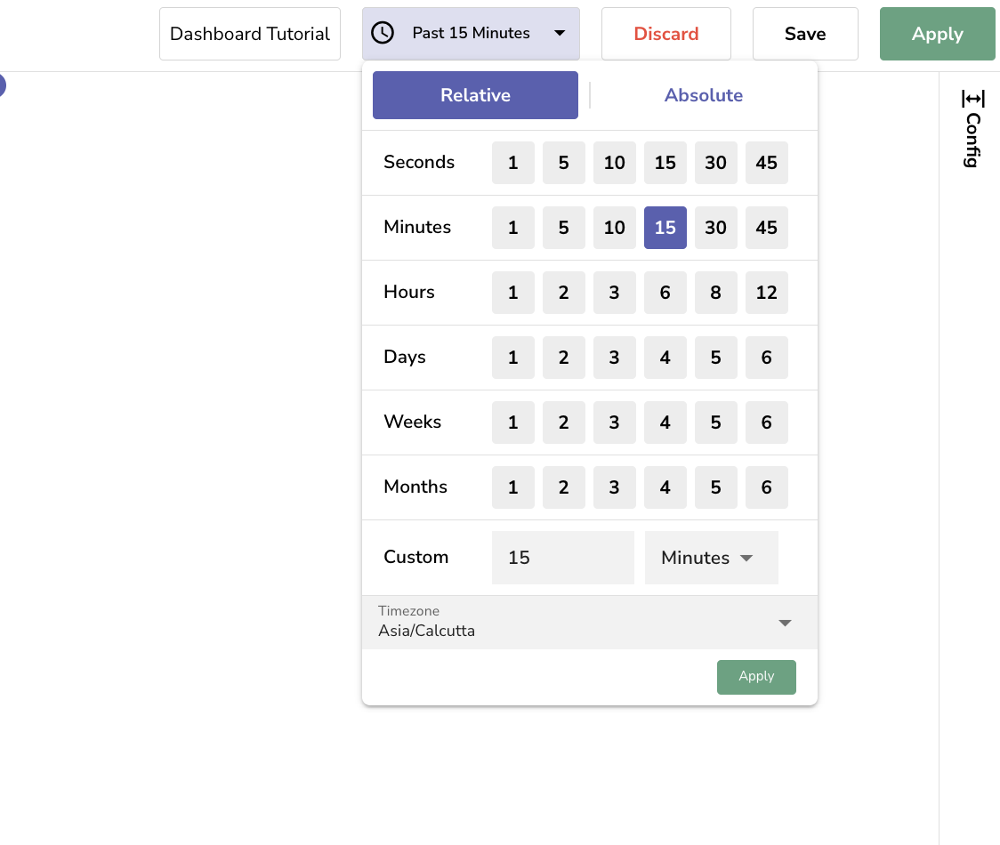
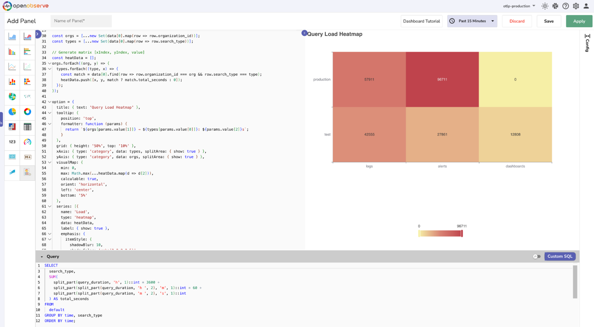

The following step-by-step instructions can help you build a [custom chart that expects flat data](what-are-custom-charts.md#how-to-check-the-data-structure-a-chart-expects). 

## Use Case

Build a custom **heatmap chart** to understand which organization and search type combinations generate the most query load.


## Before You Begin

To build a custom chart, you need to bridge two things:

- **What data you already have**: This is the structure of your ingested data, which is usually flat.
- **What the chart expects**: Each chart type needs data in a specific format. Some charts expect flat data, while others require nested data.

> **Note**: Understanding both is important because it helps you write the right SQL query, [prepare](what-are-custom-charts.md#build-the-chart) the data through grouping or aggregation, [reshape](what-are-custom-charts.md#build-the-chart) the results to match the chart’s structure, and map them correctly in the JavaScript code that renders the chart.

## Step 1: Understand the Ingested Dataset

In OpenObserve, the data ingested into a stream is typically in a flat structure.   
**Example:** In the following dataset, each row represents a single event or query log with its own timestamp, organization ID, search type, and query duration.

```linenums="1"
  { "_timestamp": "2025-05-12T09:00:00Z", "organization_id": "test", "search_type": "logs", "query_duration": "10h 51m 13s" },
  { "_timestamp": "2025-05-12T09:01:00Z", "organization_id": "production", "search_type": "alerts", "query_duration": "11h 46m 00s" },
  { "_timestamp": "2025-05-12T09:02:00Z", "organization_id": "test", "search_type": "alerts", "query_duration": "7h 44m 21s" },
  { "_timestamp": "2025-05-12T09:00:00Z", "organization_id": "test", "search_type": "logs", "query_duration": "0h 58m 02s" },
  { "_timestamp": "2025-05-12T09:02:00Z", "organization_id": "production", "search_type": "logs", "query_duration": "11h 24m 37s" },
  { "_timestamp": "2025-05-12T09:00:00Z", "organization_id": "production", "search_type": "alerts", "query_duration": "8h 25m 29s" },
  { "_timestamp": "2025-05-12T09:01:00Z", "organization_id": "production", "search_type": "alerts", "query_duration": "2h 30m 01s" },
  { "_timestamp": "2025-05-12T09:00:00Z", "organization_id": "production", "search_type": "alerts", "query_duration": "4h 10m 21s" },
  { "_timestamp": "2025-05-12T09:02:00Z", "organization_id": "production", "search_type": "logs", "query_duration": "4h 40m 34s" },
  { "_timestamp": "2025-05-12T09:01:00Z", "organization_id": "test", "search_type": "dashboards", "query_duration": "3h 33m 28s" }
```

**Note**: Use the **Logs** page to view the data ingested to the stream. 

## Step 2: Identify the Expected Data Structure

Before moving ahead, [identify what structure the chart expects](what-are-custom-charts.md#how-to-check-the-data-structure-a-chart-expects). The heatmap chart expects flat data.

In this example, each row in [data[0]](what-are-custom-charts.md#the-data-object) must contain:

- `organization_id` (example: "test")  
- `search_type` (example: "logs")  
- A numeric value (`total_seconds`) representing total query time.

**Note**: For charts that expect flat data, [reshaping is not needed](what-are-custom-charts.md#build-the-chart). SQL alone is enough to prepare the data in required format.

## Step 3: Prepare the Data (via SQL)

In the [Add Panel](what-are-custom-charts.md#how-to-access-custom-charts) page, under **Fields**, select the desired stream type and stream name. 


Build a SQL query in the **Query Editor** to fetch and prepare the data:

- Converting `query_duration` (text) into numeric seconds  
- Grouping by `organization_id` and `search_type` 
- Summing the durations to get a meaningful value per cell in the heatmap

```linenums="1"
  SELECT
  organization_id,
  search_type,
  SUM(
    split_part(query_duration, 'h', 1)::int * 3600 +
    split_part(split_part(query_duration, 'h ', 2), 'm', 1)::int * 60 +
    split_part(split_part(query_duration, 'm ', 2), 's', 1)::int
  ) AS total_seconds
FROM
  default
WHERE
  query_duration IS NOT NULL
GROUP BY
  organization_id, search_type
ORDER BY
  organization_id, search_type;
```

Select a time range to fetch the relevant dataset for your chart.



**Expected Query Result**

```linenums="1"
data=[[
  { "organization_id": "production", "search_type": "alerts", "total_seconds": 96711 },
  { "organization_id": "production", "search_type": "logs", "total_seconds": 57911 },
  { "organization_id": "test", "search_type": "alerts", "total_seconds": 27861 },
  { "organization_id": "test", "search_type": "dashboards", "total_seconds": 12808 },
  { "organization_id": "test", "search_type": "logs", "total_seconds": 42555 }
]]
```

**Note**: OpenObserve stores the result of the query in [the `data` object](what-are-custom-charts.md#the-data-object) as an **array of an array**.

## Step 4: Inspect the Queried Dataset

Inspect the queried dataset:

```linenums="1"
console.log(data);
console.log(data[0]);
```

## Step 5: JavaScript Code to Render the Heatmap

In the JavaScript editor, you must construct an [object named `option`](what-are-custom-charts.md#the-option-object). 
This `option` object defines how the chart looks and behaves. To feed data into the chart, use the query result stored in `data[0]` 

The following script:

- Extracts all unique orgs and search types  
- Creates a [x, y, value] format for each cell  
- Configures a color gradient using visualMap

```linenums="1"
const orgs = [...new Set(data[0].map(row => row.organization_id))];
const types = [...new Set(data[0].map(row => row.search_type))];

const heatData = [];
orgs.forEach((org, y) => {
  types.forEach((type, x) => {
    const match = data[0].find(row => row.organization_id === org && row.search_type === type);
    heatData.push([x, y, match ? match.total_seconds : 0]);
  });
});

option = {
  title: { text: 'Query Load Heatmap' },
  tooltip: {
    position: 'top',
    formatter: function (params) {
      return `${orgs[params.value[1]]} → ${types[params.value[0]]}: ${params.value[2]} seconds`;
    }
  },
  grid: { height: '50%', top: '10%' },
  xAxis: { type: 'category', data: types, splitArea: { show: true } },
  yAxis: { type: 'category', data: orgs, splitArea: { show: true } },
  visualMap: {
    min: 0,
    max: Math.max(...heatData.map(d => d[2])),
    calculable: true,
    orient: 'horizontal',
    left: 'center',
    bottom: '5%'
  },
  series: [{
    name: 'Query Duration (s)',
    type: 'heatmap',
    data: heatData,
    label: { show: true },
    emphasis: {
      itemStyle: {
        shadowBlur: 10,
        shadowColor: 'rgba(0,0,0,0.5)'
      }
    }
  }]
};
```

## Step 6: View Result

Click **Apply** to generate the chart. 



### Understand the Chart

In the chart, 

- The `x-axis` shows search_type (logs, alerts, dashboards).  
- The `y-axis` shows `organization_id` (test, production).  
- Each cell color reflects total query time.  

Use this heatmap to quickly spot load-heavy combinations like `production → alerts`, where optimization or alert review may be needed.

## Troubleshoot

Use the following guidance to identify and fix common issues when working with custom charts:

**1. `No data found`**  
**Cause**: The SQL query did not return any results.   
**Fix:** 

- Confirm the selected time range includes data.  
- Check that the stream name and field names are correct.  
- Run the query in the Logs view to verify that results are returned.

**2. `Uncaught ReferenceError: option is not defined`**  
**Cause:** The chart configuration was not defined correctly.  
**Fix:** 

- Ensure `option = {...}` is defined at the end of your JavaScript.  
- Do not rename the option variable or wrap it in a function or condition.

**3. Unsafe code detected: Invalid JavaScript syntax.**  
**Cause:** There is a syntax error in your JavaScript.  
**Fix:** 

- Check for missing or extra commas, brackets, or quotation marks.  
- Open your browser's developer console to locate the error.  
- Use `console.log()` to test your script step by step.

**4. Chart Not Rendering:**   
**Cause**: The query returned data, but the chart did not render.  
**Fix**: 

- Use `console.log(data[0])` to confirm that the dataset is not empty.  
- Make sure the field names in your script match the query output.
